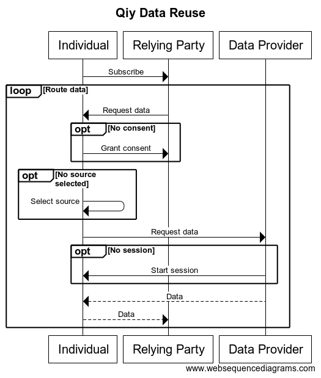

# FUNCTIONAL SPECIFICATION 'QIY SCHEME V1.1'
From Qiy Nodes to data exchange


# Contents

1. [Introduction](#1 Introduction)
	1. [Purpose](#1.1 Purpose)
	1. [Reader guidance](#1.2 Reader guidance)
1. [Overview](#2 Overview)
	1. [Data Reuse](#2.1 Data Reuse)
		1. [Privacy concern](#2.1.1 Privacy concern)
1. [Architectural Description](#3 Architectural Description)
	1. [Architectural Layers](#3.1 Architectural Layers)
	1. [Privacy](#3.2 Privacy)
	1. [Security](#3.3 Security)
	1. [Interoperability](#3.4 Interoperability)
	1. [Governance](#3.5 Governance)
	1. [Compliancy](#3.6 Compliancy)
1. [The User layer](#4 The User layer)
	1. [Qiy Users](#4.1 Qiy Users)
	1. [Service Providing User](#4.2 Service Providing User)
	1. [Qiy Node](#4.3 Qiy Node)
	1. [Connect via Qiy](#4.4 Connect via Qiy)
		1. [Generate token](#4.4.1 Generate token)
		1. [Media](#4.4.2 Media)
			1. [The web](#4.4.2.1 The web)
			1. [Print](#4.4.2.2 Print)
	1. [Setup](#4.5 Setup)
		1. [Relying Party](#4.5.1 Relying Party)
		1. [Data Provider](#4.5.1 Data Provider)
		1. [Individual](#4.5.2 Individual)
	1. [Subscribe](#4.6 Subscribe)
	1. [Consent](#4.7 Consent)
	1. [Routing](#4.8 Routing)
	1. [Source](#4.9 Source)
	1. [Session](#4.10 Session)
1. [The Application layer](#5 The Application layer)
	1. [Qiy Application](#5.1 Qiy Application)
		1. [Application Provider](#5.1.1 Application Provider)
		1. [Qiy Application Protocol](#5.1.2 Qiy Application Protocol)
		1. [Creating Qiy Nodes for Individuals](#5.1.3 Creating Qiy Nodes for Individuals)
			1. [Security consideration](#5.1.3.1 Security consideration)
		1. [Link with an existing Qiy Node](#5.1.4 Link with an existing Qiy Node)
	1. [Connect](#5.2 Connect)
		1. [Application Connect Token](#5.2.1 Application Connect Token)
		1. [Proposer: Connect](#5.2.2 Proposer: Connect)
		1. [Generate Application Connect Token](#5.2.3 Generate Application Connect Token)
		1. [Accepter: Connect](#5.2.4 Accepter: Connect)
	1. [Consent](#5.3 Consent)
		1. [Relying Party: Request consent](#5.3.1 Relying Party: Request consent)
		1. [Individual: Consider consent request](#5.3.2 Individual: Consider consent request)
	1. [Service Discovery](#5.4 Service Discovery)
	1. [Data by Reference](#5.5 Data by Reference)
		1. [Service by Reference](#5.5.1 Service by Reference)
		1. [Request data reference](#5.5.1 Request data reference)
		1. [Create reference](#5.4.2 Create reference)
		1. [Request data](#5.5.1 Request data)
		1. [Provide data](#5.5.2 Provide data)
1. [The Qiy Node layer](#6 The Qiy Node layer)
	1. [Access Provider](#6.1 Access Provider)
		1. [Portability](#6.1.1 Portability)
	1. [Qiy Node](#6.2 Qiy Node)
		1. [Qiy Node Protocol](#6.2.1 Qiy Node Protocol)
		1. [Qiy Node API](#6.2.2 Qiy Node API)
		1. [Qiy Node Implementation](#6.2.3 Qiy Node Implementation)
		1. [Qiy Node Instantiation](#6.2.4 Qiy Node Instantiation)
		1. [Deleting a Qiy Node](#6.2.5 Deleting a Qiy Node)
	1. [Connect](#6.3 Connect)
		1. [Connection Uri](#6.3.1 Connection Uri)
			1. [Security concern](#6.3.1.1 Security concern)
		1. [Connect Token](#6.3.2 Connect Token)
			1. [Security concern](#6.3.2.1 Security concern)
			1. [Creating a Connect Token](#6.3.2.2 Creating a Connect Token)
			1. [Creating a Transport Connect Token](#6.3.2.3 Creating a Transport Connect Token)
		1. [Connecting](#6.3.3 Connecting)
		1. [Deleting a Path](#6.3.4 Deleting a Path)
	1. [Consent](#6.4 Consent)
		1. [Consent Uri](#6.4.1 Consent Uri)
		1. [Consent Service Descriptor](#6.4.2 Consent Service Descriptor)
		1. [Consent Data Descriptor](#6.4.3 Consent Data Descriptor)
			1. [Privacy concern](#6.4.3.1 Privacy concern)
	1. [Qiy Node Request](#6.5 Qiy Node Request)
	1. [Qiy Node Requests](#6.6 Qiy Node Requests)
		1. [Connect Request](#6.6.1 Connect Request)
		1. [Connect Token Creation Request](#6.6.2 Connect Token Creation Request)
		1. [Connect Token Registration Request](#6.6.3 Connect Token Registration Request)
		1. [Connect Token Update Request](#6.6.4 Connect Token Update Request)
		1. [Connections Request](#6.6.5 Connections Request)
		1. [Consent Granted Request](#6.6.6 Consent Granted Request)
		1. [Consent Denied Request](#6.6.7 Consent Denied Request)
		1. [Consent Request](#6.6.9 Consent Request)
		1. [Consent Withdrawn Request](#6.6.8 Consent Withdrawn Request)
		1. [Consents Request](#6.6.9 Consents Request)
		1. [Messages Request](#6.6.10 Messages Request)
		1. [Operation Execution Request](#6.6.11 Operation Execution Request)
		1. [Operation Registration Request](#6.6.12 Operation Registration Request)
		1. [Operation References Request](#6.6.13 Operation References Request)
		1. [Source Candidates Request](#6.6.14 Source Candidates Request)
		1. [Source Registration Request](#6.6.15 Source Registration Request)
	1. [Qiy Node Message](#6.7 Qiy Node Message)
	1. [Qiy Node Messages](#6.8 Qiy Node Messages)
		1. [Consent Denied Message](#6.8.1 Consent Denied Message)
		1. [Consent Granted Message](#6.8.2 Consent Granted Message)
		1. [Consent Request Message](#6.8.3 Consent Request Message)
		1. [Operation Reference Message](#6.8.4 Operation Reference Message)
		1. [Operation Reference Request Message](#6.8.5 Operation Reference Request Message)
	1. [Qiy Node Event](#6.9 Qiy Node Event)
	1. [Qiy Node Events](#6.10 Qiy Node Events)
		1. [Connection Created Event](#6.10.1 Connection Created Event)
		1. [Consent Withdrawn Event](#6.10.2 Consent Withdrawn Event)
		1. [Message Received Event](#6.10.4 Message Received Event)
		1. [Reference Received Event](#6.10.6 Reference Received Event)
		1. [Source Candidate Event](#6.7.9 Source Candidate Event)
1. [The Service layer](#7 The Service layer)
	1. [Access Provider](#7.1 Access Provider)
		1. [Portability](#7.1.1 Portability)
	1. [Service](#7.2 Service)
		1. [Operation](#7.2.1 Operation)
		1. [Service Providing User](#7.2.2 Service Providing User)
		1. [Service Catalogue](#7.2.3 Service Catalogue)
	1. [Service Description](#7.3 Service Description)
		1. [Service Descriptor](#7.3.1 Service Descriptor)
	1. [Service Endpoints](#7.4 Service Endpoints)
		1. [Security note](#7.4.1 Security note)
	1. [Service Library](#7.5 Service Library)
		1. [Service Description Library](#7.5.1 Service Description Library)
			1. [Service Description Registration](#7.5.1.1 Service Description Registration)
		1. [Service Catalogue Library](#7.5.2 Service Catalogue Library)
			1. [Service Catalogue Registration](#7.5.2.1 Service Catalogue Registration)
		1. [Service Provider Library](#7.5.3 Service Provider Library)
			1. [Service Provider Registration](#7.5.3.1 Service Provider Registration)
		1. [Data Description Library](#7.5.4 Data Description Library)
			1. [Data Description Registration](#7.5.4.1 Data Description Registration)
	1. [Consent Service](#7.6 Consent Service)
1. [The Transport layer](#8 The Transport layer)
	1. [Access Provider](#8.1 Access Provider)
		1. [Portability](#8.1.1 Portability)
	1. [Transporter](#8.2 Transporter)
	1. [Transport Protocol](#8.3 Transport Protocol)
	1. [Transport Connect Token](#8.4 Transport Connect Token)
	1. [Transporter Instantiation](#8.5 Transporter Instantiation)
	1. [Deleting a Transporter](#8.6 Deleting a Transporter)
	1. [Transporter API](#8.7 Transporter API)
	1. [Transporter Implementation](#8.8 Transporter Implementation)
		1. [QS Issuer](#8.8.1 QS Issuer)
	1. [Path](#8.9 Path)
		1. [Path Creation](#8.9.1 Path Creation)
		1. [Deleting a Path](#8.9.2 Deleting a Path)
	1. [Transport Message](#8.10 Transport Message)
		1. [Transport Message Descriptor](#8.10.1 Transport Message Descriptor)
		1. [Transport Message Payload](#8.10.2 Transport Message Payload)
1. [The Carrier layer](#9 The Carrier layer)
	1. [Access Provider](#9.1 Access Provider)
		1. [Portability](#9.1.1 Portability)
	1. [Carrier](#9.2 Carrier)
	1. [Carrier API](#9.3 Carrier API)
	1. [Carrier Protocol](#9.4 Carrier Protocol)
	1. [Carrier Service Implementation](#9.5 Carrier Service Implementation)
		1. [QS Issuer](#9.5.1 QS Issuer)
		1. [QS User Node](#9.5.2 QS User Node)
	1. [Carrier Node](#9.6 Carrier Node)
	1. [Requesting a Qiy Node](#9.7 Requesting a Qiy Node)
1. [Definitions](#10 Definitions)
1. [Diagram sources](#11 Diagram sources)
	1. [User Layer](#11.1 User Layer)
		1. [Qiy Data Reuse](#11.1.1 Qiy Data Reuse)
		1. [Connect](#11.1.2 Connect)
			1. [Users Connect](#11.1.2.1 Users Connect)
			1. [Generate token](#11.1.2.2 Generate token)
			1. [Media](#11.1.2.3 Media)
			1. [Connect using a token in a website address](#11.1.2.4 Connect using a token in a website address)
			1. [Connect using a QR Code](#11.1.2.5 Connect using a QR Code)
			1. [Present proposal containing a QR Code](#11.1.2.6 Present proposal containing a QR Code)
		1. [Authenticate](#11.1.3 Authenticate)
			1. [Data Provider: Authenticate](#11.1.3.1 Data Provider: Authenticate)
		1. [Consent](#11.1.4 Consent)
		1. [Service discovery](#11.1.5 Service discovery)
		1. [Request data](#11.1.6 Request data)
	1. [Application Layer](#11.2 Application Layer)
		1. [Connect](#11.2.1 Connect)
			1. [Proposer: Connect](#11.2.1.1 Proposer: Connect)
			1. [Generate Application Connect Token](#11.2.1.2 Generate Application Connect Token)
			1. [Accepter: Connect](#11.2.1.3 Accepter: Connect)
		1. [Consent](#11.2.2 Consent)
			1. [Relying Party: Request consent](#11.2.2.1 Relying Party: Request consent)
			1. [Individual: Consider consent request](#11.2.2.2 Individual: Consider consent request)
		1. [Service Discovery ](#11.2.3 Service Discovery )
			1. [Individual: Select source](#11.2.3.1 Individual: Select source)
			1. [Qiy Node: Generate and distribute references](#11.2.3.2 Qiy Node: Generate and distribute references)
			1. [Generate operation reference](#11.2.3.3 Generate operation reference)
			1. [Relying Party: Persist reference](#11.2.3.4 Relying Party: Persist reference)
		1. [Request data](#11.2.4 Request data)
			1. [Relying Party: Request data](#11.2.4.1 Relying Party: Request data)
			1. [Data Provider: Provide data](#11.2.4.2 Data Provider: Provide data)

# 1 Introduction
Qiy, or rather: the [Qiy Scheme](#Qiy Scheme), puts people back in control of their [Personal Data](#Personal Data) while creating value for organizations that process it ([Relying Parties](#Relying Party)).


## 1.1 Purpose

The document is aimed at people who know that Qiy puts people back in control of their [Personal Data](#Personal Data), but who want or need to know the functional, technical, privacy, security, legal and/or compliancy aspects of Qiy.

## 1.2 Reader guidance

* Privacy officers are advised to read chapter [3 Architectural Description](#3 Architectural Description) and especially [section 3.2](#3.2 Privacy).
* Security officers are advised to read chapter [3 Architectural Description](#3 Architectural Description) and especially [section 3.3](#3.3 Privacy).
* Information analysts are advised to read chapters [3 Architectural Description](#3 Architectural Description), [4 The User layer](#4-the-user-layer) and [5 The Application layer](#5 The Application layer).
* Application developers are advised to read chapters [3 Architectural Description](#3 Architectural Description), [4 The User layer](#4-the-user-layer), [5 The Application layer](#5 The Application layer) and [6 The Qiy Node layer](#6 The Qiy Node layer).
* Systems engineers are advised to read chapters [3 Architectural Description](#3 Architectural Description), [8 The Transport Layer](#8 The Transport Layer) and [9 The Carrier Layer](#9 The Carrier Layer).

# 2 Overview

This chapter gives an overview of this document.
* [2.1 Data Reuse](#2.1 Data Reuse) describes how data can be reused with Qiy.
* [3 Architectural Description](#3 Architectural Description) describes the [Architectural Layers](#2.2 Architectural Layers) and addresses various concerns like privacy and security.
* [4 The User Layer](#4 The User Layer) describes the setup and processes of the data reuse at the user level.
* [5 The Application Layer](#5 The Application Layer) describes the processes at the application level.
* [6 The Qiy Node Layer](#6 The Qiy Node Layer) describes the same at the Qiy Node level.
* [7 The Service Layer](#7 The Service Layer) describes the [Service Layer](#Service Layer) support.
* [8 The Transport Layer](#8 The Transpor Layer) describes the [Transport Layer](#Transport Layer) support.
* [9 The Carrier Layer](#9 The Carrier Layer) describes the [Carrier Layer](#Carrier Layer) support.
* [10 Definitions](#10 Definitions) contains the definitions used in this document.
* [11 Diagram sources](#11 Diagram Sources) contains the source code used to generate the diagrams.

## 2.1 Data Reuse

This document describes a scenario in which a [Data Subject](#Data Subject) ([Individual](#Individual)) can reuse his [Personal Data](#Personal Data) stored at one organization ([Data Provider](#Data Provider)) and provide it to another organization ([Relying Party](#Relying Party)) to consume one of its services.

The Data Reuse scenario is more complex and may require less user interaction, but in essence it goes as follows:
* The Individual subscribes to a service.
* The Relying Party asks the Individual for the data it needs to provide the service.
* The Individual retrieves the data from a Data Provider.
* The Individual routes the data to the Relying Party.



### 2.1.1 Privacy concern

The Data Reuse process shows that the data is transferred to the Relying Party by choice of the Individual.
This breaks the chain of responsibility for the Data Provider; the responsibility for correct processing of the data does not extend to any processing that takes place after the handover to the Individual. 

# 3 Architectural Description

This chapter describes the major entities of Qiy and their relations with the help of the [Architectural Layers of the Qiy Scheme](#Architectural Layers of the Qiy Scheme) and addresses how Qiy addresses concerns like security and privacy.

## 3.1 Architectural Layers
The realization of the scenario is described using the following layers:


## 3.2 Privacy

Qiy has been conceived with the aim to put people back in control of their [Personal Data](#Personal Data), hence making privacy the primary concern of Qiy.
The aim has been elaborated in a set of principles called the [Qiy Trust Principles](#Qiy Trust Principle) and technical, legal and governance rules, all of which are maintained by the [Qiy Foundation](#Qiy Foundation) and the [Qiy Foundation Members](#Qiy Foundation Member).

The realization of the [Data Reuse](#Data Reuse) as described in this document demonstrates that a natural person ([Individual](#Individual)) is in control:
* The [Individual](#Individual) can securily exchange data and/or messages with another person or organization ([Qiy User](#Qiy User)) via Qiy, using connections, see [4 The User Layer](#4 The User Layer).
* The [Individual](#Individual) controls what [Qiy Users](#Qiy User) he connects with and, in principle, when he wants to end it.
* When an [Individual](#Individual) connects with a [Qiy User](#Qiy User) that is providing a [Service](#Service) via Qiy ([Service Providing User](#Service Providing User)), the [Individual](#Individual) is provided with the identity of the latter, but not the other way around.
* The [Individual](#Individual) can access his [Personal Data](#Personal Data) that is kept by another [Qiy User]([Data Provider](#Data Provider) as a result of the [Access Principle](#Access Principle), one of the [Qiy Trust Principles](#Qiy Trust Principle).
* The [Individual](#Individual) controls what data he shares with what service provider ([Relying Party](#Relying Party)) and under what terms using proveable [Consents](#Consent).
* [Qiy Users](#Qiy User) use applications that are authorized for use with Qiy ([Qiy Applications](#Qiy Application)).
* Access to Qiy, data exchange via Qiy, consent services and potentially [Qiy Nodes](#Qiy Node) are provided by [Access Providers](#Access Provider).


All parties involved are bound by the rules of the [Qiy Scheme](#Qiy Scheme):
* [Service Providing Users](#Service Providing User) are bound by the [Binding Individual Rights](#Binding Individual Right) and the [Binding Principles for Relying Parties and Data Providers](#Binding Principles for Relying Parties and Data Provider).
* [Access Providers](#Access Provider) are bound by the [Licence Agreement Issuer](#Licence Agreement Issuer) or the [Licence Agreement Service Provider](#Licence Agreement Service Provider).
* [Application Providers](#Application Provider) can only develop and produce [Qiy Application](#Qiy Application)-services and/or software with a [Licence Agreement Application Provider](#Licence Agreement Application Provider).

## 3.3 Security

As described above, privacy is at the heart of Qiy and security being a 'conditio sine qua no' for this, it is also addressed by the rules of the [Qiy Scheme](#Qiy Scheme).

## 3.4 Interoperability

An [Individual](#Individual) can only control his [Personal Data](#Personal Data), when all concerned systems are interoperable.
This is achieved as follows:
* Applications exchange data and/or messages via Qiy using open standards of the [Qiy Scheme](#Qiy Scheme) ([Qiy Open Standard](#Qiy Open Standard)).
* Applications exchange described data using [Data Descriptions](#Data Description) which are available to all concerned parties.

## 3.5 Governance

The governance rules are laid down in the [Governance Model for the Qiy Scheme](#Governance Model for the Qiy Scheme), one of the documents of the [Qiy Scheme Rulebook](#Qiy Scheme Rulebook).

## 3.6 Compliancy

The compliancy rules for [Service Providing Users](#Service Providing User) can be found in the [Binding Principles for Relying Parties and Data Providers](#Binding Principles for Relying Parties and Data Provider), one of the documents of the [Qiy Scheme Rulebook](#Qiy Scheme Rulebook).


# 4 The User layer
This chapter describes the User layer and the interaction between the [Relying Party](#Relying Party), [Individual](#Individual), [Data Provider](#Data Provider) and the lower layers for the [Data Reuse](#Data Reuse).

## 4.1 Qiy Users
The organizations and/or persons using Qiy are called [Qiy Users](#Qiy User). They can use Qiy in different [roles](#role); they can use Qiy as a [Relying Party](#Relying Party), [Individual](#Individual), [Data Provider](#Data Provider) or a combination of these.
A business for example will generally use Qiy both as a [Relying Party](#Relying Party) (for offering [Services](#Service) using reliable [Personal Data](#Personal Data)) and as a [Data Provider](#Data Provider) (as a source of [Personal Data](#Personal Data)).
As for natural persons, most of these will use Qiy as an [Individual](#Individual) to control their [Personal Data](#Personal Data).

## 4.2 Service Providing User
A [Qiy User](#Qiy User) that provides one or more [Services](#Service) to [Individuals](#Individual) is said to be (or act in the [Business Role](#Business Role) of) '[Service Providing Users](#Service Providing User)'.
Any [Qiy User](#Qiy User) acting in one or both of the roles [Relying Party](#Relying Party) or [Data Provider](#Data Provider) is implicitely acting in this role.

## 4.3 Qiy Node
A [Qiy User](#Qiy User) must have a [Qiy Node](#Qiy Node). 
[Service Providing Users](#Service Providing User) can acquire one from an [Access Provider](#Access Provider).
[Individuals](#Individual) obtain a [Qiy Node](#Qiy Node) the first time they use a [Qiy Application](#Qiy Application).
Alternatively, [Qiy Users](#Qiy User) may instantiate a [Qiy Node](#Qiy Node) themselves using a [Qiy Node Implementation](#Qiy Node Implementation) and register it with an [Access Provider](#Access Provider).

## 4.4 Connect via Qiy

Two [Qiy Users](#Qiy User) can connect via Qiy by creating a connection between their [Qiy Nodes](#Qiy Node) ([Connection](#Connection)).
The [Connection](#Connection) can be initiated by either of the two [Qiy Users](#Qiy User).
The [Qiy User](#Qiy User) initiating the [Connection](#Connection) is called the [Proposer](#Proposer), the other one [Accepter](#Accepter).
This goes as follows:
* The [Proposer](#Proposer) uses a [Qiy Application](#Qiy Application) to generate a token (see [4.7.1 Generate token]) and compose [Connect Proposal](#Connect Proposal).
* The [Proposer](#Proposer) provides it out-of-band to the [Accepter](#Accepter), for example by lettre, see [4.7.2 'Media'](#4.7.2 Media).
* The [Accepter](#Accepter) may read the proposal and use a [Qiy Application](#Qiy Application) to extract the [Connect Token](#Connect Token) and create a new [Connection](#Connection) with the [Proposer](#Proposer).

As stated before, when a [Connection](#Connection) is established, the identity of the [Qiy User](#Qiy User) is provided to the other one if the Qiy User is a [Service Providing User](#Service Providing User). 
This information may be used to reuse a formerly created [Connection](#Connection) and delete the new [Connection](#Connection).


### 4.4.1 Generate token
A [Proposer](#Proposer) can create a token using a [Qiy Application](#Qiy Application) and the following details:
* Name: The name or pseudonym to use in the [Connect Proposal](#Connect Proposal).
* Expiration: Whether the token expires and if so, on what date and time.
* Budget: The number of times that the token can be used to create a [Connection](#Connection).

In most cases, the expiration and budget are set by the application.
The Expiration and the Budget can be changed afterwards, for example to re-activate an expired token.


 
### 4.4.2 Media
[Qiy Users](#Qiy User) can use different media to connect as illustrated in this diagram:


 
#### 4.4.2.1 The web
[Qiy Users](#Qiy User) can connect by transfering a token as a query parameter in a website address:
 


 
#### 4.4.2.2 Print
[Qiy Users](#Qiy User) can convert the token to a QR Code and use various 'Print'-media to connect:


The QR Code can be used as follows to create the [Connection](#Connection):
 

 

## 4.5 Setup

This section addresses the setup for the [Data Reuse](#Data Reuse)

### 4.5.1 Relying Party

In order to be able to offer his services via Qiy, a [Relying Party](#Relying Party) has met the following preconditions:
* The [Relying Party](#Relying Party) has acquired access to Qiy with the help of an Access Provider.
* The [Access Provider](#Access Provider) has verified and registered the identity of the [Relying Party](#Relying Party) for use in Qiy.
* The [Service Library](#Service Library) contains the [Service Catalogue](#Service Catalogue) of the [Relying Party](#Relying Party) defining the provided services.
* The [Service Library](#Service Library) contains [Service Descriptions](#Service Description) for all the provided services, which also includes the terms of use, especially with regard to Personal Data.

### 4.5.1 Data Provider

In order to be able to provide the [Personal Data](#Personal Data) via Qiy, a [Data Provider](#Data Provider) has met the following preconditions:
* The [Data Provider](#Data Provider) has acquired access to Qiy with the help of an Access Provider.
* The [Access Provider](#Access Provider) has verified and registered the identity of the [Data Provider](#Data Provider) for use in Qiy.
* A [Service Endpoint](#Service Endpoint) is available to access the data.
* The [Service Library](#Service Library) contains the [Service Endpoint API](#Service Endpoint API) which describes how the data can be obtained.
* The [Service Library](#Service Library) contains [Data Descriptions](#Data Description) for the available data.
* The [Service Library](#Service Library) contains the [Service Catalogue](#Service Catalogue) of the [Data Provider](#Data Provider) defining the provided data services and the related endpoints.
* The [Service Library](#Service Library) contains [Service Descriptions](#Service Description) for the provided data services.

### 4.5.2 Individual

In order to be able to reuse [Personal Data](#Personal Data) via Qiy, an [Individual](#Individual) has met the following preconditions:
* The [Individual](#Individual) has access to his [Personal Data](#Personal Data) stored by one or more [Data Providers](#Data Provider).
* The [Individual](#Individual) has access to a personal [Qiy Node](#Qiy Node).
* The [Individual](#Individual) is using a [Qiy Application](#Qiy Application) which is linked to his [Qiy Node](#Qiy Node).

## 4.6 Subscribe

Data Reuse starts with an Individual subscribing to a service, but only after considering and accepting the terms of use, including those regarding the use of Personal Data.
When an Individual subscribes to a service, the subscription is registered by the Qiy Application, so:
* The subscribed service is recorded using the [Service Portfolio](#Service Portfolio) of the Individual.
* The record shows:
	* the start datetime of the subscription.
	* the provider of the service (the Relying Party).
	* what service is provided (using the [Service Library](#Service Library).
	* the related consent.

## 4.7 Consent

When a request for data is received, it is checked with the granted consents. If the request is not authorized by a granted consent, this may be resolved by granting one, after which the data request is processed. In other cases, the request will not be accepted and no data will be returned.

## 4.8 Routing

When all related conditions are met, a request for data from a Relying Party is processed as follows:
* The [Service Portfolio](#Service Portfolio) is consulted to find the Data Provider or Data Providers and related [Service Endpoint API](#Service Endpoint API).
* Using the API, requests are created and used to obtain the data from the [Service Endpoints](#Service Endpoint).
* The received data is forwarded to the Relying Party.

## 4.9 Source

When a [Relying Party](#Relying Party) has requested for data, the [Service Portfolio](#Service Portfolio) is used to look up the data source: the [Qiy User](#Qiy User) or [Qiy Users](#Qiy User) that will provide the data.
This can be the [Individual](#Individual) himself, for self-declared data, but it can also be one or more [Data Providers](#Data Provider).
The source of the data may be defined at the time of subscription, but if that it is not the case, the [Individual](#Individual) will be asked to make a selection from a list of suitable [Data Providers](#Data Provider) ([Servive Discovery](#Servive Discovery)).
The list will be generated using the [Service Catalogues](#Service Catalogue) from the [Service Library](#Service Library).
The [Service Portfolio](#Service Portfolio) will be updated with the outcome.

## 4.10 Session

A Service Endpoint will only process a request when issued over an active Session. This Session may be started earlier, for example when the Individual selects a Data Provider as a source, but a new Session will be started if need be.
More often then not, this may require input from the Individual.
The session credentials are persisted in the [Service Catalogue](#Service Catalogue) of the Individual.

# 5 The Application layer
This chapter describes the [Qiy Application Layer](#Qiy Application Layer) and how it supports the processes of the Data Reuse scenario.

## 5.1 Qiy Application
A [Qiy Application](#Qiy Application) is an [Application Service](#Application Service) or software which is authorized for use with Qiy.
* A [Qiy Application](#Qiy Application) must comply with the requirements of the [Qiy Scheme](#Qiy Scheme).
* A [Qiy User](#Qiy User) can only use Qiy with a [Qiy Application](#Qiy Application).
* A [Qiy User](#Qiy User) can use one or more [Qiy Applications](#Qiy Application).
* [Qiy Applications](#Qiy Application) can use a [Qiy Node](#Qiy Node) at the same time.

### 5.1.1 Application Provider
[Qiy Applications](#Qiy Application) can be provided by [Application Providers](#Application Provider). An [Application Provider](#Application Provider) can only do so with a valid [Qiy Licence Agreement Application Provider](#Qiy Licence Agreement Application Provider).

### 5.1.2 Qiy Application Protocol
The [Qiy Application Protocol](#Qiy Application Protocol) describes the interactions of the [Qiy Applications](#Qiy Application) with eachother and the underlying layers.
* The [Qiy Application Protocol](#Qiy Application Protocol) is an open standard and is part of the [Qiy Open Standard](#Qiy Open Standard).

The [Qiy Application Protocol](#Qiy Application Protocol) describes among others how [Qiy Applications](#Qiy Application):
* ... create a [Qiy Node](#Qiy Node) for a [Qiy User](#Qiy User).
* ... can be linked to a [Qiy Node](#Qiy Node) of a [Qiy User](#Qiy User).
* ... create [Connections](#Connection).
* ... create a 'backup' of a [Qiy Node](#Qiy Node).
* ... exchange [Connection Tokens](#Connection Token) out-of-band.
* ... exchange messages.
* ... exchange [Personal Data](#Personal Data).

### 5.1.3 Creating Qiy Nodes for Individuals

A [Qiy Application](#Qiy Application) can create a [Qiy Node](#Qiy Node) for a [Qiy User](#Qiy User), especially when he does not have one yet.
The [Qiy Application](#Qiy Application) can do so with the help of an [Access Provider](#Access Provider), but first it has to generate the credentials for the [Qiy Node](#Qiy Node) ([Qiy Node Credentials](#Qiy Node Credential)):
* A key pair, consisting of public key and a private key, 
* A [Node Id](#Node Id)

The [Qiy Application](#Qiy Application) must persists these in order to be able to keep using the [Qiy Node](#Qiy Node).

#### 5.1.3.1 Security consideration
Some security considerations related to the [Qiy Node Credentials](#Qiy Node Credential) are:
* The [Node Id](#Node Id) must be a [Uuid](#Uuid) in order to assure that it is unique.
* The key pair must be unique.
* The private key must be persisted securily in order to guarantee the security of the [Qiy User](#Qiy User). 
* The [Node Id](#Node Id) should be persisted securily in order to guarantee the security of the [Qiy User](#Qiy User). 
* The [Qiy Applications](#Qiy Application) that can be used on consumer devices such as smart phones must provide a way to backup and recover the [Qiy Node Credentials](#Qiy Node Credential) in order to overcome cases of loss of the device.
* A [Qiy User](#Qiy User) must be able to control the devices that can access his [Qiy Node](#Qiy Node), for example in order to be able to block access of a (possibly) stolen device.


### 5.1.4 Link with an existing Qiy Node
A [Qiy Application](#Qiy Application) can be linked to an existing [Qiy Node](#Qiy Node) by providing it with its [Qiy Node Credentials](#Qiy Node Credential).

## 5.2 Connect

### 5.2.1 Application Connect Token
[Qiy Applications](#Qiy Application) exchange [Application Connect Tokens](#Application Connect Token) to create [Connections](#Connection). 
In addition to the [Connect Token](#Connect Token) that is necessary to create the [Connection](#Connection), it contains the name or pseudonym to be displayed in the [Connect Proposal](#Connect Proposal). 
For more information, please refer to [5.2.3 'Generate Application Connect Token'](#5.2.3 Generate Application Connect Token).

### 5.2.2 Proposer: Connect
For a [Qiy Application](#Qiy Application) of a [Proposer](#Proposer), a Connection is established as follows:
* The [Qiy Application](#Qiy Application) generates an [Application Conenct Token](#Application Conenct Token), see [5.2.3 'Generate Application Connect Token'](#5.2.3 Generate Application Connect Token).
* The [Qiy Application](#Qiy Application) composes a [Connect Proposal](#Connect Proposal) for the [Proposer](#Proposer).
* The [Proposer](#Proposer) presents it out-of-band to the [Accepter](#Accepter).
* When the [Accepter](#Accepter) wants to connect, he uses the [Connect Proposal](#Connect Proposal) to create a connection with his [Qiy Application](#Qiy Application), see [5.2.4 'Accepter: Connect'](#5.2.4 Accepter: Connect).
* The [Proposer](#Proposer) detects this by use of polling (using the [Connections Request](#Connections Request)) or events (using the [Connection Created Event](#Connection Created Event)).
 


### 5.2.3 Generate Application Connect Token
The main part of an [Application Connect Token](#Application Connect Token) is the [Connect Token](#Connect Token). The [Qiy Application](#Qiy Application) can create this both online and offline:
* Offline by creating a [Connect Token](#Connect Token) and registering it later using a [Connect Token Registration Request](#Connect Token Registration Request).
* Online using a [Connect Token Creation Request](#Connect Token Creation Request).


### 5.2.4 Accepter: Connect
At the [Accepter](#Accepter)-side, a [Qiy Application](#Qiy Application) creates a [Connection](#Connection) with a [Connect Proposal](#Connect Proposal) or [Connect Token](#Connect Token) as follows:
* In case of a [Connect Proposal](#Connect Proposal), the [Qiy Application](#Qiy Application) extracts the [Connect Token](#Connect Token) from the [Connect Proposal](#Connect Proposal).
* The [Qiy Application](#Qiy Application) uses the [Connect Token](#Connect Token) in [Connect Request](#Connect Request) to the [Qiy Node](#Qiy Node) of the [Qiy User](#Qiy User).
* The [Qiy Node](#Qiy Node) creates the [Connection](#Connection) and returns the id of the [Connection](#Connection) ([Connection Uri](#Connection Uri)).


## 5.3 Consent

### 5.3.1 Relying Party: Request consent

A [Qiy Application](#Qiy Application) of a [Relying Party](#Relying Party) can request an [Individual](#Individual) for [Consent](#Consent) as follows:
* The [Qiy Application](#Qiy Application) sends a [Consent Request Message](#Consent Request Message) over the [Connection](#Connection) with the [Individual](#Individual).
* The [Qiy Application](#Qiy Application) receives a message with the outcome, either a [Consent Granted Message](#Consent Granted Message) or a [Consent Denied Message](#Consent Denied Message).


### 5.3.2 Individual: Consider consent request
A [Qiy Application](#Qiy Application) of an [Individual](#Individual) processes a [Consent Request](#Consent Request) as follows:
* The [Qiy Application](#Qiy Application) detects receiving a [Consent Request Message](#Consent Request Message) by polling (using the [Messages Request](#Messages Request)) or with events (using the [Message Received Event](#Message Received Event)).
* The [Qiy Application](#Qiy Application) extracts the [Consent Request](#Consent Request) and presents it to the [Individual](#Individual).
* Depending on the choice of the [Individual](#Individual), the [Qiy Application](#Qiy Application) returns a [Consent Granted Message](#Consent Granted Message) or a [Consent Denied Message](#Consent Denied Message) using the [Connection](#Connection) with the [Relying Party](#Relying Party).


## 5.4 Service Discovery
A [Qiy Application](#Qiy Application) can present an [Individual](#Individual) a list of suitable [Data Providers](#Data Provider) (or in general [Service Providing Users](#Service Providing User)) that can produce some requested data (or services) as follows:
* The [Qiy Application](#Qiy Application) asks the [Qiy Node](#Qiy Node) of the [Individual](#Individual) for a list of suitable [Data Providers](#Data Provider) with a [Source Candidates Request](#Source Candidates Request).
* The [Qiy Node](#Qiy Node) consults the [Service Library](#Service Library) and returns the outcome to the [Qiy Application](#Qiy Application).
* The [Qiy Application](#Qiy Application) presents the result to the [Individual](#Individual).
* The [Qiy Application](#Qiy Application) registers the selected sources with a [Source Registration Request](#Source Registration Request).

## 5.5 Data by Reference
[Qiy Applications](#Qiy Application) exchange [data by reference](#data by reference) rather then by value.
This goes as follows:
* A [Qiy Application](#Qiy Application) requests a reference for the data ([Data Reference](#Data Reference)).
* The [Qiy Application](#Qiy Application) receives a [Data Reference](#Data Reference).
* The [Qiy Application](#Qiy Application) uses the [Data Reference](#Data Reference) to acquire the data.

### 5.5.1 Service by Reference
In Qiy providing data is viewed as a service and requesting data as an operation of this service, so the 'data by reference'-pattern is implemented as using a <a id="service-by-reference">Service by Reference</a>-pattern:
* A [Qiy Application](#Qiy Application) requests an [Operation Reference](#Operation Reference) ([Operation Reference Request](#Operation Reference Request)).
* A [Operation Reference](#Operation Reference) is created by registrating the specification of the operation [Operation Specification](#Operation Specification) and returned ([Operation Registration](#Operation Registration)).
* The [Qiy Application](#Qiy Application) uses the [Data Reference](#Data Reference) to acquire the data ([Operation Execution](#Operation Execution)).

### 5.5.1 Request data reference
The [Qiy Application](#Qiy Application) of a [Relying Party](#Relying Party) can request an [Individual](#Individual) for a data reference as follows:
* The [Qiy Application](#Qiy Application) sends a [Operation Reference Request Message](#Operation Reference Request Message) using the [Connection](#Connection) of the [Individual](#Individual).
* The [Qiy Application](#Qiy Application) receives the [Operation Reference](#Operation Reference) in an [Operation Reference Message](#Operation Reference Message).


### 5.4.2 Create reference
A [Qiy Application](#Qiy Application) can create an [Operation Reference](#Operation Reference) using a specification of the operation ([Operation Specification](#Operation Specification)).
This goes as follows:
* The [Qiy Application](#Qiy Application) uses the [Operation Specification](#Operation Specification) in an [Operation Registration Request](#Operation Registration Request) to the [Qiy Node](#Qiy Node) it is linked with.
* The [Qiy Node](#Qiy Node) creates the [Operation Reference](#Operation Reference) and returns it.

### 5.5.1 Request data
The [Qiy Application](#Qiy Application) of a [Relying Party](#Relying Party) can obtain data using a [Data Reference](#Data Reference) / [Operation Reference](#Operation Reference). 
This goes as follows:
* The [Qiy Application](#Qiy Application) uses the [Operation Reference](#Operation Reference) in a [Operation Execution Request](#Operation Execution Request) to its [Qiy Node](#Qiy Node).
* The [Qiy Node](#Qiy Node) returns the requested data.


### 5.5.2 Provide data
The [Data Provider](#Data Provider) produces the data using his [Service Endpoint](#Service Endpoint).
This does not involve any of the [Qiy Applications](#Qiy Application) of the [Data Provider](#Data Provider) nor his [Qiy Node](#Qiy Node).


# 6 The Qiy Node layer
This chapter describes the [Qiy Node Layer](#Qiy Node Layer) and how it supports the upper layers.

## 6.1 Access Provider
The services of this layer can be provided by an [Access Provider](#Access Provider):
* An [Access Provider](#Access Provider) can provide [Qiy Nodes](#Qiy Node).
* An [Access Provider](#Access Provider) can host [Qiy Nodes](#Qiy Node).

### 6.1.1 Portability
An [Access Provider](#Access Provider) can offer [Qiy Node](#Qiy Node)-services to [Qiy Users](#Qiy User), but must enable [Qiy Users](#Qiy User) to easily transfer the services to a different [Access Provider](#Access Provider).

## 6.2 Qiy Node
A [Qiy Node](#Qiy Node) is een [Technology Service](#Technology Service) as defined in [Definitions of the Qiy Scheme](#Definitions of the Qiy Scheme).
A [Qiy Node](#Qiy Node):
* ... must comply with the rules of the [Qiy Scheme](#Qiy Scheme).
* ... can be hosted on any host ([Node](#Node)).
* ... has its own [Transporter](#Transporter) which ensures secure transport of messages and/or data via Qiy.

### 6.2.1 Qiy Node Protocol
The [Qiy Node Protocol](#Qiy Node Protocol) describes the interaction between the [Qiy Nodes](#Qiy Node) and the underlying layers.
* The [Qiy Node Protocol](#Qiy Node Protocol) is one of the protocols in the [Qiy Open Standard](#Qiy Open Standard).
The [Qiy Node Protocol](#Qiy Node Protocol) describes for example:
* How a [Qiy Node](#Qiy Node) is instantiated.
* How [Qiy Nodes](#Qiy Node) create [Connections](#Connection) and use them to exchange data, messages or to provide/consume services.

### 6.2.2 Qiy Node API
The [Qiy Node API](#Qiy Node API) is the [Technology Interface](#Technology Interface) of the [Qiy Node](#Qiy Node), one of the APIs of the [Qiy Open Standard](#Qiy Open Standard).
* The [Qiy Node API](#Qiy Node API) is intended for use by [Qiy Applications](#Qiy Application).

### 6.2.3 Qiy Node Implementation
A [Qiy Node Implementation](#Qiy Node Implementation) is a software package which can be used to realize a [Qiy Node](#Qiy Node).
The [Qiy Scheme](#Qiy Scheme) puts no limit on the number of [Qiy Node Implementation](#Qiy Node Implementation)s, as long as the implementation complies with the [Qiy Open Standard](#Qiy Open Standard) and the rules of the [Qiy Scheme](#Qiy Scheme). 

### 6.2.4 Qiy Node Instantiation
A [Qiy Node](#Qiy Node) can be created in two ways:
* It can be instantiated by an [Access Provider](#Access Provider). The [Access Provider](#Access Provider) will instantiate it with its own [Transporter](#Transporter). 
* It can be instantiated by a [Qiy User](#Qiy User) on a [Node](#Node) of his own using a [Qiy Node Implementation](#Qiy Node Implementation). 
When the second option is chosen, the [Qiy User](#Qiy User) is responsible for obtaining a [Transporter](#Transporter) and linking it to the [Qiy Node](#Qiy Node).

### 6.2.5 Deleting a Qiy Node
In principle, a [Qiy Node](#Qiy Node) can be deleted by its owner whenever he wants to do so.
In this case, the [Qiy Node](#Qiy Node) will be deleted including persisted data, [Connections](#Connection) and the linked [Transporter](#Transporter).
Related [Consents](#Consent) will be withdrawn.

## 6.3 Connect
Two [Qiy Nodes](#Qiy Node) can connect by creating a [Path](#Path) between themselves.
* A [Qiy Node](#Qiy Node) can connect with zero or more other [Qiy Nodes](#Qiy Node).
* A [Qiy Node](#Qiy Node) can have zero or more [Paths](#Path) with any other [Qiy Node](#Qiy Node).
* A priori, a [Qiy Node](#Qiy Node) does not know the identity of the [Qiy Node](#Qiy Node) at the other side of a [Path](#Path).

### 6.3.1 Connection Uri
The [Connection Uri](#Connection Uri) is the [Uri](#Uri) which identifies a [Connection](#Connection) for one of the [Qiy Node](#Qiy Node) it connects.
* A [Connection](#Connection) has two [Connection Uris](#Connection Uri); one for each of the two [Qiy Nodes](#Qiy Node) it connects.
* The two [Connection Uris](#Connection Uri) of one [Connection](#Connection) are not related to one another.
* A priori, a [Qiy Node](#Qiy Node) does not know the other [Connection Uri](#Connection Uri) of a [Connection](#Connection).

EXAMPLE: [Connection Uris](#Connection Uri) of a [Connection](#Connection) between [Qiy Node](#Qiy Node) 1 and [Qiy Node](#Qiy Node) 2:

[Qiy Node](#Qiy Node) | [Connection Uri](#Connection Uri)
---- | --------------
Qiy Node 1	| http://127.0.0.1:8087/user/connections/user/usernodeB/93590b55-9194-4cf4-944f-2cbceab7dbcd
Qiy Node 2	| http://127.0.0.1:8087/user/connections/user/usernodeA/f96bc541-e98b-449e-bfc5-48ec928e0dc9

#### 6.3.1.1 Security concern
The [Connection Uri](#Connection Uri) has only meaning in the context of the [Qiy Node](#Qiy Node) that knows it and is useless outside this scope.
For example, the [Uri](#Uri) by itself can not be used to exchange a message with the [Qiy Node](#Qiy Node) nor any other existing [Qiy Node](#Qiy Node).

### 6.3.2 Connect Token
A [Connect Token](#Connect Token) is a token which can be used by a [Qiy Application](#Qiy Application) to create a [Connection](#Connection).
It consists of:
* a temporary secret
* a [Transport Connect Token](#Transport Connect Token).

A [Connect Token](#Connect Token) has the following properties:
* An expiration setting: Whether the token expires and if so, on what date and time
* A budget: The number of times that the token can be used to create a Connection. 

The properties can not only be set when the token is registered or requested, but also later.
For example, it is possible to reactivate a [Connect Token](#Connect Token) by increasing the budget or inactivate one by changing the expiration.

#### 6.3.2.1 Security concern
The [Connect Token](#Connect Token) can only be used to create a [Connection](#Connection) and only so via Qiy, with the help of a [Qiy Application](#Qiy Application) and a linked [Qiy Node](#Qiy Node).
By itself, it cannot be used for any other purpose, for example gain access to a [Qiy Node](#Qiy Node) nor any other parts of the Qiy infrastructuur.

#### 6.3.2.2 Creating a Connect Token
A [Connect Token](#Connect Token) can be created both offline and online:
* A [Connect Token](#Connect Token) can be obtained from the [Qiy Node](#Qiy Node) using a [Connect Token Creation Request](#Connect Token Creation Request) ([Online Connect Token](#Online Connect Token)).
* A [Connect Token](#Connect Token) can be created by a [Qiy Application](#Qiy Application) and registered later using a [Connect Token Registration Request](#Connect Token Registration Request) ([Offline Connect Token](#Offline Connect Token)).

The [Offline Connect Token](#Offline Connect Token) allows initiating a [Connection](#Connection) (creating a [Connect Token](#Connect Token)) even when Qiy is temporarily not available.
However, care must be taken that the created token is unique, especially so for the created [Transport Connect Token](#Transport Connect Token).

#### 6.3.2.3 Creating a Transport Connect Token
A [Qiy Node](#Qiy Node) will never create a [Transport Connect Token](#Transport Connect Token):
* In case of an [Online Connect Token](#Online Connect Token): The [Qiy Node](#Qiy Node) will obtain a [Transport Connect Token](#Transport Connect Token) from its [Transporter](#Transporter).
* In case of an [Offline Connect Token](#Offline Connect Token): The [Qiy Node](#Qiy Node) will compose a [Transport Connect Token](#Transport Connect Token) using the [Connect Token](#Connect Token) provided by the [Qiy Application](#Qiy Application) and register it at its [Transporter](#Transporter).

### 6.3.3 Connecting
Two [Qiy Nodes](#Qiy Node) connect as follows:
* The [Qiy Node](#Qiy Node) of the [Proposer](#Proposer) either 1) obtains a [Transport Connect Token](#Transport Connect Token) from the [Transporter](#Transporter) or 2) from a linked [Qiy Application](#Qiy Application) in a [Connect Request](#Connect Request).
* The [Qiy Node](#Qiy Node) either 1) provides the [Transport Connect Token](#Transport Connect Token) to the [Qiy Application](#Qiy Application) or 2) registers the [Transport Connect Token](#Transport Connect Token) at its [Transporter](#Transporter).
* The [Transport Connect Token](#Transport Connect Token) is made available (partly out-of-bands, for example in a [Connect Proposal](#Connect Proposal)) to the [Qiy Node](#Qiy Node) of the [Accepter](#Accepter).
* The [Qiy Node](#Qiy Node) of the [Accepter](#Accepter) uses its [Transporter](#Transporter) to create a [Path](#Path) using the [Transport Connect Token](#Transport Connect Token) ([Path Creation Request](#Path Creation Request)).
Each accepted [Path Creation Request](#Path Creation Request) leads to a new [Path](#Path), irrespective of the number of existing [Paths](#Path) between the two [Qiy Nodes](#Qiy Node).

### 6.3.4 Deleting a Path
A [Path](#Path) can be deleted with a [Path Delete Request](#Path Delete Request).
The [Path](#Path) will be deleted completely, including any persisted data and/or messages.

## 6.4 Consent
A [Consent](#Consent) is a permission given by an [Individual](#Individual) to a [Relying Party](#Relying Party) defining what [Personal Data](#Personal Data) a [Relying Party](#Relying Party) is allowed to use for a provided [Service](#Service) and under what the terms.
A [Consent](#Consent) has the following properties:
* a [Consent Uri](#Consent Uri)
* a [Consent Service Descriptor](#Consent Service Descriptor)
* a [Consent Data Descriptor](#Consent Data Descriptor)

### 6.4.1 Consent Uri
The [Consent Uri](#Consent Uri) is an [Uri](#Uri) used to identify a [Consent](#Consent).

### 6.4.2 Consent Service Descriptor
The [Consent Service Descriptor](#Consent Service Descriptor) is a [Service Descriptor](#Service Descriptor) which indicates the [Service](#Service) that the [Consent](#Consent) applies to.
A [Service Descriptor](#Service Descriptor) can be used to obtain a description of a [Service](#Service) ([Service Description](#Service Description)) with the help of the [Service Library](#Service Library).

### 6.4.3 Consent Data Descriptor
The [Consent Data Descriptor](#Consent Data Descriptor) is a [Data Descriptor](#Data Descriptor) which indicates the [Personal Data](#Personal Data) that the [Consent](#Consent) applies to.
A [Data Descriptor](#Data Descriptor) can be used to obtain a description of [Data](#Data) ([Data Description](#Data Description)) with the help of the [Service Library](#Service Library).

#### 6.4.3.1 Privacy concern
A [Relying Party](#Relying Party) can only ask [Consent](#Consent) for [Personal Data](#Personal Data) that can be provided by one of the available [Data Providers](#Data Provider), eg for which a [Data Descriptor](#Data Descriptor) exists in the [Service Library](#Service Library).
  
## 6.5 Qiy Node Request
A <a id="qiy-node-request">Qiy Node Request</a> is a [Http Request](#Http Request) for a [Qiy Node](#Qiy Node). 
[Qiy Node Requests](#Qiy Node Request) are only accepted when they are correctly authenticated with:
* the node id
* an actual timestamp
* a digital signature over the Node Id, the timestamp and the contents of the body of the request made with the private key

## 6.6 Qiy Node Requests
This section gives an overview of the [Qiy Node Requests](#Qiy Node Request).
Details of [Qiy Node Requests](#Qiy Node Request) can be found in the [Qiy Node API](#Qiy Node API).

### 6.6.1 Connect Request
<a id="connect-request">Connect Request</a>
Met dit request kan een [Connection](#Connection) worden gemaakt met behulp van een meegegeven [Connect Token](#Connect Token).

### 6.6.2 Connect Token Creation Request
<a id="connect-token-creation-request">Connect Token Creation Request</a>
Met dit request kan een [Connect Token](#Connect Token) worden gecre&euml;erd door the [Qiy Node](#Qiy Node).

### 6.6.3 Connect Token Registration Request
<a id="connect-token-registration-request">Connect Token Registration Request</a>
Met dit request kan een [Connect Token](#Connect Token) worden geregistreerd.

### 6.6.4 Connect Token Update Request
<a id="connect-token-update-request">Connect Token Update Request</a>
Met dit request kunnen the eigenschappen van een [Connect Token](#Connect Token) worden aangepast.

### 6.6.5 Connections Request
The <a id="connections-request">Connections Request</a> kan gebruikt worden om alle [Connections](#Connection) inclusief status op te vragen.

### 6.6.6 Consent Granted Request
<a id="consent-granted-request">Consent Granted Request</a>
[Request](#Request) voor the doorgeven van the geven van een [Consent](#Consent).

### 6.6.7 Consent Denied Request
<a id="consent-denied-request">Consent Denied Request</a>
[Request](#Request) voor the doorgeven van the niet geven van een [Consent](#Consent).

### 6.6.9 Consent Request
The <a id="consent-request">Consent Request</a> is a [Qiy Node Request](#Qiy Node Request) which can be used to request for a [Consent](#Consent).

### 6.6.8 Consent Withdrawn Request
<a id="consent-withdrawn-request">Consent Withdrawn Request</a>
[Request](#Request) voor the doorgeven van the intrekken van een [Consent](#Consent).

### 6.6.9 Consents Request
<a id="consents-request">Consents Request</a>
[Request](#Request) waarmee alle [Consents](#Consent) inclusief status opgevraagd kan worden.

### 6.6.10 Messages Request
<a id="messages-request">Messages Request</a>
[Request](#Request) which can be used to retrieve all [Qiy Node Messages](#Qiy Node Message) of a [Qiy Node](#Qiy Node).

### 6.6.11 Operation Execution Request
<a id="operation-execution-request">Operation Execution Request</a>
[Request](#Request) which can be used to requests the execution of an operation using a [Operation Reference](#Operation Reference).

### 6.6.12 Operation Registration Request
<a id="operation-registration-request">Operation Registration Request</a>
[Request](#Request) which can be used to create a [Operation Reference](#Operation Reference) by registrating the [Operation Specification](#Operation Specification).

### 6.6.13 Operation References Request
<a id="operation-references-request">Operation References Request</a>
[Request](#Request) which can be used to obtain a list of [Operation References](#Operation Reference).

### 6.6.14 Source Candidates Request
The <a id="source-candidates-request">Source Candidates Request</a> is a  [Qiy Node Request](#Qiy Node Request) to obtain candidate [Service Providing Users](#Service Providing User) for a [Service](#Service).

### 6.6.15 Source Registration Request
The <a id="source-registration-request">Source Registration Request</a> is a  [Qiy Node Request](#Qiy Node Request) to register a [Service Providing Users](#Service Providing User) as source for a [Service](#Service).
 
## 6.7 Qiy Node Message
A <a id="qiy-node-message">Qiy Node Message</a> is een bericht dat over een [Connection](#Connection) wordt verstuurd.
[Qiy Node Messages](#Qiy Node Message) kunnen worden verstuurd en opgehaald met [Qiy Node Requests](#Qiy Node Request) en the status gevolgd middels [Qiy Node Events](#Qiy Node Event).
[Qiy Node Messages](#Qiy Node Message) kunnen door [Qiy Applications](#Qiy Application) worden gebruikt, maar worden ook 'intern' gebruikt voor the processen rondom the [Services](#Service), bijvoorbeeld voor the verkrijgen van een [Consent](#Consent) en the afnemen van [Services](#Service). The laatste [Qiy Node Messages](#Qiy Node Message) worden in the regel door the [Qiy Node](#Qiy Node) zelf verwerkt.

A [Qiy Node Message](#Qiy Node Message) heeft the volgende eigenschappen:
* [Qiy Node Message Serial Number](#Qiy Node Message Serial Number)
* [Qiy Node Message Reference Serial Number](#Qiy Node Message Reference Serial Number)
* [Qiy Node Message Subject](#Qiy Node Message Subject)
* [Qiy Node Message Descriptor](#Qiy Node Message Descriptor)
* [Qiy Node Message Payload](#Qiy Node Message Payload)

## 6.8 Qiy Node Messages
This section gives an overview of the [Qiy Node Messages](#Qiy Node Message).
Details of [Qiy Node Messages](#Qiy Node Message) can be found in the [Qiy Node Protocol](#Qiy Node Protocol).


### 6.8.1 Consent Denied Message
The <a id="consent-denied-message">Consent Denied Message</a> is a [Qiy Node Message](#Qiy Node Message) which can be used to communicate the denial of a [Consent](#Consent).

### 6.8.2 Consent Granted Message
The <a id="consent-granted-message">Consent Granted Message</a> is a [Qiy Node Message](#Qiy Node Message) which can be used to communicate the granting of a [Consent](#Consent).

### 6.8.3 Consent Request Message
The <a id="consent-request-message">Consent Request Message</a> is a [Qiy Node Message](#Qiy Node Message) which can be used to request for a [Consent](#Consent).

A [Consent Request Message](#Consent Request Message) has the following properties:
* [Consent Id](#Consent Id)
* [Consent Service Descriptor](#Consent Service Descriptor)

Als een [Qiy Node](#Qiy Node) van een [Data Provider](#Data Provider) een [Consent Request Message](#Consent Request Message) heeft ontvangen onderzoekt the standaard of eventueel benodige gegevens niet betrokken kunnen worden van &eacute;&eacute;n van the [Qiy Nodes](#Qiy Node) waar the al een [Connection](#Connection) mee heeft.
The [Qiy Node](#Qiy Node) heeft [Qiy Node Requests](#Qiy Node Request) waarmee nagevraagd kan worden of dit the geval en zo ja welke [Data Providers](#Data Provider) dat dan zijn, maar daarnaast kent the [Qiy Node](#Qiy Node) ook enkele [Qiy Node Events](#Qiy Node Event).

### 6.8.4 Operation Reference Message
<a id="operation-reference-message">Operation Reference Message</a>
This message can be used to convey [Operation References](#Operation Reference).
 
### 6.8.5 Operation Reference Request Message
<a id="operation-reference-request-message">Operation Reference Request Message</a>
This message can be used to request for [Operation References](#Operation Reference).
 
## 6.9 Qiy Node Event
A <a id="qiy-node">Qiy Node</a> genereert verschillende events die door gekoppelde [Qiy Applications](#Qiy Application) kunnen worden opgevangen en gebruikt. Zo genereert een [Qiy Node](#Qiy Node) een Event als er een bericht is ontvangen of als er een nieuwe [Connection](#Connection) is gemaakt.

## 6.10 Qiy Node Events
This section gives an overview of the [Qiy Node Events](#Qiy Node Event).
Details of [Qiy Node Events](#Qiy Node Event) can be found in the [Qiy Node Protocol](#Qiy Node Protocol).

### 6.10.1 Connection Created Event
<a id="connection-created-event">Connection Created Event</a>
The [Qiy Node](#Qiy Node) van een Proposer ontvangt dit event (elke keer als) er een [Connection](#Connection) gemaakt is.

### 6.10.2 Consent Withdrawn Event
The <a id="consent-withdrawn-event">Consent Withdrawn Event</a> wordt afgevuurd als een [Consent](#Consent) is ingetrokken door een [Individual](#Individual).

### 6.10.4 Message Received Event
<a id="message-received-event">Message Received Event</a>
This event is fired when a [Qiy Node Message](#Qiy Node Message) has been received.

### 6.10.6 Reference Received Event
<a id="reference-received-event">Reference Received Event</a>
A [Qiy Node](#Qiy Node) van een [Relying Party](#Relying Party) genereert dit event als the een [References Messages](#References Message) heeft ontvangen.

### 6.7.9 Source Candidate Event
<a id="source-candidate-event">Source Candidate Event</a>
A [Qiy Node](#Qiy Node) van een [Individual](#Individual) vuurt dit event af als er een nieuwe [Source Candidate](#Source Candidate) is voor een [Consent](#Consent).

# 7 The Service layer
The Service layer bevat the volgende ondersteunende diensten voor the onder regie van the gebruiker aanbieden en afnemen van [Services](#Service):
* [Service Endpoints](#Service Endpoint)
* [Service Library](#Service Library)
* [Consent Service](#Consent Service)

## 7.1 Access Provider
Vanaf deze layer moet -met uitzondering van the [Service Endpoints](#Service Endpoint)- gebruik gemaakt worden van the diensten van een [Access Provider](#Access Provider).
### 7.1.1 Portability
Voor deze diensten geldt dat er makkelijk overgestapt kan worden op een andere aanbieder.
## 7.2 Service
A [Service](#Service) is een 'information society service' as defined in the [GDPR](#GDPR).
* A [Service](#Service) omvat &eacute;&eacute;n of meerdere Operations waarmee the dienst 'by Reference' af kan worden genomen.
* A [Service](#Service) wordt aangeboden door een dienstaanbieder.
* A dienstaanbieder kan &eacute;&eacute;n of meer [Services](#Service) aanbieden.
* Eenzelfde [Service](#Service) kan door verschillende dienstaanbieders worden aangeboden.
* A [Service](#Service) kan alleen worden afgenomen als the beschrijving hiervan is opgenomen in the [Service Description Library](#Service Description Library).

### 7.2.1 Operation
* A Operation is een deeldienst van een [Service](#Service) die 'by Reference' kan worden afgenomen, zoals bijvoorbeeld the leveren van een set [Personal Data](#Personal Data) die met een [Data Reference](#Data Reference) kan worden opgevraagd.

### 7.2.2 Service Providing User
A [Service Providing User](#Service Providing User) is een rol voor een [Qiy User](#Qiy User) die [Services](#Service) via Qiy aanbiedt.
* A [Qiy User](#Qiy User) heeft deze rol als hij een [Relying Party](#Relying Party) is en/of als hij een [Data Provider](#Data Provider) is.
* A [Service Providing User](#Service Providing User) kan alleen diensten aanbieden als zijn [Service Catalogue](#Service Catalogue) is opgenomen in the [Service Catalogue Library](#Service Catalogue Library).

### 7.2.3 Service Catalogue
A [Service Catalogue](#Service Catalogue) beschrijft the aanbod van een [Service Providing User](#Service Providing User): the [Services](#Service) van een [Service Providing User](#Service Providing User).
* The [Service Catalogue](#Service Catalogue) van een [Service Providing User](#Service Providing User) bestaat uit een lijst van [Service Descriptors](#Service Descriptor).

## 7.3 Service Description
A [Service Description](#Service Description) is een beschrijving van een [Service](#Service) die zowel door mensen als door machines gelezen kan worden.
### 7.3.1 Service Descriptor
A [Service Descriptor](#Service Descriptor) is een [Uri](#Uri) waarmee een [Service Description](#Service Description) wordt ge&iuml;dentificeerd en kan worden verkregen.
## 7.4 Service Endpoints
A [Service Endpoint](#Service Endpoint) is een [Technology Service](#Technology Service) voor the afnemen van [Services](#Service) van een [Service Providing User](#Service Providing User). 
* A [Service Providing User](#Service Providing User) kan &eacute;&eacute;n of meer [Service Endpoints](#Service Endpoint) inzetten voor the aanbieden van haar [Services](#Service).
* The [Service Providing User](#Service Providing User) is verantwoordelijk voor zijn [Service Endpoint](s).
* A [Service Endpoint](#Service Endpoint) kan gebruikt worden voor the aanbieden van meerdere [Services](#Service).
* A [Service](#Service) kan geleverd worden met the hulp van meerder [Service Endpoints](#Service Endpoint).
A [Service Endpoint](#Service Endpoint) kan bijvoorbeeld gebruikt worden om database te ontsluiten met persoonsgegevens.

### 7.4.1 Security note
A [Service Endpoint](#Service Endpoint) wordt alleen door the [Qiy Node](#Qiy Node) van the [Service Providing User](#Service Providing User) gebruikt met [Requests](#Request) die door the [Service Providing User](#Service Providing User) zelf zijn opgesteld.

## 7.5 Service Library
The [Service Library](#Service Library) wordt gebruikt voor the beheren van [Service Descriptions](#Service Description) en  [Service Catalogues](#Service Catalogue) en bestaat uit:
* A [Service Description Library](#Service Description Library)
* A [Service Catalogue Library](#Service Catalogue Library)
* [Service Provider Library](#Service Provider Library)

### 7.5.1 Service Description Library
In the [Service Description Library](#Service Description Library) staan the [Registered Service Descriptions](#Registered Service Description): the geregistreerde [Service Descriptions](#Service Description) van the door [Service Providing Users](#Service Providing User) aangeboden [Services](#Service).

#### 7.5.1.1 Service Description Registration
[Service Description Registration](#Service Description Registration) is the registreren van een [Service Description](#Service Description) bij een [Access Provider](#Access Provider) voor opname in the [Service Description Library](#Service Description Library).

A [Service Description Registration Request](#Service Description Registration Request) bevat:
* A [Service Descriptor](#Service Descriptor)
* A [Service Description](#Service Description), maar alleen als die niet al beschikbaar is voor alle [Qiy Users](#Qiy User), [Application Providers](#Application Provider) en [Access Providers](#Access Provider).

### 7.5.2 Service Catalogue Library
In the [Service Catalogue Library](#Service Catalogue Library) staan the [Service Catalogue](#Service Catalogue) van the aangeboden [Services](#Service).

#### 7.5.2.1 Service Catalogue Registration
[Service Catalogue Registration](#Service Catalogue Registration) is the registreren van een [Service Catalogue](#Service Catalogue) bij een [Access Provider](#Access Provider) voor opname in the [Service Catalogue Library](#Service Catalogue Library).

A [Service Catalogue Registration Request](#Service Catalogue Registration Request) bevat:
* A lijst van [Registered Service Descriptions](#Registered Service Description).

### 7.5.3 Service Provider Library
The [Service Provider Library](#Service Provider Library) wordt gebruikt voor the beheren van the [Service Providing Users](#Service Providing User).
Met behulp van the [Service Provider Library](#Service Provider Library) kunnen [Service Providing Users](#Service Providing User) binnen Qiy worden ge&iuml;dentificeerd.

#### 7.5.3.1 Service Provider Registration
[Service Provider Registration](#Service Provider Registration) is the registreren van een [Service Providing User](#Service Providing User) bij een [Access Provider](#Access Provider) voor opname in the [Service Provider Library](#Service Provider Library).
### 7.5.4 Data Description Library
The [Data Description Library](#Data Description Library) wordt gebruikt voor the beheren van [Data Descriptions](#Data Description).
Hiervoor worden gangbare gegevensbeschrijvingsmethodes gebruikt zoals [Linked Data](#Linked Data), XML Schema, JSON Schema of RDF Schema, en externe bronnen, zoals Schema.org  of [Linked Open Vocabularies](#Linked Open Vocabulary) .

#### 7.5.4.1 Data Description Registration
[Data Description Registration](#Data Description Registration) is the registreren van een [Data Descrition](#Data Descrition) bij een [Access Provider](#Access Provider) voor opname in the [Data Description Library](#Data Description Library).

## 7.6 Consent Service
A [Consent Service](#Consent Service) wordt gebruikt voor the beheren van [Consents](#Consent) en hun status. Deze [Consents](#Consent) zijn zowel beschikbaar voor the [Individual](#Individual) die the gegeven heeft als the [Service Providing User](#Service Providing User).
* A [Consent](#Consent) kan alleen gebruikt worden als deze zowel voor the [Individual](#Individual) als the [Relying Party](#Relying Party) via the [Consent Service](#Consent Service) beschikbaar is.
* In principe kan alleen een [Individual](#Individual) een door hem gegunde [Consent](#Consent) intrekken.
* A [Relying Party](#Relying Party) kan alleen gebruik maken van [Consents](#Consent) als die niet is ingetrokken.

# 8 The Transport layer
The Transport layer verzorgt the maken van Paths tussen [Transporters](#Transporter) en the veilig transporteren van [Transport Messages](#Transport Message) daarover.
## 8.1 Access Provider
Voor deze layer moet gebruik gemaakt worden van the diensten van een [Access Provider](#Access Provider):
* The Transport diensten kunnen alleen worden afgenomen van een [Access Provider](#Access Provider).

### 8.1.1 Portability
Voor deze diensten geldt dat er makkelijk overgestapt kan worden op een andere aanbieder.
## 8.2 Transporter
A [Transporter](#Transporter) is een [Technology Service](#Technology Service) die transportdiensten levert aan een [Qiy Node](#Qiy Node).
* A [Transporter](#Transporter) moet altijd voldoen aan the eisen van the [Qiy Scheme](#Qiy Scheme).
* A [Transporter](#Transporter) wordt geleverd door een [Access Provider](#Access Provider).
* A [Transporter](#Transporter) wordt gehost op een [Carrier Node](#Carrier Node).
* Elke Qiy Node heeft een eigen [Transporter](#Transporter).

A [Transporter](#Transporter) biedt the volgende diensten:
* The leggen van Paths met andere [Transporters](#Transporter).
* The veilig transporteren van [Transport Messages](#Transport Message) over Paths..

## 8.3 Transport Protocol
The [Transport Protocol](#Transport Protocol) beschrijft the interacties tussen [Transporters](#Transporter) en the onderliggende lagen voor the realiseren van the Transport diensten.
The protocol is een open standaard en maakt deel uit van the [Qiy Scheme](#Qiy Scheme).
## 8.4 Transport Connect Token
A [Transport Connect Token](#Transport Connect Token) is een token dat door [Transporters](#Transporter) gebruikt wordt om een Path te maken.
## 8.5 Transporter Instantiation
A [Transporter](#Transporter) kan alleen door een [Access Provider](#Access Provider) worden ge&iuml;nstantieerd. Dat kan the [Access Provider](#Access Provider) doen voor [Qiy Nodes](#Qiy Node) die ze zelf heeft ge&iuml;nstantieerd of anders op verzoek voor andere [Qiy Nodes](#Qiy Node).
## 8.6 Deleting a Transporter
In principe kan een [Transporter](#Transporter) op elk gewenst moment alleen op verzoek van the [Qiy User](#Qiy User) worden verwijderd. The [Transporter](#Transporter) wordt dan inclusief gepersisteerde gegevens en/of berichten en onderliggende Paths verwijderd.
## 8.7 Transporter API
The [Transporter API](#Transporter API) beschrijft the koppelvlak van een [Transporter](#Transporter), dus bijvoorbeeld the [Transporter Requests](#Transporter Request) voor the maken van Paths en the uitwisselen van berichten daarover.
The [Transporter API](#Transporter API) is een open standaard en maakt deel uit van the [Qiy Scheme](#Qiy Scheme).
## 8.8 Transporter Implementation
The [Qiy Scheme](#Qiy Scheme) schrijft geen implementatie voor voor the [Transporter](#Transporter), dus the is toegestaan om zelf [Transporter Implementation](#Transporter Implementation) te maken of anders een implementatie te kiezen uit the beschikbare aanbod. Wel mag een [Transporter Implementation](#Transporter Implementation) alleen gebruikt worden als die voldoet aan the daarvoor geldende eisen in the [Qiy Scheme](#Qiy Scheme).
### 8.8.1 QS Issuer
The QS Issuer is een software pakket van Digital Me dat een implementatie bevat van the [Transporter](#Transporter) en waarmee [Transporters](#Transporter) kunnen worden uitgegeven.
## 8.9 Path
A Path is een logische verbinding tussen twee [Transporters](#Transporter) die gebruikt kan worden voor the uitwisselen van [Transport Messages](#Transport Message).
Physiek gezien kan een Path over &eacute;&eacute;n of meerdere [Carriers](#Carrier) lopen.
### 8.9.1 Path Creation
A Path wordt door een [Transporter](#Transporter) of verzoek van een [Qiy Node](#Qiy Node) gemaakt met behulp van een [Transport Connect Token](#Transport Connect Token).
### 8.9.2 Deleting a Path
In principe kan een Path op elk gewenst alleen op verzoek van &eacute;&eacute;n van the betrokken [Qiy Nodes](#Qiy Node) worden verwijderen. The Path wordt dan verwijderd inclusief gepersisteerde gegevens en/of berichten.
## 8.10 Transport Message
A [Transport Message](#Transport Message) is een bericht dat uitgewisseld wordt tussen twee [Transporters](#Transporter) over een Path. 
* Van een [Transport Message](#Transport Message) kunnen alleen the versturende [Transporter](#Transporter) en the ontvangende [Transporter](#Transporter) achterhaald worden.
* A [Transport Message](#Transport Message) is versleuteld en kan alleen door the ontvangende [Transporter](#Transporter) worden ontsleuteld.

A [Transport Message](#Transport Message) bevat:
* A [Transport Message Descriptor](#Transport Message Descriptor)
* A [Transport Message Payload](#Transport Message Payload)

### 8.10.1 Transport Message Descriptor
The [Transport Message Descriptor](#Transport Message Descriptor) kan gebruikt worden om the [Transport Message Description](#Transport Message Description) te achterhalen: een beschrijving van the [Transport Message](#Transport Message) en haar Payload.
A [Transport Message](#Transport Message) moet altijd een [Transport Message Descriptor](#Transport Message Descriptor) hebben. 
### 8.10.2 Transport Message Payload
The [Transport Message Payload](#Transport Message Payload) bevat the contents van the bericht. The contents, the formaat en the eventuele versleuteling van the [Transport Message Payload](#Transport Message Payload) staat beschreven in the [Transport Message Description](#Transport Message Description).

# 9 The Carrier layer
The Carrier layer is the onderste layer en the basis van Qiy.
## 9.1 Access Provider
Voor deze layer moet -met uitzondering van the levering van [Qiy Nodes](#Qiy Node)- gebruik gemaakt worden van the diensten van een [Access Provider](#Access Provider):
* The Carrier diensten kunnen alleen worden afgenomen van een [Access Provider](#Access Provider).

### 9.1.1 Portability
Voor deze diensten geldt dat er makkelijk overgestapt kan worden op een andere aanbieder.
## 9.2 Carrier
The [Carrier](#Carrier) is the belangrijkste dienst van deze layer en kan gebruikt worden om:
* The verkrijgen van een [Transporter](#Transporter).
* The veilig transporteren van berichten tussen [Carrier Services](#Carrier Service).
* The verkrijgen van een [Qiy Node](#Qiy Node).

Verder geldt:
* A [Carrier Service](#Carrier Service) moet voldoen aan the eisen van the [Qiy Scheme](#Qiy Scheme).
* A [Carrier Service](#Carrier Service) moet the [Carrier API](#Carrier API) ondersteunen.
* A [Carrier Service](#Carrier Service) wordt gehost op een [Carrier Node](#Carrier Node).
* Van een [Carrier Service](#Carrier Service) kunnen meerdere [Carrier Service Implementations](#Carrier Service Implementation) bestaan.

## 9.3 Carrier API
The [Carrier API](#Carrier API) beschrijft the diensten van the [Carrier Service](#Carrier Service).
* The [Carrier API](#Carrier API) is een open standaard en maakt deel uit van the [Qiy Scheme](#Qiy Scheme).
* The [Carrier API](#Carrier API) maakt Transportering van berichten tussen verschillende [Carrier Nodes](#Carrier Node) mogelijk.
* Elke Access Provider is verplicht om the [Carrier API](#Carrier API) te ondersteunen..

## 9.4 Carrier Protocol
The [Carrier Protocol](#Carrier Protocol) beschrijft the interacties tussen Carriers voor the realiseren van the Carrier diensten.
The protocol is een open standaard en maakt deel uit van the [Qiy Scheme](#Qiy Scheme).
## 9.5 Carrier Service Implementation
The [Qiy Scheme](#Qiy Scheme) schrijft geen implementatie voor voor the [Carrier Service](#Carrier Service), dus the is toegestaan om zelf een [Carrier Service Implementation](#Carrier Service Implementation) te maken of er anders een te kiezen uit the beschikbare aanbod. Wel mag een implementatie alleen gebruikt worden als die voldoet aan the daarvoor geldende eisen in the [Qiy Scheme](#Qiy Scheme).
### 9.5.1 QS Issuer
The QS Issuer is een software pakket van Digital Me dat een implementatie bevat van the [Transporter](#Transporter) en waarmee [Transporters](#Transporter) kunnen worden uitgegeven.
### 9.5.2 QS User Node
The QS User Node is een software pakket van Digital Me waarmee [Qiy Nodes](#Qiy Node) kunnen worden uitgegeven.
## 9.6 Carrier Node
A Node voor the hosten van [Carrier Services](#Carrier Service).
* The [Carrier Node](#Carrier Node) valt onder the verantwoordelijkheid van the [Access Provider](#Access Provider).
* A [Acces Provider](#Acces Provider) kan &eacute;&eacute;n of meerdere [Carrier Nodes](#Carrier Node) gebruiken.

## 9.7 Requesting a Qiy Node
Met the volgende gegevens kan een [Qiy Node](#Qiy Node) worden aangevraagd:
* the node id
* the publieke sleutel
* the transportwachtwoord

# 10 Definitions
In dit document worden the volgende definitions gebruikt:

Term	| Definitie
------- | ---------
<a id="access-provider">Access Provider</a>| A organisatie die [Qiy Users](#Qiy User) toegangsdiensten levert voor the [Qiy Trust Framework](#Qiy Trust Framework), d.w.z een [Issuer](#Issuer) of een [Service Provider](#Service Provider).
<a id="access-principle">Access Principle</a>| The principle which authorizes the access of an [Individual](#Individual) to his [Personal Data](#Personal Data), one of the [Qiy Trust Principles](#Qiy Trust Principle).
<a id="accepter">Accepter</a>|One of the two [Business Roles](#Business Role) which are used for creating a [Connection](#Connection), the other one being [Proposer](#Proposer): an [Accepter](#Accepter) can create a [Connection](#Connection) by accepting a [Connect Proposal](@Connect Proposal) from a [Proposer](#Proposer).
<a id="application-connect-token">Application Connect Token</a>|A [Connect Token](#Connect Token) dat door [Qiy Applications](#Qiy Application) wordt gebruikt om [Connections](#Connection) te maken.
<a id="application-interface">Application Interface</a>|As defined in Archimate 3.0, see https://pubs.opengroup.org/architecture/archimate3-doc/toc.html
<a id="application-layer">Application Layer</a>|One of the [Architectural Layers of the Qiy Scheme](#Architectural Layers of the Qiy Scheme).
<a id="application-provider">Application Provider</a>|A [Bussiness Role](#Bussiness Role) for suppliers of [Qiy Applications](#Qiy Application).
<a id="application-service">Application Service</a>|As defined in Archimate 3.0, see https://pubs.opengroup.org/architecture/archimate3-doc/toc.html
<a id="architectural-layers-of-the-qiy-scheme">Architectural Layers of the Qiy Scheme</a.>|The architectural layers of the [Qiy Scheme](#Qiy Scheme): the [User Layer](#User Layer), the [Application Layer](#Application Layer), the [Qiy Node Layer](#Qiy Node Layer), the [Service Layer](#Service Layer), the [Transport Layer](#Transport Layer) and the [Carrier Layer](#Carrier Layer).
<a id="binding-individual-rights">Binding Individual Rights</a>|One of the documents of the [Qiy Scheme Rulebook](#Qiy Scheme Rulebook).
<a id="binding-principles-for-relying-parties-and-data-providers">Binding Principles for Relying Parties and Data Providers</a>|One of the documents of the [Qiy Scheme Rulebook](#Qiy Scheme Rulebook).
<a id="business-actor">Business Actor</a>|As defined in Archimate 3.0, see https://pubs.opengroup.org/architecture/archimate3-doc/toc.html
<a id="business-object">Business Object</a>|As defined in Archimate 3.0, see https://pubs.opengroup.org/architecture/archimate3-doc/toc.html
<a id="business-process">Business Process</a>|As defined in Archimate 3.0, see https://pubs.opengroup.org/architecture/archimate3-doc/toc.html
<a id="business-role">Business Role</a>|As defined in Archimate 3.0, see https://pubs.opengroup.org/architecture/archimate3-doc/toc.html
<a id="carrier-api">Carrier API</a>|[Technology Interface](#Technology Interface) of the [Carrier Service](#Carrier Service).
<a id="carrier-layer">Carrier Layer</a>|One of the [Architectural Layers of the Qiy Scheme](#Architectural Layers of the Qiy Scheme).
<a id="carrier-node">Carrier Node</a>|A Node van een [Access Provider](#Access Provider) voor the hosten van [Carrier Services](#Carrier Service).
<a id="carrier-service">Carrier Service</a>|A [Technology Service](#Technology Service) die Carrier diensten levert.
<a id="carrier-service-implementation">Carrier Service Implementation</a>|A implementatie van een [Carrier Service](#Carrier Service), bestaande uit een software pakket.
<a id="connect-proposal">Connect Proposal</a>|A [Business Object](#Business Object) for a proposal to connect via Qiy.
<a id="connect-token">Connect Token</a>|A Literal used to create a [Connection](#Connection).
<a id="connection">Connection</a>|A connection between two [Qiy Nodes](#Qiy Node).
<a id="connection-uri">Connection Uri</a>|[Uri](#Uri) voor the id van een [Connection](#Connection).
<a id="consent">Consent</a>|As defined in the [GDPR](#GDPR).
<a id="consent-data-descriptor">Consent Data Descriptor</a>|[Data Descriptor](#Data Descriptor) in een [Service Description](#Service Description) voor the beschrijving van the voor the [Service](#Service) benodigde [Personal Data](#Personal Data).
<a id="consent-service">Consent Service</a>|A [Technology Service](#Technology Service) voor the persisteren van [Consents](#Consent) en the status daarvan voor the betrokken [Qiy Users](#Qiy User).
<a id="consent-service-description">Consent Service Description</a>|[Service Description](#Service Description) van een [Service](#Service) waarvoor [Consent](#Consent) wordt of is gevraagd.
<a id="consent-service-descriptor">Consent Service Descriptor</a>|[Service Descriptor](#Service Descriptor) van een [Consent Service Description](#Consent Service Description).
<a id="consent-uri">Consent Uri</a>|A [Uri](#Uri) waarmee een [Consent](#Consent) kan worden ge&iuml;dentificeerd.
<a id="consented-service">Consented Service</a>|A [Service](#Service) van een [Service Providing User](#Service Providing User) waarvoor een [Consent](#Consent) is gegeven aan een [Relying Party](#Relying Party). Meestal betreft dit een [Data Service](#Data Service), namelijk the leveren van van bepaalde [Personal Data](#Personal Data) die the [Relying Party](#Relying Party) nodig heeft voor the leveren van haar [Service](#Service). 
<a id="data-by-reference">Data by Reference</a>|Proces waarbij data niet als waarde maar met behulp van een Reference wordt doorgegeven, see also [Request by Reference](#Request by Reference).
<a id="data-description">Data Description</a>|A beschrijving van een gegevensset die zowel gelezen kan worden door mensen als machines.
<a id="data-description-library">Data Description Library</a>|A [Technology Service](#Technology Service) voor the beheren van [Data Descriptions](#Data Description).
<a id="data-descriptor">Data Descriptor</a>|A [Uri](#Uri) waarmee een [Data Description](#Data Description) kan worden ge&iuml;dentificeerd en verkregen.
<a id="data-provider">Data Provider</a>|A [Business Role](#Business Role) as defined in [Definitions of the Qiy Scheme](#Definitions of the Qiy Scheme).
<a id="data-provider-agreement">Data Provider Agreement</a>|A overeenkomst die een [Qiy User](#Qiy User) met een [Access Provider](#Access Provider) moet hebben om als [Data Provider](#Data Provider) te kunnen acteren.
<a id="data-reference">Data Reference</a>|A [Operation Reference](#Operation Reference) waarmee een [Relying Party](#Relying Party) [Personal Data](#Personal Data) by Reference kan opvragen bij een [Data Provider](#Data Provider).
<a id="data-subject">Data Subject</a>|As defined in the [GDPR](#GDPR).
<a id="definitions-of-the-qiy-scheme">Definitions of the Qiy Scheme</a>|One of the documents of the [Qiy Scheme Rulebook](#Qiy Scheme Rulebook).
<a id="gdpr">GDPR</a>|General Data Protection Regulation, see http://eur-lex.europa.eu/legal-content/EN-NL/TXT/?uri=CELEX:32016R0679&from=EN. 
<a id="governance-model-for-the-qiy-scheme">Governance Model for the Qiy Scheme</a>|Governance Model for the [Qiy Scheme](#Qiy Scheme), see https://www.qiyfoundation.org/qiy-scheme/qiy-scheme-rulebook/.
<a id="http-request">HTTP Request</a>|As defined in RFC 2616, see https://www.w3.org/Protocols/rfc2616/rfc2616-sec5.html
<a id="individual">Individual</a>|A [Business Role](#Business Role) of a [Qiy User](#Qiy User) as defined in [Definitions of the Qiy Scheme](#Definitions of the Qiy Scheme).
<a id="issuer">Issuer</a>|A [Business Role](#Business Role): an [Access Provider](#Access Provider) servicing natural persons, see also [Definitions of the Qiy Scheme](#Definitions of the Qiy Scheme).
<a id="licence-agreement-application-provider">Licence Agreement Application Provider</a>| A licence agreement for [Application Providers](#Application Provider), the template of which is part of the [Qiy Scheme Rulebook](#Qiy Scheme Rulebook).
<a id="licence-agreement-issuer">Licence Agreement Issuer</a>|A licence agreement for [Issuers](#Issuer), the template of which is part of the [Qiy Scheme Rulebook](#Qiy Scheme Rulebook).
<a id="licence-agreement-service-provider">Licence Agreement Service Provider</a>|A licence agreement for [Service Providers](#Service Provider), the template of which is part of the [Qiy Scheme Rulebook](#Qiy Scheme Rulebook).
<a id="literal">Literal</a>|A vaste waarde zoals beschreven op Wikipedia, see  https://en.wikipedia.org/wiki/Literal_(computer_programming).
<a id="node">Node</a>|As defined in Archimate 3.0, see https://pubs.opengroup.org/architecture/archimate3-doc/toc.html
<a id="operation">Operation</a> | A sub-service which can be used to consume a [Service](#Service).
<a id="operation-reference-request">Operation Reference Request</a> | A [Request](#Request) for an [Operation Reference](#Operation Reference).
<a id="personal-data">Personal Data</a>|As defined in the [GDPR](#GDPR).
<a id="proposer">Proposer</a>|A [Business Role](#Business Role) for a [Qiy User](#Qiy User) that initiates creating a [Connection](#Connection).
<a id="qiy-application">Qiy Application</a>|An [Application Service](#Application Service) or software that is authorized for use with Qiy.
<a id="qiy-application-protocol">Qiy Application Protocol</a>|A protocol for the interactions between [Qiy Applications](#Qiy Application) and the underlying layers.
<a id="qiy-foundation">Qiy Foundation</a>|A foundation dedicated to putting people back in control of their personal data while creating value for organisations, see https://www.qiyfoundation.org/about-qiy/.
<a id="qiy-foundation-member">Qiy Foundation Member</a>|A member of the [Qiy Foundation](#Qiy Foundation), see https://www.qiyfoundation.org/membership/.
<a id="qiy-node">Qiy Node</a>|A [Technology Service](#Technology Service) as defined in [Definitions of the Qiy Scheme](#Definitions of the Qiy Scheme).
<a id="qiy-node-api">Qiy Node API</a>|[Technology Interface](#Technology Interface) of the [Qiy Node](#Qiy Node), an Open Standard which is part of the [Qiy Scheme](#Qiy Scheme).
<a id="qiy-node-event">Qiy Node Event</a>|A [Technology Event](#Technology Event) dat door een [Qiy Node](#Qiy Node) wordt gegeneerd.
<a id="qiy-node-implementation">Qiy Node Implementation</a>|A implementatie van een [Qiy Node](#Qiy Node), bestaande uit een software pakket.
<a id="qiy-node-layer">Qiy Node Layer</a>|One of the [Architectural Layers of the Qiy Scheme](#Architectural Layers of the Qiy Scheme).
<a id="qiy-node-message">Qiy Node Message</a>|A bericht dat over een [Connection](#Connection) wordt verstuurd van &eacute;&eacute;n [Qiy Node](#Qiy Node) naar een andere [Qiy Node](#Qiy Node).
<a id="qiy-node-protocol">Qiy Node Protocol</a>|Protocol dat the interacties tussen [Qiy Nodes](#Qiy Node) onderling en the onderliggende lagen beschrijft.
<a id="qiy-node-request">Qiy Node Request</a>|A [HTTP Request](#HTTP Request) to a [Qiy Node](#Qiy Node).
<a id="qiy-open-standard">Qiy Open Standard</a>|A set of open standards for Qiy, maintained by the [Work Stream Functionality & Technology](#Work Stream Functionality & Technology), see https://www.qiyfoundation.org/qiy-scheme/workstreams/.
<a id="qiy-scheme">Qiy Scheme</a>|The blueprint of Qiy, showing how the Qiy Principles are realized, see https://www.qiyfoundation.org/qiy-scheme/.
<a id="qiy-scheme-rulebook">Qiy Scheme Rulebook</a>|A set of documents concerning governance, legal and technical aspects of the [Qiy Scheme](#Qiy Scheme), see https://www.qiyfoundation.org/qiy-scheme/qiy-scheme-rulebook/
<a id="qiy-trust-framework">Qiy Trust Framework</a>|As defined in [Definitions of the Qiy Scheme](#Definitions of the Qiy Scheme).
<a id="qiy-trust-principles">Qiy Trust Principles</a>|As defined in [Definitions of the Qiy Scheme](#Definitions of the Qiy Scheme) and available on: https://www.qiyfoundation.org/qiy-trust-principles/.
<a id="qiy-user">Qiy User</a>|A [Business Actor](#Business Actor); 'User' as defined in [Definitions of the Qiy Scheme](#Definitions of the Qiy Scheme).
<a id="reference">Reference</a>|A [Literal](#Literal).
<a id="operation-registration-request">Operation Registration Request</a>|A [Qiy Node Request](#Qiy Node Request) which can be used to generate a [Operation Reference](#Operation Reference).
<a id="operation-specification">Operation Specification</a> | A specification of a [Http Request](#Http Request) for the execution of an [Operation](#Operation).
<a id="reference-received-event">Reference Received Event</a>|A [Qiy Node Event](#Qiy Node Event) dat een [Qiy Node](#Qiy Node) afvuurt als the een nieuwe [Operation Reference](#Operation Reference) heeft ontvangen.
<a id="registered-service-description">Registered Service Description</a>|A [Service Description](#Service Description) die is opgenomen in the [Service Description Library](#Service Description Library).
<a id="relying-party">Relying Party</a>|A [Business Role](#Business Role) as defined in [Definitions of the Qiy Scheme](#Definitions of the Qiy Scheme).
<a id="relying-party-agreement">Relying Party Agreement</a>|A overeenkomst die een [Qiy User](#Qiy User) met een [Access Provider](#Access Provider) moet hebben om als [Relying Party](#Relying Party) te kunnen acteren.
<a id="request">Request</a>|A [Business Object](#Business Object): a message requesting something.
<a id="request-by-reference">Request by Reference</a>|A [Business Process](#Business Proces) which allows to issue a [Request](#Request) indirectly by using a [Operation Reference](#Operation Reference).
<a id="operation-reference">Operation Reference</a>|A [Business Object](#Business Object) used by the [Service by Reference](#Service by Reference)-pattern.
<a id="request-specification">Request Specification</a>|A [Business Object](#Business Object): The specification of a [Request](#Request).
<a id="route">Path</a>|A logische verbinding tussen twee [Transporters](#Transporter).
<a id="route-message">Transport Message</a>|A bericht dat uitgewisseld wordt tussen twee [Transporters](#Transporter) over een Path. 
<a id="route-message-description">Transport Message Description</a>|A [Service Description](#Service Description) die the [Transport Message](#Transport Message) en the contents, the opmaak en versleuteling van the [Transport Message Payload](#Transport Message Payload) beschrijft.
<a id="route-message-descriptor">Transport Message Descriptor</a>|A [Uri](#Uri) waarmee the [Transport Message Description](#Transport Message Description) kan worden verkregen.
<a id="service">Service</a>|'information society service' as defined in the [GDPR](#GDPR).
<a id="service-catalogue">Service Catalogue</a>|The [Services](#Service) aanbod van een [Service Providing User](#Service Providing User).
<a id="service-catalogue-library">Service Catalogue Library</a>|A [Technology Service](#Technology Service) voor the beheren van [Service Catalogues](#Service Catalogue) van [Service Providing Users](#Service Providing User).
<a id="service-discovery">Service Discovery</a>|Proces voor the vinden van [Service Sources](#Service Source): [Service Providing Users](#Service Providing User) die een bepaalde [Service](#Service) kan bieden.
<a id="service-discovered-event">Service Discovered Event</a>|A [Qiy Node Event](#Qiy Node Event) dat wordt afgevuurd door een [Qiy Node](#Qiy Node) van een [Individual](#Individual) als er een (nieuwe) [Service Providing User](#Service Providing User) is die een [Service](#Service) kan leveren voor een [Consent](#Consent).
<a id="service-description">Service Description</a>|A beschrijving van een [Service](#Service).
<a id="service-description-library">Service Description Library</a>|A [Technology Service](#Technology Service) voor the beheren van [Service Descriptions](#Service Description).
<a id="service-descriptor">Service Descriptor</a>|A uri waarmee een [Service Description](#Service Description) kan worden verkregen met hulp van the [Service Library](#Service Library).
<a id="service-endpoint">Service Endpoint</a>|A [Technology Service](#Technology Service) van een [Service Providing User](#Service Providing User) waarmee &eacute;&eacute;n of meer van haar [Services](#Service) kan worden afgenomen.
<a id="service-layer">Service Layer</a>|One of the [Architectural Layers of the Qiy Scheme](#Architectural Layers of the Qiy Scheme).
<a id="service-library">Service Library</a>|A [Technology Service](#Technology Service) voor the beheren van the [Services](#Service).  Deze omvat: een [Service Description Library](#Service Description Library), een [Service Catalogue Library](#Service Catalogue Library), een [Service Provider Library](#Service Provider Library) en een [Data Description Library](#Data Description Library)
<a id="service-provider">Service Provider</a>|A [Business Role](#Business Role): an [Access Provider](#Access Provider) servicing organizations as defined in [Definitions of the Qiy Scheme](#Definitions of the Qiy Scheme).
<a id="service-provider-library">Service Provider Library</a>|A [Technology Service](#Technology Service) voor the beheren van the [Service Providing Users](#Service Providing User).
<a id="service-providing-user">Service Providing User</a>|A [Business Role](#Business Role) for a [Qiy User](#Qiy User) that is providing one or more [Services](#Service) using Qiy, that is a [Data Provider](#Data Provider) or a [Relying Party](#Relying Party).
<a id="operation-execution-request">Operation Execution Request</a>|A [Qiy Node Request](#Qiy Node Request) to request the execution of a service operation using a [Service Reference](#Service Reference).
<a id="service-source">Service Source</a>|A [Service Providing User](#Service Providing User) die een bepaalde dienst kan leveren of dat doet.
<a id="source-registration-request">Source Registration Request</a>|A [Qiy Node Request](#Qiy Node Request) waarmee the [Service Sources](#Service Source) voor [Consented Services](#Consented Service) kunnen worden vastgelegd.
<a id="technology-event">Technology Event</a>|As defined in Archimate 3.0, see https://pubs.opengroup.org/architecture/archimate3-doc/toc.html
<a id="technology-interface">Technology Interface</a>|As defined in Archimate 3.0, see https://pubs.opengroup.org/architecture/archimate3-doc/toc.html
<a id="technology-service">Technology Service</a>|As defined in Archimate 3.0, see https://pubs.opengroup.org/architecture/archimate3-doc/toc.html 
<a id="transport-connect-token">Transport Connect Token</a>|A Literal dat gebruikt wordt voor the leggen van Paths tussen [Transporters](#Transporter).
<a id="transport-layer">Transport Layer</a>|One of the [Architectural Layers of the Qiy Scheme](#Architectural Layers of the Qiy Scheme).
<a id="transport-protocol">Transport Protocol</a>|Protocol dat the interactie beschrijft tussen the [Transporters](#Transporter) onderling en onderliggende lagen.
<a id="transporter">Transporter</a>|A [Technology Service](#Technology Service) die transportdiensten levert aan een [Qiy Node](#Qiy Node).
<a id="transporter-api">Transporter API</a>|[Technology Interface](#Technology Interface) of the [Transporter](#Transporter).
<a id="transporter-implementation">Transporter Implementation</a>|A implementatie van een [Transporter](#Transporter), bestaande uit een software pakket.
<a id="user-layer">User Layer</a>|One of the [Architectural Layers of the Qiy Scheme](#Architectural Layers of the Qiy Scheme).
<a id="uri">Uri</a>|See https://en.wikipedia.org/wiki/Uniform_Resource_Identifier
<a id="url">Url</a>|See https://en.wikipedia.org/wiki/Uniform_Resource_Identifier
<a id="work-stream-functionality-&-technology">Work Stream Functionality & Technology</a>|One of the work streams of the [Qiy Foundation](#Qiy Foundation), see https://www.qiyfoundation.org/qiy-scheme/workstreams/.

# 11 Diagram sources


## 11.1 User Layer
### 11.1.1 Qiy Data Reuse
```
title Qiy Data Reuse

Individual->Relying Party: Subscribe
loop Route data
Relying Party->Individual: Request data
opt No consent
    Individual->Relying Party: Grant consent 
end
opt No source selected
    Individual->Individual: Select source
end
Individual->Data Provider: Request data
opt No session
    Data Provider->Individual: Start session
end
Data Provider-->Individual: Data
Individual -->Relying Party: Data
end
```
### 11.1.2 Connect
#### 11.1.2.1 Users Connect
```
title Users Connect

Proposer->Proposer: Generate token
Proposer->Proposer: Compose proposal
Proposer->Accepter: Propose
Accepter->Accepter: Consider proposal

alt Accept proposal
Accepter->Accepter: Extract token
Accepter->Proposer: Connect
else Ignore proposal
end
```

#### 11.1.2.2 Generate token
```
title Generate token

Proposer->Proposer: Set name, expiration & budget
Proposer->+Qiy Application: Request token
Qiy Application->Qiy Application: Generate token
Qiy Application-->Proposer: token
```

#### 11.1.2.3 Media
```
title Connect

Proposer->Accepter: ... using ...
alt ... the web
else ... print
else ... apps
else ... NFC
else ... sound
else ... images
else ...
end
```
#### 11.1.2.4 Connect using a token in a website address
```
title Connect using a token in a website address

Proposer->Proposer: Generate token
Proposer->Proposer: Set query parameter in website address
Proposer->Accepter: Visit website
Accepter->Accepter: Consider to connect
alt Accept
Accepter->Accepter: Extract token
Accepter->Proposer: Connect
else Ignore
end
```
#### 11.1.2.5 Connect using a QR Code
```
title Connect using a QR Code

Proposer->Proposer: Generate token
Proposer->Proposer: Convert to QR Code
Proposer->Proposer: Compose proposal
Proposer->Accepter: Present proposal
Accepter->Accepter: Consider proposal

alt Accept proposal
Accepter->Accepter: Scan QR Code
Accepter->Accepter: Extract token
Accepter->Accepter: Verify token
Accepter->Proposer: Connect
else Ignore proposal
end
```
#### 11.1.2.6 Present proposal containing a QR Code
```
title Present proposal containing a QR Code

Proposer->Accepter: ... using ...

alt ... a poster
else ... e-mail
else ... a letter
else ... a newspaper
else ... a website
else ...
end
```

### 11.1.3 Authenticate
#### 11.1.3.1 Data Provider: Authenticate
```
title Data Provider: Authenticate

Data Provider->Individual: Identify & authenticate
alt pass
Data Provider->Data Provider: Persist connection id 
else fail
end
```
### 11.1.4 Consent
```
title Consent

Relying Party->Individual: Request consent
Individual->Individual: Consider
alt 
Individual->Relying Party: Grant
else
Individual->Relying Party: Deny
end
```

### 11.1.5 Service discovery
```
title Service discovery
Individual->Qiy: Request service catalogue
Individual->+Individual: Select source
opt For other then self-declared data
    Individual->Data Provider: Connect
end
```

### 11.1.6 Request data
```
title Request data

Individual->Data Provider: Request reference
Data Provider->Qiy: Register request
Qiy-->Data Provider: Reference
Data Provider-->Individual: Reference
Individual-->Relying Party: Reference
Relying Party-->Qiy: Reference
Qiy->Data Provider: Execute registered request
Qiy-->Relying Party: Data
```
## 11.2 Application Layer
### 11.2.1 Connect
#### 11.2.1.1 Proposer: Connect
```
title Proposer: Connect

note over Qiy Application,Qiy Node: Generate token
Qiy Application->Qiy Application: Create connect proposal
alt event
Qiy Node-->Qiy Application: Connection Created Event
else polling
Qiy Application->Qiy Node: Get connections
end
```
#### 11.2.1.2 Generate Application Connect Token
```
title Generate Application Connect Token

alt online
Qiy Application->Qiy Node: Get Connect Token
Qiy Node->Qiy Node: Create Connect Token
Qiy Node-->Qiy Application: Connect Token
else offline
Qiy Application->Qiy Application: Create Connect Token
note right of Qiy Application
    When online again:
end note
Qiy Application->Qiy Node: Register Connect Token
Qiy Node->Qiy Node: Register Connect Token
end
Qiy Application->Qiy Application: Create Application Connect Token
```

#### 11.2.1.3 Accepter: Connect
```
title Accepter: Connect

Qiy Application->Qiy Application: Extract Connect Token from connect proposal
Qiy Application->Qiy Node: Connect
Qiy Node-->Qiy Application: Connection Uri, [Proposer Id](#Proposer Id)```

### 11.2.2 Consent
#### 11.2.2.1 Relying Party: Request consent
```
title Relying Party: Request consent

Qiy Application->Qiy Node: Request consent
alt Grant
    Qiy Node->Qiy Application: Consent Granted Event
else Deny
    Qiy Node->Qiy Application: Consent Denied Event
end
```
#### 11.2.2.2 Individual: Consider consent request
```
title Individual: Consider consent request

alt Use events
Qiy Node-->Qiy Application: Consent Request Message
else Use polling
Qiy Application->Qiy Node: Request consents
end
Qiy Application->Qiy Application: Present Consent Request
alt Grant
    Qiy Application->Qiy Node: Consent Granted Request
    Qiy Node->Qiy Node: Initiate service discovery
else Deny
    Qiy Application->Qiy Node: Consent Denied Request
end
```

### 11.2.3 Service Discovery 
#### 11.2.3.1 Individual: Select source
```
title Individual: Select source

Qiy Application->Qiy Node: Request source candidates
Qiy Node->Qiy Node: Search for source candidates
Qiy Node->Qiy Application: Return candidate(s)

opt For not connected candidate(s)
    Qiy Application->Qiy Application: Propose candidate
    opt Connect with Data Provider
    end
end

Qiy Application->Qiy Application: Propose candidate(s)
opt Select candidate(s)
Qiy Application->Qiy Node: Set source
Qiy Node->Qiy Node: Generate and distribute reference(s)
```

#### 11.2.3.2 Qiy Node: Generate and distribute references
```
title Qiy Node: Generate and distribute references

Individual Qiy Node->Data Provider Qiy Node: Request reference(s)
Data Provider Qiy Node->Data Provider Qiy Node: Generate reference(s)
Data Provider Qiy Node-->Individual Qiy Node: Return reference(s)
Individual Qiy Node-->Relying Party Qiy Node: Provide reference(s)
```

#### 11.2.3.3 Generate operation reference
```
title Generate operation reference

Qiy Application->Qiy Application: Specify operation
Qiy Application->Qiy Node: Register operation specification
Qiy Node->Qiy Node: Generate operation reference
Qiy Node->Qiy Application: Operation reference
```

#### 11.2.3.4 Relying Party: Persist reference
```
title Relying Party: Persist reference

alt Events
Qiy Node-->Qiy Application: Reference Received Event
else Polling
Qiy Application->Qiy Node: Request references
end
Qiy Application->Qiy Application: Persist reference
```

### 11.2.4 Request data
#### 11.2.4.1 Relying Party: Request data
```
title Relying Party: Request data

Qiy Application->Qiy Application: Look-up reference
Qiy Application->+Qiy Node: Request data
Qiy Node->Qiy Node: Look-up and use request
Qiy Node-->Qiy Application: data
```

#### 11.2.4.2 Data Provider: Provide data
```
title Data Provider: Provide data

note over Qiy Application,Qiy Node: 
The data is fetched and returned by 
the Service Endpoint 
of the Data Provider.
```


