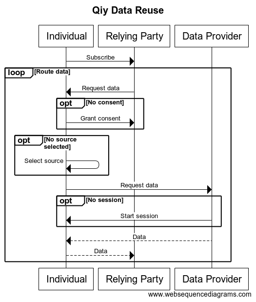

# FUNCTIONAL SPECIFICATION 'QIY SCHEME V1.1'
From Qiy Nodes to data exchange

# Contents

1. [Introduction](#1-introduction)
	1. [Purpose](#11-purpose)
	1. [Reader guidance](#12-reader-guidance)
1. [Overview](#2-overview)
	1. [Data Reuse](#21-data-reuse)
		1. [Privacy concern](#211-privacy-concern)
1. [Architectural Description](#3-architectural-description)
	1. [Architectural Layers](#31-architectural-layers)
	1. [Privacy](#32-privacy)
	1. [Security](#33-security)
	1. [Interoperability](#34-interoperability)
	1. [Governance](#35-governance)
	1. [Compliancy](#36-compliancy)
1. [The User Layer](#4-the-user-layer)
	1. [Qiy Users](#41-qiy-users)
	1. [Provider](#42-provider)
	1. [Qiy Node](#43-qiy-node)
	1. [Connect via Qiy](#44-connect-via-qiy)
		1. [Generate token](#441-generate-token)
		1. [Media](#442-media)
			1. [The web](#4421-the-web)
			1. [Print](#4422-print)
	1. [Setup](#45-setup)
		1. [Relying Party](#451-relying-party)
		1. [Data Provider](#451-data-provider)
		1. [Individual](#452-individual)
	1. [Subscribe](#46-subscribe)
	1. [Consent](#47-consent)
	1. [Routing](#48-routing)
	1. [Source](#49-source)
	1. [Session](#410-session)
1. [The Application Layer](#5-the-application-layer)
	1. [Qiy Application](#51-qiy-application)
		1. [Application Provider](#511-application-provider)
		1. [Qiy Application Protocol](#512-qiy-application-protocol)
		1. [Creating Qiy Nodes for Individuals](#513-creating-qiy-nodes-for-individuals)
			1. [Security consideration](#5131-security-consideration)
		1. [Link with an existing Qiy Node](#514-link-with-an-existing-qiy-node)
	1. [Connect](#52-connect)
		1. [Application Connect Token](#521-application-connect-token)
		1. [Proposer: Connect](#522-proposer:-connect)
		1. [Generate Application Connect Token](#523-generate-application-connect-token)
		1. [Accepter: Connect](#524-accepter:-connect)
	1. [Consent](#53-consent)
		1. [Relying Party: Request consent](#531-relying-party:-request-consent)
		1. [Individual: Consider consent request](#532-individual:-consider-consent-request)
	1. [Service Discovery](#54-service-discovery)
	1. [Data by Reference](#55-data-by-reference)
		1. [Service by Reference](#551-service-by-reference)
		1. [Request data reference](#551-request-data-reference)
		1. [Create reference](#542-create-reference)
		1. [Request data](#551-request-data)
		1. [Provide data](#552-provide-data)
1. [The Qiy Node Layer](#6-the-qiy-node-layer)
	1. [Access Provider](#61-access-provider)
		1. [Portability](#611-portability)
	1. [Qiy Node](#62-qiy-node)
		1. [Qiy Node Protocol](#621-qiy-node-protocol)
		1. [Qiy Node API](#622-qiy-node-api)
		1. [Qiy Node Implementation](#623-qiy-node-implementation)
		1. [Qiy Node Instantiation](#624-qiy-node-instantiation)
		1. [Deleting a Qiy Node](#625-deleting-a-qiy-node)
	1. [Connect](#63-connect)
		1. [Connection Uri](#631-connection-uri)
			1. [Security concern](#6311-security-concern)
		1. [Connect Token](#632-connect-token)
			1. [Security concern](#6321-security-concern)
			1. [Creating a Connect Token](#6322-creating-a-connect-token)
			1. [Creating a Transport Connect Token](#6323-creating-a-transport-connect-token)
		1. [Connecting](#633-connecting)
		1. [Deleting a Connection](#634-deleting-a-connection)
	1. [Consent](#64-consent)
		1. [Consent Uri](#641-consent-uri)
		1. [Consent Service Descriptor](#642-consent-service-descriptor)
		1. [Consent Data Descriptor](#643-consent-data-descriptor)
			1. [Privacy concern](#6431-privacy-concern)
	1. [Qiy Node Request](#65-qiy-node-request)
	1. [Qiy Node Requests](#66-qiy-node-requests)
		1. [Connect Token Creation Request](#661-connect-token-creation-request)
		1. [Connect Token Registration Request](#662-connect-token-registration-request)
		1. [Connect Token Update Request](#663-connect-token-update-request)
		1. [Connection Create Request](#664-connection-create-request)
		1. [Connection Delete Request](#665-connection-delete-request)
		1. [Connections Request](#666-connections-request)
		1. [Consent Denied Request](#667-consent-denied-request)
		1. [Consent Granted Request](#668-consent-granted-request)
		1. [Consent Request](#669-consent-request)
		1. [Consent Withdrawn Request](#6610-consent-withdrawn-request)
		1. [Consents Request](#6611-consents-request)
		1. [Message Post Request](#6612-message-post-request)
		1. [Messages Request](#6613-messages-request)
		1. [Operation Execution Request](#6614-operation-execution-request)
		1. [Operation Registration Request](#6615-operation-registration-request)
		1. [Operation References Request](#6616-operation-references-request)
		1. [Source Candidates Request](#6617-source-candidates-request)
		1. [Source Registration Request](#6618-source-registration-request)
	1. [Qiy Node Message](#67-qiy-node-message)
	1. [Qiy Node Messages](#68-qiy-node-messages)
		1. [Consent Denied Message](#681-consent-denied-message)
		1. [Consent Granted Message](#682-consent-granted-message)
		1. [Consent Request Message](#683-consent-request-message)
		1. [Operation Reference Message](#684-operation-reference-message)
		1. [Operation Reference Request Message](#685-operation-reference-request-message)
	1. [Qiy Node Event](#69-qiy-node-event)
	1. [Qiy Node Events](#610-qiy-node-events)
		1. [Connection Created Event](#6101-connection-created-event)
		1. [Consent Withdrawn Event](#6102-consent-withdrawn-event)
		1. [Message Received Event](#6103-message-received-event)
		1. [Operation Reference Received Event](#6104-operation-reference-received-event)
		1. [Source Candidate Event](#6105-source-candidate-event)
1. [The Service Layer](#7-the-service-layer)
	1. [Access Provider](#71-access-provider)
		1. [Portability](#711-portability)
	1. [Service](#72-service)
	1. [Service Endpoints](#73-service-endpoints)
	1. [Service Library](#74-service-library)
	1. [Consent Service](#75-consent-service)
1. [The Transport Layer](#8-the-transport-layer)
	1. [Access Provider](#81-access-provider)
		1. [Portability](#811-portability)
	1. [Transporter](#82-transporter)
	1. [Transport Protocol](#821-transport-protocol)
	1. [Transporter API](#822-transporter-api)
	1. [Transporter Implementation](#823-transporter-implementation)
	1. [Transporter Instantiation](#824-transporter-instantiation)
	1. [Deleting a Transporter](#825-deleting-a-transporter)
	1. [Path](#83-path)
		1. [Path Creation](#831-path-creation)
		1. [Deleting a Path](#832-deleting-a-path)
1. [The Carrier Layer](#9-the-carrier-layer)
	1. [Access Provider](#91-access-provider)
		1. [Portability](#911-portability)
	1. [Carrier](#92-carrier)
	1. [Carrier Protocol](#921-carrier-protocol)
	1. [Carrier API](#922-carrier-api)
	1. [Carrier Implementation](#923-carrier-implementation)
	1. [Carrier Node](#93-carrier-node)
1. [Definitions](#10-definitions)

# 1 Introduction
Qiy, or rather: the Qiy Scheme, puts people back in control of their Personal Data while creating value for organizations that process it (Relying Parties).

## 1.1 Purpose

The document is aimed at people who know that Qiy puts people back in control of their Personal Data, but who want or need to know the functional, technical, privacy, security, legal and/or compliancy aspects of Qiy.

## 1.2 Reader guidance

* Privacy officers are advised to read chapter [3 Architectural Description](#3-architectural-description).
* Security officers are advised to read chapter [3 Architectural Description](#3-architectural-description).
* Information analysts are advised to read chapters [3 Architectural Description](#3-architectural-description), [4 The User Layer](#4-the-user-layer) and [5 The Application Layer](#5-the-application-layer).
* Application developers are advised to read chapters [3 Architectural Description](#3-architectural-description), [4 The User Layer](#4-the-user-layer), [5 The Application Layer](#5-the-application-layer) and [6 The Qiy Node Layer](#6-the-qiy-node-layer).
* Systems engineers are advised to read chapters [3 Architectural Description](#3-architectural-description), [8 The Transport Layer](#8-the-transport-layer) and [9 The Carrier Layer](#9-the-carrier-layer).

# 2 Overview

This chapter gives an overview of this document.
* [2.1 Data Reuse](#21-data-reuse) describes how data can be reused with Qiy.
* [3 Architectural Description](#3-architectural-description) describes the Architectural Layers and addresses various concerns like privacy and security.
* [4 The User Layer](#4-the-user-layer) describes the setup and processes of the data reuse at the user level.
* [5 The Application Layer](#5-the-application-layer) describes the processes at the application level.
* [6 The Qiy Node Layer](#6-the-qiy-node-layer) describes the same at the Qiy Node level.
* [7 The Service Layer](#7-the-service-layer) describes the Service Layer support.
* [8 The Transport Layer](#8-the-transport-layer) describes the Transport Layer support.
* [9 The Carrier Layer](#9-the-carrier-layer) describes the Carrier Layer support.
* [10 Definitions](#10-definitions) contains the definitions used in this document.

## 2.1 Data Reuse

This document describes how Qiy realizes a Data Reuse scenario in which a Data Subject (Individual) reuses his Personal Data stored at one organization (Data Provider) and provide it to another organization (Relying Party) to consume one of its services.

In essence, the Data Reuse goes as follows:
* The Individual subscribes to a service.
* The Relying Party asks the Individual for the data it needs to provide the service.
* The Individual retrieves the data from a Data Provider.
* The Individual provides the data to the Relying Party.

### 2.1.1 Privacy concern

The Data Reuse scenario shows that the data is transferred to the Relying Party by choice of the Individual.
This breaks the chain of responsibility for the Data Provider; the responsibility for correct processing of the data does not extend to any processing that takes place after the handover to the Individual. 

# 3 Architectural Description

This chapter describes the major entities of Qiy and their relations with the help of the Architectural Layers of the Qiy Scheme and addresses how Qiy addresses concerns like security and privacy.

## 3.1 Architectural Layers
The realization of the scenario is described using the following layers:

## 3.2 Privacy

Qiy has been conceived with the aim to put people back in control of their Personal Data, hence making privacy the primary concern of Qiy.
The aim has been elaborated in a set of principles called the Qiy Trust Principles and technical, legal and governance rules, all of which are maintained by the Qiy Foundation and the Qiy Foundation Members.

The realization of the Data Reuse as described in this document demonstrates that a natural person (Individual) is in control:
* The Individual can securily exchange data and/or messages with another person or organization (Qiy User) via Qiy, using connections, see [4 The User Layer](#4-the-user-layer).
* The Individual controls what Qiy Users he connects with and, in principle, when he wants to end it.
* When an Individual connects with a Qiy User that is providing a Service via Qiy (Provider), the Individual is provided with the identity of the latter, but not the other way around.
* The Individual can access his Personal Data that is kept by another Qiy User (Data Provider) as a result of the Access Principle, one of the Qiy Trust Principles.
* The Individual controls what data he shares with what Provider (Relying Party) and under what terms using proveable Consents.
* Qiy Users use applications that are authorized for use with Qiy (Qiy Applications).
* Access to Qiy, data exchange via Qiy, consent services and potentially Qiy Nodes are provided by Access Providers.

All parties involved are bound by the rules of the Qiy Scheme:
* Providers are bound by the Binding Individual Rights and the Binding Principles for Relying Parties and Data Providers.
* Access Providers are bound by the Licence Agreement Issuer or the Licence Agreement Service Provider.
* Application Providers can only develop and produce Qiy Application-services and/or software with a Licence Agreement Application Provider.

## 3.3 Security

As described above, privacy is at the heart of Qiy and security being a 'conditio sine qua no' for this, it is also addressed by the rules of the Qiy Scheme.

## 3.4 Interoperability

An Individual can only control his Personal Data, when all concerned systems are interoperable.
This is achieved as follows:
* Applications exchange data and/or messages via Qiy using open standards of the Qiy Scheme (Qiy Open Standard).
* Applications exchange described data using Data Descriptions which are available to all concerned parties (via the Service Library).

## 3.5 Governance

The governance rules are laid down in the Governance Model for the Qiy Scheme, one of the documents of the Qiy Scheme Rulebook.

## 3.6 Compliancy

The compliancy rules for Providers can be found in the Binding Principles for Relying Parties and Data Providers, one of the documents of the Qiy Scheme Rulebook.

# 4 The User Layer
This chapter describes the User Layer and the interaction between the Relying Party, Individual, Data Provider and the lower layers for the Data Reuse.

## 4.1 Qiy Users
The organizations and/or persons using Qiy are called Qiy Users. They can use Qiy in different roles; they can use Qiy as a Relying Party, Individual, Data Provider or a combination of these.
A business for example will generally use Qiy both as a Relying Party (for offering Services using reliable Personal Data) and as a Data Provider (as a source of Personal Data).
As for natural persons, most of these will use Qiy as an Individual to control their Personal Data.

## 4.2 Provider
A Qiy User that provides one or more Services to Individuals is said to be (or act in the Business Role of) 'Providers'.
Any Qiy User acting in one or both of the roles Relying Party or Data Provider is implicitely acting in this role.

## 4.3 Qiy Node
A Qiy User must have a Qiy Node. 
Providers can acquire one from an Access Provider.
Individuals obtain a Qiy Node the first time they use a Qiy Application.
Alternatively, Qiy Users may instantiate a Qiy Node themselves using a Qiy Node Implementation and register it with an Access Provider.

## 4.4 Connect via Qiy

Two Qiy Users can connect via Qiy by creating a connection between their Qiy Nodes (Connection).
The Connection can be initiated by either of the two Qiy Users.
The Qiy User initiating the Connection is called the Proposer, the other one Accepter.
This goes as follows:
* The Proposer uses a Qiy Application to generate a token (see [4.7.1 Generate token](#471-generate-token)) and compose Connect Proposal.
* The Proposer provides it out-of-band to the Accepter, for example by lettre, see [4.7.2 Media](#472-media).
* The Accepter may read the proposal and use a Qiy Application to extract the Connect Token and create a new Connection with the Proposer.

As stated before, when a Connection is established, the identity of the Qiy User is provided to the other one if the Qiy User is a Provider. 
This information may be used to reuse a formerly created Connection and delete the new Connection.

### 4.4.1 Generate token
A Proposer can create a token using a Qiy Application and the following details:
* Name: The name or pseudonym to use in the Connect Proposal.
* Expiration: Whether the token expires and if so, on what date and time.
* Budget: The number of times that the token can be used to create a Connection.

In most cases, the expiration and budget are set by the application.
The Expiration and the Budget can be changed afterwards, for example to re-activate an expired token.

 
### 4.4.2 Media
Qiy Users can use different media to connect as illustrated in this diagram:

 
#### 4.4.2.1 The web
Qiy Users can connect by transfering a token as a query parameter in a website address:
 

 
#### 4.4.2.2 Print
Qiy Users can convert the token to a QR Code and use various 'Print'-media to connect:

The QR Code can be used as follows to create the Connection:
 

 

## 4.5 Setup

This section addresses the setup for the Data Reuse

### 4.5.1 Relying Party

In order to be able to offer his services via Qiy, a Relying Party has met the following preconditions:
* The Relying Party has acquired access to Qiy with the help of an Access Provider.
* The Access Provider has verified and registered the identity of the Relying Party for use in Qiy.
* The Service Library contains the Service Catalogue of the Relying Party defining the provided services.
* The Service Library contains Service Descriptions for all the provided services, which also includes the terms of use, especially with regard to Personal Data.

### 4.5.1 Data Provider

In order to be able to provide the Personal Data via Qiy, a Data Provider has met the following preconditions:
* The Data Provider has acquired access to Qiy with the help of an Access Provider.
* The Access Provider has verified and registered the identity of the Data Provider for use in Qiy.
* A Service Endpoint is available to access the data.
* The Service Library contains the Service Endpoint API which describes how the data can be obtained.
* The Service Library contains Data Descriptions for the available data.
* The Service Library contains the Service Catalogue of the Data Provider defining the provided data services and the related endpoints.
* The Service Library contains Service Descriptions for the provided data services.

### 4.5.2 Individual

In order to be able to reuse Personal Data via Qiy, an Individual has met the following preconditions:
* The Individual has access to his Personal Data stored by one or more Data Providers.
* The Individual has access to a personal Qiy Node.
* The Individual is using a Qiy Application which is linked to his Qiy Node.

## 4.6 Subscribe

Data Reuse starts with an Individual subscribing to a service, but only after considering and accepting the terms of use, including those regarding the use of Personal Data.
When an Individual subscribes to a service, the subscription is registered by the Qiy Application, so:
* The subscribed service is recorded using the Service Portfolio of the Individual.
* The record shows:
	* the start datetime of the subscription.
	* the Provider of the service (the Relying Party).
	* what service is provided (using the Service Library.
	* the related Consent.

## 4.7 Consent

When a request for data is received, it is checked with the granted consents. If the request is not authorized by an active granted consent, this may be resolved by granting one, after which the data request is processed.
In other cases, the request will not be accepted and no data will be returned.

## 4.8 Routing

When all related conditions are met, a request for data from a Relying Party is processed as follows:
* The Service Portfolio of the Individual is consulted to find the Data Provider or Data Providers and related Service Endpoint API.
* Using the API, requests are created and used to obtain the data from the Service Endpoints.
* The received data is forwarded to the Relying Party.

## 4.9 Source

When a Relying Party has requested for data, the Service Portfolio is used to look up the data source: the Provider or Providers that will provide the data (Service Source).
This can be the Individual himself, for self-declared data, but it can also be one or more Data Providers.
The source of the data may have been defined before at the time of subscription, but if that it is not the case, the Individual will be asked to make a selection from a list of suitable Data Providers (Servive Discovery).
The list will be generated using the Service Catalogues from the Service Library.
The Service Portfolio will be updated with the outcome.

## 4.10 Session

A Service Endpoint will only process a request when issued over an active Session. This Session may be started earlier, for example when the Individual selects a Data Provider as a source, but a new Session will be started if need be.
More often then not, this may require input from the Individual.
The session credentials are persisted in the Service Catalogue of the Individual.

# 5 The Application Layer
This chapter describes the Application Layer and how it supports the processes of the Data Reuse scenario.

## 5.1 Qiy Application
A Qiy Application is an Application Service or software which is authorized for use with Qiy.
* A Qiy Application must comply with the requirements of the Qiy Scheme.
* A Qiy User can only use Qiy with a Qiy Application.
* A Qiy User can use one or more Qiy Applications.
* Qiy Applications can use a Qiy Node at the same time.

### 5.1.1 Application Provider
Qiy Applications can be provided by Application Providers. An Application Provider can only do so with a valid Qiy Licence Agreement Application Provider.

### 5.1.2 Qiy Application Protocol
The Qiy Application Protocol describes the interactions of the Qiy Applications with eachother and the underlying layers.
* The Qiy Application Protocol is an open standard and is part of the Qiy Open Standard.

The Qiy Application Protocol describes among others how Qiy Applications:
* ... create a Qiy Node for a Qiy User.
* ... can be linked to a Qiy Node of a Qiy User.
* ... create Connections.
* ... create a 'backup' of a Qiy Node.
* ... exchange Connection Tokens out-of-band.
* ... exchange messages.
* ... exchange Personal Data.

### 5.1.3 Creating Qiy Nodes for Individuals

A Qiy Application can create a Qiy Node for a Qiy User, especially when he does not have one yet.
The Qiy Application can do so with the help of an Access Provider, but first it has to generate the credentials for the Qiy Node (Qiy Node Credentials):
* A key pair, consisting of public key and a private key, 
* A Node Id

The Qiy Application must persists these in order to be able to keep using the Qiy Node.

#### 5.1.3.1 Security consideration
Some security considerations related to the Qiy Node Credentials are:
* The Node Id must be a Uuid in order to assure that it is unique.
* The key pair must be unique.
* The private key must be persisted securily in order to guarantee the security of the Qiy User. 
* The Node Id should be persisted securily in order to guarantee the security of the Qiy User. 
* The Qiy Applications that can be used on consumer devices such as smart phones must provide a way to backup and recover the Qiy Node Credentials in order to overcome cases of loss of the device.
* A Qiy User must be able to control the devices that can access his Qiy Node, for example in order to be able to block access of a (possibly) stolen device.

### 5.1.4 Link with an existing Qiy Node
A Qiy Application can be linked to an existing Qiy Node by providing it with its Qiy Node Credentials.

## 5.2 Connect

### 5.2.1 Application Connect Token
Qiy Applications exchange Application Connect Tokens to create Connections. 
In addition to the Connect Token that is necessary to create the Connection, it contains the name or pseudonym to be displayed in the Connect Proposal. 
For more information, please refer to [5.2.3 'Generate Application Connect Token'](#523-generate-application-connect-token).

### 5.2.2 Proposer: Connect
For a Qiy Application of a Proposer, a Connection is established as follows:
* The Qiy Application generates an Application Conenct Token, see [5.2.3 'Generate Application Connect Token'](#523-generate-application-connect-token).
* The Qiy Application composes a Connect Proposal for the Proposer.
* The Proposer presents it out-of-band to the Accepter.
* When the Accepter wants to connect, he uses the Connect Proposal to create a connection with his Qiy Application, see [5.2.4 'Accepter: Connect'](#524-accepter-connect).
* The Proposer detects this by use of polling (using the Connections Request) or events (using the Connection Created Event).
 

### 5.2.3 Generate Application Connect Token
The main part of an Application Connect Token is the Connect Token. The Qiy Application can create this both online and offline:
* Offline by creating a Connect Token and registering it later using a Connect Token Registration Request.
* Online using a Connect Token Creation Request.

### 5.2.4 Accepter: Connect
At the Accepter-side, a Qiy Application creates a Connection with a Connect Proposal or Connect Token as follows:
* In case of a Connect Proposal, the Qiy Application extracts the Connect Token from the Connect Proposal.
* The Qiy Application uses the Connect Token in Connection Create Request to the Qiy Node of the Qiy User.
* The Qiy Node creates the Connection and returns the id of the Connection (Connection Uri).

## 5.3 Consent

### 5.3.1 Relying Party: Request consent

A Qiy Application of a Relying Party can request an Individual for Consent as follows:
* The Qiy Application sends a Consent Request Message over the Connection with the Individual.
* The Qiy Application receives a message with the outcome, either a Consent Granted Message or a Consent Denied Message.

### 5.3.2 Individual: Consider consent request
A Qiy Application of an Individual processes a Consent Request as follows:
* The Qiy Application detects receiving a Consent Request Message by polling (using the Messages Request) or with events (using the Message Received Event).
* The Qiy Application extracts the Consent Request and presents it to the Individual.
* Depending on the choice of the Individual, the Qiy Application returns a Consent Granted Message or a Consent Denied Message using the Connection with the Relying Party.

## 5.4 Service Discovery
A Qiy Application can present an Individual a list of suitable Data Providers (or in general Providers) that can produce some requested data (or services) as follows:
* The Qiy Application asks the Qiy Node of the Individual for a list of suitable Data Providers with a Source Candidates Request.
* The Qiy Node consults the Service Library and returns the outcome to the Qiy Application.
* The Qiy Application presents the result to the Individual.
* The Qiy Application registers the selected sources with a Source Registration Request.

## 5.5 Data by Reference
Qiy Applications exchange data by reference rather then by value.
This goes as follows:
* A Qiy Application requests a reference for the data (Data Reference).
* The Qiy Application receives a Data Reference.
* The Qiy Application uses the Data Reference to acquire the data.

### 5.5.1 Service by Reference
In Qiy providing data is viewed as a service and requesting data as an operation of this service, so the 'data by reference'-pattern is implemented as using a Service by Reference-pattern:
* A Qiy Application requests an Operation Reference (Operation Reference Request).
* A Operation Reference is created by registrating the specification of the operation Operation Specification and returned (Operation Registration).
* The Qiy Application uses the Data Reference to acquire the data (Operation Execution).

### 5.5.1 Request data reference
The Qiy Application of a Relying Party can request an Individual for a data reference as follows:
* The Qiy Application sends a Operation Reference Request Message using the Connection of the Individual.
* The Qiy Application receives the Operation Reference in an Operation Reference Message.

### 5.4.2 Create reference
A Qiy Application can create an Operation Reference using a specification of the operation (Operation Specification).
This goes as follows:
* The Qiy Application uses the Operation Specification in an Operation Registration Request to the Qiy Node it is linked with.
* The Qiy Node creates the Operation Reference and returns it.

### 5.5.1 Request data
The Qiy Application of a Relying Party can obtain data using a Data Reference / Operation Reference. 
This goes as follows:
* The Qiy Application uses the Operation Reference in a Operation Execution Request to its Qiy Node.
* The Qiy Node returns the requested data.

### 5.5.2 Provide data
The Data Provider produces the data using his Service Endpoint.
This does not involve any of the Qiy Applications of the Data Provider nor his Qiy Node.

# 6 The Qiy Node Layer
This chapter describes the Qiy Node Layer and how it supports the upper layers.

## 6.1 Access Provider
The services of this layer can be provided by an Access Provider:
* An Access Provider can provide Qiy Nodes.
* An Access Provider can host Qiy Nodes.

### 6.1.1 Portability
An Access Provider can offer Qiy Node-services to Qiy Users, but must enable Qiy Users to easily transfer the services to a different Access Provider.

## 6.2 Qiy Node
A Qiy Node is een Technology Service as defined in Definitions of the Qiy Scheme.
A Qiy Node:
* ... must comply with the rules of the Qiy Scheme.
* ... can be hosted on any host (Node).
* ... has its own Transporter which ensures secure transport of messages and/or data via Qiy.

### 6.2.1 Qiy Node Protocol
The Qiy Node Protocol describes the interaction between the Qiy Nodes and the underlying layers.
* The Qiy Node Protocol is one of the protocols in the Qiy Open Standard.
The Qiy Node Protocol describes for example:
* How a Qiy Node is instantiated.
* How Qiy Nodes create Connections and use them to exchange data, messages or to provide/consume services.

### 6.2.2 Qiy Node API
The Qiy Node API is the Technology Interface of the Qiy Node, one of the APIs of the Qiy Open Standard.
* The Qiy Node API is intended for use by Qiy Applications.

### 6.2.3 Qiy Node Implementation
A Qiy Node Implementation is a software package which can be used to realize a Qiy Node.
The Qiy Scheme puts no limit on the number of Qiy Node Implementations, as long as the implementation complies with the Qiy Open Standard and the rules of the Qiy Scheme. 

### 6.2.4 Qiy Node Instantiation
A Qiy Node can be created in two ways:
* It can be instantiated by an Access Provider. The Access Provider will instantiate it with its own Transporter. 
* It can be instantiated by a Qiy User on a Node of his own using a Qiy Node Implementation. 
When the second option is chosen, the Qiy User is responsible for obtaining a Transporter and linking it to the Qiy Node.

### 6.2.5 Deleting a Qiy Node
In principle, a Qiy Node can be deleted by its owner whenever he wants to do so.
In this case, the Qiy Node will be deleted including persisted data, Connections and the linked Transporter.
Related Consents will be withdrawn.

## 6.3 Connect
Two Qiy Nodes can connect by creating a Path between themselves.
* A Qiy Node can connect with zero or more other Qiy Nodes.
* A Qiy Node can have zero or more Paths with any other Qiy Node.
* A priori, a Qiy Node does not know the identity of the Qiy Node at the other side of a Path.

### 6.3.1 Connection Uri
The Connection Uri is the Uri which identifies a Connection for one of the Qiy Node it connects.
* A Connection has two Connection Uris; one for each of the two Qiy Nodes it connects.
* The two Connection Uris of one Connection are not related to one another.
* A priori, a Qiy Node does not know the other Connection Uri of a Connection.

EXAMPLE: Connection Uris of a Connection between Qiy Node 1 and Qiy Node 2:

Qiy Node | Connection Uri
---- | --------------
Qiy Node 1	| http://127.0.0.1:8087/user/connections/user/usernodeB/93590b55-9194-4cf4-944f-2cbceab7dbcd
Qiy Node 2	| http://127.0.0.1:8087/user/connections/user/usernodeA/f96bc541-e98b-449e-bfc5-48ec928e0dc9

#### 6.3.1.1 Security concern
The Connection Uri has only meaning in the context of the Qiy Node that knows it and is useless outside this scope.
For example, the Uri by itself can not be used to exchange a message with the Qiy Node nor any other existing Qiy Node.

### 6.3.2 Connect Token
A Connect Token is a token which can be used by a Qiy Application to create a Connection.
It consists of:
* a temporary secret
* a Transport Connect Token.

A Connect Token has the following properties:
* An expiration setting: Whether the token expires and if so, on what date and time
* A budget: The number of times that the token can be used to create a Connection. 

The properties can not only be set when the token is registered or requested, but also later.
For example, it is possible to reactivate a Connect Token by increasing the budget or inactivate one by changing the expiration.

#### 6.3.2.1 Security concern
The Connect Token can only be used to create a Connection and only so via Qiy, with the help of a Qiy Application and a linked Qiy Node.
By itself, it cannot be used for any other purpose, for example gain access to a Qiy Node nor any other parts of the Qiy infrastructuur.

#### 6.3.2.2 Creating a Connect Token
A Connect Token can be created both offline and online:
* A Connect Token can be obtained from the Qiy Node using a Connect Token Creation Request (Online Connect Token).
* A Connect Token can be created by a Qiy Application and registered later using a Connect Token Registration Request (Offline Connect Token).

The Offline Connect Token allows initiating a Connection (creating a Connect Token) even when Qiy is temporarily not available.
However, care must be taken that the created token is unique, especially so for the created Transport Connect Token.

#### 6.3.2.3 Creating a Transport Connect Token
A Qiy Node will never create a Transport Connect Token:
* In case of an Online Connect Token: The Qiy Node will obtain a Transport Connect Token from its Transporter.
* In case of an Offline Connect Token: The Qiy Node will compose a Transport Connect Token using the Connect Token provided by the Qiy Application and register it at its Transporter.

### 6.3.3 Connecting
Two Qiy Nodes connect as follows:
* The Qiy Node of the Proposer either 1) obtains a Transport Connect Token from the Transporter or 2) from a linked Qiy Application in a Connection Create Request.
* The Qiy Node either 1) provides the Transport Connect Token to the Qiy Application or 2) registers the Transport Connect Token at its Transporter.
* The Transport Connect Token is made available (partly out-of-bands, for example in a Connect Proposal) to the Qiy Node of the Accepter.
* The Qiy Node of the Accepter uses its Transporter to create a Path using the Transport Connect Token.
Each accepted Path Creation Request leads to a new Path, irrespective of the number of existing Paths between the two Qiy Nodes.

### 6.3.4 Deleting a Connection
A Connection can be deleted with a Connection Delete Request.
The Connection will be deleted completely, including any persisted data and/or messages and underlying Paths.
Any related Consents will be withdrawn.

## 6.4 Consent
A Consent is a permission given by an Individual to a Relying Party defining what Personal Data a Relying Party is allowed to use for a provided Service and under what the terms.
A Consent has the following properties:
* a Consent Uri
* a Consent Service Descriptor
* a Consent Data Descriptor

### 6.4.1 Consent Uri
The Consent Uri is an Uri used to identify a Consent.

### 6.4.2 Consent Service Descriptor
The Consent Service Descriptor is a Service Descriptor which indicates the Service that the Consent applies to.
A Service Descriptor can be used to obtain a description of a Service (Service Description) with the help of the Service Library.

### 6.4.3 Consent Data Descriptor
The Consent Data Descriptor is a Data Descriptor which indicates the Personal Data that the Consent applies to.
A Data Descriptor can be used to obtain a description of Data (Data Description) with the help of the Service Library.

#### 6.4.3.1 Privacy concern
A Relying Party can only ask Consent for Personal Data that can be provided by one of the available Data Providers, eg for which a Data Descriptor exists in the Service Library.
  
## 6.5 Qiy Node Request
A Qiy Node Request is a Http Request for a Qiy Node. 
Qiy Node Requests are only accepted when they are correctly authenticated with:
* the Node Id.
* an actual timestamp
* a digital signature over the Node Id, the timestamp and the contents of the body of the request made with the private key

## 6.6 Qiy Node Requests
This section gives an overview of the Qiy Node Requests.
Details of Qiy Node Requests can be found in the Qiy Node API.

### 6.6.1 Connect Token Creation Request
Connect Token Creation Request
Met dit request kan een Connect Token worden gecre&euml;erd door the Qiy Node.

### 6.6.2 Connect Token Registration Request
Connect Token Registration Request
Met dit request kan een Connect Token worden geregistreerd.

### 6.6.3 Connect Token Update Request
The Connect Token Update Request is a Qiy Node Request that can be used to update a Connect Token.

### 6.6.4 Connection Create Request
The Connection Create Request is a Qiy Node Request that can be used to create a Connection with a Connect Token.

### 6.6.5 Connection Delete Request
The Connection Delete Request is a Qiy Node Request that can be used to delete a Connection.

### 6.6.6 Connections Request
The Connections Request is a Qiy Node Request that can be used to obtain a list of all the Connections of a Qiy Node.

### 6.6.7 Consent Denied Request
The Consent Denied Request is a Qiy Node Request that can be used to record the denial of a Consent.

### 6.6.8 Consent Granted Request
The Consent Granted Request is a Qiy Node Request that can be used to record the granting of a Consent.

### 6.6.9 Consent Request
The Consent Request is a Qiy Node Request which can be used to request for a Consent.

### 6.6.10 Consent Withdrawn Request
The Consent Withdrawn Request is a Qiy Node Request that can be used to record the withdrawal of a Consent.

### 6.6.11 Consents Request
The Consents Request is a Qiy Node Request that can be used to obtain a list of all the Consents of a Qiy Node.

### 6.6.12 Message Post Request
The Message Post Request is a Qiy Node Request that can be used to post a Qiy Node Message.

### 6.6.13 Messages Request
The Messages Request is a Qiy Node Request that can be used to obtain a list of all the Messages of a Qiy Node.

### 6.6.14 Operation Execution Request
The Operation Execution Request is a Qiy Node Request that can be used to command the execution of an Operation by reference using an Operation Reference.

### 6.6.15 Operation Registration Request
The Operation Registration Request is a Qiy Node Request that can be used to obtain an Operation Reference by registrating an Operation Specification.

### 6.6.16 Operation References Request
The Operation References Request is a Qiy Node Request that can be used to obtain a list of all the Operation References of a Qiy Node.

### 6.6.17 Source Candidates Request
The Source Candidates Request is a Qiy Node Request to obtain candidate Providers for a Service.

### 6.6.18 Source Registration Request
The Source Registration Request is a Qiy Node Request to register a Provider as source for a Service.
 
## 6.7 Qiy Node Message
A Qiy Node Message is a Message that is exchanged using a Connection.
Qiy Node Messages can be sent with the Message Post Request, obtained using a Messages Request and monitored with Qiy Node Events like Message Received Event.

## 6.8 Qiy Node Messages
This section gives an overview of the Qiy Node Messages.
Details of Qiy Node Messages can be found in the Qiy Node Protocol.

### 6.8.1 Consent Denied Message
The Consent Denied Message is a Qiy Node Message which can be used to communicate the denial of a Consent.

### 6.8.2 Consent Granted Message
The Consent Granted Message is a Qiy Node Message which can be used to communicate the granting of a Consent.

### 6.8.3 Consent Request Message
The Consent Request Message is a Qiy Node Message which can be used to request for a Consent.

### 6.8.4 Operation Reference Message
Operation Reference Message
This message can be used to convey Operation References.
 
### 6.8.5 Operation Reference Request Message
Operation Reference Request Message
This message can be used to request for Operation References.
 
## 6.9 Qiy Node Event
A Qiy Node Event is a Technology Event of a Qiy Node.

## 6.10 Qiy Node Events
This section gives an overview of the Qiy Node Events.
Details of Qiy Node Events can be found in the Qiy Node Protocol.

### 6.10.1 Connection Created Event
The Connection Created Event is a Qiy Node Event that is generated when a Connection has been created.

### 6.10.2 Consent Withdrawn Event
The Consent Withdrawn Event is a Qiy Node Event that is generated when a Consent has been withdrawn.

### 6.10.3 Message Received Event
The Message Received Event is a Qiy Node Event that is generated when a Qiy Node Message has been received.

### 6.10.4 Operation Reference Received Event
The Operation Reference Received Event is a Qiy Node Event that is generated when a Qiy Node has received a new Operation Reference.

### 6.10.5 Source Candidate Event
The Source Candidate Event is a Qiy Node Event that is generated when a Qiy Node has received a new Source Candidate for a Consent.

# 7 The Service Layer
The Service Layer provides the following Technology Services to support the provisioning and consumption of Services via Qiy:
* Service Endpoints
* Service Library
* Consent Service

## 7.1 Access Provider
The Service Library and Consent Service are both provided by an Access Provider.

### 7.1.1 Portability
The Qiy Scheme prescribes that one can easily change to a different Access Provider for these services.

## 7.2 Service
In general, a Service is an 'information society service' as defined in the GDPR, with the following enhancements:
* A Service can be consumed with the use of one or more Operations.
* A Service is provided by a Provider.
* A Provider can offer one or more Services.
* One Service can be offered by one or more Providers.
* The Services that a Provider offers are described in a Service Catalogue.
* The Services that an Individual consumes are described in his Service Portfolio.

As for Qiy, the following definitions apply:
* Both Relying Parties and Data Providers are Providers.

## 7.3 Service Endpoints
A Service Endpoint is a Technology Service provided by a Provider to allow the consumption of his Services:
* A Provider can employ one or more Service Endpoints.
* A Service Endpoint can be used for one or more Services.
* A Service can be consumed with the use of one or more Service Endpoints.

For example, a Service Endpoint may be used by a Data Provider to disclose the Personal Data from one of his databases.

## 7.4 Service Library
The Service Library is used for:
* Data Descriptions
* Providers
* Service Catalogues
* Service Descriptions

## 7.5 Consent Service
A Consent Service is used for maintaining Consents and their status.
A Consent can be accessed by both of the involved Qiy Users: the Individual and the Provider.

* In principle, only an Individual can withdraw a Consent he has granted before.
* A Provider can only obtain Personal Data under a Consent which has not been withdrawn.

# 8 The Transport Layer
The Transport Layer supports the secure transmission of messages (Transport Messages) over Paths between Transporters.

## 8.1 Access Provider
The services of this layer are only provided by an Access Provider.

### 8.1.1 Portability
The Qiy Scheme prescribes that one can easily switch Access Provider for these services.

## 8.2 Transporter
A Transporter is a Technology Service which allows the secure transmission of messages and/or data.
* A Transporter must comply with the rules of the Qiy Scheme.
* A Transporter is hosted on a Carrier Node.
* Each Qiy Node has its own Transporter.

A Transporter can be used for:
* Creating Paths with other Transporters.
* Securely transmitting Transport Messages over these Paths.

## 8.2.1 Transport Protocol
The Transport Protocol describes the interaction between Transporters and the underlying layer.
The protocol is one of the protocols of the Qiy Open Standard.

## 8.2.2 Transporter API
The Transporter API is the Technology Interface of the Transporter, one of the APIs of the Qiy Open Standard.
* The Transporter API is intended for use by Qiy Nodes.

## 8.2.3 Transporter Implementation
A Transporter Implementation is a software package which can be used to realize a Transporter.
The Qiy Scheme puts no limit on the number of Transporter Implementations, as long as the implementation complies with the Qiy Open Standard and the rules of the Qiy Scheme. 

## 8.2.4 Transporter Instantiation
A Transporter can only be instantiated by an Access Provider.

## 8.2.5 Deleting a Transporter
A Transporter can be deleted by its Qiy Node.
In this case, the Transporter will be deleted including any persisted data and Routes.

## 8.3 Path
A Path is a logical connection between two Transporters that can be used to exchange Transport Messages.
Physically seen, the Path may be dynamic and stretch over several Carriers.

### 8.3.1 Path Creation
A Path can be created by a Transporter with a Transport Connect Token.

### 8.3.2 Deleting a Path
A Path can be deleted by either of the ending Transporters. 
The Path will be deleted including any persisted data and/or messages.

# 9 The Carrier Layer
The Carrier Layer supports the creation of Paths and the secure transport of messages over them.

## 9.1 Access Provider
The services of this layer are only provided by an Access Provider.

### 9.1.1 Portability
The Qiy Scheme prescribes that one can easily switch Access Provider for these services.

## 9.2 Carrier
The Carrier is Technology Service which can be used for:
* To obtain a Transporter.
* To create Paths.
* To safely transport messages between Carriers.
* To obtain a Qiy Node.

The Carrier comes with the following rules:
* A Carrier must comply with the rules of the Qiy Scheme.
* A Carrier must support the Carrier API.

## 9.2.1 Carrier Protocol
The Carrier Protocol describes the interaction between Carriers.
The protocol is part of the Qiy Open Standard.

## 9.2.2 Carrier API
The Carrier API is the Technology Interface of the Carrier and is part of the Qiy Open Standard.

## 9.2.3 Carrier Implementation
A Carrier Implementation is a software package which can be used to realize a Carrier.
The Qiy Scheme puts no limit on the number of Carrier Implementations, as long as the implementation complies with the Qiy Open Standard and the rules of the Qiy Scheme. 

## 9.3 Carrier Node
A Carrier Node is a Node which hosts one or more Carriers.
* The Carrier Node is provided by an Access Provider.
* The Access Provider can provide one or more Carrier Nodes.

# 10 Definitions
This document uses the following definitions:

Term	| Definition
------- | ----------
Access Provider	| An organization which provides Qiy Users access to the Qiy Trust Framework, either an Issuer or a Service Provider.
Access Principle	| The principle which authorizes the access of an Individual to his Personal Data, one of the Qiy Trust Principles.
Accepter	| A Business Role for a Qiy User who is creating a Connection using a Connect Token that is provided by a Proposer.
Application Connect Token	| A Token that is used by Qiy Applications to create Connections.
Application Interface	| As defined in Archimate 3.0, see https://pubs.opengroup.org/architecture/archimate3-doc/toc.html
Application Layer	| One of the Architectural Layers of the Qiy Scheme.
Application Provider	| A Bussiness Role for suppliers of Qiy Applications.
Application Service	| As defined in Archimate 3.0, see https://pubs.opengroup.org/architecture/archimate3-doc/toc.html
Architectural Layers of the Qiy Scheme	| The architectural layers of the Qiy Scheme: the User Layer, the Application Layer, the Qiy Node Layer, the Service Layer, the Transport Layer and the Carrier Layer.
Binding Individual Rights	| One of the documents of the Qiy Scheme Rulebook.
Binding Principles for Relying Parties and Data Providers	| One of the documents of the Qiy Scheme Rulebook.
Business Actor	| As defined in Archimate 3.0, see https://pubs.opengroup.org/architecture/archimate3-doc/toc.html
Business Object	| As defined in Archimate 3.0, see https://pubs.opengroup.org/architecture/archimate3-doc/toc.html
Business Process	| As defined in Archimate 3.0, see https://pubs.opengroup.org/architecture/archimate3-doc/toc.html
Business Role	| As defined in Archimate 3.0, see https://pubs.opengroup.org/architecture/archimate3-doc/toc.html
Carrier	| A Technology Service that provides the services of the Carrier Layer. 
Carrier API	| Technology Interface of the Carrier.
Carrier Implementation	| A software package which can be used to realize a Carrier.
Carrier Layer	| One of the Architectural Layers of the Qiy Scheme.
Carrier Node	| A Node which hosts one or more Carriers.
Connect Proposal	| A Business Object for a proposal to connect via Qiy.
Connect Token	| A Literal used to create a Connection.
Connection	| A connection between two Qiy Nodes.
Connection Uri	| Uri voor the id van een Connection.
Consent	| As defined in the GDPR.
Consent Data Descriptor	| Data Descriptor in een Service Description voor the beschrijving van the voor the Service benodigde Personal Data.
Consent Service	| A Technology Service used to maintain Consents and their status.
Consent Service Description	| A Service Description of the Service for which a Consent applies.
Consent Service Descriptor	| A Service Descriptor of a Consent Service Description.
Consent Uri	| A Uri which is used to identify a Consent.
Data by Reference	| A pattern for exchanging data indirectly using a Data Reference, see also Service by Reference.
Data Description	| A description of data.
Data Descriptor	| An Uri which can be used to identify and obtain a Data Description.
Data Provider	| A Business Role as defined in Definitions of the Qiy Scheme.
Data Provider Agreement	| An agreement required for Data Providers.
Data Reference	| An Operation Reference which can be used to obtain Personal Data of an Individual.
Data Subject	| As defined in the GDPR.
Definitions of the Qiy Scheme	| One of the documents of the Qiy Scheme Rulebook.
GDPR	| General Data Protection Regulation, see http://eur-lex.europa.eu/legal-content/EN-NL/TXT/?uri=CELEX:32016R0679&from=EN. 
Governance Model for the Qiy Scheme	| Governance Model for the Qiy Scheme, see https://www.qiyfoundation.org/qiy-scheme/qiy-scheme-rulebook/.
HTTP Request	| As defined in RFC 2616, see https://www.w3.org/Protocols/rfc2616/rfc2616-sec5.html
Individual	| A Business Role of a Qiy User as defined in Definitions of the Qiy Scheme.
Issuer	| A Business Role for an Access Provider that provides services to natural persons, see Definitions of the Qiy Scheme.
Licence Agreement Application Provider	| A licence agreement for Application Providers.
Licence Agreement Issuer	| A licence agreement for Issuers, the template of which is part of the Qiy Scheme Rulebook.
Licence Agreement Service Provider	| A licence agreement for Service Providers, the template of which is part of the Qiy Scheme Rulebook.
Literal	| A fixex value, see https://en.wikipedia.org/wiki/Literal_(computer_programming).
Node	| As defined in Archimate 3.0, see https://pubs.opengroup.org/architecture/archimate3-doc/toc.html
Operation | A 'sub-service' which can be used to consume a Service.
Operation Reference	| A Business Object used by the Service by Reference-pattern.
Operation Specification | A specification of a Http Request for the execution of an Operation.
Personal Data	| As defined in the GDPR.
Path	| A connection between two Transporters which is used to exchange Transport Messages.
Proposer	| A Business Role for a Qiy User that initiates creating a Connection by providing a Connect Token, sometimes using a Connect Proposal.
Provider	| A Business Role for a Qiy User that is providing one or more Services using Qiy, that is a Data Provider or a Relying Party.
Qiy Application	| An Application Service or software that is authorized for use with Qiy.
Qiy Application Protocol	| A protocol for the interactions between Qiy Applications and the underlying layers.
Qiy Foundation	| A foundation dedicated to putting people back in control of their personal data while creating value for organisations, see https://www.qiyfoundation.org/about-qiy/.
Qiy Foundation Member	| A member of the Qiy Foundation, see https://www.qiyfoundation.org/membership/.
Qiy Node	| A Technology Service as defined in Definitions of the Qiy Scheme.
Qiy Node API	| A Technology Interface of the Qiy Node that is part of the Qiy Open Standard.
Qiy Node Implementation	| A software package which can be used to realize a Qiy Node.
Qiy Node Layer	| One of the Architectural Layers of the Qiy Scheme.
Qiy Node Protocol	| A protocol describing the interaction between Qiy Nodes and the underlying layers.
Qiy Open Standard	| A set of open standards for Qiy, maintained by the Work Stream Functionality & Technology, see https://www.qiyfoundation.org/qiy-scheme/workstreams/.
Qiy Scheme	| See https://www.qiyfoundation.org/qiy-scheme/.
Qiy Scheme Rulebook	| A set of documents concerning governance, legal and technical aspects of the Qiy Scheme, see https://www.qiyfoundation.org/qiy-scheme/qiy-scheme-rulebook/
Qiy Trust Framework	| As defined in Definitions of the Qiy Scheme.
Qiy Trust Principles	| As defined in Definitions of the Qiy Scheme, see https://www.qiyfoundation.org/qiy-trust-principles/.
Qiy User	| A Business Actor; defined as 'User' in Definitions of the Qiy Scheme.
Reference	| A Literal.
Relying Party	| A Business Role as defined in Definitions of the Qiy Scheme.
Relying Party Agreement	| An agreement that is required for Relying Parties.
Request	| A Business Object: a message requesting something.
Transport Message	| A message that is exchanged over a Path between two Transporters.
Transport Message Description	| A Data Description that describes the contents, format and encryption (if any) of a Transport Message.
Service	| An 'information society service' as defined in the GDPR.
Service by Reference	| A pattern for consuming Services indirectly using references (Operation Reference).
Service Discovery	| A Business Process to find Providers for a given Service.
Service Endpoint	| A Technology Service provided by a Provider to allow the consumption of his Services.
Service Layer	| One of the Architectural Layers of the Qiy Scheme.
Service Library	| A Technology Service that supports the Service processes of the Individuals and the Providers.
Service Provider	| A Business Role: an Access Provider which provides business-to-business services as defined in Definitions of the Qiy Scheme.
Service Source	| A Provider that can or is providing a specific Service.
Technology Event	| As defined in Archimate 3.0, see https://pubs.opengroup.org/architecture/archimate3-doc/toc.html
Technology Interface	| As defined in Archimate 3.0, see https://pubs.opengroup.org/architecture/archimate3-doc/toc.html
Technology Service	| As defined in Archimate 3.0, see https://pubs.opengroup.org/architecture/archimate3-doc/toc.html 
Transport Connect Token	| A Literal used to create Paths.
Transport Layer	| One of the Architectural Layers of the Qiy Scheme.
Transport Protocol	| A protocol that is part of the Qiy Open Standard and which describes the interaction between Transporters and the lower layers.
Transporter	| A Technology Service that provides transport services.
Transporter API	| Technology Interface of a Transporter.
Transporter Implementation	| A software package which can be used to realize a Transporter.
User Layer	| One of the Architectural Layers of the Qiy Scheme.
Uri	| See https://en.wikipedia.org/wiki/Uniform_Resource_Identifier
Url	| See https://en.wikipedia.org/wiki/Uniform_Resource_Identifier
Work Stream Functionality & Technology	| One of the work streams of the Qiy Foundation, see https://www.qiyfoundation.org/qiy-scheme/workstreams/.

