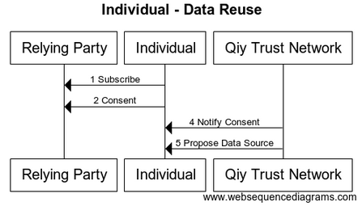

# FUNCTIONAL SPECIFICATION 'QIY SCHEME V1.1'
From [Qiy Nodes](Definitions.md#qiy-node) to [Data exchange](Definitions.md#data-exchange)


# Contents

1. [Introduction](#1-introduction)
	1. [Purpose](#11-purpose)
	1. [Readers' Guidance](#12-readers-guidance)
1. [Overview](#2-overview)
1. [Data Provider Acquires Access to Qiy Trust Network](#3-data-provider-acquires-access-to-qiy-trust-network)
1. [Individual Acquires Access to Qiy Trust Network](#4-individual-acquires-access-to-qiy-trust-network)
1. [Relying Party Acquires Access to Qiy Trust Network](#5-relying-party-acquires-access-to-qiy-trust-network)
1. [Individual Connects with Data Provider](#6-individual-connects-with-data-provider)
1. [Individual Connects with Relying Party](#7-individual-connects-with-relying-party)
	1. [Connect](#71-connect)
	1. [Sign up](#72-sign-up)
	1. [Subscribe](#73-subscribe)
	1. [Consent](#74-consent)
	1. [Propose Data Source](#75-propose-data-source)
	1. [Request Operation](#76-request-operation)
	1. [Register Operation](#77-register-operation)
	1. [Consent & Data Reference](#78-consent-&-data-reference)
1. [Relying Party Requests Personal Data](#8-relying-party-requests-personal-data)
	1. [Request Data](#81-request-data)
	1. [Lookup Operation](#82-lookup-operation)
	1. [Execute Operation](#83-execute-operation)
	1. [Data](#84-data)
1. [Personal Data Scenario - All](#9-personal-data-scenario---all)
1. [Diagrams](#10-diagrams)
	1. [Data Provider - Setup](#101-data-provider---setup)
	1. [Individual - Setup](#102-individual---setup)
	1. [Relying Party - Setup](#103-relying-party---setup)
	1. [Data Provider - Data Reuse](#104-data-provider---data-reuse)
	1. [Individual - Data Reuse](#105-individual---data-reuse)
	1. [Relying Party - Data Reuse](#106-relying-party---data-reuse)
	1. [Data Reuse Scenario - All](#107-data-reuse-scenario---all)

# 1 Introduction

This document describes the basic Qiy Scheme scenarios as an introduction to the full functional description provided in the [Use Cases](Definitions.md#use-case) listed in [UC00 Use Cases Overview](./use-cases/UC00%20Use%20Cases%20Overview.md).
These scenarios form the prelude for many other applications, examples of wich can be found in [Example Applications](example-applications/Example%20Applications.md).


## 1.1 Purpose

This document is the entry point for information analysts and software engineers that need to know how they can use the [Qiy Trust Network](Definitions.md#qiy-trust-network).

## 1.2 Readers' Guidance

* Information analysts are advised to read the scenarios of interest and the related [Use Case Specifications](use-cases/UC00%20Use%20Cases%20Overview.md).
* Software engineers are advised to read the scenarios of interest, the related [Use Case Specifications](use-cases/UC00%20Use%20Cases%20Overview.md) and the related [Qiy Node Documentation](Definitions.md#qiy-node-documentation).

# 2 Overview

This document describes the following scenarios:
* [Data Provider](Definitions.md#data-provider) scenarios:
  * [3 Data Provider Acquires Access to Qiy Trust Network](#3-data-provider-acquires-access-to-qiy-trust-network)
  * [7 Individual Connects with Data Provider](#7-individual-connects-with-data-provider)
* Scenarios for [Individuals](Definitions.md#individual):
  * [4 Individual Acquires Access to Qiy Trust Network](#4-individual-acquires-access-to-qiy-trust-network)
  * [6 Individual Connects with Data Provider](#6-individual-connects-with-data-provider)
  * [7 Individual Connects with Relying Party](#7-individual-connects-with-relying-party)
  * [8 Relying Party Requests Personal Data](#8-relying-party-requests-personal-data)
* [Relying Party](Definitions.md#relying-party) scenarios:
  * [5 Relying Party Acquires Access to Qiy Trust Network](#5-relying-party-acquires-access-to-qiy-trust-network)
  * [7 Individual Connects with Relying Party](#7-individual-connects-with-relying-party)
  * [8 Relying Party Requests Personal Data](#8-relying-party-requests-personal-data)


# 3 Data Provider Acquires Access to Qiy Trust Network

This chapter describes a scenario of a [Data Provider](Definitions.md#data-provider) acquiring access to the Qiy Trust Network as an introduction to the full description provided in [UC01 Acquire Access to Qiy Trust Network](./use-cases/UC01%20Acquire%20Access%20to%20Qiy%20Trust%20Network.md).

The [Functional and Technical Overview](Functional%20and%20Technical%20Overview.md) describes the conditions under which a [Data Provider](Definitions.md#data-provider) can put a [Data Subject](Definitions.md#data-subject) ([Individual](Definitions.md#individual)) in control of his [Personal Data](Definitions.md#personal-data) via Qiy. In this scenario, the [Data Provider](Definitions.md#data-provider) (to be) has already made the necessary arrangements to meet these conditions.
The remaining steps for a [Data Provider](Definitions.md#data-provider) in order to enable [Data Subjects](Definitions.md#data-subject) to get in control of their [Personal Data](Definitions.md#personal-data) via the [Qiy Trust Network](Definitions.md#qiy-trust-network) are:
*   The [Data Provider](Definitions.md#data-provider) selects an [Access Provider](Definitions.md#access-provider).
*   The [Data Provider](Definitions.md#data-provider) concludes an access agreement with the [Access Provider](Definitions.md#access-provider).
*   The [Access Provider](Definitions.md#access-provider) authenticates and registers the [Identity](Definitions.md#identity) of the [Data Provider](Definitions.md#data-provider) in the [Service Library](Definitions.md#service-library).
*   The [Access Provider](Definitions.md#access-provider) creates a [Qiy Node](Definitions.md#qiy-node) for the [Data Provider](Definitions.md#data-provider) and provides the [Data Provider](Definitions.md#data-provider) with the [Qiy Node Credentials](Definitions.md#qiy-node-credential).
*   The [Data Provider](Definitions.md#data-provider) configures its computing system with the [Qiy Node Credentials](Definitions.md#qiy-node-credential) and gains physical access to the [Qiy Trust Network](Definitions.md#qiy-trust-network).
*   The [Data Provider](Definitions.md#data-provider) publishes its [Service Catalogue](Definitions.md#service-catalogue) in the [Service Library](Definitions.md#service-library).


# 4 Individual Acquires Access to Qiy Trust Network

This chapter describes a scenario in which an [Individual](Definitions.md#individual) acquires access to the Qiy Trust Network as an introduction to the full description provided in [UC01 Acquire Access to Qiy Trust Network](./use-cases/UC01%20Acquire%20Access%20to%20Qiy%20Trust%20Network.md).

The [Qiy Scheme](Definitions.md#qiy-scheme) allows [Individuals](Definitions.md#individual) to use the [Qiy Trust Network](Definitions.md#qiy-trust-network) in many different ways, but the [Individual](Definitions.md#individual) in this scenario has never used the [Qiy Trust Network](Definitions.md#qiy-trust-network) before and acquires access as follows:
* The [Individual](Definitions.md#individual) selects a [Qiy Application](Definitions.md#qiy-application).
* The [Individual](Definitions.md#individual) installs the application on his smart phone and secures access to it by setting a passcode.
* The [Qiy Application](Definitions.md#qiy-application) creates a [Qiy Node](Definitions.md#qiy-node) for the [Individual](Definitions.md#individual) and persists the [Qiy Node Credentials](Definitions.md#qiy-node-credential).

After these steps, the [Individual](Definitions.md#individual) has gained access to the [Qiy Trust Network](Definitions.md#qiy-trust-network) and he can use it by means of the [Qiy Application](Definitions.md#qiy-application).


# 5 Relying Party Acquires Access to Qiy Trust Network

This chapter describes a scenario in which a [Relying Party](Definitions.md#relying-party) acquires access to the [Qiy Trust Network](Definitions.md#qiy-trust-network) as an introduction to the full description provided in [UC01 Acquire Access to Qiy Trust Network](./use-cases/UC01%20Acquire%20Access%20to%20Qiy%20Trust%20Network.md).

The [Functional and Technical Overview](Functional%20and%20Technical%20Overview.md) describes the conditions under which a [Relying Party](Definitions.md#relying-party) can provide its [Services](Definitions.md#service) via Qiy while using verifiable [Personal Data](Definitions.md#personal-data) under control of their [Data Subject](Definitions.md#data-subject) ([Individual](Definitions.md#individual)).
In this scenario, the [Relying Party](Definitions.md#relying-party) (to be) has already made the necessary arrangements to meet these conditions.
The remaining steps for a [Relying Party](Definitions.md#relying-party) in order to enable [Individuals](Definitions.md#individual) to use its [Services](Definitions.md#service) via the [Qiy Trust Network](Definitions.md#qiy-trust-network) are:
* The [Relying Party](Definitions.md#relying-party) selects an [Access Provider](Definitions.md#access-provider)
  * and concludes an access agreement with the [Access Provider](Definitions.md#access-provider).
* The [Access Provider](Definitions.md#access-provider) authenticates and registers the [Identity](Definitions.md#identity) of the [Relying Party](Definitions.md#relying-party) in the [Service Library](Definitions.md#service-library),
  * ... creates a [Qiy Node](Definitions.md#qiy-node) for the [Relying Party](Definitions.md#relying-party)
  * and provides the [Relying Party](Definitions.md#relying-party) with the [Qiy Node Credentials](Definitions.md#qiy-node-credential).
* The [Relying Party](Definitions.md#relying-party) configures its computing system with the [Qiy Node Credentials](Definitions.md#qiy-node-credential) to gain physical access to the [Qiy Trust Network](Definitions.md#qiy-trust-network).
  * and publishes its [Service Catalogue](Definitions.md#service-catalogue) in the [Service Library](Definitions.md#service-library).


# 6 Individual Connects with Data Provider

This chapter describes a scenario in which an [Individual](Definitions.md#individual) connects with a [Data Provider](Definitions.md#data-provider) and get access to his [Personal Data](Definitions.md#personal-data) as an introduction to the full description provided in [UC02 Connect with Qiy User](./use-cases/UC02%20Connect%20with%20Qiy%20User.md).

The [Qiy Scheme](Definitions.md#qiy-scheme) allows [Individuals](Definitions.md#individual) to connect with a [Data Provider](Definitions.md#data-provider) and get access to his [Personal Data](Definitions.md#personal-data) in many different ways, but the [Individual](Definitions.md#individual) in this scenario does so as follows:
* The [Individual](Definitions.md#individual) starts the previously installed [Qiy Application](Definitions.md#qiy-application) and enters the passcode.
* The [Qiy Application](Definitions.md#qiy-application) presents an option to connect with a specific [Data Provider](Definitions.md#data-provider). 
* The [Individual](Definitions.md#individual) selects the option to connect with the [Data Provider](Definitions.md#data-provider).
* The [Qiy Application](Definitions.md#qiy-application) retrieves a [Connect Token](Definitions.md#connect-token) from the [Qiy Node](Definitions.md#qiy-node) and
  * ... redirects the [Individual](Definitions.md#individual) to the webpage of the [Data Provider](Definitions.md#data-provider) 
  * while passing the [Connect Token](Definitions.md#connect-token) in the webpage address.
* The [Individual](Definitions.md#individual) has an account with the [Data Provider](Definitions.md#data-provider) and uses his credentials to sign on.
* The [Data Provider](Definitions.md#data-provider) verifies the credentials and looks up the local account id and
  * ... asks its [Qiy Node](Definitions.md#qiy-node) to create a [Connection](Definitions.md#connection) using the [Connect Token](Definitions.md#connect-token) which was included in the webpage address.
* The [Qiy Trust Network](Definitions.md#qiy-trust-network) creates the [Connection](Definitions.md#connection) with the [Individual](Definitions.md#individual),
  * ... sends the [Qiy Node](Definitions.md#qiy-node) of the [Data Provider](Definitions.md#data-provider) the [Connection Uri](Definitions.md#connection-uri) of the new [Connection](Definitions.md#connection),
  * and sends the [Qiy Node](Definitions.md#qiy-node) of the [Qiy Application](Definitions.md#qiy-application):
    * the [Connection Uri](Definitions.md#connection-uri) of the new [Connection](Definitions.md#connection) 
    * and the [Identity](Definitions.md#identity) of the [Data Provider](Definitions.md#data-provider).
* The [Data Provider](Definitions.md#data-provider) persists the relation between the local account id and the [Connection Uri](Definitions.md#connection-uri), 
  * ... informs the [Individual](Definitions.md#individual) that he can control his [Personal Data](Definitions.md#personal-data) via Qiy
  * and redirects him back to his [Qiy Application](Definitions.md#qiy-application).


# 7 Individual Connects with Relying Party

This chapter describes a scenario in which an [Individual](Definitions.md#individual) connects with a [Relying Party](Definitions.md#relying-party) and grants it consent to use his [Personal Data](Definitions.md#personal-data) as an introduction to the full description provided in [UC02 Connect with Qiy User](./use-cases/UC02%20Connect%20with%20Qiy%20User.md).

The [Qiy Scheme](Definitions.md#qiy-scheme) allows [Individuals](Definitions.md#individual) to do so in many different ways, but the [Individual](Definitions.md#individual) in this scenario does it as follows:

## 7.1 Connect

* The [Individual](Definitions.md#individual) visits a website of a [Relying Party](Definitions.md#relying-party) using a laptop.
* The website is a [Qiy Application](Definitions.md#qiy-application) and presents an option to sign on using Qiy.
* The [Individual](Definitions.md#individual) chooses to use this option.
* The [Relying Party](Definitions.md#relying-party) retreives a [Connect Token](Definitions.md#connect-token) from its [Qiy Node](Definitions.md#qiy-node),
  * ... uses it in a [QR Code](Definitions.md#qr-code)
  * ... persists the id of the [Connect Token](Definitions.md#connect-token),
  * and presents it in a sig on page to the [Individual](Definitions.md#individual).
* The [Individual](Definitions.md#individual) picks up his smartphone, 
  * ... starts the previously installed [Qiy Application](Definitions.md#qiy-application),
  * ... enters the passcode
  * and scans the QR Code.
* The [Qiy Application](Definitions.md#qiy-application) converts the [QR Code](Definitions.md#qr-code),
  * ... extracts the [Connect Token](Definitions.md#connect-token)
  * and asks its [Qiy Node](Definitions.md#qiy-node) to create a [Connection](Definitions.md#connection) with it.
* The [Qiy Node](Definitions.md#qiy-node) uses the [Connect Token](Definitions.md#connect-token) to ask the [Qiy Trust Network](Definitions.md#qiy-trust-network) to create the [Connection](Definitions.md#connection). 
* The [Qiy Trust Network](Definitions.md#qiy-trust-network) to creates the [Connection](Definitions.md#connection) with the [Relying Party](Definitions.md#relying-party) and
  * ... provides the [Qiy Node](Definitions.md#qiy-node) of the [Qiy Application](Definitions.md#qiy-application) with:
    * the [Connection Uri](Definitions.md#connection-uri) of the new [Connection](Definitions.md#connection)
    * and the [Identity](Definitions.md#identity) of the [Relying Party](Definitions.md#relying-party);
  * and provides the [Qiy Node](Definitions.md#qiy-node) of the [Relying Party](Definitions.md#relying-party) with:
    * the [Connection Uri](Definitions.md#connection-uri) of the new [Connection](Definitions.md#connection)
    * and the id of the [Connect Token](Definitions.md#connect-token) that was used to create it.
* The [Qiy Application](Definitions.md#qiy-application) informs the [Individual](Definitions.md#individual) that he is connected with the [Relying Party](Definitions.md#relying-party)
  * ... provides him with the option to view the contact details.
  * and advises him to return to the website.


## 7.2 Sign up

* The [Relying Party](Definitions.md#relying-party) looks up the related sign on page using the id of the [Connect Token](Definitions.md#connect-token),
  * ... removes the sign on page,
  * ... creates a local account for the [Individual](Definitions.md#individual),
  * ... persists the relation between the local account and the [Connection Uri](Definitions.md#connection-uri), 
  * and informs the [Individual](Definitions.md#individual) that he has a new anonymous account and that he is signed on.


## 7.3 Subscribe

* The [Relying Party](Definitions.md#relying-party) displays its [Service Catalogue](Definitions.md#service-catalogue).
* The [Individual](Definitions.md#individual) browses the [Service Catalogue](Definitions.md#service-catalogue),
  * ... selects a [Service](Definitions.md#service),
  * and subscribes to the [Service](Definitions.md#service).

## 7.4 Consent

* The [Relying Party](Definitions.md#relying-party) asks the [Individual](Definitions.md#individual) [Consent](Definitions.md#consent) to use his [Personal Data](Definitions.md#personal-data).
* The [Individual](Definitions.md#individual) grants the [Relying Party](Definitions.md#relying-party) [Consent](Definitions.md#consent) to use [Personal Data](Definitions.md#personal-data) that can be provided by the [Data Provider](Definitions.md#data-provider) for this [Service](Definitions.md#service).
* The [Relying Party](Definitions.md#relying-party) asks its [Qiy Node](Definitions.md#qiy-node) to register the [Consent](Definitions.md#consent).
* The [Qiy Node](Definitions.md#qiy-node) asks the [Qiy Trust Network](Definitions.md#qiy-trust-network) to register the [Consent](Definitions.md#consent).
* The [Qiy Trust Network](Definitions.md#qiy-trust-network) persists the [Consent](Definitions.md#consent)
  * and notifies the [Qiy Node](Definitions.md#qiy-node) of the [Qiy Application](Definitions.md#qiy-application).
* The [Qiy Node](Definitions.md#qiy-node) notifies the [Qiy Application](Definitions.md#qiy-application).
* The [Qiy Application](Definitions.md#qiy-application) notifies the [Individual](Definitions.md#individual) of the [Consent](Definitions.md#consent).


## 7.5 Propose Data Source

* The [Qiy Application](Definitions.md#qiy-application) proposes to use the [Data Provider](Definitions.md#data-provider) as data source for the [Consent](Definitions.md#consent).
* The [Individual](Definitions.md#individual) accepts the proposal.
* The [Qiy Application](Definitions.md#qiy-application) asks the [Qiy Trust Network](Definitions.md#qiy-trust-network) to register the [Data Provider](Definitions.md#data-provider) as data source for the [Consent](Definitions.md#consent).


## 7.6 Request Operation

* The [Qiy Trust Network](Definitions.md#qiy-trust-network) requests the [Data Provider](Definitions.md#data-provider) for a [Data Reference](Definitions.md#data-reference) (which can be used to acquire the data).
* The [Data Provider](Definitions.md#data-provider) generates an [Operation Specification](Definitions.md#operation-specification) (which specifies a request that will get the data from the [Service Endpoint](Definitions.md#service-endpoint)),
  * and returns it to the [Qiy Trust Network](Definitions.md#qiy-trust-network). 

## 7.7 Register Operation

* The [Qiy Trust Network](Definitions.md#qiy-trust-network) generates a [Data Reference](Definitions.md#data-reference),
  * ... uses it to register the [Operation Specification](Definitions.md#operation-specification)

## 7.8 Consent & Data Reference

* and returns the [Data Reference](Definitions.md#data-reference) to the [Data Provider](Definitions.md#data-provider).
* The [Data Provider](Definitions.md#data-provider) sends the [Data Reference](Definitions.md#data-reference) to the [Qiy Node](Definitions.md#qiy-node) of the [Qiy Application](Definitions.md#qiy-application). 
* The [Qiy Node](Definitions.md#qiy-node) of the [Qiy Application](Definitions.md#qiy-application) sends the [Data Reference](Definitions.md#data-reference) to the [Relying Party](Definitions.md#relying-party).


# 8 Relying Party Requests Personal Data

This chapter describes a scenario in which a Relying Party acquires [Personal Data](Definitions.md#personal-data) as an introduction to the full description provided in [UC03 Request Personal Data](./use-cases/UC03%20Request%20Personal%20Data.md).

This goes as follows:

## 8.1 Request Data

* The [Relying Party](Definitions.md#relying-party) asks its [Qiy Node](Definitions.md#qiy-node) to resolve the [Data Reference](Definitions.md#data-reference).
* The [Qiy Node](Definitions.md#qiy-node) asks the [Qiy Trust Network](Definitions.md#qiy-trust-network) to resolve the [Data Reference](Definitions.md#data-reference).

## 8.2 Lookup Operation

* The [Qiy Trust Network](Definitions.md#qiy-trust-network) looks up the related [Operation Specification](Definitions.md#operation-specification)
  * ... constructs the operation

## 8.3 Execute Operation

  * and executes it.
* The [Service Endpoint](Definitions.md#service-endpoint) receives a request to obtain the [Personal Data](Definitions.md#personal-data) of the [Individual](Definitions.md#individual)
  * ... authenticates the request,
  * ... processes it,
  * ... selects the data from the local database
  * and returns it.

## 8.4 Data

* The [Qiy Trust Network](Definitions.md#qiy-trust-network) returns the data to the [Qiy Node](Definitions.md#qiy-node) of the [Relying Party](Definitions.md#relying-party).
* The [Qiy Node](Definitions.md#qiy-node) returns the data to the [Relying Party](Definitions.md#relying-party).

# 9 Personal Data Scenario - All


# 10 Diagrams


## 10.1 Data Provider - Setup


```
title "Data Provider - Setup"

participant "Data Provider" as DP
participant "Qiy Node" as QN
participant "Access Provider" as AP

DP->AP  : Conclude Access Agreement
DP->AP  : Request Qiy Node
AP->AP : Create Qiy Node
AP-->DP: Qiy Node Credentials
DP-> QN  : Register Data Service
```


## 10.2 Individual - Setup


```
title "Individual - Setup"

participant "Individual" as User
participant "Qiy Application" as App
participant "Access Provider" as AP

User->App  : Install
User->App  : Set passcode
App->AP : Request Qiy Node
AP-->App: Qiy Node Credentials
```


## 10.3 Relying Party - Setup


```
title " Relying Party - Setup"

participant " Relying Party" as RP
participant "Qiy Node" as QN
participant "Access Provider" as AP

RP->AP  : Conclude Access Agreement
RP->AP  : Request Qiy Node
AP->AP : Create Qiy Node
AP-->RP: Qiy Node Credentials
RP-> QN  : Register Service Catalogue
```


## 10.4 Data Provider - Data Reuse


```
title "Data Provider - Data Reuse"

participant Individual as User
participant "Data Provider" as DP
participant "Qiy Trust Network" as QTF

User -> DP	 	: Connect
User -> DP	 	: Sign on
DP-> DP         : Persist Connection Id

QTF -> DP       : Request Operation Specification
QTF -> DP: Execute Operation
```


## 10.5 Individual - Data Reuse



```
title "Individual - Data Reuse"

participant "Relying Party" as RP
participant Individual as User
participant "Data Provider" as DP
participant "Qiy Trust Network" as QTF

User -> DP	 	: Connect
User -> DP	 	: Sign on

User -> RP	 	: Connect
User -> RP	 	: Subscribe
User -> RP	 	: Consent
QTF -> Individual : Notify Consent
QTF -> Individual : Propose Data Source
```


## 10.6 Relying Party - Data Reuse


```
title "Relying Party - Data Reuse"

participant "Relying Party" as RP
participant Individual as User
participant "Qiy Trust Network" as QTF

User -> RP	 	: Connect
RP -> RP        : Sign up
User -> RP	 	: Subscribe
User -> RP	 	: Consent
RP -> QTF	 	: Register Consent
QTF -> RP	 	: Send Data Reference

RP -> QTF: Request Data
QTF -> RP: Send Data

```


## 10.7 Data Reuse Scenario - All


```
title "Data Reuse Scenario - All"

participant "Relying Party" as RP
participant Individual as User
participant "Data Provider" as DP
participant "Qiy Trust Network" as QTF

User -> DP	 	: 1 Connect
User -> DP	 	: 2 Sign on
DP-> DP         : 3 Persist Connection Id

User -> RP	 	: 4 Connect
RP -> RP        : 5 Sign up
User -> RP	 	: 6 Subscribe
User -> RP	 	: 7 Consent
RP -> QTF	 	: 8 Register Consent
QTF -> Individual : 9 Notify Consent
QTF -> Individual : 10 Propose Data Source
QTF -> DP       : 11 Request Operation Specification
QTF -> QTF       : 12 Generate Data Reference
QTF -> QTF       : 13 Register Operation Specification
QTF -> RP	 	: 14 Send Data Reference

RP -> QTF: 15 Request Data
QTF -> QTF: 16 Lookup Operation Specification
QTF -> DP: 17 Execute Operation
QTF -> RP: 18 Send Data


```


