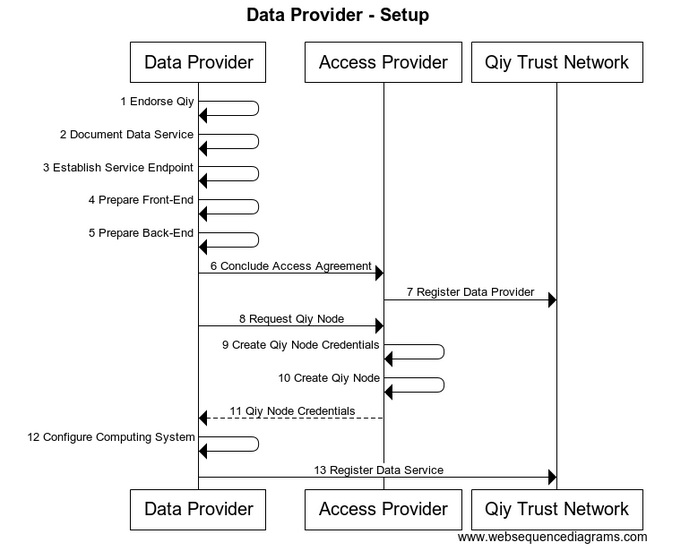
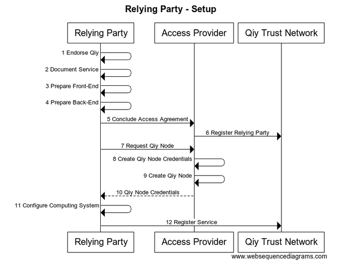

# Functional Specification
From [Qiy Nodes](Definitions.md#qiy-node) to [Data exchange](Definitions.md#data-exchange)


# Contents

1. [Introduction](#1-introduction)
	1. [Purpose](#11-purpose)
	1. [Readers' Guidance](#12-readers-guidance)
1. [Overview](#2-overview)
1. [Data Provider Scenarios](#3-data-provider-scenarios)
	1. [Setup](#31-setup)
	1. [Data Reuse](#32-data-reuse)
1. [Scenarios for Individual](#4-scenarios-for-individual)
	1. [Setup](#41-setup)
	1. [Data Reuse](#42-data-reuse)
1. [Relying Party Scenarios](#5-relying-party-scenarios)
	1. [Setup](#51-setup)
	1. [Data Reuse](#52-data-reuse)
1. [Data Reuse Scenario](#6-data-reuse-scenario)
	1. [Connect with Data Provider](#61-connect-with-data-provider)
	1. [Sign on](#62-sign-on)
	1. [Persist Connection Id](#63-persist-connection-id)
	1. [Connect with Relying Party](#64-connect-with-relying-party)
	1. [Sign up](#65-sign-up)
	1. [Subscribe](#66-subscribe)
	1. [Consent](#67-consent)
	1. [Register Consent](#68-register-consent)
	1. [Notify Consent](#69-notify-consent)
	1. [Propose Data Source](#610-propose-data-source)
	1. [Request Operation Specification](#611-request-operation-specification)
	1. [Generate Data Reference](#612-generate-data-reference)
	1. [Register Operation Specification](#613-register-operation-specification)
	1. [Send Data Reference](#614-send-data-reference)
	1. [Request Data](#615-request-data)
	1. [Lookup Operation](#616-lookup-operation)
	1. [Execute Operation](#617-execute-operation)
	1. [Data](#618-data)
1. [Diagrams](#7-diagrams)
	1. [Data Provider - Setup](#71-data-provider---setup)
	1. [Individual - Setup](#72-individual---setup)
	1. [Relying Party - Setup](#73-relying-party---setup)
	1. [Data Provider - Data Reuse](#74-data-provider---data-reuse)
	1. [Individual - Data Reuse](#75-individual---data-reuse)
	1. [Relying Party - Data Reuse](#76-relying-party---data-reuse)
	1. [Data Reuse Scenario - All](#77-data-reuse-scenario---all)

# 1 Introduction

This document describes the basic Qiy Scheme scenarios as an introduction to the full functional description provided in the [Use Cases](Definitions.md#use-case) listed in [UC00 Use Cases Overview](./use-cases/UC00%20Use%20Cases%20Overview.md).
These scenarios form the prelude for many other applications, examples of wich can be found in [Example Applications](example-applications/Example%20Applications.md).


## 1.1 Purpose

This document is the entry point for information analysts and software engineers that need to know how they can use the [Qiy Trust Network](Definitions.md#qiy-trust-network).

## 1.2 Readers' Guidance

* Information analysts are advised to read the scenarios of interest and the related [Use Case Specifications](use-cases/UC00%20Use%20Cases%20Overview.md).
* Software engineers are advised to read the scenarios of interest, the related [Use Case Specifications](use-cases/UC00%20Use%20Cases%20Overview.md) and the related [Qiy Node Documentation](Definitions.md#qiy-node-documentation).

# 2 Overview

The remainder of this document describes the scenarios for the different roles and the Data Reuse scenario in full, finishing with the source code of the diagrams:
* [3 Data Provider Scenarios](#3-data-provider-scenarios)
* [4 Scenarios for Individual](#4-scenarios-for-individual)
* [5 Relying Party Scenarios](#5-relying-party-scenarios)
* [6 Data Reuse Scenario](#6-data-reuse-scenario)
* [7 Diagrams](#7-diagrams)


# 3 Data Provider Scenarios


## 3.1 Setup

This section describes a scenario of a [Data Provider](Definitions.md#data-provider) acquiring access to the [Qiy Trust Network](Definitions.md#qiy-trust-network).




The flow is as follows:
1. The [Data Provider](Definitions.md#data-provider) endorses [Qiy](Definitions.md#qiy) by implementing the [Binding Principles for Relying Parties and Data Providers](Definitions.md#binding-principles-for-relying-parties-and-data-providers).
1. The [Data Provider](Definitions.md#data-provider) documents its [Data Service](Definitions.md#data-service) in a [Data Service Description](Definitions.md#data-service-description).
1. The [Data Provider](Definitions.md#data-provider) establishes a [Service Endpoint](Definitions.md#service-endpoint) which will be used to provide [Personal Data](Definitions.md#personal-data) via the [Qiy Trust Network](Definitions.md#qiy-trust-network).
1. The [Data Provider](Definitions.md#data-provider) prepares the front-end of its computing system to be able to establish connections with its users via Qiy.
1. The [Data Provider](Definitions.md#data-provider) prepares the back-end of its computing system to be able to distribute data via Qiy.
1. The [Data Provider](Definitions.md#data-provider) selects an [Access Provider](Definitions.md#access-provider) and concludes an access agreement.
1. The [Access Provider](Definitions.md#access-provider) registers the [Data Provider](Definitions.md#data-provider) in the [Service Library](Definitions.md#service-library) of the [Qiy Trust Network](Definitions.md#qiy-trust-network).
1. The [Data Provider](Definitions.md#data-provider) asks the [Access Provider](Definitions.md#access-provider) for a [Qiy Node](Definitions.md#qiy-node).
1. The [Access Provider](Definitions.md#access-provider) creates [Qiy Node Credentials](Definitions.md#qiy-node-credential).
1. The [Access Provider](Definitions.md#access-provider) creates a [Qiy Node](Definitions.md#qiy-node).
1. The [Access Provider](Definitions.md#access-provider) returns the [Qiy Node Credentials](Definitions.md#qiy-node-credential).
1. The [Data Provider](Definitions.md#data-provider) configures its computing system with the [Qiy Node Credentials](Definitions.md#qiy-node-credential) and gains physical access to the [Qiy Trust Network](Definitions.md#qiy-trust-network).
1. The [Data Provider](Definitions.md#data-provider) registers its [Data Service](Definitions.md#data-service) by publishing the [Data Service Description](Definitions.md#data-service-description) in the [Service Library](Definitions.md#service-library) of the [Qiy Trust Network](Definitions.md#qiy-trust-network).


## 3.2 Data Reuse

The flow for a [Data Provider](Definitions.md#data-provider) in the scenario described in [6 Data Reuse scenario](#6-data-reuse-scenario) is:


# 4 Scenarios for Individual


## 4.1 Setup

This section describes a scenario in which an [Individual](Definitions.md#individual) acquires access to the [Qiy Trust Network](Definitions.md#qiy-trust-network) as an introduction to the full description provided in [UC01 Acquire Access to Qiy Trust Network](./use-cases/UC01%20Acquire%20Access%20to%20Qiy%20Trust%20Network.md).


The [Qiy Scheme](Definitions.md#qiy-scheme) allows [Individuals](Definitions.md#individual) to use the [Qiy Trust Network](Definitions.md#qiy-trust-network) in many different ways, but the [Individual](Definitions.md#individual) in this scenario has never used the [Qiy Trust Network](Definitions.md#qiy-trust-network) before and acquires access using his smartphone as follows:
1. The [Individual](Definitions.md#individual) installs a [Qiy Application](Definitions.md#qiy-application) on his smartphone.
1. The [Individual](Definitions.md#individual) sets a passcode to secure access the [Qiy Application](Definitions.md#qiy-application).
1. The [Qiy Application](Definitions.md#qiy-application) generates [Qiy Node Credentials](Definitions.md#qiy-node-credential).
1. The [Qiy Application](Definitions.md#qiy-application) persists [Qiy Node Credentials](Definitions.md#qiy-node-credential).
1. The [Qiy Application](Definitions.md#qiy-application) uses the public parts of the credentials to create a [Qiy Node](Definitions.md#qiy-node) with the help of an [Access Provider](Definitions.md#access-provider).

After these steps, the [Individual](Definitions.md#individual) has gained access to the [Qiy Trust Network](Definitions.md#qiy-trust-network) and he can use it by means of the [Qiy Application](Definitions.md#qiy-application).


## 4.2 Data Reuse

The flow for an [Individual](Definitions.md#individual) in the scenario described in [6 Data Reuse scenario](#6-data-reuse-scenario) is:


# 5 Relying Party Scenarios


## 5.1 Setup

This section describes a scenario of a [Relying Party](Definitions.md#relying-party) acquiring access to the [Qiy Trust Network](Definitions.md#qiy-trust-network).




The flow is as follows:
1. The [Relying Party](Definitions.md#relying-party) documents its [Service](Definitions.md#service) in a [Service Description](Definitions.md#service-description).
1. The [Relying Party](Definitions.md#relying-party) prepares the front-end of its computing system to be able to establish (initially anonymous) connections with [Individuals](Definitions.md#individual) via Qiy.
1. The [Relying Party](Definitions.md#relying-party) prepares the back-end of its computing system to be able to receive [Personal Data](Definitions.md#personal-data) via Qiy.
1. The [Relying Party](Definitions.md#relying-party) selects an [Access Provider](Definitions.md#access-provider) and concludes an access agreement.
1. The [Access Provider](Definitions.md#access-provider) registers the [Relying Party](Definitions.md#relying-party) in the [Service Library](Definitions.md#service-library) of the [Qiy Trust Network](Definitions.md#qiy-trust-network).
1. The [Relying Party](Definitions.md#relying-party) asks the [Access Provider](Definitions.md#access-provider) for a [Qiy Node](Definitions.md#qiy-node).
1. The [Access Provider](Definitions.md#access-provider) creates [Qiy Node Credentials](Definitions.md#qiy-node-credential).
1. The [Access Provider](Definitions.md#access-provider) creates a [Qiy Node](Definitions.md#qiy-node).
1. The [Access Provider](Definitions.md#access-provider) returns the [Qiy Node Credentials](Definitions.md#qiy-node-credential).
1. The [Relying Party](Definitions.md#relying-party) configures its computing system with the [Qiy Node Credentials](Definitions.md#qiy-node-credential) and gains physical access to the [Qiy Trust Network](Definitions.md#qiy-trust-network).
1. The [Relying Party](Definitions.md#relying-party) registers its [Service](Definitions.md#service) by publishing the [Service Description](Definitions.md#service-description) in the [Service Library](Definitions.md#service-library) of the [Qiy Trust Network](Definitions.md#qiy-trust-network).


## 5.2 Data Reuse

The flow for a [Relying Party](Definitions.md#relying-party) in the scenario described in [6 Data Reuse scenario](#6-data-reuse-scenario) is:


# 6 Data Reuse Scenario

This chapter describes the scenario in full.
 


## 6.1 Connect with Data Provider

* The [Individual](Definitions.md#individual) starts the previously installed [Qiy Application](Definitions.md#qiy-application) and enters the passcode.
* The [Qiy Application](Definitions.md#qiy-application) presents an option to connect with a specific [Data Provider](Definitions.md#data-provider). 
* The [Individual](Definitions.md#individual) selects the option to connect with the [Data Provider](Definitions.md#data-provider).
* The [Qiy Application](Definitions.md#qiy-application) retrieves a [Connect Token](Definitions.md#connect-token) from the [Qiy Node](Definitions.md#qiy-node) and
  * ... redirects the [Individual](Definitions.md#individual) to the webpage of the [Data Provider](Definitions.md#data-provider) 
  * while passing the [Connect Token](Definitions.md#connect-token) in the webpage address.
* The [Data Provider](Definitions.md#data-provider) asks its [Qiy Node](Definitions.md#qiy-node) to create a [Connection](Definitions.md#connection) using the [Connect Token](Definitions.md#connect-token) which was included in the webpage address.
* The [Qiy Trust Network](Definitions.md#qiy-trust-network) creates the [Connection](Definitions.md#connection) with the [Individual](Definitions.md#individual),
  * ... sends the [Qiy Node](Definitions.md#qiy-node) of the [Data Provider](Definitions.md#data-provider) the [Connection Uri](Definitions.md#connection-uri) of the new [Connection](Definitions.md#connection),
  * and sends the [Qiy Node](Definitions.md#qiy-node) of the [Qiy Application](Definitions.md#qiy-application):
    * the [Connection Uri](Definitions.md#connection-uri) of the new [Connection](Definitions.md#connection) 
    * and the [Identity](Definitions.md#identity) of the [Data Provider](Definitions.md#data-provider).


## 6.2 Sign on

* The [Individual](Definitions.md#individual) has an account with the [Data Provider](Definitions.md#data-provider) and signs on.


## 6.3 Persist Connection Id

* The [Data Provider](Definitions.md#data-provider) looks up the local account id,
  * ... persists the relation between the local account id and the [Connection Uri](Definitions.md#connection-uri), 
  * ... informs the [Individual](Definitions.md#individual) that he can control his [Personal Data](Definitions.md#personal-data) via Qiy
  * and redirects him back to his [Qiy Application](Definitions.md#qiy-application).


## 6.4 Connect with Relying Party

* The [Individual](Definitions.md#individual) visits a website of a [Relying Party](Definitions.md#relying-party) using a laptop.
* The website is a [Qiy Application](Definitions.md#qiy-application) and presents an option to sign on using Qiy.
* The [Individual](Definitions.md#individual) chooses to use this option.
* The [Relying Party](Definitions.md#relying-party) retreives a [Connect Token](Definitions.md#connect-token) from its [Qiy Node](Definitions.md#qiy-node),
  * ... uses it in a [QR Code](Definitions.md#qr-code)
  * ... persists the id of the [Connect Token](Definitions.md#connect-token),
  * and presents it in a sig on page to the [Individual](Definitions.md#individual).
* The [Individual](Definitions.md#individual) picks up his smartphone, 
  * ... starts the previously installed [Qiy Application](Definitions.md#qiy-application),
  * ... enters the passcode
  * and scans the QR Code.
* The [Qiy Application](Definitions.md#qiy-application) converts the [QR Code](Definitions.md#qr-code),
  * ... extracts the [Connect Token](Definitions.md#connect-token)
  * and asks its [Qiy Node](Definitions.md#qiy-node) to create a [Connection](Definitions.md#connection) with it.
* The [Qiy Node](Definitions.md#qiy-node) uses the [Connect Token](Definitions.md#connect-token) to ask the [Qiy Trust Network](Definitions.md#qiy-trust-network) to create the [Connection](Definitions.md#connection). 
* The [Qiy Trust Network](Definitions.md#qiy-trust-network) to creates the [Connection](Definitions.md#connection) with the [Relying Party](Definitions.md#relying-party) and
  * ... provides the [Qiy Node](Definitions.md#qiy-node) of the [Qiy Application](Definitions.md#qiy-application) with:
    * the [Connection Uri](Definitions.md#connection-uri) of the new [Connection](Definitions.md#connection)
    * and the [Identity](Definitions.md#identity) of the [Relying Party](Definitions.md#relying-party);
  * and provides the [Qiy Node](Definitions.md#qiy-node) of the [Relying Party](Definitions.md#relying-party) with:
    * the [Connection Uri](Definitions.md#connection-uri) of the new [Connection](Definitions.md#connection)
    * and the id of the [Connect Token](Definitions.md#connect-token) that was used to create it.
* The [Qiy Application](Definitions.md#qiy-application) informs the [Individual](Definitions.md#individual) that he is connected with the [Relying Party](Definitions.md#relying-party)
  * ... provides him with the option to view the contact details.
  * and advises him to return to the website.


## 6.5 Sign up

* The [Relying Party](Definitions.md#relying-party) looks up the related sign on page using the id of the [Connect Token](Definitions.md#connect-token),
  * ... removes the sign on page,
  * ... creates a local account for the [Individual](Definitions.md#individual),
  * ... persists the relation between the local account and the [Connection Uri](Definitions.md#connection-uri), 
  * and informs the [Individual](Definitions.md#individual) that he has a new anonymous account and that he is signed on.


## 6.6 Subscribe

* The [Relying Party](Definitions.md#relying-party) displays its [Service Catalogue](Definitions.md#service-catalogue).
* The [Individual](Definitions.md#individual) browses the [Service Catalogue](Definitions.md#service-catalogue),
  * ... selects a [Service](Definitions.md#service),
  * and subscribes to the [Service](Definitions.md#service).


## 6.7 Consent

* The [Relying Party](Definitions.md#relying-party) asks the [Individual](Definitions.md#individual) [Consent](Definitions.md#consent) to use his [Personal Data](Definitions.md#personal-data).
* The [Individual](Definitions.md#individual) grants the [Relying Party](Definitions.md#relying-party) [Consent](Definitions.md#consent) to use [Personal Data](Definitions.md#personal-data) that can be provided by the [Data Provider](Definitions.md#data-provider) for this [Service](Definitions.md#service).


## 6.8 Register Consent

* The [Relying Party](Definitions.md#relying-party) asks its [Qiy Node](Definitions.md#qiy-node) to register the [Consent](Definitions.md#consent).
* The [Qiy Node](Definitions.md#qiy-node) asks the [Qiy Trust Network](Definitions.md#qiy-trust-network) to register the [Consent](Definitions.md#consent).
* The [Qiy Trust Network](Definitions.md#qiy-trust-network) persists the [Consent](Definitions.md#consent)


## 6.9 Notify Consent

* The [Qiy Trust Network](Definitions.md#qiy-trust-network) notifies the [Qiy Node](Definitions.md#qiy-node) of the [Qiy Application](Definitions.md#qiy-application).
* The [Qiy Node](Definitions.md#qiy-node) notifies the [Qiy Application](Definitions.md#qiy-application).
* The [Qiy Application](Definitions.md#qiy-application) notifies the [Individual](Definitions.md#individual) of the [Consent](Definitions.md#consent).


## 6.10 Propose Data Source

* The [Qiy Application](Definitions.md#qiy-application) proposes to use the [Data Provider](Definitions.md#data-provider) as data source for the [Consent](Definitions.md#consent).
* The [Individual](Definitions.md#individual) accepts the proposal.
* The [Qiy Application](Definitions.md#qiy-application) asks the [Qiy Trust Network](Definitions.md#qiy-trust-network) to register the [Data Provider](Definitions.md#data-provider) as data source for the [Consent](Definitions.md#consent).


## 6.11 Request Operation Specification

* The [Qiy Trust Network](Definitions.md#qiy-trust-network) requests the [Data Provider](Definitions.md#data-provider) for a [Data Reference](Definitions.md#data-reference) (which can be used to acquire the data).
* The [Data Provider](Definitions.md#data-provider) generates an [Operation Specification](Definitions.md#operation-specification) (which specifies a request that will get the data from the [Service Endpoint](Definitions.md#service-endpoint)),
  * and returns it to the [Qiy Trust Network](Definitions.md#qiy-trust-network). 


## 6.12 Generate Data Reference

* The [Qiy Trust Network](Definitions.md#qiy-trust-network) generates a [Data Reference](Definitions.md#data-reference).


## 6.13 Register Operation Specification

* The [Qiy Trust Network](Definitions.md#qiy-trust-network) registers the [Operation Specification](Definitions.md#operation-specification) under the [Data Reference](Definitions.md#data-reference).


## 6.14 Send Data Reference

* The [Qiy Trust Network](Definitions.md#qiy-trust-network) sends the [Data Reference](Definitions.md#data-reference) to the [Relying Party](Definitions.md#relying-party).


## 6.15 Request Data

* The [Relying Party](Definitions.md#relying-party) asks its [Qiy Node](Definitions.md#qiy-node) to resolve the [Data Reference](Definitions.md#data-reference).
* The [Qiy Node](Definitions.md#qiy-node) asks the [Qiy Trust Network](Definitions.md#qiy-trust-network) to resolve the [Data Reference](Definitions.md#data-reference).


## 6.16 Lookup Operation

* The [Qiy Trust Network](Definitions.md#qiy-trust-network) looks up the related [Operation Specification](Definitions.md#operation-specification)
  * and constructs the operation


## 6.17 Execute Operation

* The [Qiy Trust Network](Definitions.md#qiy-trust-network) executes the operation, requesting the [Service Endpoint](Definitions.md#service-endpoint) for the data.
* The [Service Endpoint](Definitions.md#service-endpoint) processes the request and returns the data


## 6.18 Data

* The [Qiy Trust Network](Definitions.md#qiy-trust-network) sends the data to the [Qiy Node](Definitions.md#qiy-node) of the [Relying Party](Definitions.md#relying-party).
* The [Qiy Node](Definitions.md#qiy-node) returns the data to the [Relying Party](Definitions.md#relying-party).


# 7 Diagrams


## 7.1 Data Provider - Setup


```
title "Data Provider - Setup"

participant "Data Provider" as DP
participant "Access Provider" as AP
participant "Qiy Trust Network" as QTN

DP->DP: 1 Endorse Qiy
DP->DP: 2 Document Data Service
DP->DP: 3 Establish Service Endpoint
DP->DP: 4 Prepare Front-End
DP->DP: 5 Prepare Back-End
DP->AP  : 6 Conclude Access Agreement
AP-> QTN  : 7 Register Data Provider
DP->AP  : 8 Request Qiy Node
AP->AP: 9 Create Qiy Node Credentials
AP->AP : 10 Create Qiy Node
AP-->DP: 11 Qiy Node Credentials
DP->DP: 12 Configure Computing System
DP-> QTN  : 13 Register Data Service
```


## 7.2 Individual - Setup


```
title "Individual - Setup"

participant "Individual" as User
participant "Qiy Application" as App
participant "Access Provider" as AP

User->App  : 1 Install
User->App  : 2 Set Passcode
App->App: 3 Create Credentials
App->App: 4 Persist Credentials
App->AP : 5 Create Qiy Node
```


## 7.3 Relying Party - Setup


```
title "Relying Party - Setup"

participant "Relying Party" as RP
participant "Access Provider" as AP
participant "Qiy Trust Network" as QTN

RP->RP: 1 Document Service
RP->RP: 2 Prepare Front-End
RP->RP: 3 Prepare Back-End
RP->AP  : 4 Conclude Access Agreement
AP-> QTN  : 5 Register Relying Party
RP->AP  : 6 Request Qiy Node
AP->AP : 7 Create Qiy Node Credentials
AP->AP : 8 Create Qiy Node
AP-->RP: 9 Qiy Node Credentials
RP->RP: 10 Configure Computing System
RP-> QTN  : 11 Register Service
```


## 7.4 Data Provider - Data Reuse


```
title "Data Provider - Data Reuse"

participant Individual as User
participant "Data Provider" as DP
participant "Qiy Trust Network" as QTF

User -> DP	 	: 1 Connect
User -> DP	 	: 2 Sign on
DP-> DP         : 3 Persist Connection Id

QTF -> DP       : 11 Request Operation Specification
QTF -> DP: 17 Execute Operation
```


## 7.5 Individual - Data Reuse


```
title "Individual - Data Reuse"

participant "Relying Party" as RP
participant Individual as User
participant "Data Provider" as DP
participant "Qiy Trust Network" as QTF

User -> DP	 	: 1 Connect
User -> DP	 	: 2 Sign on

User -> RP	 	: 4 Connect
User -> RP	 	: 6 Subscribe
User -> RP	 	: 7 Consent
QTF -> Individual : 9 Notify Consent
QTF -> Individual : 10 Propose Data Source
```


## 7.6 Relying Party - Data Reuse


```
title "Relying Party - Data Reuse"

participant "Relying Party" as RP
participant Individual as User
participant "Qiy Trust Network" as QTF

User -> RP	 	: 4 Connect
RP -> RP        : 5 Sign up
User -> RP	 	: 6 Subscribe
User -> RP	 	: 7 Consent
RP -> QTF	 	: 8 Register Consent
QTF -> RP	 	: 14 Send Data Reference

RP -> QTF: 15 Request Data
QTF -> RP: 18 Send Data

```


## 7.7 Data Reuse Scenario - All


```
title "Data Reuse Scenario - All"

participant "Relying Party" as RP
participant Individual as User
participant "Data Provider" as DP
participant "Qiy Trust Network" as QTF

User -> DP	 	: 1 Connect
User -> DP	 	: 2 Sign on
DP-> DP         : 3 Persist Connection Id

User -> RP	 	: 4 Connect
RP -> RP        : 5 Sign up
User -> RP	 	: 6 Subscribe
User -> RP	 	: 7 Consent
RP -> QTF	 	: 8 Register Consent
QTF -> Individual : 9 Notify Consent
QTF -> Individual : 10 Propose Data Source
QTF -> DP       : 11 Request Operation Specification
QTF -> QTF       : 12 Generate Data Reference
QTF -> QTF       : 13 Register Operation Specification
QTF -> RP	 	: 14 Send Data Reference

RP -> QTF: 15 Request Data
QTF -> QTF: 16 Lookup Operation Specification
QTF -> DP: 17 Execute Operation
QTF -> RP: 18 Send Data


```


