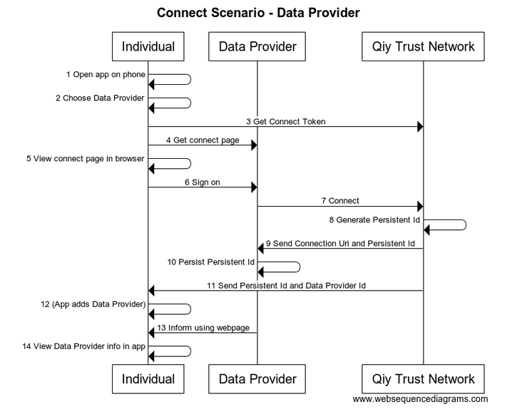
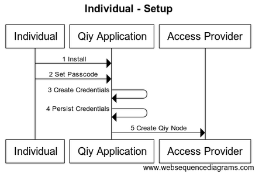
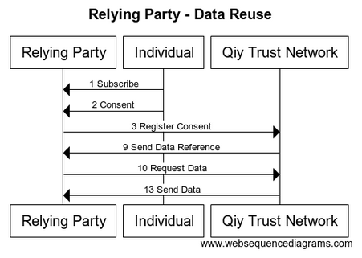

# Functional Specification
From [Qiy Nodes](Definitions.md#qiy-node) to data exchange


# Contents

1. [Introduction](#1-introduction)
	1. [Purpose](#11-purpose)
	1. [Readers' Guidance](#12-readers-guidance)
1. [Overview](#2-overview)
1. [Data Provider Scenario](#3-data-provider-scenario)
	1. [Setup](#31-setup)
	1. [Individual Connects](#32-individual-connects)
	1. [Data Reuse](#33-data-reuse)
1. [Scenario for Individual](#4-scenario-for-individual)
	1. [Setup](#41-setup)
	1. [Connect with Data Provider](#42-connect-with-data-provider)
	1. [Connect with Relying Party](#43-connect-with-relying-party)
	1. [Data Reuse](#44-data-reuse)
1. [Relying Party Scenario](#5-relying-party-scenario)
	1. [Setup](#51-setup)
	1. [Individual Connects](#52-individual-connects)
	1. [Data Reuse](#53-data-reuse)
1. [Connect with Data Provider](#6-connect-with-data-provider)
1. [Connect with Relying Party](#7-connect-with-relying-party)
1. [Data Reuse](#8-data-reuse)
	1. [Subscribe](#81-subscribe)
	1. [Consent](#82-consent)
	1. [Register Consent](#83-register-consent)
	1. [Notify Consent](#84-notify-consent)
	1. [Propose Data Source](#85-propose-data-source)
	1. [Request Operation Specification](#86-request-operation-specification)
	1. [Generate Data Reference](#87-generate-data-reference)
	1. [Register Operation Specification](#88-register-operation-specification)
	1. [Send Data Reference](#89-send-data-reference)
	1. [Request Data](#810-request-data)
	1. [Lookup Operation](#811-lookup-operation)
	1. [Execute Operation](#812-execute-operation)
	1. [Data](#813-data)
1. [Diagrams](#9-diagrams)
	1. [Data Provider - Setup](#91-data-provider---setup)
	1. [Individual - Setup](#92-individual---setup)
	1. [Relying Party - Setup](#93-relying-party---setup)
	1. [Connect Scenario - Data Provider](#94-connect-scenario---data-provider)
	1. [Connect Scenario - Relying Party](#95-connect-scenario---relying-party)
	1. [Data Provider - Data Reuse](#96-data-provider---data-reuse)
	1. [Individual - Data Reuse](#97-individual---data-reuse)
	1. [Relying Party - Data Reuse](#98-relying-party---data-reuse)
	1. [Data Reuse Scenario - All](#99-data-reuse-scenario---all)

# 1 Introduction

This document describes the basic Qiy Scheme scenarios as an introduction to the full functional description provided in the [Use Case specifications](Definitions.md#use-case).


## 1.1 Purpose

This document is the entry point for information analysts and software engineers that need to know how they can use the [Qiy Trust Network](Definitions.md#qiy-trust-network).

## 1.2 Readers' Guidance

* Information analysts are advised to read the scenarios of interest and the related [Use Case](Definitions.md#use-case) specifications, see [UC00 Use Cases Overview](./use-cases/UC00%20Use%20Cases%20Overview.md).
* Software engineers are advised to read the scenarios of interest, the related [Use Case](Definitions.md#use-case) specifications (see [UC00 Use Cases Overview](./use-cases/UC00%20Use%20Cases%20Overview.md)) and the related [Qiy Node Documentation](Definitions.md#qiy-node-documentation).

# 2 Overview

The remainder of this document describes the scenarios for the different roles and the Data Reuse scenario in full, finishing with the source code of the diagrams:
* [3 Data Provider Scenario](#3-data-provider-scenario)
* [4 Scenario for Individual](#4-scenario-for-individual)
* [5 Relying Party Scenario](#5-relying-party-scenario)
* [6 Connect with Data Provider](#6-connect-with-data-provider)
* [7 Connect with Relying Party](#7-connect-with-relying-party)
* [8 Data Reuse](#8-data-reuse)
* [9 Diagrams](#9-diagrams)


# 3 Data Provider Scenario


## 3.1 Setup

This section describes the scenario for the [Data Provider](Definitions.md#data-provider) acquiring access to the [Qiy Trust Network](Definitions.md#qiy-trust-network).


The flow is as follows:
1. The [Data Provider](Definitions.md#data-provider) endorses Qiy by implementing the [Binding Principles for Relying Parties and Data Providers](Definitions.md#binding-principles-for-relying-parties-and-data-providers).
1. The [Data Provider](Definitions.md#data-provider) documents its [Data Service](Definitions.md#data-service) in a [Data Service Description](Definitions.md#data-service-description).
1. The [Data Provider](Definitions.md#data-provider) establishes a [Service Endpoint](Definitions.md#service-endpoint) which will be used to provide [Personal Data](Definitions.md#personal-data) via the [Qiy Trust Network](Definitions.md#qiy-trust-network).
1. The [Data Provider](Definitions.md#data-provider) prepares the front-end of its computing system to be able to establish connections with its users via Qiy.
1. The [Data Provider](Definitions.md#data-provider) prepares the back-end of its computing system to be able to distribute data via Qiy.
1. The [Data Provider](Definitions.md#data-provider) selects an [Access Provider](Definitions.md#access-provider) and concludes an access agreement.
1. The [Access Provider](Definitions.md#access-provider) registers the [Data Provider](Definitions.md#data-provider) in the [Service Library](Definitions.md#service-library) of the [Qiy Trust Network](Definitions.md#qiy-trust-network).
1. The [Data Provider](Definitions.md#data-provider) asks the [Access Provider](Definitions.md#access-provider) for a [Qiy Node](Definitions.md#qiy-node).
1. The [Access Provider](Definitions.md#access-provider) creates [Qiy Node Credentials](Definitions.md#qiy-node-credentials).
1. The [Access Provider](Definitions.md#access-provider) creates a [Qiy Node](Definitions.md#qiy-node).
1. The [Access Provider](Definitions.md#access-provider) returns the [Qiy Node Credentials](Definitions.md#qiy-node-credentials).
1. The [Data Provider](Definitions.md#data-provider) configures its computing system with the [Qiy Node Credentials](Definitions.md#qiy-node-credentials) and gains physical access to the [Qiy Trust Network](Definitions.md#qiy-trust-network).
1. The [Data Provider](Definitions.md#data-provider) registers its [Data Service](Definitions.md#data-service) by publishing the [Data Service Description](Definitions.md#data-service-description) in the [Service Library](Definitions.md#service-library) of the [Qiy Trust Network](Definitions.md#qiy-trust-network).


## 3.2 Individual Connects

After the setup, the [Individual](Definitions.ms#individual) connects with the [Data Provider](Definitions.md#data-provider).
The scenario for this is described in [6 Connect with Data Provider](#6-connect-with-data-provider).
 


## 3.3 Data Reuse

Finally, the [Data Provider](Definitions.md#data-provider) will deliver the [Personal Data](Definitions.md#personal-data) as shown below.
The details of this flow are described in [8 Data Reuse](#8-data-reuse):


# 4 Scenario for Individual


## 4.1 Setup

This section describes the scenario for the [Individual](Definitions.md#individual) acquiring access to the [Qiy Trust Network](Definitions.md#qiy-trust-network).



The [Qiy Scheme](Definitions.md#qiy-scheme) allows [Individuals](Definitions.md#individual) to use the [Qiy Trust Network](Definitions.md#qiy-trust-network) in many different ways, but the [Individual](Definitions.md#individual) in this scenario has never used the [Qiy Trust Network](Definitions.md#qiy-trust-network) before and acquires access using his smartphone as follows:
1. The [Individual](Definitions.md#individual) installs a [Qiy Application](Definitions.md#qiy-application) on his smartphone.
1. The [Individual](Definitions.md#individual) sets a passcode to secure access the [Qiy Application](Definitions.md#qiy-application).
1. The [Qiy Application](Definitions.md#qiy-application) generates [Qiy Node Credentials](Definitions.md#qiy-node-credentials).
1. The [Qiy Application](Definitions.md#qiy-application) persists [Qiy Node Credentials](Definitions.md#qiy-node-credentials).
1. The [Qiy Application](Definitions.md#qiy-application) uses the public parts of the credentials to create a [Qiy Node](Definitions.md#qiy-node) with the help of an [Access Provider](Definitions.md#access-provider).

After these steps, the [Individual](Definitions.md#individual) has gained access to the [Qiy Trust Network](Definitions.md#qiy-trust-network) and he can use it by means of the [Qiy Application](Definitions.md#qiy-application).

## 4.2 Connect with Data Provider

After setup, the [Individual](Definitions.ms#individual) connects with the [Data Provider](Definitions.md#data-provider).
The details of the flow are described in [6 Connect with Data Provider](#6-connect-with-data-provider).
 


## 4.3 Connect with Relying Party

As a next step, the [Individual](Definitions.ms#individual) connects with the [Relying Party](Definitions.md#relying-party).
The details of this flow are described in [7 Connect with Relying Party](#7-connect-with-relying-party).
 


## 4.4 Data Reuse

In this scenario, the [Personal Data](Definitions.md#personal-data) of the [Individual](Definitions.md#individual) consents use of his data to the [Relying Party](Definitions.md#relying-party) after which his data are provided without interaction with the him.
The flow is described in detail in [8 Data Reuse](#8-data-reuse).


# 5 Relying Party Scenario


## 5.1 Setup

This section describes the scenario for the [Relying Party](Definitions.md#relying-party) acquiring access to the [Qiy Trust Network](Definitions.md#qiy-trust-network).


The flow is as follows:
1. The [Relying Party](Definitions.md#relying-party) endorses Qiy by implementing the [Binding Principles for Relying Parties and Data Providers](Definitions.md#binding-principles-for-relying-parties-and-data-providers).
1. The [Relying Party](Definitions.md#relying-party) documents its [Service](Definitions.md#service) in a [Service Description](Definitions.md#service-description).
1. The [Relying Party](Definitions.md#relying-party) prepares the front-end of its computing system to be able to establish (initially anonymous) connections with [Individuals](Definitions.md#individual) via Qiy.
1. The [Relying Party](Definitions.md#relying-party) prepares the back-end of its computing system to be able to receive [Personal Data](Definitions.md#personal-data) via Qiy.
1. The [Relying Party](Definitions.md#relying-party) selects an [Access Provider](Definitions.md#access-provider) and concludes an access agreement.
1. The [Access Provider](Definitions.md#access-provider) registers the [Relying Party](Definitions.md#relying-party) in the [Service Library](Definitions.md#service-library) of the [Qiy Trust Network](Definitions.md#qiy-trust-network).
1. The [Relying Party](Definitions.md#relying-party) asks the [Access Provider](Definitions.md#access-provider) for a [Qiy Node](Definitions.md#qiy-node).
1. The [Access Provider](Definitions.md#access-provider) creates [Qiy Node Credentials](Definitions.md#qiy-node-credentials).
1. The [Access Provider](Definitions.md#access-provider) creates a [Qiy Node](Definitions.md#qiy-node).
1. The [Access Provider](Definitions.md#access-provider) returns the [Qiy Node Credentials](Definitions.md#qiy-node-credentials).
1. The [Relying Party](Definitions.md#relying-party) configures its computing system with the [Qiy Node Credentials](Definitions.md#qiy-node-credentials) and gains physical access to the [Qiy Trust Network](Definitions.md#qiy-trust-network).
1. The [Relying Party](Definitions.md#relying-party) registers its [Service](Definitions.md#service) by publishing the [Service Description](Definitions.md#service-description) in the [Service Library](Definitions.md#service-library) of the [Qiy Trust Network](Definitions.md#qiy-trust-network).


## 5.2 Individual Connects

After the setup, the [Individual](Definitions.ms#individual) visits the website of the [Relying Party](Definitions.md#relying-party) and connect via Qiy.
This flow is described in detail in [7 Connect with Relying Party](#7-connect-with-relying-party).
 


## 5.3 Data Reuse

The [Relying Party](Definitions.md#relying-party) can acquire the [Personal Data](Definitions.md#personal-data) as shown below.
Please refer to [8 Data Reuse](#8-data-reuse) for the details.




# 6 Connect with Data Provider

This chapter describes the flow for the [Individual](Definitions.ms#individual) connecting with the [Data Provider](Definitions.md#data-provider).
 


1. The [Individual](Definitions.md#individual) opens the previously installed [Qiy Application](Definitions.md#qiy-application) on his phone and enters the passcode.
2. The [Qiy Application](Definitions.md#qiy-application) presents an option to connect with the [Data Provider](Definitions.md#data-provider) which the [Individual](Definitions.md#individual) chooses.
3. The [Qiy Application](Definitions.md#qiy-application) retrieves a [Connect Token](Definitions.md#connect-token) from the [Qiy Trust Network](Definitions.md#qiy-trust-network).
4. The [Qiy Application](Definitions.md#qiy-application) incorporates the [Connect Token](Definitions.md#connect-token) in the webpage address of the [Data Provider](Definitions.md#data-provider) which is opened in a webbrowser.
5. The [Individual](Definitions.md#individual) views the connect page asking him to sign on.
6. The [Individual](Definitions.md#individual) has an account with the [Data Provider](Definitions.md#data-provider) and succesfully signs on.
7. The [Data Provider](Definitions.md#data-provider) asks the [Qiy Trust Network](Definitions.md#qiy-trust-network) to create a Connection|Definitions.md#] with the [Connect Token](Definitions.md#connect-token).
8. The [Qiy Trust Network](Definitions.md#qiy-trust-network) creates the [Connection](Definitions.md#connection) and generates a [Persistent Id](Definitions.md#persistent-id) for the [Connection](Definitions.md#connection).
9. The [Qiy Trust Network](Definitions.md#qiy-trust-network) sends the [Connection Uri](Definitions.md#connection-uri) and the [Persistent Id](Definitions.md#persistent-id) to the [Data Provider](Definitions.md#data-provider).
10. The [Data Provider](Definitions.md#data-provider) persists the [Persistent Id](Definitions.md#persistent-id) in the local profile of the [Individual](Definitions.md#individual).
11. The [Qiy Trust Network](Definitions.md#qiy-trust-network) sends the [Persistent Id](Definitions.md#persistent-id) and the [Data Provider Id](Definitions.md#data-provider-id) to the [Individual](Definitions.md#individual) which is captured by his [Qiy Application](Definitions.md#qiy-application).
12. The [Qiy Application](Definitions.md#qiy-application) adds the [Data Provider](Definitions.md#data-provider) to the list of connected [Data Providers](Definitions.md#data-provider).
13. The [Data Provider](Definitions.md#data-provider) uses the webpage to inform the [Individual](Definitions.md#individual) that they are connected via Qiy and that he can control his [Personal Data](Definitions.md#personal-data) via Qiy and redirects him back to the [Qiy Application](Definitions.md#qiy-application).
14. The [Individual](Definitions.md#individual) can view details of the newly added [Data Provider](Definitions.md#data-provider) in the app.


# 7 Connect with Relying Party

This chapter describes the flow for the [Individual](Definitions.ms#individual) connecting with the [Relying Party](Definitions.md#relying-party).
 


1. The [Individual](Definitions.md#individual) gets his laptop and opens a webbrowser.
2. The [Individual](Definitions.md#individual) visits the website of the [Relying Party](Definitions.md#relying-party). It presents an option to sign on using Qiy.
3. The [Individual](Definitions.md#individual) chooses to use this option.
4. The [Relying Party](Definitions.md#relying-party) retreives a [Connect Token](Definitions.md#connect-token) from the [Qiy Trust Network](Definitions.md#qiy-trust-network).
5. The [Relying Party](Definitions.md#relying-party) uses it to generate a [QR Code](Definitions.md#qr-code) in a sign on page.
6. The [Relying Party](Definitions.md#relying-party) sends the sig on page to the [Individual](Definitions.md#individual).
7. The [Individual](Definitions.md#individual) picks up his smartphone, opens the previously installed [Qiy Application](Definitions.md#qiy-application) and scans the [QR Code](Definitions.md#qr-code).
8. The [Qiy Application](Definitions.md#qiy-application) extracts the [Connect Token](Definitions.md#connect-token) and uses it to request the [Qiy Trust Network](Definitions.md#qiy-trust-network) to create a [Connection](Definitions.md#connection). 
9. The [Qiy Trust Network](Definitions.md#qiy-trust-network) creates the [Connection](Definitions.md#connection) and generates a [Persistent Id](Definitions.md#persistent-id) for the [Connection](Definitions.md#connection).
10. The [Qiy Trust Network](Definitions.md#qiy-trust-network) sends the [Persistent Id](Definitions.md#persistent-id) and the [Relying Party Id](Definitions.md#relying-party-id) to the [Qiy Application](Definitions.md#qiy-application) of the [Individual](Definitions.md#individual).
11. The [Qiy Application](Definitions.md#qiy-application) asks the [Individual](Definitions.md#individual) to confirm the connection and to return to the website and the [Individual](Definitions.md#individual) complies.
12. The [Qiy Trust Network](Definitions.md#qiy-trust-network) sends the [Persistent Id](Definitions.md#persistent-id) to the [Relying Party](Definitions.md#relying-party).
13. The [Relying Party](Definitions.md#relying-party) creates a local account for the [Individual](Definitions.md#individual).
13. The [Relying Party](Definitions.md#relying-party) persists the [Persistent Id](Definitions.md#persistent-id) in the local profile of the [Individual](Definitions.md#individual).
14. The [Relying Party](Definitions.md#relying-party) looks up the related sign on page and replaces it with a welcome page, informing the [Individual](Definitions.md#individual) that he has a new anonymous account and that he is signed on via Qiy.


# 8 Data Reuse

This chapter describes the data reuse flow.
 


## 8.1 Subscribe

* The [Relying Party](Definitions.md#relying-party) displays its [Service Catalogue](Definitions.md#service-catalogue).
* The [Individual](Definitions.md#individual) browses the [Service Catalogue](Definitions.md#service-catalogue),
  * ... selects a [Service](Definitions.md#service),
  * and subscribes to the [Service](Definitions.md#service).


## 8.2 Consent

* The [Relying Party](Definitions.md#relying-party) asks the [Individual](Definitions.md#individual) [Consent](Definitions.md#consent) to use his [Personal Data](Definitions.md#personal-data).
* The [Individual](Definitions.md#individual) grants the [Relying Party](Definitions.md#relying-party) [Consent](Definitions.md#consent) to use [Personal Data](Definitions.md#personal-data) that can be provided by the [Data Provider](Definitions.md#data-provider) for this [Service](Definitions.md#service).


## 8.3 Register Consent

* The [Relying Party](Definitions.md#relying-party) asks its [Qiy Node](Definitions.md#qiy-node) to register the [Consent](Definitions.md#consent).
* The [Qiy Node](Definitions.md#qiy-node) asks the [Qiy Trust Network](Definitions.md#qiy-trust-network) to register the [Consent](Definitions.md#consent).
* The [Qiy Trust Network](Definitions.md#qiy-trust-network) persists the [Consent](Definitions.md#consent)


## 8.4 Notify Consent

* The [Qiy Trust Network](Definitions.md#qiy-trust-network) notifies the [Qiy Node](Definitions.md#qiy-node) of the [Qiy Application](Definitions.md#qiy-application).
* The [Qiy Node](Definitions.md#qiy-node) notifies the [Qiy Application](Definitions.md#qiy-application).
* The [Qiy Application](Definitions.md#qiy-application) notifies the [Individual](Definitions.md#individual) of the [Consent](Definitions.md#consent).


## 8.5 Propose Data Source

* The [Qiy Application](Definitions.md#qiy-application) proposes to use the [Data Provider](Definitions.md#data-provider) as data source for the [Consent](Definitions.md#consent).
* The [Individual](Definitions.md#individual) accepts the proposal.
* The [Qiy Application](Definitions.md#qiy-application) asks the [Qiy Trust Network](Definitions.md#qiy-trust-network) to register the [Data Provider](Definitions.md#data-provider) as data source for the [Consent](Definitions.md#consent).


## 8.6 Request Operation Specification

* The [Qiy Trust Network](Definitions.md#qiy-trust-network) requests the [Data Provider](Definitions.md#data-provider) for a [Data Reference](Definitions.md#data-reference) (which can be used to acquire the data).
* The [Data Provider](Definitions.md#data-provider) generates an [Operation Specification](Definitions.md#operation-specification) (which specifies a request that will get the data from the [Service Endpoint](Definitions.md#service-endpoint)),
  * and returns it to the [Qiy Trust Network](Definitions.md#qiy-trust-network). 


## 8.7 Generate Data Reference

* The [Qiy Trust Network](Definitions.md#qiy-trust-network) generates a [Data Reference](Definitions.md#data-reference).


## 8.8 Register Operation Specification

* The [Qiy Trust Network](Definitions.md#qiy-trust-network) registers the [Operation Specification](Definitions.md#operation-specification) under the [Data Reference](Definitions.md#data-reference).


## 8.9 Send Data Reference

* The [Qiy Trust Network](Definitions.md#qiy-trust-network) sends the [Data Reference](Definitions.md#data-reference) to the [Relying Party](Definitions.md#relying-party).


## 8.10 Request Data

* The [Relying Party](Definitions.md#relying-party) asks its [Qiy Node](Definitions.md#qiy-node) to resolve the [Data Reference](Definitions.md#data-reference).
* The [Qiy Node](Definitions.md#qiy-node) asks the [Qiy Trust Network](Definitions.md#qiy-trust-network) to resolve the [Data Reference](Definitions.md#data-reference).


## 8.11 Lookup Operation

* The [Qiy Trust Network](Definitions.md#qiy-trust-network) looks up the related [Operation Specification](Definitions.md#operation-specification)
  * and constructs the operation


## 8.12 Execute Operation

* The [Qiy Trust Network](Definitions.md#qiy-trust-network) executes the operation, requesting the [Service Endpoint](Definitions.md#service-endpoint) for the data.
* The [Service Endpoint](Definitions.md#service-endpoint) processes the request and returns the data


## 8.13 Data

* The [Qiy Trust Network](Definitions.md#qiy-trust-network) sends the data to the [Qiy Node](Definitions.md#qiy-node) of the [Relying Party](Definitions.md#relying-party).
* The [Qiy Node](Definitions.md#qiy-node) returns the data to the [Relying Party](Definitions.md#relying-party).


# 9 Diagrams


## 9.1 Data Provider - Setup


```
title "Data Provider - Setup"

participant "Data Provider" as DP
participant "Access Provider" as AP
participant "Qiy Trust Network" as QTN

DP->DP: 1 Endorse Qiy
DP->DP: 2 Document Data Service
DP->DP: 3 Establish Service Endpoint
DP->DP: 4 Prepare Front-End
DP->DP: 5 Prepare Back-End
DP->AP  : 6 Conclude Access Agreement
AP-> QTN  : 7 Register Data Provider
DP->AP  : 8 Request Qiy Node
AP->AP: 9 Create Qiy Node Credentials
AP->AP : 10 Create Qiy Node
AP-->DP: 11 Qiy Node Credentials
DP->DP: 12 Configure Computing System
DP-> QTN  : 13 Register Data Service
```


## 9.2 Individual - Setup


```
title "Individual - Setup"

participant "Individual" as User
participant "Qiy Application" as App
participant "Access Provider" as AP

User->App  : 1 Install
User->App  : 2 Set Passcode
App->App: 3 Create Credentials
App->App: 4 Persist Credentials
App->AP : 5 Create Qiy Node
```


## 9.3 Relying Party - Setup


```
title "Relying Party - Setup"

participant "Relying Party" as RP
participant "Access Provider" as AP
participant "Qiy Trust Network" as QTN

RP->RP: 1 Endorse Qiy
RP->RP: 2 Document Service
RP->RP: 3 Prepare Front-End
RP->RP: 4 Prepare Back-End
RP->AP  : 5 Conclude Access Agreement
AP-> QTN  : 6 Register Relying Party
RP->AP  : 7 Request Qiy Node
AP->AP : 8 Create Qiy Node Credentials
AP->AP : 9 Create Qiy Node
AP-->RP: 10 Qiy Node Credentials
RP->RP: 11 Configure Computing System
RP-> QTN  : 12 Register Service
```


## 9.4 Connect Scenario - Data Provider


```
title " Connect Scenario - Data Provider"

participant Individual as User
participant "Data Provider" as DP
participant "Qiy Trust Network" as QTN

User -> User	: 1 Open app on phone
User -> User	: 2 Choose Data Provider
User -> QTN	 	: 3 Get Connect Token
User -> DP	 	: 4 Get connect page
User -> User	: 5 View connect page in browser
User -> DP	 	: 6 Sign on
DP -> QTN       : 7 Connect
QTN -> QTN      : 8 Generate Persistent Id
QTN -> DP       : 9 Send Connection Uri and Persistent Id
DP-> DP         : 10 Persist Persistent Id
QTN -> User     : 11 Send Persistent Id and Data Provider Id
User -> User	: 12 (App adds Data Provider)
DP   -> User    : 13 Inform using webpage
User -> User	: 14 View Data Provider info in app
```


## 9.5 Connect Scenario - Relying Party


```
title "Connect Scenario - Relying Party"

participant Individual as User
participant "Relying Party" as RP
participant "Qiy Trust Network" as QTN

User -> User    : 1 Open browser on laptop
User -> RP      : 2 Visit website
User -> RP      : 3 Get sign on page
RP -> QTN       : 4 Get Connect Token
RP -> RP        : 5 Generate QR Code
RP -> User      : 6 Send sign on page
User -> User    : 7 Scan QR Code using Qiy app on phone
User -> QTN     : 8 Connect
QTN -> QTN      : 9 Create Persistent Id
QTN -> User     : 10 Send Persistent Id and Relying Party Id
User -> User    : 11 Confirm connection and return to laptop
QTN -> RP       : 12 Send Persistent Id
RP -> RP        : 13 Create account
RP -> RP        : 14 Persist Id
RP -> User      : 15 Welcome via web
```


## 9.6 Data Provider - Data Reuse


```
title "Data Provider - Data Reuse"

participant Individual as User
participant "Data Provider" as DP
participant "Qiy Trust Network" as QTF

User -> DP	 	: 1 Connect
User -> DP	 	: 2 Sign on
DP-> DP         : 3 Persist Connection Id

QTF -> DP       : 11 Request Operation Specification
QTF -> DP: 17 Execute Operation
```


## 9.7 Individual - Data Reuse


```
title "Individual - Data Reuse"

participant "Relying Party" as RP
participant Individual as User
participant "Qiy Trust Network" as QTN

User -> RP	  : 1 Subscribe
User -> RP	  : 2 Consent
QTN -> Individual : 4 Notify Consent
QTN -> Individual : 5 Propose Data Source
```


## 9.8 Relying Party - Data Reuse


```
title "Relying Party - Data Reuse"

participant "Relying Party"     as RP
participant "Individual"        as User
participant "Qiy Trust Network" as QTF

User -> RP  : 1 Subscribe
User -> RP  : 2 Consent
RP   -> QTF : 3 Register Consent
QTF  -> RP  : 9 Send Data Reference
RP   -> QTF : 10 Request Data
QTF  -> RP  : 13 Send Data
```


## 9.9 Data Reuse Scenario - All


```
title "Data Reuse Scenario - All"

participant "Relying Party" as RP
participant Individual as User
participant "Data Provider" as DP
participant "Qiy Trust Network" as QTN

User -> RP	  : 1 Subscribe
User -> RP	  : 2 Consent
RP -> QTN	  : 3 Register Consent
QTN -> Individual : 4 Notify Consent
QTN -> Individual : 5 Propose Data Source
QTN -> DP         : 6 Request Operation Specification
QTN -> QTN        : 7 Generate Data Reference
QTN -> QTN        : 8 Register Operation Specification
QTN -> RP	  : 9 Send Data Reference

RP -> QTN         : 10 Request Data
QTN -> QTN        : 11 Lookup Operation Specification
QTN -> DP         : 12 Execute Operation
QTN -> RP         : 13 Send Data
```


