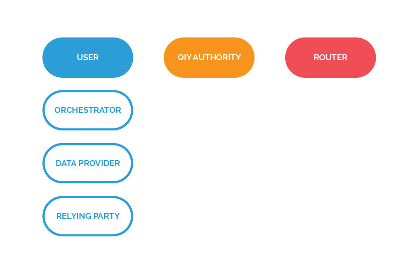
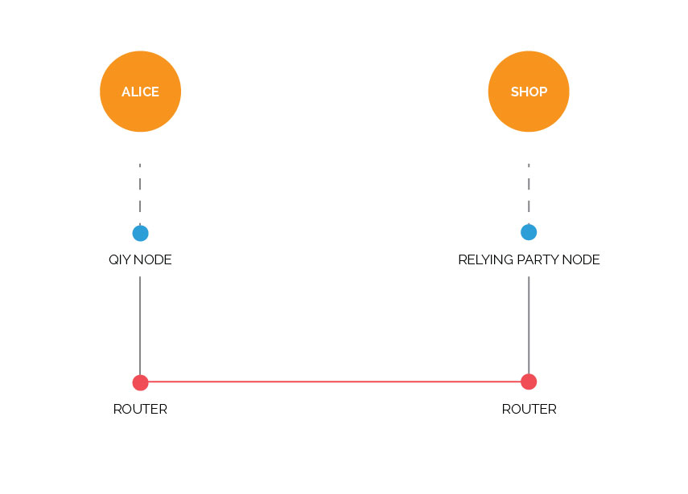
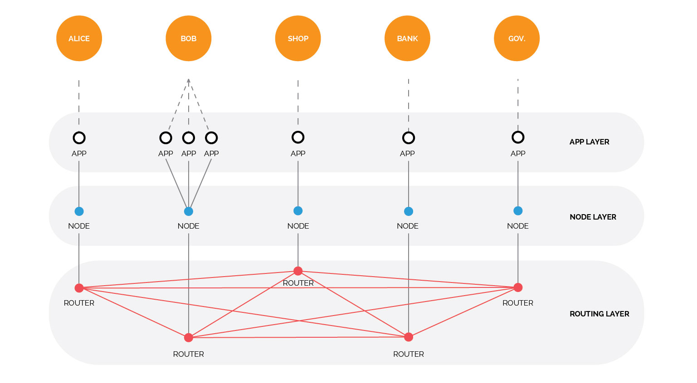
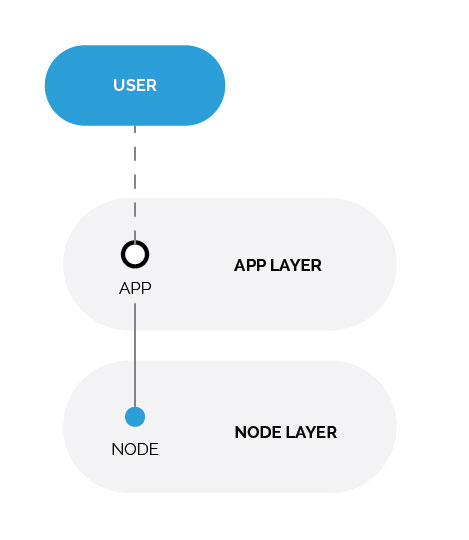
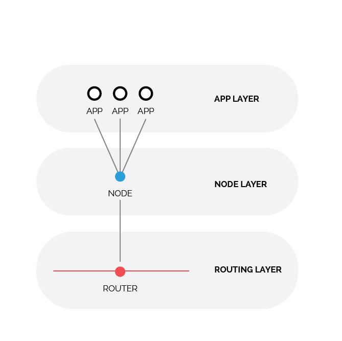
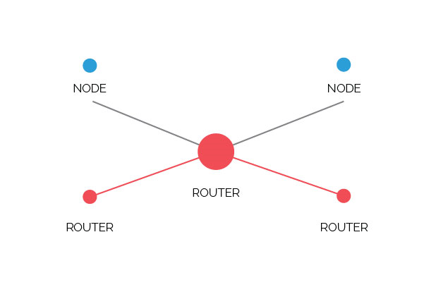
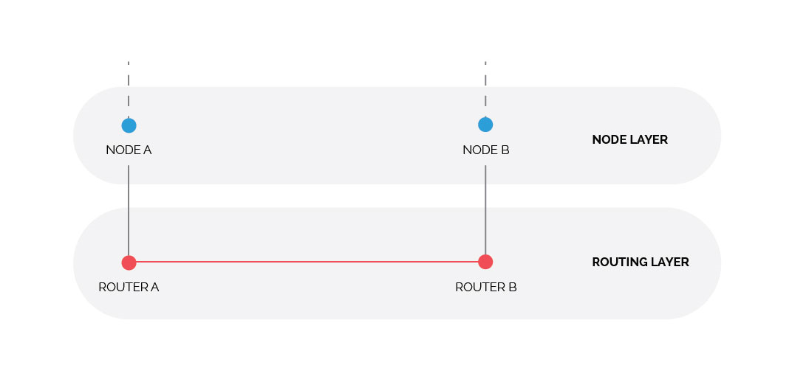

# Functional and Technical Overview

# Abstract

This document is produced by the [Work Stream Functionality & Technology](Definitions.md#work-stream-functionality--technology) and describes the functional, technical, privacy, security, legal and/or compliancy aspects of Qiy.

# Content

1. [Introduction](#1-introduction)
	1. [Purpose](#11-purpose)
	1. [Readers' Guidance](#12-readers-guidance)
	1. [Overview](#13-overview)
	1. [Terminology](#14-terminology)
1. [High-Level Qiy Use Cases](#2-high-level-qiy-use-cases)
	1. [Qiy Participants](#21-qiy-participants)
		1. [Individuals](#individuals)
		1. [Organizations](#organizations)
	1. [Qiy Roles](#22-qiy-roles)
		1. [Users](#221-users)
		1. [Orchestrator](#orchestrator)
		1. [Data Providers](#data-providers)
		1. [Relying Parties](#relying-parties)
		1. [Router](#222-router)
		1. [Scheme Authority](#223-scheme-authority)
	1. [Individual as Data Provider Use Case](#23-individual-as-data-provider-use-case)
		1. [Overview](#231-overview)
		1. [Zooming in](#232-zooming-in)
1. [Qiy Architecture](#3-qiy-architecture)
	1. [Basic Qiy Concepts](#31-basic-qiy-concepts)
		1. [Qiy Node](#311-qiy-node)
		1. [Global Addresses](#312-global-addresses)
		1. [Persistent Connections](#313-persistent-connections)
		1. [Structured data](#314-structured-data)
		1. [Distributed network of Nodes and [Routers](Definitions.md#router)](#315-distributed-network-of-nodes-and-[routers](Definitions.md#router))
	1. [Protocol Layering](#32-protocol-layering)
		1. [Layer responsibilities](#321-layer-responsibilities)
		1. [Layer constraints](#322-layer-constraints)
	1. [Privacy in Qiy](#33-privacy-in-qiy)
	1. [Security in Qiy](#34-security-in-qiy)
1. [Application Layer](#4-application-layer)
	1. [Application Messages](#41-application-messages)
	1. [Responsibilities](#42-responsibilities)
		1. [Interface for the User](#421-interface-for-the-user)
		1. [Out-of-band Application interface](#422-out-of-band-application-interface)
		1. [Authentication of the User](#423-authentication-of-the-user)
		1. [Data interpretation and processing](#424-data-interpretation-and-processing)
		1. [Policy Enforcement Point](#425-policy-enforcement-point)
	1. [Node Connection](#43-node-connection)
	1. [Application Requirements](#44-application-requirements)
1. [Qiy Node Layer](#5-qiy-node-layer)
	1. [Responsibilities](#51-responsibilities)
		1. [Application Management](#511-application-management)
			1. [Application Authentication ](#5111-application-authentication-)
			1. [Application Authorization](#5112-application-authorization)
		1. [Messaging](#512-messaging)
		1. [Consent Management](#513-consent-management)
		1. [Digital Identity](#514-digital-identity)
		1. [Connection Management](#515-connection-management)
		1. [Key Management](#516-key-management)
		1. [Preferences and Settings](#517-preferences-and-settings)
	1. [Inter-Node Communication](#52-inter-node-communication)
	1. [Router Connection](#53-router-connection)
	1. [Node Requirements](#54-node-requirements)
1. [Routing Layer](#6-routing-layer)
	1. [Route](#61-route)
	1. [Responsibilities](#62-responsibilities)
		1. [Registering a Qiy Node](#621-registering-a-qiy-node)
		1. [Authenticating a Qiy Node](#622-authenticating-a-qiy-node)
		1. [Creating a Route between Nodes](#623-creating-a-route-between-nodes)
		1. [Message Routing](#624-message-routing)

# 1 Introduction

This chapter describes the purpose, contents, structure and use of this document.

## 1.1 Purpose

Qiy, or rather: the [Qiy Scheme](Definitions.md#qiy-scheme), puts people back in control of their [Personal Data](Definitions.md#personal-data) while creating value for organizations that process it ([Relying Parties](Definitions.md#relying-party)).
The document describes the functional, technical, privacy, security, legal and/or compliancy aspects of Qiy.

## 1.2 Readers' Guidance

* Privacy officers are advised to read chapters [2 High-Level Qiy Use Cases](#2-high-level-qiy-use-cases) and [3 Qiy Architecture](#3-qiy-architecture).
* Security officers are advised to read chapters [2 High-Level Qiy Use Cases](#2-high-level-qiy-use-cases) and [3 Qiy Architecture](#3-qiy-architecture).
* Information analysts are advised to read chapters [2 High-Level Qiy Use Cases](#2-high-level-qiy-use-cases), [3 Qiy Architecture](#3-qiy-architecture), [4 Application Layer](#4-application-layer) and [5 Qiy Node Layer](#5-qiy-node-layer).
* Application developers are advised to read chapters [2 High-Level Qiy Use Cases](#2-high-level-qiy-use-cases), [3 Qiy Architecture](#3-qiy-architecture), [4 Application Layer](#4-application-layer) and [5 Qiy Node Layer](#5-qiy-node-layer).
* Systems engineers are advised to read chapters [2 High-Level Qiy Use Cases](#2-high-level-qiy-use-cases), [3 Qiy Architecture](#3-qiy-architecture) and [6 Routing Layer](#6-routing-layer).

## 1.3 Overview

This document has the following chapters:
* [1 Introduction](#1-introduction) - this chapter - describes the purpose, contents, structure and use of this document.
* [2 High-Level Qiy Use Cases](#2-high-level-qiy-use-cases) describes some of the high-level [Use Cases](Definitions.md#use-case) that Qiy addresses.
* [3 Qiy Architecture](#3-qiy-architecture) provides a brief description of the key Qiy concepts, layers and components.
* [4 Application Layer](#4-application-layer) describes the [Application Layer](Definitions.md#application-layer).
* [5 Qiy Node Layer](#5-qiy-node-layer) describes the [Qiy Node Layer](Definitions.md#qiy-node-layer).
* [6 Routing Layer](#6-routing-layer) describes the [Routing Layer](Definitions.md#routing-layer).

## 1.4 Terminology

Please refer to [Definitions](./Definitions.md) for a description of the meaning of the used terms.

# 2 High-Level Qiy Use Cases

[Individuals](Definitions.md#individual) and organizations, including government organizations can be participants in the [Qiy Scheme](Definitions.md#qiy-scheme) in different [Roles](Definitions.md#role).

## 2.1 Qiy Participants

### Individuals
[Individuals](Definitions.md#individual) benefit from participating in the [Qiy Scheme](Definitions.md#qiy-scheme), by gaining oversight and control over their personal information. By participating in the [Qiy Scheme](Definitions.md#qiy-scheme) they can:
1. Know where their [Data](Definitions.md#data) is
2. Access their [Data](Definitions.md#data) at the source
3. Control who uses this [Data](Definitions.md#data) and for what purpose
4. Re-use the [Data](Definitions.md#data) to create insight and value for themselves, or to share with others
5. Re-use the [Data](Definitions.md#data) with a vouch for its correctness from the party providing the [Data](Definitions.md#data).

### Organizations 
While the benefits of the [Qiy Scheme](Definitions.md#qiy-scheme) are obvious for [Individuals](Definitions.md#individual), organizations may benefit from participating as well. This includes government organizations, which can participate in the Scheme in a similar way as any other organization.

Organizations benefit in the following ways:
1. The quality of the [Data](Definitions.md#data) is likely to be higher, as the [Individual](Definitions.md#individual) can keep it up to date himself, and only has to manage it in one location
2. Unnecessary [Data](Definitions.md#data) replication is prevented, as [Data](Definitions.md#data) can remain at the source
3. Organizations can make use of [Data](Definitions.md#data) that is enriched with the vouch of another organization, increasing the correctness and hence value of the [Data](Definitions.md#data) (if the vouching organization is trusted)
4. Lower costs to get quality and [Consent](Definitions.md#consent) based [Data](Definitions.md#data)
5. Dynamic [Data](Definitions.md#data): subscribe to actual (and validated) [Data](Definitions.md#data)
6. Get to know one's customer not by collecting, but by connecting.

## 2.2 Qiy Roles
In the [Qiy Scheme](Definitions.md#qiy-scheme) different [Roles](Definitions.md#role) can be distinguished. A single organization may participate in the [Qiy Scheme](Definitions.md#qiy-scheme) in more than one [Role](Definitions.md#role). At a minimum, a transaction in the [Qiy Scheme](Definitions.md#qiy-scheme) involves two [Users](Definitions.md#user) and their respective [Qiy Nodes](Definitions.md#qiy-node).

    Diagram 2-1 The [Roles](Definitions.md#role) in the [Qiy Scheme](Definitions.md#qiy-scheme)

### 2.2.1 Users
[Individuals](Definitions.md#individual) and organizations can participate in the [Qiy Scheme](Definitions.md#qiy-scheme) in different [Roles](Definitions.md#role). 

### Orchestrator
[Individuals](Definitions.md#individual) participate in the [Qiy Scheme](Definitions.md#qiy-scheme) in the [Role](Definitions.md#role) of [Orchestrator](Definitions.md#orchestrator). The [Orchestrator](Definitions.md#orchestrator) is represented in the [Qiy Scheme](Definitions.md#qiy-scheme) by his [Qiy Node](Definitions.md#qiy-node). The [Orchestrator](Definitions.md#orchestrator) is in control of his [Qiy Node](Definitions.md#qiy-node) enabling him to decide how other participants will interact with him. The [Orchestrator](Definitions.md#orchestrator) controls the relations with other participants and uses his [Qiy Node](Definitions.md#qiy-node) to manage his [Consent](Definitions.md#consent) for who may use his [Data](Definitions.md#data) for what purpose.

### Data Providers
[Data Providers](Definitions.md#data-provider) make [Data](Definitions.md#data) accessible to other [Users](Definitions.md#user) in the [Qiy Scheme](Definitions.md#qiy-scheme). A [Data Provider](Definitions.md#data-provider) can make [Data](Definitions.md#data) available to an [Orchestrator](Definitions.md#orchestrator) after he has established a [Connection](Definitions.md#connection) to the [Orchestrator](Definitions.md#orchestrator)'s [Qiy Node](Definitions.md#qiy-node), so that the [Orchestrator](Definitions.md#orchestrator) may use the [Data](Definitions.md#data) for his personal use, or share it in an interaction with another [User](Definitions.md#user). If an [Orchestrator](Definitions.md#orchestrator) has given [Consent](Definitions.md#consent), the [Data Provider](Definitions.md#data-provider) may also share [Data](Definitions.md#data) with a [Relying Party](Definitions.md#relying-party) on behalf of the [Orchestrator](Definitions.md#orchestrator). These [Assertions](Definitions.md#assertion) typically supply the receiving party some [Personal Data](Definitions.md#personal-data) of the [Individual](Definitions.md#individual) that is necessary to perform a transaction. If an [Assertion](Definitions.md#assertion) is sent by a [Data Provider](Definitions.md#data-provider), he can enrich the metadata belonging to the [Data](Definitions.md#data) with a vouch for correctness of the [Data](Definitions.md#data). The receiving party may value this vouch based on [Trust](Definitions.md#trust) and reputation of the [Data Provider](Definitions.md#data-provider).
[Data Providers](Definitions.md#data-provider) will often be (government) organizations that have a relation with the [Orchestrator](Definitions.md#orchestrator). In some cases, an [Individual](Definitions.md#individual) can be a [Data Provider](Definitions.md#data-provider); in this case the [Individual](Definitions.md#individual) will be the original source and the [Assertion](Definitions.md#assertion) that is given is not vouched for by any other [User](Definitions.md#user).

### Relying Parties
A [Relying Party](Definitions.md#relying-party) is a [User](Definitions.md#user) that relies on the [Qiy Trust Network](Definitions.md#qiy-trust-network) to receive [Data](Definitions.md#data) from an [Orchestrator](Definitions.md#orchestrator), typically for some kind of [Business Process](Definitions.md#business-proces). To receive this [Data](Definitions.md#data), it is required that the [Relying Party](Definitions.md#relying-party) establishes a [Connection](Definitions.md#connection) with the [Qiy Node](Definitions.md#qiy-node) of an [Orchestrator](Definitions.md#orchestrator). In practice, [Relying Party](Definitions.md#relying-party) will often also participate as a [Data Provider](Definitions.md#data-provider), making the exchange with the [Orchestrator](Definitions.md#orchestrator) possible in both ways.

### 2.2.2 Router
[Router](Definitions.md#router) is the general term for [Service Providers](Definitions.md#service-provider) whose primary purpose is to connect [Users](Definitions.md#user) (respectively their [Qiy Nodes](Definitions.md#qiy-node)) to the [Qiy Scheme](Definitions.md#qiy-scheme). Some [Service Providers](Definitions.md#service-provider) focus on offering [Connections](Definitions.md#connection) to [Users](Definitions.md#user), others add additional [Services](Definitions.md#service) to the primary [Service](Definitions.md#service) of issuing [Qiy Nodes](Definitions.md#qiy-node).

### 2.2.3 Scheme Authority
The [Qiy Scheme](Definitions.md#qiy-scheme) is managed through an independent and international organization, called the [Scheme Authority](Definitions.md#scheme-authority). At the national level, the implementation of the Scheme in that national market is delegated to a [Regional Authority](Definitions.md#regional-authority). At all times the independence of the [Scheme Authority](Definitions.md#scheme-authority) and its national 'branches' shall be warranted. Also, at all times the Scheme in its implementation shall be open and non-discriminatory. To ensure this, appropriate audits and sanctions will be in place at both the national and the international level.
The [Scheme Authority](Definitions.md#scheme-authority) and its national 'branches' set and enforce the rules and regulations and issue [Licenses](Definitions.md#license) to participants of the [Qiy Scheme](Definitions.md#qiy-scheme).

The [Qiy Foundation](Definitions.md#qiy-foundation) fulfils the [Role](Definitions.md#role) of [Scheme Authority](Definitions.md#scheme-authority).

## 2.3 Individual as Data Provider Use Case

### 2.3.1 Overview
In the following example, an [Individual](Definitions.md#individual) named Alice places an order from a web shop called Webshop.com.
To connect with others on the [Qiy Infrastructure](Definitions.md#qiy-infrastructure), Alice uses an app on her smartphone that enables her to scan QR codes to connect. In her [Role](Definitions.md#role) as [Orchestrator](Definitions.md#orchestrator), Alice is in control of the process described in the [Use Case](Definitions.md#use-case).
Webshop.com is an organization connected to the [Qiy Infrastructure](Definitions.md#qiy-infrastructure) by their [Router](Definitions.md#router). To serve Alice, Webshop.com relies on information to be supplied by her using the [Qiy Infrastructure](Definitions.md#qiy-infrastructure); Webshop.com is a [Relying Party](Definitions.md#relying-party) in this [Use Case](Definitions.md#use-case).

The processing sequence is as follows:
1. Alice visits the website of Webshop.com and puts an item in her shopping cart. 
2. Alice proceeds to the check out to purchase the item in her cart.
3. To further serve Alice, Webshop.com [Requests](Definitions.md#request) Alice to connect so that Webshop.com may use Alice's [Data](Definitions.md#data). Webshop.com presents Alice with a [Connect Token](Definitions.md#connect-token) in the form of a QR code so that Alice can connect with Webshop.com.
4. Using the app on her smartphone, Alice scans the QR code, establishing a [Connection](Definitions.md#connection) with the Webshop.com.
5. Alice can now share the necessary [Data](Definitions.md#data) (e.g. name, delivery address, preferences, etc.) with Webshop.com and complete her order.

    Diagram 2-2 The [Individual](Definitions.md#individual) as a [Data Provider](Definitions.md#data-provider)

### 2.3.2 Zooming in
The [Individual](Definitions.md#individual) and the [Qiy Node](Definitions.md#qiy-node)
Alice is represented in the [Qiy Scheme](Definitions.md#qiy-scheme) by her personal [Qiy Node](Definitions.md#qiy-node). As an [Orchestrator](Definitions.md#orchestrator) she interacts with her [Qiy Node](Definitions.md#qiy-node) using one or more Applications. For the worked example, we assume that Alice uses an app on her smartphone that can interact with her [Qiy Node](Definitions.md#qiy-node). This app also enables Alice to connect with other parties that participate in the [Qiy Scheme](Definitions.md#qiy-scheme), such as Webshop.com in this example.

Advertising the [Connect Token](Definitions.md#connect-token)

Alice can visit the website of Webshop.com and put items in her cart without having to identify herself to Webshop.com. To complete the order however, Webshop.com requires some information about Alice; e.g. her real name and her address. To acquire this information using Qiy, Webshop.com invites Alice to connect them. To establish a [Connection](Definitions.md#connection) with her [Qiy Node](Definitions.md#qiy-node), Webshop.com generates a [Connect Token](Definitions.md#connect-token) and presents it out-of-band. In this example, the [Connect Token](Definitions.md#connect-token) is presented as a QR code that can be scanned using an appropriate app. The [Connect Token](Definitions.md#connect-token) contains the information necessary for the app to establish a [Connection](Definitions.md#connection) with Webshop.com. Alice scans this code using the app on her phone.

Establishing a [Connection](Definitions.md#connection)

Using the [Connect Token](Definitions.md#connect-token), the app establishes a secure, encrypted [Connection](Definitions.md#connection) between Alice's [Qiy Node](Definitions.md#qiy-node) and the [Qiy Node](Definitions.md#qiy-node) of Webshop.com via the [Routers](Definitions.md#router). Once this route has been established, Alice and Webshop.com may exchange [Data](Definitions.md#data) through the [Qiy Infrastructure](Definitions.md#qiy-infrastructure). All [Data](Definitions.md#data) transmitted over this [Connection](Definitions.md#connection) is shielded from other parties in between, i.e. the [Routers](Definitions.md#router) only forward the [Data](Definitions.md#data) to the destination [Qiy Node](Definitions.md#qiy-node), but cannot read the contents of the messages they are passing along.

[Data](Definitions.md#data) exchange

The route between Alice's [Qiy Node](Definitions.md#qiy-node) and Webshop.com can be used to securely exchange information; Alice is, as the [Orchestrator](Definitions.md#orchestrator), in control over what [Data](Definitions.md#data) will or will not be shared with [Relying Parties](Definitions.md#relying-party) connected to her [Qiy Node](Definitions.md#qiy-node).
To complete Alice's order, Webshop.com [Requests](Definitions.md#request) the address where her order should be shipped to. Alice acts as a [Data Provider](Definitions.md#data-provider) and supplies this input herself. Webshop.com may then complete the order based on the [Data](Definitions.md#data) Alice has shared.

# 3 Qiy Architecture
This chapter describes the [Qiy Architecture](Definitions.md#qiy-architecture): the entities and their interrelations, which are involved in online communication and transactions. 

The capabilities of the architecture will be illustrated using a limited real-life [Qiy Scheme](Definitions.md#qiy-scheme) web scenario. The rest of the chapter addresses the rationale behind the architecture: why it has been designed the way it has been designed and how it relates to the [Qiy Trust Principles](Definitions.md#qiy-trust-principles) proclaimed by the [Qiy Foundation](Definitions.md#qiy-foundation).
## 3.1 Basic Qiy Concepts
### 3.1.1 Qiy Node
The [Qiy Node](Definitions.md#qiy-node) is a delegate component for Applications. The [Qiy Node](Definitions.md#qiy-node) is responsible for [Connection](Definitions.md#connection) management of global addresses, [Connections](Definitions.md#connection), [Key Management](Definitions.md#key-management), and cryptographic transformations of messages and implements the [Connection](Definitions.md#connection) to the [Qiy Infrastructure](Definitions.md#qiy-infrastructure).
### 3.1.2 Global Addresses
Like e-mail addresses, you can send messages using the [Qiy Infrastructure](Definitions.md#qiy-infrastructure) to a [Qiy Node](Definitions.md#qiy-node) by sending messages to the address. Unlike e-mail addresses however, [Users](Definitions.md#user) have many different [Qiy Node](Definitions.md#qiy-node) addresses, as each [Connection](Definitions.md#connection) should use their own unique address. Qiy uses globally unique addresses (based on the [Domain Name System](Definitions.md#domain-name-system)) in order to route [Connections](Definitions.md#connection) and deliver their messages over the [Qiy Infrastructure](Definitions.md#qiy-infrastructure). 
### 3.1.3 Persistent Connections
Upon fulfillment of the preconditions, a [Qiy Node](Definitions.md#qiy-node) has a long-lived [Connection](Definitions.md#connection) with another [Qiy Node](Definitions.md#qiy-node), which enables the [Users](Definitions.md#user) controlling the connected [Qiy Nodes](Definitions.md#qiy-node) to send and receive a potentially unlimited number of messages over the [Connection](Definitions.md#connection). Such a [Connection](Definitions.md#connection) can be used to engage in a-synchronous structured [Request](Definitions.md#request)-response interactions, in close to real time and real time [Data](Definitions.md#data) streaming.
### 3.1.4 Structured data
The basic protocol [Data](Definitions.md#data) unit in Qiy is not a [Connection](Definitions.md#connection) (which simply provides the transport for point-to-point communication) but a Qiy Message, which is essentially [Data](Definitions.md#data) or a fragment of [Data](Definitions.md#data) that is sent over a [Connection](Definitions.md#connection). 

After two [Qiy Nodes](Definitions.md#qiy-node) have completed the [Connection](Definitions.md#connection) negotiation, either party can send messages. A message contains the following parts:
* [Connection](Definitions.md#connection) information
* [Consent](Definitions.md#consent) information
* Application [Data](Definitions.md#data).

[Connection](Definitions.md#connection) information

[Connection](Definitions.md#connection) information refers to the global address of a [Qiy Node](Definitions.md#qiy-node) and [Connection](Definitions.md#connection)-[Tokens](Definitions.md#token), intended to route messages, and information used during the [Connection](Definitions.md#connection) negotiation like session keys.

[Consent](Definitions.md#consent) information

Per the [Qiy Trust Principles](Definitions.md#qiy-trust-principles), [Data](Definitions.md#data) may only be used with the [User](Definitions.md#user)'s permission only. [Consent](Definitions.md#consent) describes how an [Individual](Definitions.md#individual) allows his [Data](Definitions.md#data) to be used by a [Relying Party](Definitions.md#relying-party) in the [Qiy Scheme](Definitions.md#qiy-scheme). [Consent](Definitions.md#consent) specifies the permissions that are applied to a certain set of [Data](Definitions.md#data) for a specific [Relying Party](Definitions.md#relying-party). 

[Consent](Definitions.md#consent) specifies at least the following parameters:
* What [Data](Definitions.md#data) the [Consent](Definitions.md#consent) is applied to
* How many times the [Data](Definitions.md#data) may be accessed (e.g. single time only, or unlimited times)
* For what period of time the requesting party may access the [Data](Definitions.md#data) (e.g. an hour, or a year)
* The purpose for which the [Consent](Definitions.md#consent) was given (e.g. to deliver your order to your home address, or to give you financial advice).

The [Data Provider](Definitions.md#data-provider) initiates the [Consent Request](Definitions.md#consent-request) to the [Orchestrator](Definitions.md#orchestrator), where the [Consent Request](Definitions.md#consent-request) contains a clear human readable purpose declaration.

Application [Data](Definitions.md#data)

Application [Data](Definitions.md#data) can be considered as the message payload after the [Connection](Definitions.md#connection) is established. Applications are free to declare and implement namespaces to structure [Data](Definitions.md#data) elements and [Attributes](Definitions.md#attribute) of [Data](Definitions.md#data) contained in a message payload. 

The assessment of the quality of [Data](Definitions.md#data) received by a [Relying Party](Definitions.md#relying-party) and the trustworthiness of the [Data](Definitions.md#data) is at the discretion of the [Relying Party](Definitions.md#relying-party) and depends on the [Data Provider](Definitions.md#data-provider) reputation and relation to that [Relying Party](Definitions.md#relying-party). For this purpose the Application [Data](Definitions.md#data) contains metadata identifying the asserting [Data Provider](Definitions.md#data-provider) and the level of assurance of the [Connection](Definitions.md#connection) between [Data Provider](Definitions.md#data-provider) and [Orchestrator](Definitions.md#orchestrator).

### 3.1.5 Distributed network of Nodes and [Routers](Definitions.md#router)
In practice, the [Qiy Infrastructure](Definitions.md#qiy-infrastructure) consists of a network of [Routers](Definitions.md#router) and [Qiy Nodes](Definitions.md#qiy-node) that inter-communicate. Important design considerations are:
* [Qiy Nodes](Definitions.md#qiy-node) only communicate with the [Router](Definitions.md#router) where they are registered
* [Qiy Nodes](Definitions.md#qiy-node) only communicate with [Routers](Definitions.md#router) that are licensed by the [Qiy Authority](Definitions.md#qiy-authority)
* [Routers](Definitions.md#router) only communicate with [Qiy Nodes](Definitions.md#qiy-node) they [Trust](Definitions.md#trust); i.e. have registered
* [Routers](Definitions.md#router) only communicate with routers that are licensed by the [Qiy Authority](Definitions.md#qiy-authority).

## 3.2 Protocol Layering
The [Qiy Standard](Definitions.md#qiy-standard) uses protocol layering to simplify the designs by dividing them into functional layers, and assigning protocols to perform each layer's task. The [Qiy Standard](Definitions.md#qiy-standard) divides the protocols into three virtual layers:

1. [Application Layer](Definitions.md#application-layer): consists of applications and/or [Services](Definitions.md#service), which deliver trustful [Services](Definitions.md#service) to end [Users](Definitions.md#user) and/or businesses
2. [Qiy Node Layer](Definitions.md#qiy-node-layer): consists of [Qiy Nodes](Definitions.md#qiy-node) representing [Users](Definitions.md#user), the layer is responsible for among other things [Consent Management](Definitions.md#consent-management), [Key Management](Definitions.md#key-management), [Session Management](Definitions.md#session-management) and [Connection Management](Definitions.md#connection-management)
3. [Routing Layer](Definitions.md#routing-layer): consist of [Routers](Definitions.md#router) responsible for routing messages between [Qiy Nodes](Definitions.md#qiy-node).

Each layer provides [Services](Definitions.md#service) to the next-higher layer and shields the upper layer from the details of how the [Services](Definitions.md#service) below it are actually implemented. At the same time, each entity in a layer appears to be in direct communication with other entities.

    Diagram 3-1 Example configuration of applications, [Qiy Nodes](Definitions.md#qiy-node) and routers

### 3.2.1 Layer responsibilities
The [Application Layer](Definitions.md#application-layer) responsibilities are:
1. Provide an Interface for the [User](Definitions.md#user)
2. Out of band Application interface
3. Authentication of the [User](Definitions.md#user)
4. [Data](Definitions.md#data) interpretation and processing
5. [Policy Enforcement Point](Definitions.md#policy-enforcement-point).

The [Qiy Node Layer](Definitions.md#qiy-node-layer) responsibilities are:
1. [Application Management](Definitions.md#application-management) - What Applications are linked to the [Qiy Node](Definitions.md#qiy-node) and what are their capabilities
2. Messaging - Persist, deliver and delegate messages (from/to an Application or a [Qiy Node](Definitions.md#qiy-node))
3. [Consent Management](Definitions.md#consent-management) - Manage the 'Pass by reference register' (who may access what [Data](Definitions.md#data), and when does the permission expire)
4. [Connection Management](Definitions.md#connection-management) - Manage the [Connections](Definitions.md#connection) with other [Qiy Nodes](Definitions.md#qiy-node)
5. Key management
6. Preferences and settings.

The responsibilities of the [Routing Layer](Definitions.md#routing-layer) are:
1. Registering a [Qiy Node](Definitions.md#qiy-node)
2. Authenticating a [Qiy Node](Definitions.md#qiy-node)
3. Creating a Route between [Qiy Nodes](Definitions.md#qiy-node)
4. Message routing.
### 3.2.2 Layer constraints
The configuration illustrates some of the major constraints of the [Qiy Architecture](Definitions.md#qiy-architecture):
1. [Users](Definitions.md#user) can use one or more Applications to communicate and interact
2. Each Application is connected to the [Qiy Node](Definitions.md#qiy-node) of the [User](Definitions.md#user)
3. Each [Qiy Node](Definitions.md#qiy-node) is connected to one [Router](Definitions.md#router)
4. Each [Router](Definitions.md#router) can be connected to one or more [Qiy Nodes](Definitions.md#qiy-node)
5. Each [Router](Definitions.md#router) can be connected to one or more other [Routers](Definitions.md#router).
## 3.3 Privacy in Qiy
In designing and developing the [Qiy Scheme](Definitions.md#qiy-scheme), privacy by design is default. This refers to both a [User](Definitions.md#user)'s ability to control how their [Personal Data](Definitions.md#personal-data) is shared and used, and to mechanisms that inhibit their actions at multiple participants from being inappropriately correlated. 

Qiy has a number of mechanisms that support deployment in privacy:
* Qiy implements an indirect routing strategy. When a [Qiy Node](Definitions.md#qiy-node) sends a message to another [Qiy Node](Definitions.md#qiy-node), that message is send to the [Router](Definitions.md#router) the sending [Qiy Node](Definitions.md#qiy-node) is registered at. The receiving [Router](Definitions.md#router) forwards the message to the [Router](Definitions.md#router) the destination [Qiy Node](Definitions.md#qiy-node) is registered at. Routing tables hold only information to forward to the next hop
* Qiy supports the establishment of [Pseudonyms](Definitions.md#pseudonym) established between an [Orchestrator](Definitions.md#orchestrator) and other [Users](Definitions.md#user) ([Relying Party](Definitions.md#relying-party) and [Data Provider](Definitions.md#data-provider)). Such [Pseudonyms](Definitions.md#pseudonym) do not themselves enable inappropriate correlation between [Relying Parties](Definitions.md#relying-party) and [Data Providers](Definitions.md#data-provider) (as would be possible if the [Qiy Node](Definitions.md#qiy-node) asserted the same [Identifier](Definitions.md#identifier) for a [User](Definitions.md#user) to every other [User](Definitions.md#user), a so-called global address)
* Qiy supports one-time or transient [Identifiers](Definitions.md#identifier) ' such [Identifiers](Definitions.md#identifier) ensure that every time a certain [Orchestrator](Definitions.md#orchestrator) establishes a connector with a given [Relying Party](Definitions.md#relying-party) or [Data Provider](Definitions.md#data-provider), that party will be unable to recognize them as the same [Orchestrator](Definitions.md#orchestrator) that might have previously visited them (based solely on the [Identifier](Definitions.md#identifier), correlation may be possible through non-Qiy [Data](Definitions.md#data)).

## 3.4 Security in Qiy
How can the [Relying Party](Definitions.md#relying-party) [Trust](Definitions.md#trust) information being exchanged' In addition, what prevents a 'man-in-the-middle' attack that might grab information to be illicitly 'replayed' at a later date' These and many more security considerations are discussed in detail in the [Qiy Security and Privacy Considerations Specification](Definitions.md#qiy-security-and-privacy-considerations-specification). 

Qiy defines a number of security mechanisms to detect and protect against such attacks. The primary mechanism is for the [Orchestrator](Definitions.md#orchestrator) and the [Data Provider](Definitions.md#data-provider) and [Relying Party](Definitions.md#relying-party) to have a pre-existing [Trust](Definitions.md#trust) relationship which typically relies on a [Public Key Infrastructure](Definitions.md#public-key-infrastructure) (PKI). A general overview of what is recommended is provided below:
* All communication between a [Qiy Node](Definitions.md#qiy-node) and a [Router](Definitions.md#router) and between [Routers](Definitions.md#router) use the TLS protocol
* To prevent old communications to be reused in replay attacks, use of nonces is recommended. A nonce is an arbitrary number that may only be used once. To ensure that a nonce can only be used once, it should be time-variant (including a suitably fine-grained timestamp in its value), or generated with enough random bits to ensure a probabilistically insignificant chance of repeating a previously generated value. 
* Communication between [Qiy Nodes](Definitions.md#qiy-node) is encrypted using symmetric encryption. 
During the [Connection](Definitions.md#connection) negotiation all messages between a [Qiy Node](Definitions.md#qiy-node) and a [Router](Definitions.md#router) and between [Routers](Definitions.md#router) are digitally signed to ensure that the content of the message cannot be altered during this stage.

# 4 Application Layer
This chapter is describing the [Application Layer](Definitions.md#application-layer). While all other components of the [Qiy Infrastructure](Definitions.md#qiy-infrastructure) are generic, Applications allow for specific behavior. The Application is what differentiates a web shop from a bank. 

    Diagram 4-1 Application context diagram

A [Qiy Node](Definitions.md#qiy-node) may use multiple Applications; each specialized in a specific behavior, together enabling their [User](Definitions.md#user) with a multitude of behaviors. Each Application instance is however always only connected to one [Qiy Node](Definitions.md#qiy-node). 
## 4.1 Application Messages
Once a [Connection](Definitions.md#connection) between [Qiy Nodes](Definitions.md#qiy-node) has been made, Applications can use it to exchange messages. The actual content of these messages are meaningful for the Applications, but is out of scope for the [Qiy Standard](Definitions.md#qiy-standard). 

To exchange information an Application must communicate:
* Definition of the format of the message, i.e. how the message can be understood by another Application protocol
* What the message is about is that are terms understandable for an [Individual](Definitions.md#individual) (used for consent messages)
* The meaningful content itself (also referred to as 'payload').

The Application may use an interface on the [Qiy Node](Definitions.md#qiy-node) that supports encryption to protect the message from prying eyes, but the message itself should be transmitted plaintext.
Each message that an Application constructs will be sent to a [Qiy Node](Definitions.md#qiy-node); each message that a [Qiy Node](Definitions.md#qiy-node) receives will be handled by an Application. Communication between Applications is indirect: multiple Applications may be able to respond to any message, it is up to the [User](Definitions.md#user) to decide which one will actually handle the message.
## 4.2 Responsibilities
The responsibilities of the [Application Layer](Definitions.md#application-layer) are stated in 3.2.1. Each of the following sections in this chapter will handle one. For convenience they are repeated here:

1. Interface for the [User](Definitions.md#user)
2. Out-of-band Application interface
3. Authentication of the [User](Definitions.md#user)
4. [Data](Definitions.md#data) interpretation and processing
5. [Policy Enforcement Point](Definitions.md#policy-enforcement-point).
### 4.2.1 Interface for the User
Only Applications are allowed to interface with the [Qiy Node](Definitions.md#qiy-node) and as such, the Application acts as an interface on the [Qiy Node](Definitions.md#qiy-node) for the [User](Definitions.md#user). If the [User](Definitions.md#user) is an automated system, this interface will be an API. If the [User](Definitions.md#user) is human, the interface will be a (G)UI. Separate Applications may provide parts of the interface, e.g. by only reacting on a subset of all [Data](Definitions.md#data) received by the [Qiy Node](Definitions.md#qiy-node).
### 4.2.2 Out-of-band Application interface
When the [User](Definitions.md#user) wants to set-up a [Connection](Definitions.md#connection) with another [User](Definitions.md#user), the initiating party uses an Application to present a [Connect Token](Definitions.md#connect-token). The Application does this by requesting the information required from the [Qiy Node](Definitions.md#qiy-node) and converting that to the presentable form. 
Some Application of the other [User](Definitions.md#user) must be able to receive the [Token](Definitions.md#token) and forward it to the other [User](Definitions.md#user)'s [Qiy Node](Definitions.md#qiy-node). 

The [Connect Token](Definitions.md#connect-token) should not be transmitted via the [Qiy Infrastructure](Definitions.md#qiy-infrastructure), i.e for security reasons there must be out-of-band communication of the [Connect Token](Definitions.md#connect-token).
In the [Use Case](Definitions.md#use-case) of the [Individual](Definitions.md#individual) as a [Data Provider](Definitions.md#data-provider), this is done by Webshop.com by displaying a QR code on their website (the Application) and Alice's Application scanning it, using the air as a transport medium. 
### 4.2.3 Authentication of the User
As the [Application Layer](Definitions.md#application-layer) is the main interface for the [User](Definitions.md#user), it needs to ensure that the [User](Definitions.md#user) accessing the Application is who he claims he is.
### 4.2.4 Data interpretation and processing
As a [Qiy Node](Definitions.md#qiy-node) is generic, it is left up to the Application to provide meaning to the received messages. Depending on the protocol a specific Application may or may not be able to provide this meaning. Furthermore, once the meaning is given, the Application may be able to do further processing on the message. 

For example: in the 'Individual as Data Provider' [Use Case](Definitions.md#use-case), this is done by Alice's Application on her phone. When Webshop.com sends a question to Alice's [Qiy Node](Definitions.md#qiy-node), the Application is able to see that Alice needs to answer it herself. The Application processes the message and presents it in a form, which Alice can understand and respond to.
### 4.2.5 Policy Enforcement Point
If an Application is a [Data Provider](Definitions.md#data-provider), it should check the validity of the [Data](Definitions.md#data) [Request](Definitions.md#request) on each invocation, i.e. whenever giving out [Data](Definitions.md#data) the Application should ensure that:
* The requesting party is allowed access to the [Data](Definitions.md#data);
* The time-frame for which access was allowed has not expired;
* The number of times access was allowed has not been exceeded;
* The access has not been revoked.
## 4.3 Node Connection
The Application may connect to an existing [Qiy Node](Definitions.md#qiy-node) or register a new [Qiy Node](Definitions.md#qiy-node). In each case the Application must provide the proper means for the [Qiy Node](Definitions.md#qiy-node) to determine if the Application is authorized to do so. The Application must also provide the [Qiy Node](Definitions.md#qiy-node) with a listing of the capabilities the Application has. This list defines the [Data](Definitions.md#data) and [Services](Definitions.md#service) that the Application can provide. The list takes the form of a list of protocols
## 4.4 Application Requirements
TBD

# 5 Qiy Node Layer
This chapter describes the [Qiy Node Layer](Definitions.md#qiy-node-layer), its responsibilities and how these are met.

    Diagram 5-1 [Qiy Node](Definitions.md#qiy-node) context diagram

## 5.1 Responsibilities
The [Qiy Node Layer](Definitions.md#qiy-node-layer) responsibilities are:
1. [Application Management](Definitions.md#application-management) - What Applications are linked to the [Qiy Node](Definitions.md#qiy-node) and what are their capabilities
2. Messaging - Persist, deliver and delegate messages (from/to an Application or a [Qiy Node](Definitions.md#qiy-node))
3. [Consent Management](Definitions.md#consent-management) - Manage the 'Pass by reference register' (who may access what [Data](Definitions.md#data), and when does the permission expire)
4. [Connection Management](Definitions.md#connection-management) - Manage the [Connections](Definitions.md#connection) with other [Qiy Nodes](Definitions.md#qiy-node)
5. Key management
6. Preferences and settings.

### 5.1.1 Application Management
Each [Qiy Node](Definitions.md#qiy-node) maintains a registration of the connected Applications and acts as a registry for related information, such as the supported [Application Protocols](Definitions.md#application-protocol).
#### 5.1.1.1 Application Authentication 
An Application can only connect with a [Qiy Node](Definitions.md#qiy-node) and exchange messages via the [Qiy Infrastructure](Definitions.md#qiy-infrastructure) when it has been authenticated by that [Qiy Node](Definitions.md#qiy-node).
#### 5.1.1.2 Application Authorization
TBD

### 5.1.2 Messaging
A [Qiy Node](Definitions.md#qiy-node) persists all the [Application Messages](Definitions.md#application-message) it has received from and/or sent to other [Qiy Nodes](Definitions.md#qiy-node) and assures and maintains the delivery status. 
The [Qiy Node](Definitions.md#qiy-node) addresses outgoing [Application Messages](Definitions.md#application-message) to the destination [Qiy Node](Definitions.md#qiy-node). [Application Messages](Definitions.md#application-message) are delivered to the [Router](Definitions.md#router). It is the sending [Qiy Node](Definitions.md#qiy-node)'s responsibility to ensure the confidentiality of the message by encrypting it in a way only the destination [Qiy Node](Definitions.md#qiy-node) can decrypt.
The delivery of incoming [Application Messages](Definitions.md#application-message) is based on the [Application Protocol](Definitions.md#application-protocol). Messages are delivered to a supporting Application. Which Application handles which message is determined either after [User](Definitions.md#user) interaction or by using preference. [Data](Definitions.md#data) [Requests](Definitions.md#request) and responses are delivered in the same way, but only when they have been consented for.

### 5.1.3 Consent Management
All data exchanges are subject to [Consent Management](Definitions.md#consent-management):
1. Incoming data requests (from other [Users](Definitions.md#user)) for [Data](Definitions.md#data) owned by the [Qiy Node](Definitions.md#qiy-node)'s [User](Definitions.md#user) are only accepted when the associated [Consent](Definitions.md#consent) is (or has previously been) accepted by the [User](Definitions.md#user).
2. Incoming data requests for [Data](Definitions.md#data) of [Users](Definitions.md#user) other than the receiver or the sender are subject to the owner's [Consent](Definitions.md#consent). 

The [Qiy Node](Definitions.md#qiy-node) keeps track of all data requests, data responses, data notifications and [Consents](Definitions.md#consent).

### 5.1.4 Digital Identity
A [Qiy Node](Definitions.md#qiy-node) represents a [User](Definitions.md#user) in the digital realm and is as such his digital [Identity](Definitions.md#identity). A [Qiy Node](Definitions.md#qiy-node) can be addressed by any other [Qiy Node](Definitions.md#qiy-node) using global addresses when a [Connection](Definitions.md#connection) has been established between the two. This [Connection](Definitions.md#connection) can be regarded as the digital equivalent of a relationship between two [Users](Definitions.md#user), e.g. an [Individual](Definitions.md#individual) and a web shop.

### 5.1.5 Connection Management
The [Qiy Node](Definitions.md#qiy-node) acts as a registry for its [Connections](Definitions.md#connection), the status and related information and provides means for their management. 

### 5.1.6 Key Management
The [Qiy Node](Definitions.md#qiy-node) is responsible for the proper management of all the key pairs that are used to meet its responsibilities.
### 5.1.7 Preferences and Settings
 The [Qiy Node](Definitions.md#qiy-node) can act as a registry for preferences and settings of sorts and provides means for their management.
## 5.2 Inter-Node Communication
A [Qiy Node](Definitions.md#qiy-node) can only communicate another [Qiy Node](Definitions.md#qiy-node) over a bi-directional communication channel (route), which is created when two [Users](Definitions.md#user) establish a [Connection](Definitions.md#connection).
Please refer to Error! [Reference](Definitions.md#reference) source not found. Error! [Reference](Definitions.md#reference) source not found. for more information on establishing and using [Routes](Definitions.md#route).
## 5.3 Router Connection
Only [Qiy Nodes](Definitions.md#qiy-node) that fulfill the [Qiy Node Requirements](Definitions.md#qiy-node-requirement) can establish a [Connection](Definitions.md#connection) with a [Router](Definitions.md#router) and only with [Routers](Definitions.md#router) that fulfill the [Router Requirements](Definitions.md#router-requirement).
Please refer to chapter 6 [Routing Layer](Definitions.md#routing-layer) for more information. 

## 5.4 Node Requirements
TBD

# 6 Routing Layer
This chapter is dedicated to the [Routing Layer](Definitions.md#routing-layer).

    Diagram 6-1 [Router](Definitions.md#router) context diagram

## 6.1 Route
The Route is a key principle ensuring the privacy of the [Qiy Nodes](Definitions.md#qiy-node). The archetypical Route is shown in the next diagram: 

    Diagram 6-2 Archetypical Route
	
In this Route, Qiy Node A has a unique address for this Route with Router A, which in turn publishes a unique address for this Route to both Qiy Node A and Router B. Router B in turn has its own unique address for this route, which it publishes to both Router A and Qiy Node B. No further information about the Route is given to each party. This ensures that Qiy Node A cannot know the [Identity](Definitions.md#identity) of Router B or Qiy Node B.
Likewise Qiy Node B cannot know the [Identity](Definitions.md#identity) of Router A or Qiy Node A. Router A cannot know Qiy Node B and Router B cannot know Qiy Node A. By splitting up the knowledge of the complete Route, the privacy of the [Qiy Nodes](Definitions.md#qiy-node) is ensured.
## 6.2 Responsibilities
The [Routing Layer](Definitions.md#routing-layer) responsibilities are:
1. Registering a [Qiy Node](Definitions.md#qiy-node)
2. Authenticating a [Qiy Node](Definitions.md#qiy-node)
3. Creating a Route between [Qiy Nodes](Definitions.md#qiy-node)
4. Message routing.

### 6.2.1 Registering a Qiy Node
Any [Qiy Node](Definitions.md#qiy-node) can only participate in the [Qiy Infrastructure](Definitions.md#qiy-infrastructure) by using a [Router](Definitions.md#router). Each [Qiy Node](Definitions.md#qiy-node) should only connect to one [Router](Definitions.md#router). In order to enable the [Qiy Node](Definitions.md#qiy-node) to connect, the [Router](Definitions.md#router) has to be made aware of its presence. To do this, the [Qiy Node](Definitions.md#qiy-node) registers itself with the [Router](Definitions.md#router). In this process the [Qiy Node](Definitions.md#qiy-node) and the [Router](Definitions.md#router) exchange whatever information is required for the [Router](Definitions.md#router) to Authenticate the [Qiy Node](Definitions.md#qiy-node).

### 6.2.2 Authenticating a Qiy Node
It is the responsibility of the [Router](Definitions.md#router) to ensure that any operation made on a [Qiy Node](Definitions.md#qiy-node)'s behalf, can only be done by that [Qiy Node](Definitions.md#qiy-node) and no other.

### 6.2.3 Creating a Route between Nodes
When creating a [Qiy Node](Definitions.md#qiy-node), the design considerations from paragraph 3.1.5 should always be taken into account. The creation of a Route between Qiy Node A and Qiy Node B, initiated by Qiy Node A is realized in the following steps:

1. Qiy Node A [Requests](Definitions.md#request) a notification on a unique address (a) from Router A on a coming event
2. Router A provides Qiy Node A with a unique address (b) to trigger the event
3. Qiy Node A uses the unique address (b) in a [Connect Token](Definitions.md#connect-token) which it advertises
4. Qiy Node B picks up the [Connect Token](Definitions.md#connect-token), creates a unique address (c)
5. Qiy Node B provides Router B with unique address (c) and (b), the latter of which it got from the [Connect Token](Definitions.md#connect-token)
6. Router B creates a unique address (d), which it associates with Qiy Node B's unique address (c)
7. Router B triggers the event by calling (b) on Router A, with (d) as a parameter
8. Router A creates a unique address (e) which it returns to Router B
9. Router B associates the partial Route (d)(c) with (e)
10. Router A calls (a) with parameter (e)
11. Qiy Node A creates a unique address (f), which it returns to Router A
12. Router A associates the partial Route (e)(d) with (f)
13. Qiy Node A associates (f) with (e).
14. The following Route has been created: (f)-(e)-(d)-(c)

Please note that Router A and Router B may be in fact the same entity. 

### 6.2.4 Message Routing

The [Routing Layer](Definitions.md#routing-layer) is responsible for routing [Application Messages](Definitions.md#application-message) between the [Qiy Nodes](Definitions.md#qiy-node). The [Application Messages](Definitions.md#application-message) are passed along the Route. Each of the [Qiy Nodes](Definitions.md#qiy-node) on the Route can use the Route to exchange messages. All the information a [Router](Definitions.md#router) needs to pass on the message is its unique address within the Route and the layer where the sender resides. Given the example in the previous paragraph: 

* If Router A receives a message at address (e) and the sender is the [Qiy Node Layer](Definitions.md#qiy-node-layer), the message needs to be forwarded to (d)
* If Router A receives a message at address (e) and the sender is the [Routing Layer](Definitions.md#routing-layer), the message needs to be forwarded to (f)

Only messages where a Route exists are processed.

