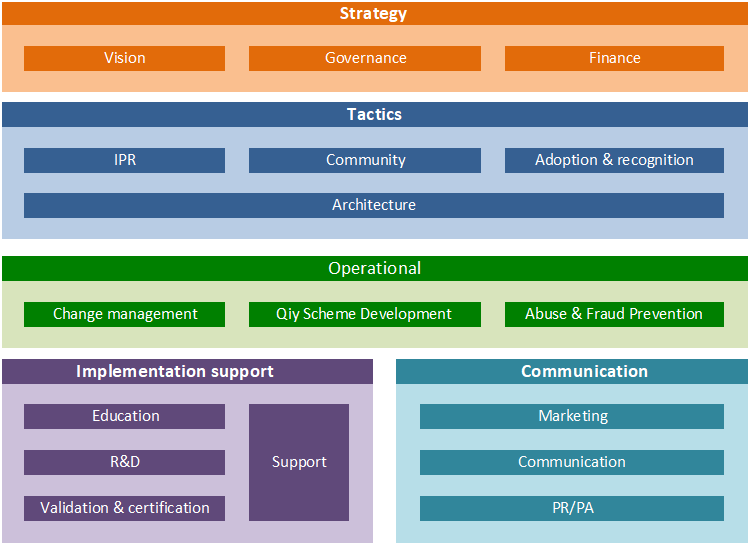
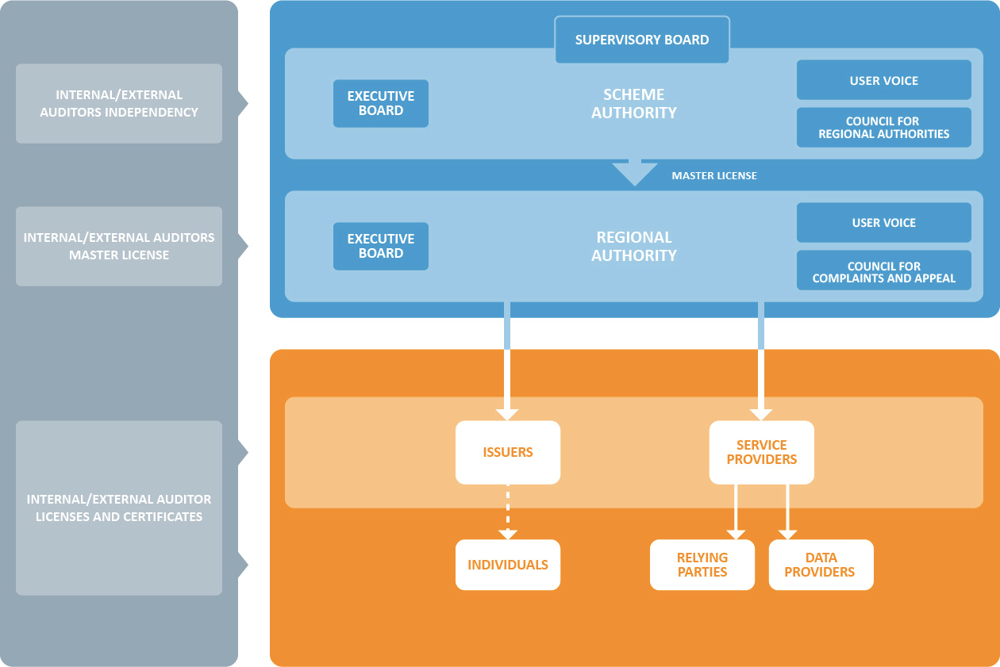

# Governance Model 'Qiy Scheme V1.0'

## Abstract
The Qiy Scheme defines a framework for individual users, companies and governmental organisations to safely control and exchange personal information. This document describes the way the Qiy Scheme is organised, managed and governed.

# Content

1. [Qiy Scheme](#1-qiy-scheme)
	1. [Qiy Foundation](#11-qiy-foundation)
		1. [Vision](#vision)
		1. [Mission](#mission)
	1. [Qiy Scheme](#12-qiy-scheme)
		1. [Rules and Regulations ](#121-rules-and-regulations-)
		1. [Qiy Standard](#122-qiy-standard)
1. [Governance Model](#2-governance-model)
	1. [Context Governance Model](#21-context-governance-model)
	1. [Governance Model](#22-governance-model)
		1. [The legislative branch](#221-the-legislative-branch)
		1. [The executive branch](#222-the-executive-branch)
		1. [The judiciary branch](#223-the-judiciary-branch)
1. [Scheme Authority](#3-scheme-authority)
	1. [Structure](#31-structure)
		1. [Supervisory Board](#311-supervisory-board)
		1. [Executive Board](#312-executive-board)
	1. [Products and services](#32-products-and-services)
		1. [The development and maintenance of the Qiy Scheme](#321-the-development-and-maintenance-of-the-qiy-scheme)
		1. [Master License Regional Authorities](#322-master-license-regional-authorities)
		1. [Public relations, public affairs, spokesperson, brand promotion](#323-public-relations,-public-affairs,-spokesperson,-brand-promotion)
1. [Regional Authority](#4-regional-authority)
	1. [Structure](#41-structure)
	1. [Products & services Regional Authority](#42-products-&-services-regional-authority)
		1. [Licensing and certification](#421-licensing-and-certification)
		1. [Abuse and Fraud Coordination](#422-abuse-and-fraud-coordination)

# 1 Qiy Scheme
This document describes the way the Qiy Scheme is intended to be organised, managed and governed. In a nutshell, the Qiy Scheme will be managed through an independent (international) organisation, called the Scheme Authority. At the national or regional level, a so-called Regional Authority will be responsible for the implementation of the Scheme in the relevant geographical market. At all times the independence of the Scheme Authority and its geographical 'branches' shall be warranted. Also, at all times the Scheme in its implementation shall be open and non-discriminatory. To ensure this, appropriate audits and sanctions will be in place in each of the geographical regions and at the international level. 

## 1.1 Qiy Foundation

### Vision
The vision of Qiy Foundation is that the position of man in the digital world should be equal to the position of man in the physical world. Human values and acting in accordance with the human dimensions are important principles.

### Mission
The Qiy Foundation's mission is to give people control over their data and facilitate them to do smart things with it. This applies to data they produce themselves and data that is available from third parties.

The vision and mission have led to the Qiy Scheme, which is administered by the Qiy Foundation. Qiy Trust Framework is the open standard infrastructure based on the rules and regulations of the Qiy Scheme. Issuers and Service Providers create and offer the Qiy Trust Framework and auxiliary services to the market under a license of the Qiy Foundation. At the core of the Qiy Trust Framework are privacy, data security and the individual in control of his or her personal data.

The Qiy Foundation has outsourced or otherwise removed all activities, which are not required for or essential to the development and maintenance of the Qiy Scheme, whilst ensuring that all activities and assets related to the Qiy Scheme (Rules and Regulations and the Qiy Standard) remain inside and under the control of the Scheme Authority. This means that the development of implementations on the basis of the Qiy Scheme is left to market parties.

## 1.2 Qiy Scheme
The Qiy Scheme is an open standard and a set of technical, operational and business rules and agreements which fosters interoperability between the interconnected persons, organisations and devices which enables the exchange of data between Data Providers, Individuals and Relying Parties under the control and with the consent of the Individual. The Qiy Scheme forms the basis of the Qiy Trust Framework, the technical infrastructure which is based on an open standard and which respects the rules and regulations of the Qiy Scheme. The Qiy Trust Framework makes it possible to exchange between individuals, organisations and devices in a safe and secure manner, personal data to which an Individual can connect on the basis of the Qiy Scheme. The Qiy Scheme regulates issues such as, functionality, security, reliability levels, access criteria, communication, liabilities and availability. Market parties, which respect the requirements of the Qiy Scheme, may offer the Qiy Trust Framework as a service.

### 1.2.1 Rules and Regulations 

The Rules & Regulations, hereafter R&R, are intended to create a level playing field for all those parties wishing to make use of the Qiy Trust Framework.

Thus, the R&R must be transparent and non-discriminatory and applicable to all players participating in the Scheme. The requirements laid down in the R&R, are to be compiled according to a system of roles, with each role corresponding to a specific activity in the Qiy Trust Framework.

Parties, which meet the requirements of the Qiy Scheme, may qualify for a license to operate on the basis of the Qiy Scheme and offer Qiy Trust Framework services. The Scheme Authority, as the owner of the Scheme, will delegate the issuing of these licenses to the Regional Authority via a so-called 'Master license'.

### 1.2.2 Qiy Standard
The Qiy Standard is a normative specification describing features that are mandatory and optional for implementations claiming conformance to the Qiy Standard V 1.0. The Standard also specifies the entire set of documents comprising V 1.0.

Overview and Specification of Qiy Standard V 1.0:
* Conformance requirements for the Qiy standard V 1.0
* Qiy Node, interfaces and protocols for the Qiy Standard V 1.0
* Security and Privacy Considerations for the Qiy Scheme V 1.0
* Glossary to clarify the meanings of the specification for the Qiy Standard V 1.0
* Technical overview Qiy Standard V 1.0
* Controlled artifacts (e.g. software packages) for conformance testing. To aid conformance testing to the standard, test procedures, tooling and setups will be developed and maintained by the Scheme Authority. This does not include any software other than software required to facilitate conformance tests (model implementation).

# 2 Governance Model
## 2.1 Context Governance Model
The overall development- and management model for the Qiy Scheme consists of several elements: the model is divided in strategic, tactical and operational parts, together with elements relating to implementation support and communication.
 

Figure 1: Global view on governance model

## 2.2 Governance Model
The characteristics of the Governance Model must support the vision and the mission of the Qiy Foundation to put people in the center of a trust framework so that they can access and control their personal data. 

The model is built on the concept of the Trias Politica: the division of powers into three branches, each with separate and independent powers and areas of responsibility so that the powers of one branch are not in conflict with the powers associated with the other branches. The typical division of these three branches is into a 'legislative', an 'executive', and a 'judiciary' branch.

Figure 2: Governance model Qiy Scheme

### 2.2.1 The legislative branch
The rules of the Qiy Scheme are developed and enforced by an independent and formal body, the Scheme Authority. The Scheme Authority must be independent to ensure integrity and in order to create a favorable environment in which the Qiy Trust Framework can be further developed and managed. The Supervisory Board of the Scheme Authority should warrant and safeguard the legitimate interests of all users of the Qiy Scheme and promote competition between the parties which operate on the basis of the Qiy Scheme. The Scheme Authority sets the licensing conditions for the Regional Authorities and monitors compliance with those licensing conditions. The Qiy Foundation fulfills the role of Scheme Authority.

Regional Authorities represent the Scheme Authority in their country, based on a Master license provided by the Scheme Authority. Regional Authorities must adhere to the overall Scheme. This implies among others that there will be open access based on transparent criteria for all parties who want to operate on the basis of the Qiy Scheme. 

### 2.2.2 The executive branch
The Qiy Scheme distinguishes four generic business roles for the delivery of specific services within the Qiy Trust Framework: Issuers, Service Providers, Data Providers and Relying Parties. Each private or public entity operating on the basis of the Qiy Scheme can assume one or more of these roles. Issuers offer services to the individuals who want to connect to the Qiy Trust Framework. Service Providers do the same for organisations (i.e., Relying Parties and Data Providers), which want to operate on the basis of the Qiy Scheme.

### 2.2.3 The judiciary branch
The Qiy Scheme is administered by the Scheme Authority. The Scheme Authority is responsible for defining and managing the requirements, which are associated with the different roles that are specified in the Qiy Scheme. The Rules & Regulations, together with the Qiy Standard itself, are part of the Qiy Scheme. The Rules & Regulations define the different roles in more detail and provide a regulatory framework for the activities of users of the Qiy Scheme. In a Master license the Scheme Authority also sets out the licensing requirements, which must be included in licenses which will be issued by Regional Authorities. An independent audit mechanism monitors the behavior of the different parties in the executive branch for compliance with the Rules & Regulations. On the basis of a similar mechanism compliance by the Qiy Foundation with the Rules & Regulations is monitored.

# 3 Scheme Authority
The Scheme Authority sets the standards, policies and carries out the management of the Qiy Scheme. Scheme Authority is responsible for defining and managing requirements for the different roles that are recognized in the Qiy Scheme. This includes the process of preparing changes to the Scheme and organises structured decision-making. 

## 3.1 Structure
This paragraph describes the separation between substantive activities in the executive organisation of the Scheme Authority and decision-making.

### 3.1.1 Supervisory Board
The Supervisory Board has a duty to supervise the policy of the Executive Board of the Scheme Authority and the general affairs within Scheme Authority. The Supervisory Board shall: 
* Supervise the policy of the Executive Board of the Scheme Authority and the general affairs within Scheme Authority.
* Supervise and monitor the achievement of the objectives of the Scheme Authority;
* Supervise and monitor the strategy and risks inherent in business activities;
* Monitor and verify the design and operation of the risk management and control systems;
* Warrant and safeguard the legitimate interests of all users of the Qiy Scheme and promote competition between the parties which operate on the basis of the Qiy Scheme;
* Advise the Executive Board upon request or at its own initiative on all issues it deems fit.

The Supervisory Board shall initially be composed of three (3) board members. Additional members shall be added over time according to the needs of the organisation.

### 3.1.2 Executive Board
The Executive Board runs the Scheme Authority on a day-to-day basis. The Executive Board is responsible for:
* Issuing a Master license to Regional Authorities;
* Monitoring compliance with the terms set and the possible imposition of penalties, other sanctions and/or remedies for non-compliance or violation;
* The development and maintenance of the Scheme (Rules and Regulations and the Standard). A process will be defined how to ensure an appropriate change management process for the Qiy Scheme, involving all interested parties.

## 3.2 Products and services
The following 'products and services' are developed and maintained by the Scheme Authority:
* The Scheme(R&R and Qiy Standard) development and maintenance
* Stakeholder engagement (Regional Authorities, Participants and Users)
* Master license Regional Authorities
* Intellectual property of the Scheme
* Antitrust guidelines
* Model implementation
* Research and center for expertise
* Public relations, public affairs, spokesperson, brand promotion

### 3.2.1 The development and maintenance of the Qiy Scheme
In the context of developing the Qiy Scheme, all participants are allowed to submit change requests. The proposed change requests should outline the background and rationale for the change, determine which parts of the Qiy Scheme are affected and which parties are involved (impact analysis).

### 3.2.2 Master License Regional Authorities
The Master License gives the operational responsibility for the Qiy Trust Framework to the Qiy Regional Authority. It permits the Regional Authority to license, under the Rules and Regulations of the Scheme Authority, Issuers and Service providers at the Regional level. 

The Regional Authority works on Regional stakeholder engagement and performs Regional marketing, communication and PR/PA tasks.
The Master license will impose requirements on the Regional Authority regarding financing, staff, etc. in the interest of the overall Scheme. 

### 3.2.3 Public relations, public affairs, spokesperson, brand promotion
The general public and specific interest groups need general information on how to use Qiy as a framework. The Scheme Authority is proactive in providing information and keeping a dialogue with all stakeholders. Similarly, Qiy is marketed as reliable, easy and efficient.

# 4 Regional Authority
## 4.1 Structure
The optimal organisational structure of the Regional Authority will very much be linked to the scope of the relevant geographical market/regional customs/regional legal framework.

## 4.2 Products & services Regional Authority
The Regional Authority's areas of responsibility are:
* To organise Regional stakeholder engagement
* To license Regional Issuers and Service providers 
* To ensure compliance (audits)
* To ensure an independent complaints and appeal process for licensees
* To establish an information and consultation mechanism on the further development of the Scheme

### 4.2.1 Licensing and certification
Parties wishing to offer services in one (or more) of the roles defined by the Scheme must satisfy the conditions imposed by the Scheme Authority for the role(s) concerned. This may include requirements regarding the organisation itself and its business processes. If a dispute arises, arbitration is mandatory through an independent Council for Complaints and Appeal.

### 4.2.2 Abuse and Fraud Coordination
The Scheme Authority must ensure the integrity and reliability of the overall Qiy Trust Framework. To do so the Scheme Authority must work closely together with all stakeholders, must be alert and must provide leadership in the joint fight against fraud. Regional Authorities have an important role to play in the signaling and prevention of abuse and/or fraud and must work together/collaborate with the Scheme Authority where necessary.

