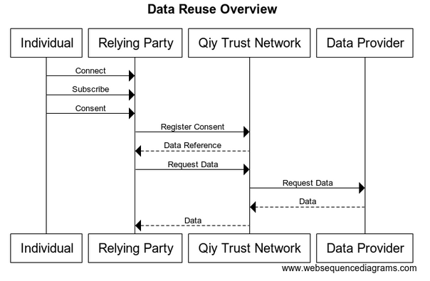
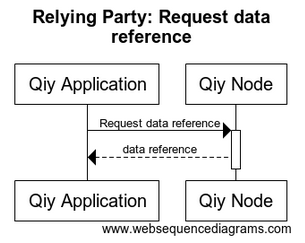

# High-Level Architectural Overview


# Abstract

This document is produced by the [Work Stream Functionality & Technology](Definitions.md#work-stream-functionality--technology) and describes the functional, technical, privacy, security, legal and/or compliancy aspects of Qiy.


# Contents


1. [Introduction](#1-introduction)
	1. [Purpose](#11-purpose)
	1. [Readers' Guidance](#12-readers-guidance)
1. [Overview](#2-overview)
	1. [Data Reuse](#21-data-reuse)
		1. [Privacy concern](#211-privacy-concern)
1. [Architectural Description](#3-architectural-description)
	1. [Architectural Layers](#31-architectural-layers)
	1. [Privacy](#32-privacy)
	1. [Security](#33-security)
	1. [Interoperability](#34-interoperability)
	1. [Governance](#35-governance)
	1. [Compliancy](#36-compliancy)
1. [The User Layer](#4-the-user-layer)
	1. [Qiy Users](#41-qiy-users)
	1. [Service Provider](#42-service-provider)
	1. [Qiy Node](#43-qiy-node)
	1. [Persistent Id](#44-persistent-id)
	1. [Connect via Qiy](#45-connect-via-qiy)
	1. [Setup](#46-setup)
		1. [Relying Party](#461-relying-party)
		1. [Data Provider](#462-data-provider)
		1. [Individual](#463-individual)
	1. [Subscribe](#47-subscribe)
	1. [Consent](#48-consent)
	1. [Routing](#49-routing)
	1. [Source](#410-source)
	1. [Session](#411-session)
1. [The Application Layer](#5-the-application-layer)
	1. [Qiy Application](#51-qiy-application)
		1. [Qiy Application Protocol](#511-qiy-application-protocol)
		1. [Creating Qiy Nodes for Individuals](#512-creating-qiy-nodes-for-individuals)
			1. [Security consideration](#5121-security-consideration)
		1. [Link with an existing Qiy Node](#513-link-with-an-existing-qiy-node)
	1. [Connect](#52-connect)
		1. [Application Connect Token](#521-application-connect-token)
		1. [Proposer: Connect](#522-proposer-connect)
		1. [Generate Application Connect Token](#523-generate-application-connect-token)
		1. [Accepter: Connect](#524-accepter-connect)
	1. [Consent](#53-consent)
		1. [Relying Party: Request consent](#531-relying-party-request-consent)
		1. [Individual: Consider consent request](#532-individual-consider-consent-request)
	1. [Service Discovery](#54-service-discovery)
	1. [Data by Reference](#55-data-by-reference)
		1. [Service by Reference](#551-service-by-reference)
		1. [Request data reference](#552-request-data-reference)
		1. [Create reference](#553-create-reference)
		1. [Request data](#554-request-data)
		1. [Provide data](#555-provide-data)
1. [The Qiy Node Layer](#6-the-qiy-node-layer)
	1. [Access Provider](#61-access-provider)
		1. [Portability](#611-portability)
	1. [Qiy Node](#62-qiy-node)
		1. [Qiy Node Protocol](#621-qiy-node-protocol)
		1. [Qiy Node API](#622-qiy-node-api)
		1. [Qiy Node Implementation](#623-qiy-node-implementation)
		1. [Qiy Node Instantiation](#624-qiy-node-instantiation)
		1. [Deleting a Qiy Node](#625-deleting-a-qiy-node)
	1. [Connect](#63-connect)
		1. [Connection Uri](#631-connection-uri)
			1. [Security concern](#6311-security-concern)
		1. [Connect Token](#632-connect-token)
			1. [Security concern](#6321-security-concern)
			1. [Creating a Connect Token](#6322-creating-a-connect-token)
			1. [Creating a Transport Connect Token](#6323-creating-a-transport-connect-token)
		1. [Connecting](#633-connecting)
		1. [Deleting a Connection](#634-deleting-a-connection)
	1. [Consent](#64-consent)
		1. [Consent Uri](#641-consent-uri)
		1. [Consent Service Descriptor](#642-consent-service-descriptor)
		1. [Consent Data Descriptor](#643-consent-data-descriptor)
			1. [Privacy concern](#6431-privacy-concern)
	1. [Qiy Node Request](#65-qiy-node-request)
	1. [Qiy Node Message](#66-qiy-node-message)
	1. [Qiy Node Event](#67-qiy-node-event)
1. [The Service Layer](#7-the-service-layer)
	1. [Access Provider](#71-access-provider)
		1. [Portability](#711-portability)
	1. [Service](#72-service)
	1. [Service Endpoints](#73-service-endpoints)
	1. [Service Library](#74-service-library)
	1. [Consent Service](#75-consent-service)
1. [The Transport Layer](#8-the-transport-layer)
	1. [Access Provider](#81-access-provider)
		1. [Portability](#811-portability)
	1. [Transporter](#82-transporter)
	1. [Transport Protocol](#83-transport-protocol)
	1. [Transporter API](#84-transporter-api)
	1. [Transporter Implementation](#85-transporter-implementation)
	1. [Transporter Instantiation](#86-transporter-instantiation)
	1. [Deleting a Transporter](#87-deleting-a-transporter)
	1. [Path](#88-path)
		1. [Path Creation](#881-path-creation)
		1. [Deleting a Path](#882-deleting-a-path)
1. [The Carrier Layer](#9-the-carrier-layer)
	1. [Access Provider](#91-access-provider)
		1. [Portability](#911-portability)
	1. [Carrier](#92-carrier)
	1. [Carrier Protocol](#93-carrier-protocol)
	1. [Carrier API](#94-carrier-api)
	1. [Carrier Implementation](#95-carrier-implementation)
	1. [Carrier Node](#96-carrier-node)
1. [Diagram sources](#10-diagram-sources)
	1. [User Layer](#101-user-layer)
		1. [Data Reuse Overview](#1011-data-reuse-overview)
		1. [Connect](#1012-connect)
			1. [Users Connect](#10121-users-connect)
	1. [Application Layer](#102-application-layer)
		1. [Connect](#1021-connect)
			1. [Proposer: Connect](#10211-proposer-connect)
			1. [Generate Application Connect Token](#10212-generate-application-connect-token)
			1. [Accepter: Connect](#10213-accepter-connect)
		1. [Consent](#1022-consent)
			1. [Relying Party: Request Consent](#10221-relying-party-request-consent)
			1. [Individual: Consider consent request](#10222-individual-consider-consent-request)
		1. [Request data](#1023-request-data)
			1. [Relying Party: Request Data Reference](#10231-relying-party-request-data-reference)
			1. [Relying Party: Request Data](#10232-relying-party-request-data)
			1. [Data Provider: Provide Data](#10233-data-provider-provide-data)

# 1 Introduction
Qiy, or rather: the [Qiy Scheme](Definitions.md#qiy-scheme), puts people back in control of their [Personal Data](Definitions.md#personal-data) while creating value for organizations that process it ([Relying Parties](Definitions.md#relying-party)).


## 1.1 Purpose

The document is aimed at people who know that Qiy puts people back in control of their [Personal Data](Definitions.md#personal-data), but who want or need to know the functional, technical, privacy, security, legal and/or compliancy aspects of Qiy.

## 1.2 Readers' Guidance

* [Access Providers](Definitions.md#access-provider) are advised to read chapter [3 Architectural Description](#3-architectural-description), sections [4.6.1 Setup](#461-setup) (for [Relying Parties](Definitions.md#relying-party)) [4.6.2 Setup](#462-setup) (for [Data Providers](Definitions.md#data-provider)) and the sections named 'Access Provider' in chapters [6 The Qiy Node Layer](#61-access-provider), [7 The Service Layer](#71-access-provider), [8 The Transport Layer](#81-access-provider) and [9 The Carrier Layer](#91-access-provider).
* Data analysts are advised to read chapters [3 Architectural Description](#3-architectural-description), [4.6 Setup](#46-setup) and [7 The Service Layer](#7-the-service-layer).
* Enterprise architects are advised to read chapter [3 Architectural Description](#3-architectural-description).
* Information analysts are advised to read chapters [3 Architectural Description](#3-architectural-description), [4 The User Layer](#4-the-user-layer) and [5 The Application Layer](#5-the-application-layer).
* Legal experts are advised to read chapter [3 Architectural Description](#3-architectural-description).
* Network engineers are advised to read chapters [3 Architectural Description](#3-architectural-description), [8 The Transport Layer](#8-the-transport-layer) and [9 The Carrier Layer](#9-the-carrier-layer).
* Privacy experts are advised to read chapter [3 Architectural Description](#3-architectural-description).
* Security officers are advised to read chapter [3 Architectural Description](#3-architectural-description).
* Service managers are advised to read chapter [3 Architectural Description](#3-architectural-description) and [4.6 Setup](#46-setup).
* Software engineers are advised to read chapters [3 Architectural Description](#3-architectural-description), [4 The User Layer](#4-the-user-layer), [5 The Application Layer](#5-the-application-layer) and [6 The Qiy Node Layer](#6-the-qiy-node-layer).
* System engineers are advised to read chapters [3 Architectural Description](#3-architectural-description), [8 The Transport Layer](#8-the-transport-layer) and [9 The Carrier Layer](#9-the-carrier-layer).

# 2 Overview

This chapter gives an overview of this document.
* [2.1 Data Reuse](#21-data-reuse) describes how [Data](Definitions.md#data) can be reused with Qiy.
* [3 Architectural Description](#3-architectural-description) describes the [Architectural Layers](Definitions.md#architectural-layers) and addresses various concerns like privacy and security.
* [4 The User Layer](#4-the-user-layer) describes the setup and processes of the data reuse scenario at the [User](Definitions.md#user) level.
* [5 The Application Layer](#5-the-application-layer) describes the processes at the application level.
* [6 The Qiy Node Layer](#6-the-qiy-node-layer) describes the same at the [Qiy Node](Definitions.md#qiy-node) level.
* [7 The Service Layer](#7-the-service-layer) describes the [Service Layer](Definitions.md#service-layer) support.
* [8 The Transport Layer](#8-the-transport-layer) describes the [Transport Layer](Definitions.md#transport-layer) support.
* [9 The Carrier Layer](#9-the-carrier-layer) describes the [Carrier Layer](Definitions.md#carrier-layer) support.
* [10 Diagram sources](#10-diagram-sources) contains the source code that has been used to generate the diagrams in this document.

## 2.1 Data Reuse

This chapter introduces a typical data reuse scenario which is elaborated in the [Functional Specification](Definitions.md#functional-specification).


In this scenario a [Data Subject](Definitions.md#data-subject) ([Individual](Definitions.md#individual)) reuses his [Personal Data](Definitions.md#personal-data) stored at one organization ([Data Provider](Definitions.md#data-provider)) and provides it to another organization ([Relying Party](Definitions.md#relying-party)) to consume one of its [Services](Definitions.md#service). This goes as follows:
* The [Individual](Definitions.md#individual) connects with a [Relying Party](Definitions.md#relying-party), see [Functional Specification: section 4.3](Functional%20Specification.md#43-connect-with-relying-party).
* The [Individual](Definitions.md#individual) subscribes to one of the [Services](Definitions.md#service) and grants the use of his [Personal Data](Definitions.md#personal-data), see [Functional Specification: section 5.3](Functional%20Specification.md#53-data-reuse).
* The [Relying Party](Definitions.md#relying-party) registers the [Consent](Definitions.md#consent) with the [Qiy Trust Network](Definitions.md#qiy-trust-network) which provides the [Relying Party](Definitions.md#relying-party) with a [Data Reference](Definitions.md#data-reference) to acquire the data, see [Functional Specification: section 5.3](Functional%20Specification.md#53-data-reuse).
* The [Relying Party](Definitions.md#relying-party) asks the [Qiy Trust Network](Definitions.md#qiy-trust-network) to resolve the [Data Reference](Definitions.md#data-reference), see [Functional Specification: section 5.3](Functional%20Specification.md#53-data-reuse).
* The [Qiy Trust Network](Definitions.md#qiy-trust-network) acquires the [Data](Definitions.md#data) from the [Data Provider](Definitions.md#data-provider) and returns it to the [Relying Party](Definitions.md#relying-party), see [Functional Specification: chapter 8](Functional%20Specification.md#8-data-reuse).



(Diagram source code: [10.1.1 Data Reuse Overview](#1011-data-reuse-overview))


### 2.1.1 Privacy concern

The data reuse scenario shows that the [Data](Definitions.md#data) is transferred to the [Relying Party](Definitions.md#relying-party) by choice of the [Individual](Definitions.md#individual).
This breaks the chain of responsibility for the [Data Provider](Definitions.md#data-provider); the responsibility for correct processing of the [Data](Definitions.md#data) does not extend to any processing that takes place after the handover to the [Individual](Definitions.md#individual). 

# 3 Architectural Description

This chapter describes the major entities of Qiy and their relations with the help of the [Architectural Layers](Definitions.md#architectural-layers) of the [Qiy Scheme](Definitions.md#qiy-scheme) and addresses how Qiy addresses concerns like security and privacy.

## 3.1 Architectural Layers
The realization of the scenario is described using the following layers:


## 3.2 Privacy

Qiy has been conceived with the aim to put people back in control of their [Personal Data](Definitions.md#personal-data), hence making privacy the primary concern of Qiy.
The aim has been elaborated in a set of principles called the [Qiy Trust Principles](Definitions.md#qiy-trust-principles) and technical, legal and governance rules, all of which are maintained by the [Qiy Foundation](Definitions.md#qiy-foundation) and the [Qiy Foundation Members](Definitions.md#qiy-foundation-member).

The realization of the data reuse as described in this document demonstrates that a natural person ([Individual](Definitions.md#individual)) is in control:
* The [Individual](Definitions.md#individual) can securily exchange [Data](Definitions.md#data) and/or messages with another person or organization ([Qiy User](Definitions.md#qiy-user)) via Qiy, using [Connections](Definitions.md#connection), see [4 The User Layer](#4-the-user-layer).
* The [Individual](Definitions.md#individual) controls what [Qiy Users](Definitions.md#qiy-user) he connects with and, in principle, when he wants to end it.
* When an [Individual](Definitions.md#individual) connects with a [Qiy User](Definitions.md#qiy-user) that is providing a [Service](Definitions.md#service) via Qiy ([Service Provider](Definitions.md#service-provider)), the [Individual](Definitions.md#individual) is provided with the [Identity](Definitions.md#identity) of the latter, but not the other way around.
* The [Individual](Definitions.md#individual) can access his [Personal Data](Definitions.md#personal-data) that is kept by another [Qiy User](Definitions.md#qiy-user) ([Data Provider](Definitions.md#data-provider)) as a result of the [Access Principle](Definitions.md#access-principle), one of the [Qiy Trust Principles](Definitions.md#qiy-trust-principles).
* The [Individual](Definitions.md#individual) controls what [Data](Definitions.md#data) he shares with what [Service Provider](Definitions.md#service-provider) ([Relying Party](Definitions.md#relying-party)) and under what terms using proveable [Consents](Definitions.md#consent).
* The [Data Provider](Definitions.md#data-provider) knows what [Data](Definitions.md#data) is obtained by (or in name of) an [Individual](Definitions.md#individual), but he does not know whether the [Data](Definitions.md#data) is shared and if so, with what [Relying Parties](Definitions.md#relying-party).
* [Relying Parties](Definitions.md#relying-party) however know the [Data Provider](Definitions.md#data-provider) of shared [Data](Definitions.md#data) and can use this information to assess the trustworthiness of the [Data](Definitions.md#data) and/or to verify the validity of the [Data](Definitions.md#data).
* [Qiy Users](Definitions.md#qiy-user) use applications that are authorized for use with Qiy ([Qiy Applications](Definitions.md#qiy-application)).
* Access to Qiy, data exchange via Qiy, [Consent Services](Definitions.md#consent-service) and if needed [Qiy Nodes](Definitions.md#qiy-node) are provided by [Access Providers](Definitions.md#access-provider).


All parties involved are bound by the rules of the [Qiy Scheme](Definitions.md#qiy-scheme):
* [Service Providers](Definitions.md#service-provider) are bound by the [Binding Individual Rights](Definitions.md#binding-individual-right) and the [Binding Principles for Relying Parties and Data Providers](Definitions.md#binding-principles-for-relying-parties-and-data-provider).
* [Access Providers](Definitions.md#access-provider) are bound by the [License Agreement Access Provider](Definitions.md#license-agreement-access-provider).

## 3.3 Security

As described above, privacy is at the heart of Qiy and security being a 'conditio sine qua no' for this, it is also addressed by the rules of the [Qiy Scheme](Definitions.md#qiy-scheme).

## 3.4 Interoperability

An [Individual](Definitions.md#individual) can only control his [Personal Data](Definitions.md#personal-data), when all concerned systems are interoperable.
This is achieved as follows:
* Applications exchange [Data](Definitions.md#data) and/or messages via Qiy using open standards of the [Qiy Scheme](Definitions.md#qiy-scheme) ([Qiy Open Standard](Definitions.md#qiy-open-standard)).
* Applications exchange self-describing [Data](Definitions.md#data) and/or messages using [Data Descriptions](Definitions.md#data-description) which are available to all concerned parties (via the [Service Library](Definitions.md#service-library)).

## 3.5 Governance

The governance rules are laid down in the [Governance Model for the Qiy Scheme](Definitions.md#governance-model-for-the-qiy-scheme), one of the documents of the [Qiy Scheme Rulebook](Definitions.md#qiy-scheme-rulebook).

## 3.6 Compliancy

The compliancy rules for [Service Providers](Definitions.md#service-provider) can be found in the [Binding Principles for Relying Parties and Data Providers](Definitions.md#binding-principles-for-relying-parties-and-data-provider), one of the documents of the [Qiy Scheme Rulebook](Definitions.md#qiy-scheme-rulebook).


# 4 The User Layer
This chapter describes the [User Layer](Definitions.md#user-layer) and the interaction between the [Relying Party](Definitions.md#relying-party), [Individual](Definitions.md#individual), [Data Provider](Definitions.md#data-provider) and the lower layers.

## 4.1 Qiy Users
The organizations and/or persons using Qiy are called [Qiy Users](Definitions.md#qiy-user). They can use Qiy in different [Roles](Definitions.md#role); they can use Qiy as a [Relying Party](Definitions.md#relying-party), [Individual](Definitions.md#individual), [Data Provider](Definitions.md#data-provider) or a combination of these.
A business for example will generally use Qiy both as a [Relying Party](Definitions.md#relying-party) (for offering [Services](Definitions.md#service) using reliable [Personal Data](Definitions.md#personal-data)) and as a [Data Provider](Definitions.md#data-provider) (as a source of [Personal Data](Definitions.md#personal-data)).
As for natural persons, most of these will use Qiy as an [Individual](Definitions.md#individual) to control their [Personal Data](Definitions.md#personal-data).

## 4.2 Service Provider
A [Qiy User](Definitions.md#qiy-user) that provides one or more [Services](Definitions.md#service) via Qiy is said to be a (or act in the [Business Role](Definitions.md#business-role) of) [Service Provider](Definitions.md#service-provider).
Any [Qiy User](Definitions.md#qiy-user) acting in one or both of the [Roles](Definitions.md#role) [Relying Party](Definitions.md#relying-party) or [Data Provider](Definitions.md#data-provider) is a [Service Provider](Definitions.md#service-provider).

## 4.3 Qiy Node
A [Qiy User](Definitions.md#qiy-user) must have a [Qiy Node](Definitions.md#qiy-node). 
[Service Providers](Definitions.md#service-provider) can acquire one from an [Access Provider](Definitions.md#access-provider).
[Individuals](Definitions.md#individual) obtain a [Qiy Node](Definitions.md#qiy-node) the first time they use a [Qiy Application](Definitions.md#qiy-application).
Alternatively, [Qiy Users](Definitions.md#qiy-user) may instantiate a [Qiy Node](Definitions.md#qiy-node) themselves using a [Qiy Node Implementation](Definitions.md#qiy-node-implementation) and register it with an [Access Provider](Definitions.md#access-provider).

## 4.4 Persistent Id

The [Persistent Id](Definitions.md#persistent-id) is an identifier for a [Connection](Definitions.md#connection) which is created by the [Qiy Trust Network](Definitions.md#qiy-trust-network) and communicated to both the [Accepter](Definitions.md#accepter) and the [Proposer](Definitions.md#proposer) which can be used between these two as a [Pseudo Id](Definitions.md#pseudo-id), but with the following constraints:
* The [Persistent Id](Definitions.md#persistent-id) is the same for both the [Accepter](Definitions.md#accepter) and the [Proposer](Definitions.md#proposer).
* The [Persistent Id](Definitions.md#persistent-id) is only known by the [Accepter](Definitions.md#accepter) and the [Proposer](Definitions.md#proposer) and can not be used outside this scope.

## 4.5 Connect via Qiy

Two [Qiy Users](Definitions.md#qiy-user) can connect via Qiy by creating a [Connection](Definitions.md#connection) between their [Qiy Nodes](Definitions.md#qiy-node) ([Connection](Definitions.md#connection)).
This is described in full detail in the [Use Cases](Definitions.md#use-case).

The [Connection](Definitions.md#connection) can be initiated by either of the two [Qiy Users](Definitions.md#qiy-user).
The [Qiy User](Definitions.md#qiy-user) initiating the [Connection](Definitions.md#connection) is called the [Proposer](Definitions.md#proposer), the other one [Accepter](Definitions.md#accepter).
This may go as follows:
* The [Proposer](Definitions.md#proposer) gets a [Connect Token](Definitions.md#connect-token) from the [Qiy Trust Network](Definitions.md#qiy-trust-network).
* The [Proposer](Definitions.md#proposer) creates a [Connect Proposal](Definitions.md#connect-proposal) including the [Connect Token](Definitions.md#connect-token).
* The [Proposer](Definitions.md#proposer) provides it out-of-band to the [Accepter](Definitions.md#accepter), for example by lettre.
* The [Accepter](Definitions.md#accepter) accepts the proposal and extracts the [Connect Token](Definitions.md#connect-token).
* The [Accepter](Definitions.md#accepter) uses it to request the [Qiy Trust Network](Definitions.md#qiy-trust-network) to create a new [Connection](Definitions.md#connection).
* The [Qiy Trust Network](Definitions.md#qiy-trust-network) creates the [Connection](Definitions.md#connection).
* The [Qiy Trust Network](Definitions.md#qiy-trust-network) generates a new [Persistent Id](Definitions.md#persistent-id) and provides it to both the [Accepter](Definitions.md#accepter) and the [Proposer](Definitions.md#proposer).

As stated before, when a [Connection](Definitions.md#connection) is established, the [Identity](Definitions.md#identity) of the [Qiy User](Definitions.md#qiy-user) is provided to the other one if the [Qiy User](Definitions.md#qiy-user) is a [Service Provider](Definitions.md#service-provider). 
This information may be used to reuse a formerly created [Connection](Definitions.md#connection) and delete the new [Connection](Definitions.md#connection).


(Diagram source code: [10.1.2.1 Users Connect](#10121-users-connect))

## 4.6 Setup

This section addresses the setup conditions for the different [Qiy Users](Definitions.md#qiy-users).

### 4.6.1 Relying Party

In order to be able to offer his [Services](Definitions.md#service) via Qiy, a [Relying Party](Definitions.md#relying-party) has met the following preconditions:
* The [Relying Party](Definitions.md#relying-party) has acquired access to Qiy with the help of an [Access Provider](Definitions.md#access-provider).
* The [Access Provider](Definitions.md#access-provider) has verified and registered the [Identity](Definitions.md#identity) of the [Relying Party](Definitions.md#relying-party) for use in Qiy.
* The [Service Library](Definitions.md#service-library) contains the [Service Catalogue](Definitions.md#service-catalogue) of the [Relying Party](Definitions.md#relying-party) defining the provided [Services](Definitions.md#service).
* The [Service Library](Definitions.md#service-library) contains [Service Descriptions](Definitions.md#service-description) for all the provided [Services](Definitions.md#service), which also includes the terms of use, especially with regard to [Personal Data](Definitions.md#personal-data).

### 4.6.2 Data Provider

In order to be able to provide the [Personal Data](Definitions.md#personal-data) via Qiy, a [Data Provider](Definitions.md#data-provider) has met the following preconditions:
* The [Data Provider](Definitions.md#data-provider) has acquired access to Qiy with the help of an [Access Provider](Definitions.md#access-provider).
* The [Access Provider](Definitions.md#access-provider) has verified and registered the [Identity](Definitions.md#identity) of the [Data Provider](Definitions.md#data-provider) for use in Qiy.
* A [Service Endpoint](Definitions.md#service-endpoint) is available to access the [Data](Definitions.md#data).
* The [Service Library](Definitions.md#service-library) contains the [Service Endpoint API](Definitions.md#service-endpoint-api) which describes how the [Data](Definitions.md#data) can be obtained.
* The [Service Library](Definitions.md#service-library) contains [Data Descriptions](Definitions.md#data-description) for the available [Data](Definitions.md#data).
* The [Service Library](Definitions.md#service-library) contains the [Service Catalogue](Definitions.md#service-catalogue) of the [Data Provider](Definitions.md#data-provider) defining the provided [Data Services](Definitions.md#data-service) and the related endpoints.
* The [Service Library](Definitions.md#service-library) contains [Service Descriptions](Definitions.md#service-description) for the provided [Data Services](Definitions.md#data-service).

### 4.6.3 Individual

In order to be able to reuse [Personal Data](Definitions.md#personal-data) via Qiy, an [Individual](Definitions.md#individual) has met the following preconditions:
* The [Individual](Definitions.md#individual) has access to his [Personal Data](Definitions.md#personal-data) stored by one or more [Data Providers](Definitions.md#data-provider).
* The [Individual](Definitions.md#individual) has access to a personal [Qiy Node](Definitions.md#qiy-node).
* The [Individual](Definitions.md#individual) is using a [Qiy Application](Definitions.md#qiy-application) which is linked to his [Qiy Node](Definitions.md#qiy-node).

## 4.7 Subscribe

Data reuse starts with an [Individual](Definitions.md#individual) subscribing to a [Service](Definitions.md#service), but only after considering and accepting the terms of use, including those regarding the use of [Personal Data](Definitions.md#personal-data).
When an [Individual](Definitions.md#individual) subscribes to a [Service](Definitions.md#service), the subscription is registered by the [Qiy Application](Definitions.md#qiy-application), so:
* The subscribed [Service](Definitions.md#service) is recorded using the [Service Portfolio](Definitions.md#service-portfolio) of the [Individual](Definitions.md#individual).
* The record shows:
	* the start datetime of the subscription.
	* the [Service Provider](Definitions.md#service-provider) of the [Service](Definitions.md#service) (the [Relying Party](Definitions.md#relying-party)).
	* what [Service](Definitions.md#service) is provided (using the [Service Library](Definitions.md#service-library)).
	* the related [Consent](Definitions.md#consent).

## 4.8 Consent

When a [Request](Definitions.md#request) for [Data](Definitions.md#data) is received, it is checked with the granted [Consents](Definitions.md#consent). If the [Request](Definitions.md#request) is not authorized by an active granted [Consent](Definitions.md#consent), this may be resolved by granting one, after which the [Data](Definitions.md#data) [Request](Definitions.md#request) is processed.
In other cases, the [Request](Definitions.md#request) will not be accepted and no [Data](Definitions.md#data) will be returned.

## 4.9 Routing

When all related conditions are met, a request for [Data](Definitions.md#data) from a [Relying Party](Definitions.md#relying-party) is processed as follows:
* The [Service Portfolio](Definitions.md#service-portfolio) of the [Individual](Definitions.md#individual) is consulted to find the [Data Provider](Definitions.md#data-provider) or [Data Providers](Definitions.md#data-provider) and related [Service Endpoint API](Definitions.md#service-endpoint-api).
* Using the API, [Requests](Definitions.md#request) are created and used to obtain the [Data](Definitions.md#data) from the [Service Endpoints](Definitions.md#service-endpoint).
* The received [Data](Definitions.md#data) is forwarded to the [Relying Party](Definitions.md#relying-party).

## 4.10 Source

When a [Relying Party](Definitions.md#relying-party) has requested for [Data](Definitions.md#data), the [Service Portfolio](Definitions.md#service-portfolio) is used to look up the [Data](Definitions.md#data) source: the [Service Provider](Definitions.md#service-provider) or [Service Providers](Definitions.md#service-provider) that will provide the [Data](Definitions.md#data) ([Service Source](Definitions.md#service-source)).
This can be the [Individual](Definitions.md#individual) himself, for self-declared [Data](Definitions.md#data), but it can also be one or more [Data Providers](Definitions.md#data-provider).
The source of the [Data](Definitions.md#data) may have been defined before at the time of subscription, but if that it is not the case, the [Individual](Definitions.md#individual) will be asked to make a selection from a list of suitable [Data Providers](Definitions.md#data-provider) ([Service Discovery](Definitions.md#service-discovery)).
The list will be generated using the [Service Catalogues](Definitions.md#service-catalogue) from the [Service Library](Definitions.md#service-library).
The [Service Portfolio](Definitions.md#service-portfolio) will be updated with the outcome.

## 4.11 Session

A [Service Endpoint](Definitions.md#service-endpoint) will only process a [Request](Definitions.md#request) when issued over an active Session. This session may be started earlier, for example when the [Individual](Definitions.md#individual) selects a [Data Provider](Definitions.md#data-provider) as a source, but a new Session will be started if need be.
More often then not, this may require input from the [Individual](Definitions.md#individual).
The session [Credentials](Definitions.md#credential) are persisted in the [Service Portfolio](Definitions.md#service-portfolio) of the [Individual](Definitions.md#individual).

# 5 The Application Layer
This chapter describes the [Application Layer](Definitions.md#application-layer) and how it supports the processes of the data reuse scenario.

## 5.1 Qiy Application
A [Qiy Application](Definitions.md#qiy-application) is an [Application](Definitions.md#application) that uses the [Qiy Trust Network](Definitions.md#qiy-trust-network).
* A [Qiy User](Definitions.md#qiy-user) can only use Qiy with a [Qiy Application](Definitions.md#qiy-application).
* A [Qiy User](Definitions.md#qiy-user) can use one or more [Qiy Applications](Definitions.md#qiy-application).
* Two or more [Qiy Applications](Definitions.md#qiy-application) can concurrently use one and the same [Qiy Node](Definitions.md#qiy-node).

### 5.1.1 Qiy Application Protocol
The [Qiy Application Protocol](Definitions.md#qiy-application-protocol) describes the interactions of the [Qiy Applications](Definitions.md#qiy-application) with eachother and the underlying layers.
* The [Qiy Application Protocol](Definitions.md#qiy-application-protocol) is an open standard and is part of the [Qiy Open Standard](Definitions.md#qiy-open-standard).

The [Qiy Application Protocol](Definitions.md#qiy-application-protocol) describes among others how [Qiy Applications](Definitions.md#qiy-application):
* ... create a [Qiy Node](Definitions.md#qiy-node) for a [Qiy User](Definitions.md#qiy-user).
* ... can be linked to a [Qiy Node](Definitions.md#qiy-node) of a [Qiy User](Definitions.md#qiy-user).
* ... create [Connections](Definitions.md#connection).
* ... create a 'backup' of a [Qiy Node](Definitions.md#qiy-node).
* ... exchange [Connect Tokens](Definitions.md#connect-token) out-of-band.
* ... exchange messages.
* ... exchange [Personal Data](Definitions.md#personal-data).

### 5.1.2 Creating Qiy Nodes for Individuals

A [Qiy Application](Definitions.md#qiy-application) can create a [Qiy Node](Definitions.md#qiy-node) for a [Qiy User](Definitions.md#qiy-user), especially when he does not have one yet.
The [Qiy Application](Definitions.md#qiy-application) can do so with the help of an [Access Provider](Definitions.md#access-provider), but first it has to generate the [Credentials](Definitions.md#credential) for the [Qiy Node](Definitions.md#qiy-node) ([Qiy Node Credentials](Definitions.md#qiy-node-credential)):
* A key pair, consisting of public key and a private key, 
* A [Node Id](Definitions.md#node-id)

The [Qiy Application](Definitions.md#qiy-application) must persists these in order to be able to keep using the [Qiy Node](Definitions.md#qiy-node).

#### 5.1.2.1 Security consideration
Some security considerations related to the [Qiy Node Credentials](Definitions.md#qiy-node-credential) are:
* The [Node Id](Definitions.md#node-id) must be a [Uuid](Definitions.md#uuid) in order to assure that it is unique.
* The key pair must be unique.
* The private key must be persisted securily in order to guarantee the security of the [Qiy User](Definitions.md#qiy-user). 
* The [Node Id](Definitions.md#node-id) should be persisted securily in order to guarantee the security of the [Qiy User](Definitions.md#qiy-user). 
* The [Qiy Applications](Definitions.md#qiy-application) that can be used on consumer devices such as smart phones must provide a way to backup and recover the [Qiy Node Credentials](Definitions.md#qiy-node-credential) in order to overcome cases of loss of the device.
* A [Qiy User](Definitions.md#qiy-user) must be able to control the devices that can access his [Qiy Node](Definitions.md#qiy-node), for example in order to be able to block access of a (possibly) stolen device.


### 5.1.3 Link with an existing Qiy Node
A [Qiy Application](Definitions.md#qiy-application) can be linked to an existing [Qiy Node](Definitions.md#qiy-node) by providing it with its [Qiy Node Credentials](Definitions.md#qiy-node-credential).

## 5.2 Connect

### 5.2.1 Application Connect Token
[Qiy Applications](Definitions.md#qiy-application) exchange [Application Connect Tokens](Definitions.md#application-connect-token) to create [Connections](Definitions.md#connection). 
In addition to the [Connect Token](Definitions.md#connect-token) that is necessary to create the [Connection](Definitions.md#connection), it contains the name (true or not) to be displayed in the [Connect Proposal](Definitions.md#connect-proposal). 
For more information, please refer to [5.2.3 Generate Application Connect Token](#523-generate-application-connect-token).

### 5.2.2 Proposer: Connect
For a [Qiy Application](Definitions.md#qiy-application) of a [Proposer](Definitions.md#proposer), a [Connection](Definitions.md#connection) is established as follows:
* The [Qiy Application](Definitions.md#qiy-application) generates an [Application Connect Token](Definitions.md#application-connect-token), see [5.2.3 Generate Application Connect Token](#523-generate-application-connect-token).
* The [Qiy Application](Definitions.md#qiy-application) composes a [Connect Proposal](Definitions.md#connect-proposal) for the [Proposer](Definitions.md#proposer).
* The [Proposer](Definitions.md#proposer) presents it out-of-band to the [Accepter](Definitions.md#accepter).
* When the [Accepter](Definitions.md#accepter) wants to connect, he uses the [Connect Proposal](Definitions.md#connect-proposal) to create a [Connection](Definitions.md#connection) with his [Qiy Application](Definitions.md#qiy-application), see [5.2.4 Accepter: Connect](#524-accepter-connect).
* The [Proposer](Definitions.md#proposer) detects this by use of polling (using the [Connections Request](Definitions.md#connections-request)) or events (using the [Connection Created Event](Definitions.md#connection-created-event)).
 


(Diagram source code: [10.2.1.1 Proposer: Connect](#10211-proposer-connect))


### 5.2.3 Generate Application Connect Token
The main part of an [Application Connect Token](Definitions.md#application-connect-token) is the [Connect Token](Definitions.md#connect-token). The [Qiy Application](Definitions.md#qiy-application) can create this both online and offline:
* Offline by creating a [Connect Token](Definitions.md#connect-token) and registering it later using a [Connect Token Register Request](Definitions.md#connect-token-register-request).
* Online using a [Connect Token Create Request](Definitions.md#connect-token-create-request).


(Diagram source code: [10.2.1.2 Generate Application Connect Token](#10212-generate-application-connect-token))


### 5.2.4 Accepter: Connect
At the [Accepter](Definitions.md#accepter)-side, a [Qiy Application](Definitions.md#qiy-application) creates a [Connection](Definitions.md#connection) with a [Connect Proposal](Definitions.md#connect-proposal) or [Connect Token](Definitions.md#connect-token) as follows:
* In case of a [Connect Proposal](Definitions.md#connect-proposal), the [Qiy Application](Definitions.md#qiy-application) extracts the [Connect Token](Definitions.md#connect-token) from the [Connect Proposal](Definitions.md#connect-proposal).
* The [Qiy Application](Definitions.md#qiy-application) uses the [Connect Token](Definitions.md#connect-token) in [Connection Create Request](Definitions.md#connection-create-request) to the [Qiy Node](Definitions.md#qiy-node) of the [Qiy User](Definitions.md#qiy-user).
* The [Qiy Node](Definitions.md#qiy-node) creates the [Connection](Definitions.md#connection) and returns the id of the [Connection](Definitions.md#connection) ([Connection Uri](Definitions.md#connection-uri)).


(Diagram source code: [10.2.1.3 Accepter: Connect](#10213-accepter-connect))


## 5.3 Consent

### 5.3.1 Relying Party: Request consent

A [Qiy Application](Definitions.md#qiy-application) of a [Relying Party](Definitions.md#relying-party) can [Request](Definitions.md#request) an [Individual](Definitions.md#individual) for [Consent](Definitions.md#consent) as follows:
* The [Qiy Application](Definitions.md#qiy-application) sends a [Consent Request Message](Definitions.md#consent-request-message) over the [Connection](Definitions.md#connection) with the [Individual](Definitions.md#individual).
* The [Qiy Application](Definitions.md#qiy-application) receives a message with the outcome, either a [Consent Granted Message](Definitions.md#consent-granted-message) or a [Consent Denied Message](Definitions.md#consent-denied-message).


### 5.3.2 Individual: Consider consent request
A [Qiy Application](Definitions.md#qiy-application) of an [Individual](Definitions.md#individual) processes a [Consent Request](Definitions.md#consent-request) as follows:
* The [Qiy Application](Definitions.md#qiy-application) detects receiving a [Consent Request Message](Definitions.md#consent-request-message) by polling (using the [Messages Request](Definitions.md#messages-request)) or with events (using the [Message Received Event](Definitions.md#message-received-event)).
* The [Qiy Application](Definitions.md#qiy-application) extracts the [Consent Request](Definitions.md#consent-request) and presents it to the [Individual](Definitions.md#individual).
* Depending on the choice of the [Individual](Definitions.md#individual), the [Qiy Application](Definitions.md#qiy-application) returns a [Consent Granted Message](Definitions.md#consent-granted-message) or a [Consent Denied Message](Definitions.md#consent-denied-message) using the [Connection](Definitions.md#connection) with the [Relying Party](Definitions.md#relying-party).


(Diagram source code: [10.2.2.2 Individual: Consider consent request](#10222-individual-consider-consent-request))


## 5.4 Service Discovery
A [Qiy Application](Definitions.md#qiy-application) can present an [Individual](Definitions.md#individual) a list of suitable [Data Providers](Definitions.md#data-provider) (or in general [Service Providers](Definitions.md#service-provider)) that can produce some requested [Data](Definitions.md#data) (or [Services](Definitions.md#service)) as follows:
* The [Qiy Application](Definitions.md#qiy-application) asks the [Qiy Node](Definitions.md#qiy-node) of the [Individual](Definitions.md#individual) for a list of suitable [Data Providers](Definitions.md#data-provider) with a [Source Candidates Request](Definitions.md#source-candidates-request).
* The [Qiy Node](Definitions.md#qiy-node) consults the [Service Library](Definitions.md#service-library) and returns the outcome to the [Qiy Application](Definitions.md#qiy-application).
* The [Qiy Application](Definitions.md#qiy-application) presents the result to the [Individual](Definitions.md#individual).
* The [Qiy Application](Definitions.md#qiy-application) registers the selected sources with a [Source Register Request](Definitions.md#source-register-request).

## 5.5 Data by Reference
[Qiy Applications](Definitions.md#qiy-application) exchange [Data by Reference](Definitions.md#data-by-reference) rather then by value.
This goes as follows:
* A [Qiy Application](Definitions.md#qiy-application) [Requests](Definitions.md#request) a [Reference](Definitions.md#reference) for the [Data](Definitions.md#data) ([Data Reference](Definitions.md#data-reference)).
* The [Qiy Application](Definitions.md#qiy-application) receives a [Data Reference](Definitions.md#data-reference).
* The [Qiy Application](Definitions.md#qiy-application) uses the [Data Reference](Definitions.md#data-reference) to acquire the [Data](Definitions.md#data).

### 5.5.1 Service by Reference
In Qiy providing [Data](Definitions.md#data) is viewed as a [Service](Definitions.md#service) and requesting [Data](Definitions.md#data) as an [Operation](Definitions.md#operation) of this [Service](Definitions.md#service), so the 'data by reference'-pattern is implemented as using a [Service by Reference](Definitions.md#service-by-reference)-pattern:
* A [Qiy Application](Definitions.md#qiy-application) [Requests](Definitions.md#request) an [Operation Reference](Definitions.md#operation-reference) using an [Operation Reference Request Message](Definitions.md#operation-reference-request-message).
* An [Operation Reference](Definitions.md#operation-reference) is created by registrating the [Operation Specification](Definitions.md#operation-specification) using an [Operation Register Request](Definitions.md#operation-register-request) and returned using an [Operation Reference Message](Definitions.md#operation-reference-message).
* The [Qiy Application](Definitions.md#qiy-application) can call for the execution of an [Operation](Definitions.md#operation) by submitting the [Operation Reference](Definitions.md#operation-reference) in an [Operation Execute Request](Definitions.md#operation-execute-request).

### 5.5.2 Request data reference
The [Qiy Application](Definitions.md#qiy-application) of a [Relying Party](Definitions.md#relying-party) can [Request](Definitions.md#request) an [Individual](Definitions.md#individual) for a [Data Reference](Definitions.md#data-reference) as follows:
* The [Qiy Application](Definitions.md#qiy-application) sends a [Operation Reference Request Message](Definitions.md#operation-reference-request-message) using the [Connection](Definitions.md#connection) of the [Individual](Definitions.md#individual).
* The [Qiy Application](Definitions.md#qiy-application) receives the [Operation Reference](Definitions.md#operation-reference) in an [Operation Reference Message](Definitions.md#operation-reference-message).




### 5.5.3 Create reference
A [Qiy Application](Definitions.md#qiy-application) can create an [Operation Reference](Definitions.md#operation-reference) using a specification of the [Operation](Definitions.md#operation) ([Operation Specification](Definitions.md#operation-specification)).
This goes as follows:
* The [Qiy Application](Definitions.md#qiy-application) uses the [Operation Specification](Definitions.md#operation-specification) in an [Operation Register Request](Definitions.md#operation-register-request) to the [Qiy Node](Definitions.md#qiy-node) it is linked with.
* The [Qiy Node](Definitions.md#qiy-node) creates the [Operation Reference](Definitions.md#operation-reference) and returns it.

### 5.5.4 Request data
The [Qiy Application](Definitions.md#qiy-application) of a [Relying Party](Definitions.md#relying-party) can obtain [Data](Definitions.md#data) using a [Data Reference](Definitions.md#data-reference) / [Operation Reference](Definitions.md#operation-reference). 
This goes as follows:
* The [Qiy Application](Definitions.md#qiy-application) uses the [Operation Reference](Definitions.md#operation-reference) in a [Operation Execute Request](Definitions.md#operation-execute-request) to its [Qiy Node](Definitions.md#qiy-node).
* The [Qiy Node](Definitions.md#qiy-node) returns the requested [Data](Definitions.md#data).


### 5.5.5 Provide data
The [Data Provider](Definitions.md#data-provider) produces the [Data](Definitions.md#data) using his [Service Endpoint](Definitions.md#service-endpoint).
This does not involve any of the [Qiy Applications](Definitions.md#qiy-application) of the [Data Provider](Definitions.md#data-provider) nor his [Qiy Node](Definitions.md#qiy-node).


# 6 The Qiy Node Layer
This chapter describes the [Qiy Node Layer](Definitions.md#qiy-node-layer) and how it supports the upper layers.

## 6.1 Access Provider
The [Services](Definitions.md#service) of this layer can be provided by an [Access Provider](Definitions.md#access-provider):
* An [Access Provider](Definitions.md#access-provider) can provide [Qiy Nodes](Definitions.md#qiy-node).
* An [Access Provider](Definitions.md#access-provider) can host [Qiy Nodes](Definitions.md#qiy-node).

### 6.1.1 Portability
An [Access Provider](Definitions.md#access-provider) can offer [Qiy Node](Definitions.md#qiy-node)-[Services](Definitions.md#service) to [Qiy Users](Definitions.md#qiy-user), but must enable [Qiy Users](Definitions.md#qiy-user) to easily transfer the [Services](Definitions.md#service) to a different [Access Provider](Definitions.md#access-provider).

## 6.2 Qiy Node
A [Qiy Node](Definitions.md#qiy-node) is a [Technology Service](Definitions.md#technology-service) as defined in [Definitions of the Qiy Scheme](Definitions.md#definitions-of-the-qiy-scheme).
A [Qiy Node](Definitions.md#qiy-node):
* ... must comply with the rules of the [Qiy Scheme](Definitions.md#qiy-scheme).
* ... can be hosted on any host ([Node](Definitions.md#node)).
* ... has its own [Transporter](Definitions.md#transporter) which ensures secure transport of messages and/or [Data](Definitions.md#data) via Qiy.

### 6.2.1 Qiy Node Protocol
The [Qiy Node Protocol](Definitions.md#qiy-node-protocol) describes the interaction between the [Qiy Nodes](Definitions.md#qiy-node) and the underlying layers.
* The [Qiy Node Protocol](Definitions.md#qiy-node-protocol) is one of the protocols in the [Qiy Open Standard](Definitions.md#qiy-open-standard).
The [Qiy Node Protocol](Definitions.md#qiy-node-protocol) describes for example:
* How a [Qiy Node](Definitions.md#qiy-node) is instantiated.
* How [Qiy Nodes](Definitions.md#qiy-node) create [Connections](Definitions.md#connection) and use them to exchange [Data](Definitions.md#data), messages or to provide/consume [Services](Definitions.md#service).

### 6.2.2 Qiy Node API
The [Qiy Node API](Definitions.md#qiy-node-api) is the [Technology Interface](Definitions.md#technology-interface) of the [Qiy Node](Definitions.md#qiy-node), one of the APIs of the [Qiy Open Standard](Definitions.md#qiy-open-standard).
* The [Qiy Node API](Definitions.md#qiy-node-api) is intended for use by [Qiy Applications](Definitions.md#qiy-application).

### 6.2.3 Qiy Node Implementation
A [Qiy Node Implementation](Definitions.md#qiy-node-implementation) is a software package which can be used to realize a [Qiy Node](Definitions.md#qiy-node).
The [Qiy Scheme](Definitions.md#qiy-scheme) puts no limit on the number of [Qiy Node Implementations](Definitions.md#qiy-node-implementation), as long as the implementation complies with the [Qiy Open Standard](Definitions.md#qiy-open-standard) and the rules of the [Qiy Scheme](Definitions.md#qiy-scheme). 

### 6.2.4 Qiy Node Instantiation
A [Qiy Node](Definitions.md#qiy-node) can be created in two ways:
* It can be instantiated by an [Access Provider](Definitions.md#access-provider). The [Access Provider](Definitions.md#access-provider) will instantiate it with its own [Transporter](Definitions.md#transporter). 
* It can be instantiated by a [Qiy User](Definitions.md#qiy-user) on a [Node](Definitions.md#node) of his own using a [Qiy Node Implementation](Definitions.md#qiy-node-implementation). 
When the second option is chosen, the [Qiy User](Definitions.md#qiy-user) is responsible for obtaining a [Transporter](Definitions.md#transporter) and linking it to the [Qiy Node](Definitions.md#qiy-node).

### 6.2.5 Deleting a Qiy Node
In principle, a [Qiy Node](Definitions.md#qiy-node) can be deleted by its owner whenever he wants to do so.
In this case, the [Qiy Node](Definitions.md#qiy-node) will be deleted including persisted [Data](Definitions.md#data), [Connections](Definitions.md#connection) and the linked [Transporter](Definitions.md#transporter).
Related [Consents](Definitions.md#consent) will be withdrawn.

## 6.3 Connect
Two [Qiy Nodes](Definitions.md#qiy-node) can connect by creating a [Path](Definitions.md#path) between themselves.
* A [Qiy Node](Definitions.md#qiy-node) can connect with zero or more other [Qiy Nodes](Definitions.md#qiy-node).
* A [Qiy Node](Definitions.md#qiy-node) can have zero or more [Paths](Definitions.md#path) with any other [Qiy Node](Definitions.md#qiy-node).
* A priori, a [Qiy Node](Definitions.md#qiy-node) does not know the [Identity](Definitions.md#identity) of the [Qiy Node](Definitions.md#qiy-node) at the other side of a [Path](Definitions.md#path).

### 6.3.1 Connection Uri
The [Connection Uri](Definitions.md#connection-uri) is the [Uri](Definitions.md#uri) which identifies a [Connection](Definitions.md#connection) for one of the [Qiy Node](Definitions.md#qiy-node) it connects.
* A [Connection](Definitions.md#connection) has two [Connection Uris](Definitions.md#connection-uri); one for each of the two [Qiy Nodes](Definitions.md#qiy-node) it connects.
* The two [Connection Uris](Definitions.md#connection-uri) of one [Connection](Definitions.md#connection) are not related to one another.
* A priori, a [Qiy Node](Definitions.md#qiy-node) does not know the other [Connection Uri](Definitions.md#connection-uri) of a [Connection](Definitions.md#connection).

EXAMPLE: [Connection Uris](Definitions.md#connection-uri) of a [Connection](Definitions.md#connection) between [Qiy Node](Definitions.md#qiy-node) 1 and [Qiy Node](Definitions.md#qiy-node) 2:

[Qiy Node](Definitions.md#qiy-node) | [Connection Uri](Definitions.md#connection-uri)
---- | --------------
[Qiy Node](Definitions.md#qiy-node) 1	| http://127.0.0.1:8087/[User](Definitions.md#user)/[Connections](Definitions.md#connection)/[User](Definitions.md#user)/usernodeB/93590b55-9194-4cf4-944f-2cbceab7dbcd
[Qiy Node](Definitions.md#qiy-node) 2	| http://127.0.0.1:8087/[User](Definitions.md#user)/[Connections](Definitions.md#connection)/[User](Definitions.md#user)/usernodeA/f96bc541-e98b-449e-bfc5-48ec928e0dc9

#### 6.3.1.1 Security concern
The [Connection Uri](Definitions.md#connection-uri) has only meaning in the context of the [Qiy Node](Definitions.md#qiy-node) that knows it and is useless outside this scope.
For example, the [Uri](Definitions.md#uri) by itself can not be used to exchange a message with the [Qiy Node](Definitions.md#qiy-node) nor any other existing [Qiy Node](Definitions.md#qiy-node).

### 6.3.2 Connect Token
A [Connect Token](Definitions.md#connect-token) is a [Token](Definitions.md#token) which can be used by a [Qiy Application](Definitions.md#qiy-application) to create a [Connection](Definitions.md#connection).
It consists of:
* a temporary secret
* a [Transport Connect Token](Definitions.md#transport-connect-token).

A [Connect Token](Definitions.md#connect-token) has the following properties:
* An expiration setting: Whether the [Token](Definitions.md#token) expires and if so, on what date and time
* A budget: The number of times that the [Token](Definitions.md#token) can be used to create a [Connection](Definitions.md#connection). 

The properties can not only be set when the [Token](Definitions.md#token) is registered or requested, but also later.
For example, it is possible to reactivate a [Connect Token](Definitions.md#connect-token) by increasing the budget or inactivate one by changing the expiration.

#### 6.3.2.1 Security concern
The [Connect Token](Definitions.md#connect-token) can only be used to create a [Connection](Definitions.md#connection) and only so via Qiy, with the help of a [Qiy Application](Definitions.md#qiy-application) and a linked [Qiy Node](Definitions.md#qiy-node).
By itself, it cannot be used for any other purpose, for example gain access to a [Qiy Node](Definitions.md#qiy-node) nor any other parts of the Qiy infrastructuur.

#### 6.3.2.2 Creating a Connect Token
A [Connect Token](Definitions.md#connect-token) can be created both offline and online:
* A [Connect Token](Definitions.md#connect-token) can be obtained from the [Qiy Node](Definitions.md#qiy-node) using a [Connect Token Create Request](Definitions.md#connect-token-create-request) ([Online Connect Token](Definitions.md#online-connect-token)).
* A [Connect Token](Definitions.md#connect-token) can be created by a [Qiy Application](Definitions.md#qiy-application) and registered later using a [Connect Token Register Request](Definitions.md#connect-token-register-request) ([Offline Connect Token](Definitions.md#offline-connect-token)).

The [Offline Connect Token](Definitions.md#offline-connect-token) allows initiating a [Connection](Definitions.md#connection) (creating a [Connect Token](Definitions.md#connect-token)) even when Qiy is temporarily not available.
However, care must be taken that the created [Token](Definitions.md#token) is unique, especially so for the created [Transport Connect Token](Definitions.md#transport-connect-token).

#### 6.3.2.3 Creating a Transport Connect Token
A [Qiy Node](Definitions.md#qiy-node) will never create a [Transport Connect Token](Definitions.md#transport-connect-token):
* In case of an [Online Connect Token](Definitions.md#online-connect-token): The [Qiy Node](Definitions.md#qiy-node) will obtain a [Transport Connect Token](Definitions.md#transport-connect-token) from its [Transporter](Definitions.md#transporter).
* In case of an [Offline Connect Token](Definitions.md#offline-connect-token): The [Qiy Node](Definitions.md#qiy-node) will compose a [Transport Connect Token](Definitions.md#transport-connect-token) using the [Connect Token](Definitions.md#connect-token) provided by the [Qiy Application](Definitions.md#qiy-application) and register it at its [Transporter](Definitions.md#transporter).

### 6.3.3 Connecting
Two [Qiy Nodes](Definitions.md#qiy-node) connect as follows:
* The [Qiy Node](Definitions.md#qiy-node) of the [Proposer](Definitions.md#proposer) either 1) obtains a [Transport Connect Token](Definitions.md#transport-connect-token) from the [Transporter](Definitions.md#transporter) or 2) from a linked [Qiy Application](Definitions.md#qiy-application) in a [Connection Create Request](Definitions.md#connection-create-request).
* The [Qiy Node](Definitions.md#qiy-node) either 1) provides the [Transport Connect Token](Definitions.md#transport-connect-token) to the [Qiy Application](Definitions.md#qiy-application) or 2) registers the [Transport Connect Token](Definitions.md#transport-connect-token) at its [Transporter](Definitions.md#transporter).
* The [Transport Connect Token](Definitions.md#transport-connect-token) is made available (partly out-of-bands, for example in a [Connect Proposal](Definitions.md#connect-proposal)) to the [Qiy Node](Definitions.md#qiy-node) of the [Accepter](Definitions.md#accepter).
* The [Qiy Node](Definitions.md#qiy-node) of the [Accepter](Definitions.md#accepter) uses its [Transporter](Definitions.md#transporter) to create a [Path](Definitions.md#path) using the [Transport Connect Token](Definitions.md#transport-connect-token).
Each accepted [Path Create Request](Definitions.md#path-create-request) leads to a new [Path](Definitions.md#path), irrespective of the number of existing [Paths](Definitions.md#path) between the two [Qiy Nodes](Definitions.md#qiy-node).

### 6.3.4 Deleting a Connection
A [Connection](Definitions.md#connection) can be deleted with a [Connection Delete Request](Definitions.md#connection-delete-request).
The [Connection](Definitions.md#connection) will be deleted completely, including any persisted [Data](Definitions.md#data) and/or messages and underlying [Paths](Definitions.md#path).
Any related [Consents](Definitions.md#consent) will be withdrawn.

## 6.4 Consent
A [Consent](Definitions.md#consent) is a permission given by an [Individual](Definitions.md#individual) to a [Relying Party](Definitions.md#relying-party) defining what [Personal Data](Definitions.md#personal-data) a [Relying Party](Definitions.md#relying-party) is allowed to use for a provided [Service](Definitions.md#service) and under what the terms.
A [Consent](Definitions.md#consent) has the following properties:
* a [Consent Uri](Definitions.md#consent-uri)
* a [Consent Service Descriptor](Definitions.md#consent-service-descriptor)
* a [Consent Data Descriptor](Definitions.md#consent-data-descriptor)

### 6.4.1 Consent Uri
The [Consent Uri](Definitions.md#consent-uri) is an [Uri](Definitions.md#uri) used to identify a [Consent](Definitions.md#consent).

### 6.4.2 Consent Service Descriptor
The [Consent Service Descriptor](Definitions.md#consent-service-descriptor) is a [Service Descriptor](Definitions.md#service-descriptor) which indicates the [Service](Definitions.md#service) that the [Consent](Definitions.md#consent) applies to.
A [Service Descriptor](Definitions.md#service-descriptor) can be used to obtain a description of a [Service](Definitions.md#service) ([Service Description](Definitions.md#service-description)) with the help of the [Service Library](Definitions.md#service-library).

### 6.4.3 Consent Data Descriptor
The [Consent Data Descriptor](Definitions.md#consent-data-descriptor) is a [Data Descriptor](Definitions.md#data-descriptor) which indicates the [Personal Data](Definitions.md#personal-data) that the [Consent](Definitions.md#consent) applies to.
A [Data Descriptor](Definitions.md#data-descriptor) can be used to obtain a description of [Data](Definitions.md#data) ([Data Description](Definitions.md#data-description)) with the help of the [Service Library](Definitions.md#service-library).

#### 6.4.3.1 Privacy concern
A [Relying Party](Definitions.md#relying-party) can only ask [Consent](Definitions.md#consent) for [Personal Data](Definitions.md#personal-data) that can be provided by one of the available [Data Providers](Definitions.md#data-provider), eg for which a [Data Descriptor](Definitions.md#data-descriptor) exists in the [Service Library](Definitions.md#service-library).
  
## 6.5 Qiy Node Request
A [Qiy Node Request](Definitions.md#qiy-node-request) is a [HTTP Request](Definitions.md#http-request) for a [Qiy Node](Definitions.md#qiy-node). 
[Qiy Node Requests](Definitions.md#qiy-node-request) are only accepted when they are correctly authenticated with:
* the [Node Id](Definitions.md#node-id).
* an actual timestamp
* a digital signature over the [Node Id](Definitions.md#node-id), the timestamp and the contents of the body of the [Request](Definitions.md#request) made with the private key

## 6.6 Qiy Node Message
A [Qiy Node Message](Definitions.md#qiy-node-message) is a message that is exchanged using a [Connection](Definitions.md#connection).
[Qiy Node Messages](Definitions.md#qiy-node-message) can be sent with the [Message Post Request](Definitions.md#message-post-request), obtained using a [Messages Request](Definitions.md#messages-request) and monitored with [Qiy Node Events](Definitions.md#qiy-node-event) like [Message Received Event](Definitions.md#message-received-event).

## 6.7 Qiy Node Event
A [Qiy Node Event](Definitions.md#qiy-node-event) is a [Technology Event](Definitions.md#technology-event) of a [Qiy Node](Definitions.md#qiy-node).

# 7 The Service Layer
The [Service Layer](Definitions.md#service-layer) provides the following [Technology Services](Definitions.md#technology-service) to support the provisioning and consumption of [Services](Definitions.md#service) via Qiy:
* [Service Endpoints](Definitions.md#service-endpoint)
* [Service Library](Definitions.md#service-library)
* [Consent Service](Definitions.md#consent-service)

## 7.1 Access Provider
The [Service Library](Definitions.md#service-library) and [Consent Service](Definitions.md#consent-service) are both provided by an [Access Provider](Definitions.md#access-provider).

### 7.1.1 Portability
The [Qiy Scheme](Definitions.md#qiy-scheme) prescribes that one can easily change to a different [Access Provider](Definitions.md#access-provider) for these [Services](Definitions.md#service).

## 7.2 Service
In general, a [Service](Definitions.md#service) is an 'information society service' as defined in the [GDPR](Definitions.md#gdpr), with the following enhancements:
* A [Service](Definitions.md#service) can be consumed with the use of one or more [Operations](Definitions.md#operation).
* A [Service](Definitions.md#service) is provided by a [Service Provider](Definitions.md#service-provider).
* A [Service Provider](Definitions.md#service-provider) can offer one or more [Services](Definitions.md#service).
* One [Service](Definitions.md#service) can be offered by one or more [Service Providers](Definitions.md#service-provider).
* The [Services](Definitions.md#service) that a [Service Provider](Definitions.md#service-provider) offers are described in a [Service Catalogue](Definitions.md#service-catalogue).
* The [Services](Definitions.md#service) that an [Individual](Definitions.md#individual) consumes are described in his [Service Portfolio](Definitions.md#service-portfolio).

As for Qiy, the following definitions apply:
* Both [Relying Parties](Definitions.md#relying-party) and [Data Providers](Definitions.md#data-provider) are [Service Providers](Definitions.md#service-provider).

## 7.3 Service Endpoints
A [Service Endpoint](Definitions.md#service-endpoint) is a [Technology Service](Definitions.md#technology-service) provided by a [Service Provider](Definitions.md#service-provider) to allow the consumption of his [Services](Definitions.md#service):
* A [Service Provider](Definitions.md#service-provider) can employ one or more [Service Endpoints](Definitions.md#service-endpoint).
* A [Service Endpoint](Definitions.md#service-endpoint) can be used for one or more [Services](Definitions.md#service).
* A [Service](Definitions.md#service) can be consumed with the use of one or more [Service Endpoints](Definitions.md#service-endpoint).

For example, a [Service Endpoint](Definitions.md#service-endpoint) may be used by a [Data Provider](Definitions.md#data-provider) to disclose the [Personal Data](Definitions.md#personal-data) from one of his databases.

## 7.4 Service Library
The [Service Library](Definitions.md#service-library) is used to store (information about):
* [Data Descriptions](Definitions.md#data-description)
* [Service Providers](Definitions.md#service-provider)
* [Service Catalogues](Definitions.md#service-catalogue)
* [Service Descriptions](Definitions.md#service-description)

## 7.5 Consent Service
A [Consent Service](Definitions.md#consent-service) is used for maintaining [Consents](Definitions.md#consent) and their status.
A [Consent](Definitions.md#consent) can be accessed by both of the involved [Qiy Users](Definitions.md#qiy-user): the [Individual](Definitions.md#individual) and the [Service Provider](Definitions.md#service-provider).

* In principle, only an [Individual](Definitions.md#individual) can withdraw a [Consent](Definitions.md#consent) he has granted before.
* A [Service Provider](Definitions.md#service-provider) can only obtain [Personal Data](Definitions.md#personal-data) under a [Consent](Definitions.md#consent) which has not been withdrawn.

# 8 The Transport Layer
The [Transport Layer](Definitions.md#transport-layer) supports the secure transmission of messages ([Transport Messages](Definitions.md#transport-message)) over [Paths](Definitions.md#path) between [Transporters](Definitions.md#transporter).

## 8.1 Access Provider
The [Services](Definitions.md#service) of this layer are only provided by an [Access Provider](Definitions.md#access-provider).

### 8.1.1 Portability
The [Qiy Scheme](Definitions.md#qiy-scheme) prescribes that one can easily switch [Access Provider](Definitions.md#access-provider) for these [Services](Definitions.md#service).

## 8.2 Transporter
A [Transporter](Definitions.md#transporter) is a [Technology Service](Definitions.md#technology-service) which allows the secure transmission of messages and/or [Data](Definitions.md#data).
* A [Transporter](Definitions.md#transporter) must comply with the rules of the [Qiy Scheme](Definitions.md#qiy-scheme).
* A [Transporter](Definitions.md#transporter) is hosted on a [Carrier Node](Definitions.md#carrier-node).
* Each [Qiy Node](Definitions.md#qiy-node) has its own [Transporter](Definitions.md#transporter).

A [Transporter](Definitions.md#transporter) can be used for:
* Creating [Paths](Definitions.md#path) with other [Transporters](Definitions.md#transporter).
* Securely transmitting [Transport Messages](Definitions.md#transport-message) over these [Paths](Definitions.md#path).

## 8.3 Transport Protocol
The [Transport Protocol](Definitions.md#transport-protocol) describes the interaction between [Transporters](Definitions.md#transporter) and the underlying layer.
The protocol is one of the protocols of the [Qiy Open Standard](Definitions.md#qiy-open-standard).

## 8.4 Transporter API
The [Transporter API](Definitions.md#transporter-api) is the [Technology Interface](Definitions.md#technology-interface) of the [Transporter](Definitions.md#transporter), one of the APIs of the [Qiy Open Standard](Definitions.md#qiy-open-standard).
* The [Transporter API](Definitions.md#transporter-api) is intended for use by [Qiy Nodes](Definitions.md#qiy-node).

## 8.5 Transporter Implementation
A [Transporter Implementation](Definitions.md#transporter-implementation) is a software package which can be used to realize a [Transporter](Definitions.md#transporter).
The [Qiy Scheme](Definitions.md#qiy-scheme) puts no limit on the number of [Transporter Implementations](Definitions.md#transporter-implementation), as long as the implementation complies with the [Qiy Open Standard](Definitions.md#qiy-open-standard) and the rules of the [Qiy Scheme](Definitions.md#qiy-scheme). 

## 8.6 Transporter Instantiation
A [Transporter](Definitions.md#transporter) can only be instantiated by an [Access Provider](Definitions.md#access-provider).

## 8.7 Deleting a Transporter
A [Transporter](Definitions.md#transporter) can be deleted by its [Qiy Node](Definitions.md#qiy-node).
In this case, the [Transporter](Definitions.md#transporter) will be deleted including any persisted [Data](Definitions.md#data) and [Paths](Definitions.md#path).

## 8.8 Path
A [Path](Definitions.md#path) is a logical [Connection](Definitions.md#connection) between two [Transporters](Definitions.md#transporter) that can be used to exchange [Transport Messages](Definitions.md#transport-message).
Physically seen, the [Path](Definitions.md#path) may be dynamic and stretch over several [Carriers](Definitions.md#carrier).

### 8.8.1 Path Creation
A [Path](Definitions.md#path) can be created by a [Transporter](Definitions.md#transporter) with a [Transport Connect Token](Definitions.md#transport-connect-token).

### 8.8.2 Deleting a Path
A [Path](Definitions.md#path) can be deleted by either of the ending [Transporters](Definitions.md#transporter). 
The [Path](Definitions.md#path) will be deleted including any persisted [Data](Definitions.md#data) and/or messages.

# 9 The Carrier Layer
The [Carrier Layer](Definitions.md#carrier-layer) supports the creation of [Paths](Definitions.md#path) and the secure transport of messages over them.

## 9.1 Access Provider
The [Services](Definitions.md#service) of this layer are only provided by an [Access Provider](Definitions.md#access-provider).

### 9.1.1 Portability
The [Qiy Scheme](Definitions.md#qiy-scheme) prescribes that one can easily switch [Access Provider](Definitions.md#access-provider) for these [Services](Definitions.md#service).

## 9.2 Carrier
The [Carrier](Definitions.md#carrier) is [Technology Service](Definitions.md#technology-service) which can be used for:
* To obtain a [Transporter](Definitions.md#transporter).
* To create [Paths](Definitions.md#path).
* To safely [Transport Messages](Definitions.md#transport-message) between [Carriers](Definitions.md#carrier).
* To obtain a [Qiy Node](Definitions.md#qiy-node).

The [Carrier](Definitions.md#carrier) comes with the following rules:
* A [Carrier](Definitions.md#carrier) must comply with the rules of the [Qiy Scheme](Definitions.md#qiy-scheme).
* A [Carrier](Definitions.md#carrier) must support the [Carrier API](Definitions.md#carrier-api).

## 9.3 Carrier Protocol
The [Carrier Protocol](Definitions.md#carrier-protocol) describes the interaction between [Carriers](Definitions.md#carrier).
The protocol is part of the [Qiy Open Standard](Definitions.md#qiy-open-standard).

## 9.4 Carrier API
The [Carrier API](Definitions.md#carrier-api) is the [Technology Interface](Definitions.md#technology-interface) of the [Carrier](Definitions.md#carrier) and is part of the [Qiy Open Standard](Definitions.md#qiy-open-standard).

## 9.5 Carrier Implementation
A [Carrier Implementation](Definitions.md#carrier-implementation) is a software package which can be used to realize a [Carrier](Definitions.md#carrier)
The [Qiy Scheme](Definitions.md#qiy-scheme) puts no limit on the number of [Carrier Implementations](Definitions.md#carrier-implementation), as long as the implementation complies with the [Qiy Open Standard](Definitions.md#qiy-open-standard) and the rules of the [Qiy Scheme](Definitions.md#qiy-scheme). 

## 9.6 Carrier Node
A [Carrier Node](Definitions.md#carrier-node) is a [Node](Definitions.md#node) which hosts one or more [Carriers](Definitions.md#carrier).
* The [Carrier Node](Definitions.md#carrier-node) is provided by an [Access Provider](Definitions.md#access-provider).
* The [Access Provider](Definitions.md#access-provider) can provide one or more [Carrier Nodes](Definitions.md#carrier-node).


# 10 Diagram sources

The diagrams in this document are generated using the online sequence diagram generator of https://www.websequencediagrams.com.
This chapter contains the source code of these diagrams.


## 10.1 User Layer
### 10.1.1 Data Reuse Overview
```
title "Data Reuse Overview"

participant "Relying Party"     as RP
participant "Individual"        as User
participant "Data Provider"     as DP
participant "Qiy Trust Network" as QTN

User ->  RP   : Connect
User ->  RP   : Subscribe
User ->  RP   : Consent
RP   ->  QTN  : Register Consent
QTN  --> RP   : Data Reference
RP   ->  QTN  : Request Data
QTN  ->  DP   : Request Data
DP   --> QTN  : Data
QTN  --> RP   : Data
```
### 10.1.2 Connect
#### 10.1.2.1 Users Connect
```
title "Users Connect"

participant "Proposer"          as P
participant "Accepter"          as A
participant "Qiy Trust Network" as Q

P -> Q : 1 Get Connect Token
P -> P : 2 Create Connect Proposal
P -> A : 3 Propose
A -> A : 4 Extract Connect Token
A -> Q : 5 Request Connection
Q -> Q : 6 Create Connection
Q -> P : 7 Send Persistent Id
Q -> A : 8 Send Persistent Id
```

## 10.2 Application Layer
### 10.2.1 Connect
#### 10.2.1.1 Proposer: Connect
```
title Proposer: Connect

note over Qiy Application,Qiy Node: Generate token
Qiy Application->Qiy Application: Create connect proposal
alt event
Qiy Node-->Qiy Application: Connection Created Event
else polling
Qiy Application->Qiy Node: Get connections
end
```
#### 10.2.1.2 Generate Application Connect Token
```
title Generate Application Connect Token

alt online
Qiy Application->Qiy Node: Get Connect Token
Qiy Node->Qiy Node: Create Connect Token
Qiy Node-->Qiy Application: Connect Token
else offline
Qiy Application->Qiy Application: Create Connect Token
note right of Qiy Application
    When online again:
end note
Qiy Application->Qiy Node: Register Connect Token
Qiy Node->Qiy Node: Register Connect Token
end
Qiy Application->Qiy Application: Create Application Connect Token
```

#### 10.2.1.3 Accepter: Connect
```
title Accepter: Connect

Qiy Application->Qiy Application: Extract Connect Token from connect proposal
Qiy Application->Qiy Node: Connect
Qiy Node-->Qiy Application: Connection Uri, [Proposer Id](Definitions.md#proposer-id)
```

### 10.2.2 Consent
#### 10.2.2.1 Relying Party: Request Consent
```
title Relying Party: Request consent

Qiy Application->Qiy Node: Request consent
alt Grant
    Qiy Node->Qiy Application: Consent Granted Event
else Deny
    Qiy Node->Qiy Application: Consent Denied Event
end
```
#### 10.2.2.2 Individual: Consider consent request
```
title Individual: Consider consent request

alt Use events
Qiy Node-->Qiy Application: Consent Request Message
else Use polling
Qiy Application->Qiy Node: Request consents
end
Qiy Application->Qiy Application: Present Consent Request
alt Grant
    Qiy Application->Qiy Node: Consent Granted Request
    Qiy Node->Qiy Node: Initiate service discovery
else Deny
    Qiy Application->Qiy Node: Consent Denied Request
end
```

### 10.2.3 Request data
#### 10.2.3.1 Relying Party: Request Data Reference
```
title Relying Party: Request data reference

Qiy Application->+Qiy Node: Request data reference
Qiy Node-->Qiy Application: data reference
```

#### 10.2.3.2 Relying Party: Request Data
```
title Relying Party: Request data

Qiy Application->Qiy Application: Look-up reference
Qiy Application->+Qiy Node: Request data
Qiy Node->Qiy Node: Look-up and use request
Qiy Node-->Qiy Application: data
```

#### 10.2.3.3 Data Provider: Provide Data
```
title Data Provider: Provide data

note over Qiy Application,Qiy Node: 
The data is fetched and returned by 
the Service Endpoint 
of the Data Provider.
```


