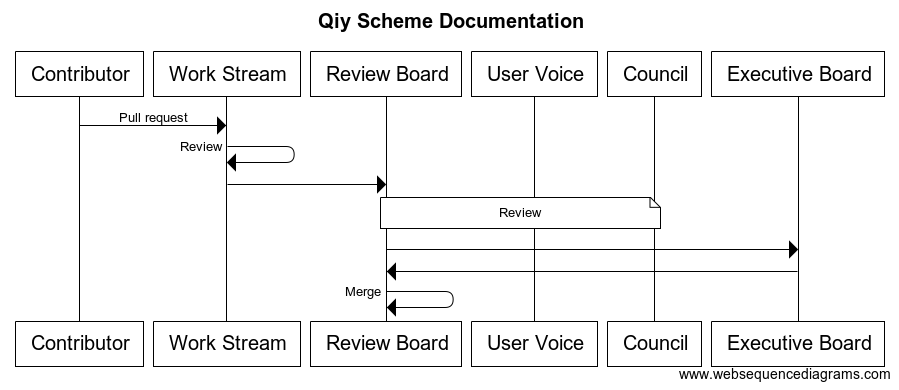

# Qiy Scheme documentation

## Abstract
The Qiy Scheme defines a framework for individual users, companies and governmental organisations to safely control and exchange personal data. This document describes the process the Qiy Scheme.

# Content

# 1 Qiy Scheme
This document describes the process of further development of the Qiy Scheme. The Qiy Scheme is a global system for the exchange of personal data under the control of the individual. It consists of technical protocols, regulations and a governance model. The Qiy Scheme is an open standard and a set of technical, operational and business rules and agreements which fosters interoperability between the interconnected persons, organisations, products, services and devices, which enables the exchange of data between Data Providers, Individuals and Relying Parties under the control of the Individual. The Qiy Scheme regulates issues such as, functionality, security, reliability levels, access criteria, communication, liabilities and availability.

# 2 Qiy Trust Network
The Qiy Scheme forms the basis of the Qiy Trust Network: the technical infrastructure which is based on an open standard and which respects the rules and regulations of the Qiy Scheme. The Qiy Trust Network makes it possible to exchange between individuals, organisations, products, services and devices in a safe and secure manner, personal data to which an Individual can connect on the basis of the Qiy Scheme. Market parties that respect the requirements of the Qiy Scheme, may build their own trust infrastructure and connect it to the Qiy Trust Network.

# 3 Scheme Authority
The Qiy Scheme is managed by the Qiy Foundation, which fulfills the role of Scheme Authority. The Qiy Foundation is a not-for-profit organisation with a governance model that makes it independent from market forces and political influence. The organisation is funded by annual contributions from Member organisations. The Qiy Foundation works closely together with national and international parties in the public and private sectors to enrich and maintain the Qiy Scheme. 

# 4 Development process
The development process starts at the level of Work Streams. Everyone is free to contribute their suggestions to the Work Streams.The process ends by an instruction of the Supervisory Authority to merge new elements with the existing version of the Qiy Scheme.

## 4.1 Parties fulfilling a role in the process

### Contributor
Any individual person who wishes to do so can make suggestions for the further development of the Qiy Scheme by sending a pull request. The GitHub Terms of Service apply, notably Section D thereof dealing with User-Generated Content. However, Contributors of possibly copyrighted materials must first sign a Contributor License Agreement. And, in the case where an individual is an employee in a country where intellectual property created by employees automatically becomes the property of the employer, this person will need to sign in advance a Contributor License Agreement for individuals with an employment relationship and to submit a signed Employer’s Declaration by which the employer grants the Qiy Foundation an irrevocable license to use that intellectual property, as set out in the said Contributor License Agreement.

### Work Stream
Work Streams provide a forum for discussion and have as their main tasks the preparation of relevant work programmes and to contribute to the further development of the Qiy Scheme. A Work Stream is the primary decision making centre for all matters that fall within its Terms of Reference.

It is the responsibility of the Executive Board of the Qiy Foundation to create or dissolve a Work Stream and to approve its Terms of Reference.

A Work Stream prepares drafts concerning the management, further development and maintenance of the Qiy Scheme for consideration by the Supervisory Authority.

A Work Stream may establish working groups, if required. When this is the case, the Work Stream shall decide on the rules for the working group, within the scope of the Qiy Foundation’s Rules & Regulations and the Work Stream Procedures.

Participation in a Work Stream or working group is by invitation by the Chairperson only. Non-Members with a special expertise may be invited to participate in working groups or even in a Work Stream. Where deemed necessary by the Chairperson of a Work Stream, participants in Work Streams or working groups will be asked to sign a Mutual Confidentiality and Non-Disclosure Agreement with the Qiy Foundation.

Counselors of the Qiy Foundation may attend meetings of a Work Stream and participate in the work without the right to vote.

The Chairpersons of each Work Stream ensure that all pull requests suggested by Contributors are reviewed in the Work Stream.

The Work Stream Procedures adopted by the Executive Board of the Qiy Foundation apply.

### Review Board
It is the task of the Review Board to review the work of the different Work Streams and to seek the advice of both the User Voice and the Council of Regional Authorities. Where necessary, the Review Board will ask the Work Stream to reconsider their proposals in the light of the advice received. The procedural rules for the adoption of Work Stream pull requests apply.

Members of the Review Board are nominated by the Executive Board of the Qiy Foundation, but selected and appointed by the Supervisory Authority. The Rules on the Selection and Appointment of members of the Review Board apply.

### User Voice
The User Voice is an advisory panel of the Qiy Foundation. Its members represent the interests of the different user groups of the Qiy Scheme. Its role is to advise the Supervisory Authority on proposals made by Work Streams.

The Rules on the Selection and Appointment of members of the User Voice apply.

### Council of Regional Authorities
The Council of Regional Authorities consists of representatives of the Regional Authorities. Its members represent the interests of the Regional Authorities. Its role is to advise the Supervisory Authority on proposals made by Work Streams.

The Rules on the Selection and Appointment of members of the Council of Regional Authorities apply.

### Supervisory Authority
The Supervisory Authority is responsible for the management, further development and maintenance of the Qiy Scheme. Once it has accepted a new deliverable for the Qiy Scheme, it shall instruct the Review Board to merge the deliverable with the existing version of the Qiy Scheme. It will also assign a version number to each new deliverable.

The Rules on the Selection and Appointment of members of the Supervisory Authority apply.

## 4.2 Process

Contributors can create pull requests at any time. All pull requests will be reviewed by the Work Stream that is most relevant to the pull request in question. The Chairperson of a Work Streams will decide which of the pull requests is relevant to their work.

The deliberations in a Work Stream result in a pull request made to the Review Board. Pull requests made by Work streams will be reviewed by the Review Board. The Review Board will consider the pull requests made by the different Work Streams in conjunction with each other. It will also verify whether all pull requests made by Contributors have been reviewed. The Review Board can refer pull requests back to one or several Work Streams. The work of the Review Board results in a pull request containing a new deliverable of the Qiy Scheme . The Supervisory Authority will consider the pull request made by the Review Board. Consequently, it can instruct the Review Board to merge the deliverable with the existing Qiy Scheme or refer the proposed deliverable back to the Review Board for further consideration.

