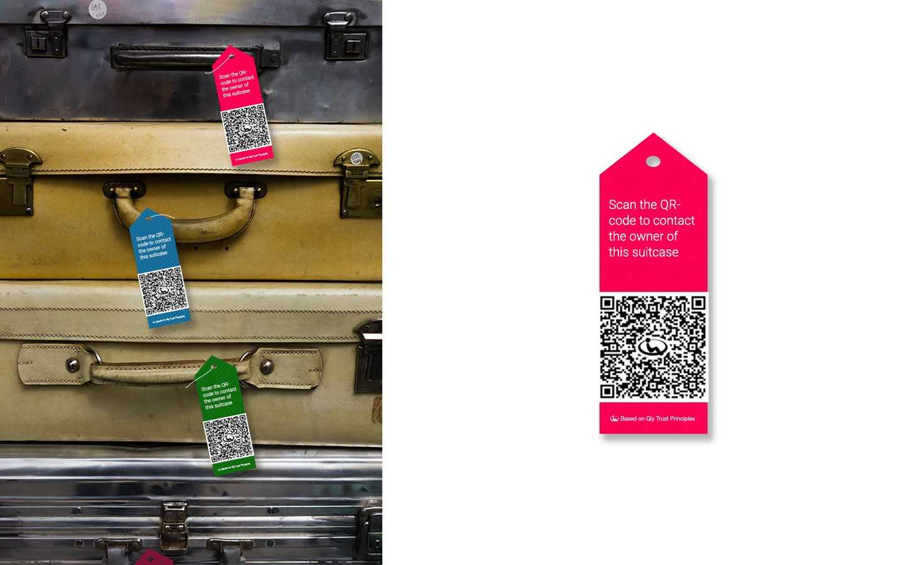
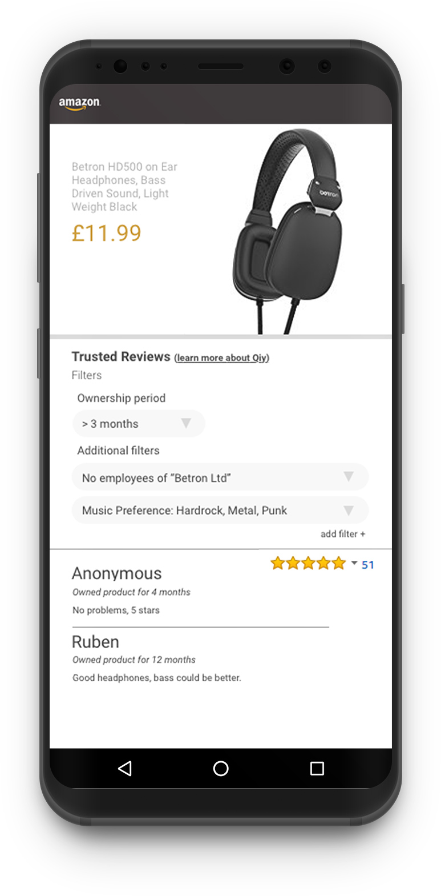
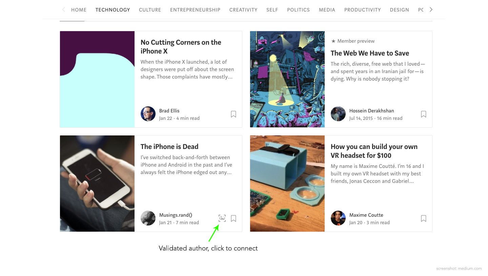
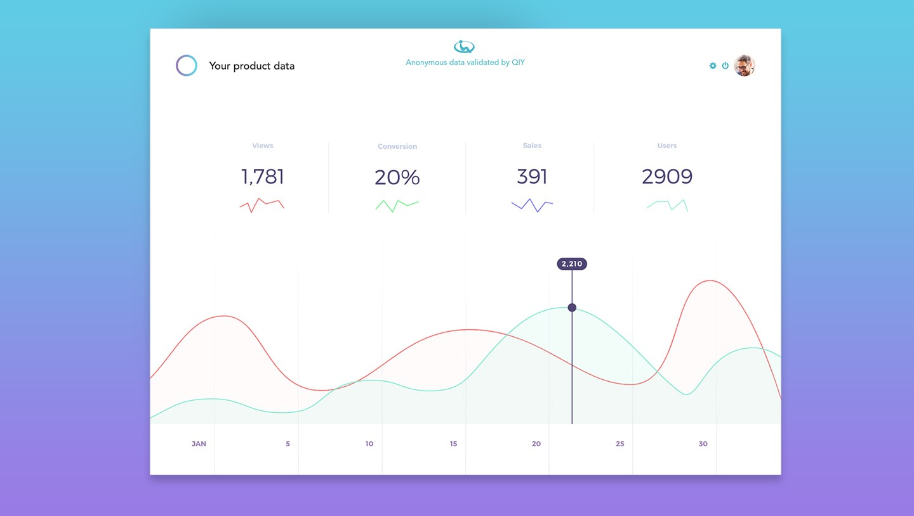

# Example Applications

# Abstract

This document contains examples for some applications of the Qiy Scheme.

# Contents

1. ['Help, I am lost!'](#1-help,-i-am-lost)
1. ['Let us know'](#2-let-us-know)
1. [Login](#3-login)
1. [Share Medical Data](#4-share-medical-data)
1. ['Have you seen this man?'](#5-have-you-seen-this-man)
1. [At the airport](#6-at-the-airport)
1. ['The lines are open: scan now!'](#7-the-lines-are-open-scan-now)
1. [Clothing Label](#8-clothing-label)
1. [Formal Elections](#9-formal-elections)
1. [Luggage Label](#10-luggage-label)
1. [Track & Trace](#11-track-&-trace)
1. [Video Doorbell / Electronic Access](#12-video-doorbell--electronic-access)
1. [Trustable Reviews](#13-trustable-reviews)
1. [Tickets](#14-tickets)
1. [News Source](#15-news-source)
1. [Product Data](#16-product-data)

# 1 'Help, I am lost!'

The [Connect Proposal](Definitions.md#connect-proposal) can be used on a badge to contact the parents of a wandering child:

# 2 'Let us know'

The [Connect Proposal](Definitions.md#connect-proposal) can be used to react anonymously to a news item in a newspaper:

# 3 Login

The [Connect Proposal](Definitions.md#connect-proposal) can be used by websites as a [User](Definitions.md#user) friendly login alternative:

# 4 Share Medical Data

The [Connect Proposal](Definitions.md#connect-proposal) can be used to anonymously share medical [Data](Definitions.md#data) for a visit at a medical facility:

# 5 'Have you seen this man?'

The [Connect Proposal](Definitions.md#connect-proposal) can be used to anonymously contribute to reduce crime:

# 6 At the airport

Qiy can be used to route verifiable identifying [Data](Definitions.md#data), for example to digitally use your passport to authenticate yourself at an airport:

# 7 'The lines are open: scan now!'

The [Connect Proposal](Definitions.md#connect-proposal) can be used to vote for your favourite singer at a song contest:

# 8 Clothing Label

A [Connect Token](Definitions.md#connect-token) in its representation as a QR Code can be used in a clothing label to disclose product details:

# 9 Formal Elections

A [Connect Token](Definitions.md#connect-token) in its representation as a QR Code can be used in formal elections to vote for a candidate:

# 10 Luggage Label

A [Connect Token](Definitions.md#connect-token) in its representation as a QR Code can be used as a luggage label:

# 11 Track & Trace

Barcodes in existing Track & Trace systems can be used as [Connect Tokens](Definitions.md#connect-token) for example to track and trace the delivery of a parcel:

# 12 Video Doorbell / Electronic Access

Scanning a QR Code placed next to an entrance may be used to ring a doorbell and start a video call with the reception or house owner or result in the opening of a door when the visitor was invited for a meeting at the premises:

# 13 Trustable Reviews

Qiy allows solutions in which consumers can [Trust](Definitions.md#trust) posted reviews on products or [Services](Definitions.md#service):

# 14 Tickets

Qiy allows ticketing-solutions were consumers can easily join an event and where ticket distribution is more under control of the organizer:

# 15 News Source

Qiy allows solutions were consumers can verify the source of news articles:

# 16 Product Data

Qiy allows consumers to share product [Data](Definitions.md#data) and/or experiences with manufacturers:

