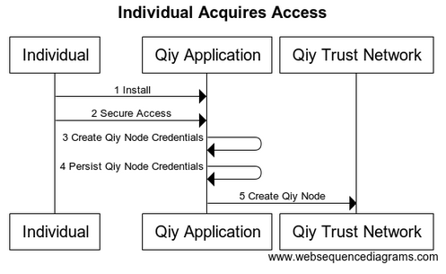
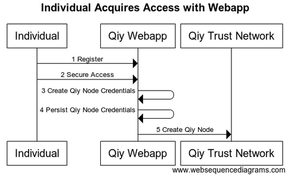
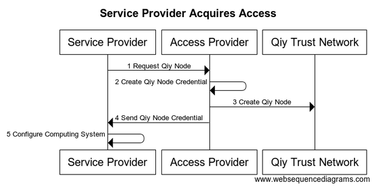

# UC01 Acquire Access to Qiy Trust Network

# Abstract

This document describes how an [Individual](../Definitions.md#individual) and a [Service Provider](../Definitions.md#service-provider) acquire access to the [Qiy Trust Network](../Definitions.md#qiy-trust-network).

# Contents


1. [Primary Actors](#primary-actors)
1. [Preconditions](#preconditions)
1. [Basic Flow: Individual acquires access using a Qiy App](#basic-flow-individual-acquires-access-using-a-qiy-app)
	1. [The Individual installs a new Qiy App](#1-the-individual-installs-a-new-qiy-app)
	1. [The Individual secures access to the Qiy App](#2-the-individual-secures-access-to-the-qiy-app)
	1. [The Qiy App creates Qiy Node Credentials](#3-the-qiy-app-creates-qiy-node-credentials)
		1. [Python](#python)
	1. [The Qiy App persists the Qiy Node Credentials](#4-the-qiy-app-persists-the-qiy-node-credentials)
	1. [The Qiy App requests the Qiy Trust Network to create a Qiy Node](#5-the-qiy-app-requests-the-qiy-trust-network-to-create-a-qiy-node)
1. [Postconditions](#postconditions)
1. [Extensions](#extensions)
1. [E1.1 Individual acquires access using a Qiy Webapp](#e11-individual-acquires-access-using-a-qiy-webapp)
	1. [The Individual registers an account for the Qiy Webapp](#1-the-individual-registers-an-account-for-the-qiy-webapp)
	1. [The Individual secures access to the Qiy Webapp](#2-the-individual-secures-access-to-the-qiy-webapp)
	1. [The Qiy Webapp creates Qiy Node Credentials](#3-the-qiy-webapp-creates-qiy-node-credentials)
	1. [The Qiy Webapp persists the Qiy Node Credentials](#4-the-qiy-webapp-persists-the-qiy-node-credentials)
	1. [The Qiy Webapp requests the Qiy Trust Network to create a Qiy Node](#5-the-qiy-webapp-requests-the-qiy-trust-network-to-create-a-qiy-node)
1. [E2 Service Provider acquires access](#e2-service-provider-acquires-access)
	1. [Preconditions](#preconditions)
	1. [Flow](#flow)
		1. [The Service Provider requests the Access Provider for a Qiy Node](#1-the-service-provider-requests-the-access-provider-for-a-qiy-node)
		1. [The Access Provider creates Qiy Node Credentials](#2-the-access-provider-creates-qiy-node-credentials)
		1. [The Access Provider requests the Qiy Trust Network to create a Qiy Node](#3-the-access-provider-requests-the-qiy-trust-network-to-create-a-qiy-node)
		1. [The Access Provider sends the Qiy Node Credentials to the Service Provider](#4-the-access-provider-sends-the-qiy-node-credentials-to-the-service-provider)
		1. [The Service Provider configures its Computing System with the Qiy Node Credentials](#5-the-service-provider-configures-its-computing-system-with-the-qiy-node-credentials)
	1. [Postconditions](#postconditions)
1. [Diagram Source Code](#diagram-source-code)
	1. [Individual Acquires Access](#individual-acquires-access)
	1. [Individual Acquires Access with Webapp](#individual-acquires-access-with-webapp)
	1. [Service Provider Acquires Access](#service-provider-acquires-access)

# Primary Actors

* [Individual](../Definitions.md#individual)
* [Qiy App](../Definitions.md#qiy-app)

# Preconditions

1. The [Individual](../Definitions.md#individual) wants access to the [Qiy Trust Network](../Definitions.md#qiy-trust-network).

# Basic Flow: Individual acquires access using a Qiy App

The basic flow describes how an [Individual](../Definitions.md#individual) acquires access to the [Qiy Trust Network](../Definitions.md#qiy-trust-network).



## 1. The Individual installs a new Qiy App
## 2. The Individual secures access to the Qiy App

The [Individual](../Definitions.md#individual) can secure access to the Qiy App in different ways:
1. The [Individual](../Definitions.md#individual) can secure access using a passcode which is specific for the [Qiy App](../Definitions.md#qiy-app).
1. The [Individual](../Definitions.md#individual) can secure access using the passcode for the device that the [Qiy App](../Definitions.md#qiy-app) is installed on.
1. The [Individual](../Definitions.md#individual) can secure access using a fingerprint for the device that the [Qiy App](../Definitions.md#qiy-app) is installed on.


## 3. The Qiy App creates Qiy Node Credentials

The Qiy Node Credentials consist of:
* One [Qiy Node Id](../Definitions.md#qiy-node-id): a [Uuid](../Definitions.md#uuid).
* One [RSA Private Key](../Definitions.md#rsa-private-key).

### Python

Code snippet to generate and save an [RSA Private Key](../Definitions.md#rsa-private-key):

```
from cryptography.hazmat.backends import default_backend
from cryptography.hazmat.primitives.asymmetric.rsa import generate_private_key
from cryptography.hazmat.primitives import serialization

private_key = generate_private_key(
        backend=default_backend(),
        public_exponent=65537,
        key_size=2048
        )

with open(pem_filename, "wb") as f:
    f.write(private_key.private_bytes(
        encoding=serialization.Encoding.PEM,
        format=serialization.PrivateFormat.TraditionalOpenSSL,
        encryption_algorithm=serialization.NoEncryption())
        )
```

## 4. The Qiy App persists the Qiy Node Credentials
## 5. The Qiy App requests the Qiy Trust Network to create a Qiy Node

The [Qiy App](../Definitions.md#qiy-app) requests the [Qiy Trust Network](../Definitions.md#qiy-trust-network) to create a [Qiy Node](../Definitions.md#qiy-node) using a [Qiy Node Create Request](../Definitions.md#qiy-node-create-request).


# Postconditions

1. The [Individual](../Definitions.md#individual) has access to the [Qiy Trust Network](../Definitions.md#qiy-trust-network) by means of a [Qiy Application](../Definitions.md#qiy-application).


# Extensions

# E1.1 Individual acquires access using a Qiy Webapp

The flow for [Qiy Webapps](../Definitions.md#qiy-webapp) is the same as the basic flow but for the first step:



## 1. The Individual registers an account for the Qiy Webapp
## 2. The Individual secures access to the Qiy Webapp
## 3. The Qiy Webapp creates Qiy Node Credentials
## 4. The Qiy Webapp persists the Qiy Node Credentials
## 5. The Qiy Webapp requests the Qiy Trust Network to create a Qiy Node

# E2 Service Provider acquires access

This extension describes how a [Service Provider](../Definitions.md#service-provider) acquires access to the [Qiy Trust Network](../Definitions.md#qiy-trust-network).


## Preconditions

1. The [Service Provider](../Definitions.md#service-provider) wants access to the [Qiy Trust Network](../Definitions.md#qiy-trust-network).
1. The [Service Provider](../Definitions.md#service-provider) has concluded an agreement with an [Access Provider](../Definitions.md#access-provider).


## Flow



### 1. The Service Provider requests the Access Provider for a Qiy Node

Please refer to the [Access Provider](../Definitions.md#access-provider) for more information.

### 2. The Access Provider creates Qiy Node Credentials

See also [3. The Qiy App creates Qiy Node Credentials](#3-the-qiy-app-creates-qiy-node-credentials).

### 3. The Access Provider requests the Qiy Trust Network to create a Qiy Node

See also [5. The Qiy App requests the Qiy Trust Network to create a Qiy Node](#5-the-qiy-app-requests-the-qiy-trust-network-to-create-a-qiy-node).

### 4. The Access Provider sends the Qiy Node Credentials to the Service Provider

Please refer to the [Access Provider](../Definitions.md#access-provider) for more information.

### 5. The Service Provider configures its Computing System with the Qiy Node Credentials


## Postconditions

1. The [Service Provider](../Definitions.md#service-provider) has access to the [Qiy Trust Network](../Definitions.md#qiy-trust-network) by means of [Qiy Node Credentials](../Definitions.md#qiy-node-credentials).

# Diagram Source Code

## Individual Acquires Access

```
title "Individual Acquires Access"

participant "Individual"        as User
participant "Qiy App"           as App
participant "Qiy Trust Network" as QTN

User -> App  : 1 Install
User -> App  : 2 Secure Access
App  -> App  : 3 Create Qiy Node Credentials
App  -> App  : 4 Persist Qiy Node Credentials
App  -> QTN  : 5 Create Qiy Node
```

## Individual Acquires Access with Webapp

```
title "Individual Acquires Access with Webapp"

participant "Individual"        as User
participant "Qiy Webapp"           as App
participant "Qiy Trust Network" as QTN

User -> App  : 1 Register
User -> App  : 2 Secure Access
App  -> App  : 3 Create Qiy Node Credentials
App  -> App  : 4 Persist Qiy Node Credentials
App  -> QTN  : 5 Create Qiy Node
```

## Service Provider Acquires Access

```
title "Service Provider Acquires Access"

participant "Service Provider"  as SP
participant "Access Provider"   as AP
participant "Qiy Trust Network" as QTN

SP ->  AP  : 1 Request Qiy Node
AP ->  AP  : 2 Create Qiy Node Credentials
AP ->  QTN : 3 Create Qiy Node
AP ->  SP  : 4 Send Qiy Node Credentials
SP ->  SP  : 5 Configure Computing System
```
