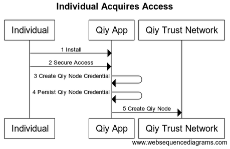

# UC01 Acquire Access to Qiy Trust Network

# Abstract

This document is the use case specification for use case [UC01 Acquire Access to Qiy Trust Network](UC01%20Acquire%20Access%20to%20Qiy%20Trust%20Network.md).

# Contents


1. [Primary Actors](#primary-actors)
1. [Preconditions](#preconditions)
1. [Basic Flow](#basic-flow)
	1. [The Individual installs a new Qiy App](#1-the-individual-installs-a-new-qiy-app)
	1. [The Individual secures access to the Qiy App](#2-the-individual-secures-access-to-the-qiy-app)
	1. [The Qiy App creates Qiy Node Credentials](#3-the-qiy-app-creates-qiy-node-credentials)
	1. [The Qiy App persists the Qiy Node Credentials](#4-the-qiy-app-persists-the-qiy-node-credentials)
	1. [The Qiy App requests the Qiy Trust Network to create a Qiy Node](#5-the-qiy-app-requests-the-qiy-trust-network-to-create-a-qiy-node)
1. [Postconditions](#postconditions)
1. [Extensions](#extensions)
1. [E1.1 Qiy Webapp](#e11-qiy-webapp)
	1. [The Individual registers an account for the Qiy Webapp](#1-the-individual-registers-an-account-for-the-qiy-webapp)
	1. [The Individual secures access to the Qiy Webapp](#2-the-individual-secures-access-to-the-qiy-webapp)
	1. [The Qiy Webapp creates Qiy Node Credentials](#3-the-qiy-webapp-creates-qiy-node-credentials)
	1. [The Qiy Webapp persists the Qiy Node Credentials](#4-the-qiy-webapp-persists-the-qiy-node-credentials)
	1. [The Qiy Webapp requests the Qiy Trust Network to create a Qiy Node](#5-the-qiy-webapp-requests-the-qiy-trust-network-to-create-a-qiy-node)
1. [E2 Service Provider](#e2-service-provider)
1. [E3 Qiy Application](#e3-qiy-application)
1. [E4 Qiy Node](#e4-qiy-node)
1. [Access Provider](#5-access-provider)
1. [Other extensions](#other-extensions)
1. [Diagram Source Code](#diagram-source-code)
	1. [Individual Acquires Access](#individual-acquires-access)
	1. [Individual Acquires Access with Webapp](#individual-acquires-access-with-webapp)

# Primary Actors

* [Individual](../Definitions.md#individual)
* [Qiy App](../Definitions.md#qiy-app)

# Preconditions

1. The [Individual](../Definitions.md#individual) wants exclusive access to a new [Qiy Node](../Definitions.md#qiy-node).

# Basic Flow

[Individual](../Definitions.md#individual) acquires access to the [Qiy Trust Network](../Definitions.md#qiy-trust-network)
* with a new [Qiy Node](../Definitions.md#qiy-node) and
* with a [Qiy App](../Definitions.md#qiy-app).



## 1. The Individual installs a new Qiy App
## 2. The Individual secures access to the Qiy App
## 3. The Qiy App creates Qiy Node Credentials
## 4. The Qiy App persists the Qiy Node Credentials
## 5. The Qiy App requests the Qiy Trust Network to create a Qiy Node


# Postconditions

1. The [Individual](../Definitions.md#individual) has exclusive access to a new [Qiy App](../Definitions.md#qiy-app).
1. The [Individual](../Definitions.md#individual) has exclusive access to a new [Qiy Node](../Definitions.md#qiy-node).
1. The [Qiy App](../Definitions.md#qiy-app) has exclusive access to the [Qiy Node](../Definitions.md#qiy-node).


# Extensions

# E1.1 Qiy Webapp

The flow for [Qiy Webapps](../Definitions.md#qiy-webapp) is the same as the basic flow but for the first step:


## 1. The Individual registers an account for the Qiy Webapp
## 2. The Individual secures access to the Qiy Webapp
## 3. The Qiy Webapp creates Qiy Node Credentials
## 4. The Qiy Webapp persists the Qiy Node Credentials
## 5. The Qiy Webapp requests the Qiy Trust Network to create a Qiy Node

# E2 Service Provider

tbd

# E3 Qiy Application

tbd

# E4 Qiy Node

tbd

# 5 Access Provider

tbd

# Other extensions

Please refer to [UC08 Manage Access to Qiy Trust Network](UC08%20Manage%20Access%20to%20Qiy%20Trust%20Network.md).

# Diagram Source Code

## Individual Acquires Access

```
title "Individual Acquires Access"

participant "Individual"        as User
participant "Qiy App"           as App
participant "Qiy Trust Network" as QTN

User -> App  : 1 Install
User -> App  : 2 Secure Access
App  -> App  : 3 Create Qiy Node Credentials
App  -> App  : 4 Persist Qiy Node Credentials
App  -> QTN  : 5 Create Qiy Node
```

## Individual Acquires Access with Webapp

```
title "Individual Acquires Access with Webapp"

participant "Individual"        as User
participant "Qiy Webapp"           as App
participant "Qiy Trust Network" as QTN

User -> App  : 1 Register
User -> App  : 2 Secure Access
App  -> App  : 3 Create Qiy Node Credentials
App  -> App  : 4 Persist Qiy Node Credentials
App  -> QTN  : 5 Create Qiy Node
```
