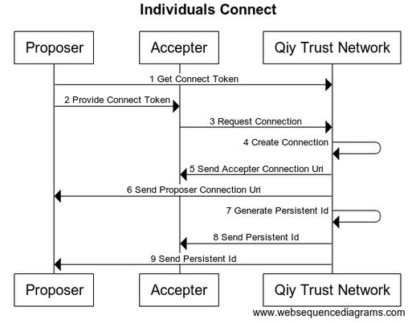
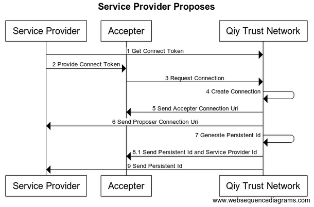
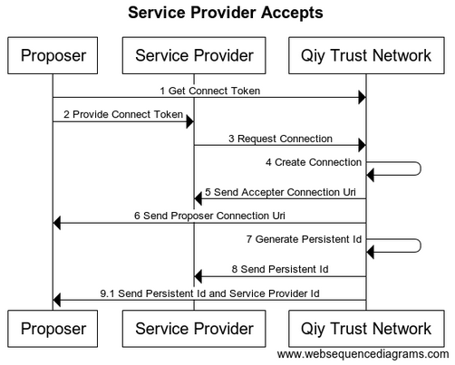

# UC02 Connect with Qiy User

# Abstract

This document describes how [Qiy Users](../Definitions.md#qiy-user) can connect via the [Qiy Trust Network](../Definitions.md#qiy-trust-network).

# Contents


1. [Primary Actors](#primary-actors)
1. [Preconditions](#preconditions)
1. [Basic Flow: Individuals Connect](#basic-flow-individuals-connect)
	1. [The Proposer requests the Qiy Trust Network for a Connect Token](#1-the-proposer-requests-the-qiy-trust-network-for-a-connect-token)
	1. [The Proposer provides the Accepter with the Connect Token](#2-the-proposer-provides-the-accepter-with-the-connect-token)
	1. [The Accepter requests the Qiy Trust Network to create a Connection using the Connect Token](#3-the-accepter-requests-the-qiy-trust-network-to-create-a-connection-using-the-connect-token)
	1. [The Qiy Trust Network creates a Connection](#4-the-qiy-trust-network-creates-a-connection)
	1. [The Qiy Trust Network sends the Proposer Connection Uri to the Proposer](#5-the-qiy-trust-network-sends-the-proposer-connection-uri-to-the-proposer)
	1. [The Qiy Trust Network sends the Accepter Connection Uri to the Accepter](#6-the-qiy-trust-network-sends-the-accepter-connection-uri-to-the-accepter)
	1. [The Qiy Trust Network generates a Persistent Id](#7-the-qiy-trust-network-generates-a-persistent-id)
	1. [The Qiy Trust Network sends the Persistent Id to the Proposer](#8-the-qiy-trust-network-sends-the-persistent-id-to-the-proposer)
	1. [The Qiy Trust Network sends the Persistent Id to the Accepter](#9-the-qiy-trust-network-sends-the-persistent-id-to-the-accepter)
1. [Postconditions](#postconditions)
1. [Extensions](#extensions)
1. [Provide Connect Token as QR Code](#22-provide-connect-token-as-qr-code)
1. [Service Provider Proposes](#81-service-provider-proposes)
	1. [Reuse Connection](#811-reuse-connection)
1. [Service Provider Accepts](#91-service-provider-accepts)
1. [Diagram source code](#diagram-source-code)
	1. [Individuals Connect](#individuals-connect)
	1. [Service Provider Proposes](#service-provider-proposes)
	1. [Service Provider Accepts](#service-provider-accepts)

# Primary Actors

* [Proposer](../Definitions.md#proposer): An [Individual](../Definitions.md#individual)
* [Accepter](../Definitions.md#accepter): An [Individual](../Definitions.md#individual)
* [Qiy Trust Network](../Definitions.md#qiy-trust-network)

# Preconditions

1. The [Proposer](../Definitions.md#proposer) has access to the [Qiy Trust Network](../Definitions.md#qiy-trust-network).
1. The [Accepter](../Definitions.md#accepter) has access to the [Qiy Trust Network](../Definitions.md#qiy-trust-network).

# Basic Flow: Individuals Connect



## 1. The Proposer requests the Qiy Trust Network for a Connect Token

The [Proposer](../Definitions.md#proposer) requests the [Qiy Trust Network](../Definitions.md#qiy-trust-network) for a [Connect Token](../Definitions.md#connect-token) using a [Connect Token Create Request](../Qiy%20Node%20Protocol.md#connect-token-create-request).

Alternatively, the [Proposer](../Definitions.md#proposer) may generate a [Connect Token](../Definitions.md#connect-token) himself and register it with a [Connect Token Register Request](../Qiy%20Node%20Protocol.md#connect-token-register-request) and impose constraints on it at request time or change them later, see [UC08 Manage Connect Tokens](UC08%20Manage%20Connect%20Tokens.md).

## 2. The Proposer provides the Accepter with the Connect Token

The [Proposer](../Definitions.md#proposer) provides the [Accepter](../Definitions.md#accepter) with the [Connect Token](../Qiy%20Node%20Protocol.md#connect-token), for example as a [Json Object](../Definitions.md#json-object) in a query parameter of a website address.

## 3. The Accepter requests the Qiy Trust Network to create a Connection using the Connect Token

The [Accepter](../Definitions.md#accepter) requests the [Qiy Trust Network](../Definitions.md#qiy-trust-network) to create a [Connection](../Qiy%20Node%20Protocol.md#connection) using the [Connect Token](../Qiy%20Node%20Protocol.md#connect-token) in a [Connection Create Request](../Qiy%20Node%20Protocol.md#connection-create-request).

## 4. The Qiy Trust Network creates a Connection

The [Qiy Trust Network](../Definitions.md#qiy-trust-network) creates a [Connection](../Qiy%20Node%20Protocol.md#connection) between the [Individuals](../Definitions.md#individual) and generates two [Connection Uris](../Definitions.md#connection-uri): one for each of them.

## 5. The Qiy Trust Network sends the Proposer Connection Uri to the Proposer

The [Qiy Trust Network](../Definitions.md#qiy-trust-network) sends the [Connection Uri](../Definitions.md#connection-uri) for the [Proposer](../Definitions.md#proposer) to the [Proposer](../Definitions.md#proposer) in a [Connection Created Event](../Qiy%20Node%20Protocol.md#connection-created-event).

## 6. The Qiy Trust Network sends the Accepter Connection Uri to the Accepter

The [Qiy Trust Network](../Definitions.md#qiy-trust-network) returns the [Connection Uri](../Definitions.md#connection-uri) for the [Accepter](../Definitions.md#accepter) to the [Accepter](../Definitions.md#accepter) in the response of the [Connection Create Request](../Qiy%20Node%20Protocol.md#connection-create-request).

## 7. The Qiy Trust Network generates a Persistent Id

## 8. The Qiy Trust Network sends the Persistent Id to the Proposer

The [Qiy Trust Network](../Definitions.md#qiy-trust-network) sends the [Persistent Id](../Qiy%20Node%20Protocol.md#persistent-id) to the [Proposer](../Definitions.md#proposer) in a [Persistent Id Event](../Qiy%20Node%20Protocol.md#persistent-id-event).

## 9. The Qiy Trust Network sends the Persistent Id to the Accepter

The [Qiy Trust Network](../Definitions.md#qiy-trust-network) sends the [Persistent Id](../Qiy%20Node%20Protocol.md#persistent-id) to the [Accepter](../Definitions.md#accepter) in a [Persistent Id Event](../Qiy%20Node%20Protocol.md#persistent-id-event).


# Postconditions

1. The [Proposer](../Definitions.md#proposer) and the [Accepter](../Definitions.md#accepter) have a new [Connection](../Qiy%20Node%20Protocol.md#connection).

The [Qiy Users](../Definitions.md#qiy-user) can use the [Connection](../Qiy%20Node%20Protocol.md#connection) to exchange [Qiy Node Messages](../Qiy%20Node%20Protocol.md#qiy-node-message) or [Personal Data](../Definitions.md#personal-data), see [UC03 Send Message](UC03%20Send%20Message.md) or [UC04 Request Personal Data](UC04%20Request%20Personal%20Data.md).

# Extensions

# 2.2 Provide Connect Token as QR Code

Alternatively, a [Proposer](../Definitions.md#proposer) can provide the [Connect Token](../Qiy%20Node%20Protocol.md#connect-token) to the [Accepter](../Definitions.md#accepter) as a [QR Code](../Definitions.md#qr-code).
This way, [Qiy Users](../Definitions.md#qiy-user) can connect over various media by scanning the [QR Code](../Definitions.md#qr-code).

# 8.1 Service Provider Proposes

When the [Proposer](../Definitions.md#proposer) is a [Service Provider](../Definitions.md#service-provider), the [Qiy Trust Network](../Definitions.md#qiy-trust-network) will send the [Accepter](../Definitions.md#accepter) his [Service Provider Id](../Definitions.md#service-provider-id) in addition to the [Persistent Id](../Definitions.md#persistent-id) as pictured below:




## 8.1.1 Reuse Connection

Based on the received [Service Provider Id](../Definitions.md#service-provider-id), an [Individual](../Definitions.md#individual) can reuse a [Connection](../Qiy%20Node%20Protocol.md#connection) by including the [Persistent Id](../Qiy%20Node%20Protocol.md#persistent-id) of that [Connection](../Qiy%20Node%20Protocol.md#connection) in the [Connection Delete Request](../Qiy%20Node%20Protocol.md#connection-delete-request). The [Qiy Trust Network](../Definitions.md#qiy-trust-network) will delete the [Connection](../Qiy%20Node%20Protocol.md#connection) and will inform the [Service Provider](../Definitions.md#service-provider) to use the existing [Connection](../Qiy%20Node%20Protocol.md#connection) using a [Connection Deleted Event](../Qiy%20Node%20Protocol.md#connection-deleted-event).


# 9.1 Service Provider Accepts

When the [Accepter](../Definitions.md#accepter) is a [Service Provider](../Definitions.md#service-provider), the [Qiy Trust Network](../Definitions.md#qiy-trust-network) will send the [Proposer](../Definitions.md#proposer) his [Service Provider Id](../Definitions.md#service-provider-id) in addition to the [Persistent Id](../Qiy%20Node%20Protocol.md#persistent-id) as pictured below:




# Diagram source code

## Individuals Connect


```
title "Individuals Connect"

participant "Proposer"          as P
participant "Accepter"          as A
participant "Qiy Trust Network" as QTN

P   -> QTN : 1 Get Connect Token
P   -> A   : 2 Provide Connect Token
A   -> QTN : 3 Request Connection
QTN -> QTN : 4 Create Connection
QTN -> A   : 5 Send Accepter Connection Uri
QTN -> P   : 6 Send Proposer Connection Uri
QTN -> QTN : 7 Generate Persistent Id
QTN -> A   : 8 Send Persistent Id
QTN -> P   : 9 Send Persistent Id
```

## Service Provider Proposes


```
title "Service Provider Proposes"

participant "Service Provider"  as SP
participant "Accepter"          as A
participant "Qiy Trust Network" as QTN

SP  -> QTN : 1 Get Connect Token
SP  -> A   : 2 Provide Connect Token
A   -> QTN : 3 Request Connection
QTN -> QTN : 4 Create Connection
QTN -> A   : 5 Send Accepter Connection Uri
QTN -> SP  : 6 Send Proposer Connection Uri
QTN -> QTN : 7 Generate Persistent Id
QTN -> A   : 8.1 Send Persistent Id and Service Provider Id
QTN -> SP  : 9 Send Persistent Id
```


## Service Provider Accepts


```
title "Service Provider Accepts"

participant "Proposer"          as P
participant "Service Provider"  as SP
participant "Qiy Trust Network" as QTN

P   -> QTN : 1 Get Connect Token
P   -> SP  : 2 Provide Connect Token
SP  -> QTN : 3 Request Connection
QTN -> QTN : 4 Create Connection
QTN -> SP  : 5 Send Accepter Connection Uri
QTN -> P   : 6 Send Proposer Connection Uri
QTN -> QTN : 7 Generate Persistent Id
QTN -> SP  : 8 Send Persistent Id
QTN -> P   : 9.1 Send Persistent Id and Service Provider Id
```


