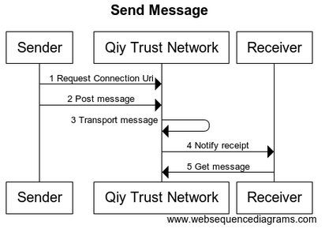

# UC03 Send Message

# Abstract

This document describes how [Qiy Users](../Definitions.md#qiy-user) can exchange [Qiy Node Messages](../Definitions.md#qiy-node-message).

# Contents


1. [Primary Actors](#primary-actors)
1. [Preconditions](#preconditions)
1. [Basic Flow: Send Qiy Node Message](#basic-flow-send-qiy-node-message)
	1. [The Sender requests the Qiy Trust Network for the Connection Uri](#1-the-sender-requests-the-qiy-trust-network-for-the-connection-uri)
	1. [The Sender posts the Qiy Node Message](#2-the-sender-posts-the-qiy-node-message)
	1. [The Qiy Trust Network transports the Qiy Node Message](#3-the-qiy-trust-network-transports-the-qiy-node-message)
	1. [The Qiy Trust Network notifies the receipt of the message to the Receiver](#4-the-qiy-trust-network-notifies-the-receipt-of-the-message-to-the-receiver)
	1. [The Receiver fetches the Qiy Node Message from the Qiy Trust Network](#5-the-receiver-fetches-the-qiy-node-message-from-the-qiy-trust-network)
1. [Postconditions](#postconditions)
1. [Extensions](#extensions)
1. [Sender sends a reply message](#21-sender-sends-a-reply-message)
1. [Diagram Source Code](#diagram-source-code)
	1. [Send Message](#send-message)

# Primary Actors

* [Sender](../Definitions.md#sender): a [Qiy User](../Definitions.md#qiy-user)
* [Receiver](../Definitions.md#receiver): a [Qiy User](../Definitions.md#qiy-user)
* [Qiy Trust Framework]

# Preconditions

1. The [Sender](../Definitions.md#sender) has access to the [Qiy Trust Network](../Definitions.md#qiy-trust-network).
1. The [Receiver](../Definitions.md#receiver) has access to the [Qiy Trust Network](../Definitions.md#qiy-trust-network).
1. The [Sender](../Definitions.md#sender) and [Receiver](../Definitions.md#receiver) have a [Connection](../Definitions.md#connection).
1. The [Sender](../Definitions.md#sender) knows the [Persistent Id](../Definitions.md#persistent-id) of the [Connection](../Definitions.md#connection) with the [Receiver](../Definitions.md#receiver).
1. The [Receiver](../Definitions.md#receiver) knows the [Persistent Id](../Definitions.md#persistent-id) of the [Connection](../Definitions.md#connection) with the [Sender](../Definitions.md#sender).
1. The [Message Descriptor](../Definitions.md#message-descriptor) has been registered with the [Service Library](../Definitions.md#service-library).

# Basic Flow: Send Qiy Node Message



## 1. The Sender requests the Qiy Trust Network for the Connection Uri

The [Sender](../Definitions.md#sender) requests the [Qiy Trust Network](../Definitions.md#qiy-trust-network) for the [Connection Uri](../Definitions.md#connection-uri) of the [Connection](../Definitions.md#connection) with the [Receiver](../Definitions.md#receiver) using the [Persistent Id](../Definitions.md#persistent-id) of the [Connection](../Definitions.md#connection) in a [Connections Request](../Definitions.md#connections-request).

## 2. The Sender posts the Qiy Node Message

The [Sender](../Definitions.md#sender) posts the [Qiy Node Message](../Definitions.md#qiy-node-message) using the [Connection Uri](../Definitions.md#connection-uri) of the [Connection](../Definitions.md#connection) in a [Message Post Request](../Definitions.md#message-post-request).
The [Sender](../Definitions.md#sender) does not specify the [Reference Serial Number](../Definitions.md#reference-serial-number) of the [Qiy Node Message](../Definitions.md#qiy-node-message).

## 3. The Qiy Trust Network transports the Qiy Node Message

The [Qiy Trust Network](../Definitions.md#qiy-trust-network) transports the [Qiy Node Message](../Definitions.md#qiy-node-message) to (the [Qiy Node](../Definitions.md#qiy-node) of) the [Receiver](../Definitions.md#receiver).

## 4. The Qiy Trust Network notifies the receipt of the message to the Receiver

The [Qiy Trust Network](../Definitions.md#qiy-trust-network) notifies the receipt of the message to the [Receiver](../Definitions.md#receiver) with a [Message Received Event](../Definitions.md#message-received-event) containing a [Connection Uri](../Definitions.md#connection-uri) of the [Connection](../Definitions.md#connection) over which is was received.

## 5. The Receiver fetches the Qiy Node Message from the Qiy Trust Network

The [Receiver](../Definitions.md#receiver) fetches the [Qiy Node Message](../Definitions.md#qiy-node-message) from the [Qiy Trust Network](../Definitions.md#qiy-trust-network) using the [Connection Uri](../Definitions.md#connection-uri) in a [Messages Request](../Definitions.md#messages-request).


# Postconditions

1. The [Receiver](../Definitions.md#receiver) has received the message.

# Extensions

# 2.1 Sender sends a reply message

The [Sender](../Definitions.md#sender) can send a reply message by referencing the [Serial Number](../Definitions.md#serial-number) of the [Qiy Node Message](../Definitions.md#qiy-node-message) that he replies to in the [Reference Serial Number](../Definitions.md#reference-serial-number). 


# Diagram Source Code

## Send Message


```
title "Send Message"

participant "Sender"            as S
participant "Qiy Trust Network" as QTN
participant "Receiver"          as R

S   -> QTN : 1 Request Connection Uri
S   -> QTN : 2 Post message
QTN -> QTN : 3 Transport message
QTN -> R   : 4 Notify receipt
R   -> QTN : 5 Get message
```

