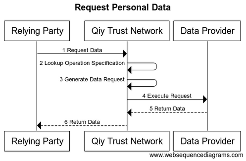

# UC04 Request Personal Data

# Abstract

This document describes how a [Relying Party](../Definitions.md#relying-party) can acquire [Personal Data](../Definitions.md#personal-data) of an [Individual](../Definitions.md#individual) from a [Data Provider](../Definitions.md#data-provider).

# Contents


1. [Primary Actors](#primary-actors)
1. [Preconditions](#preconditions)
1. [Basic Flow: Request Personal Data](#basic-flow-request-personal-data)
	1. [The Relying Party requests the Qiy Trust Network for the Personal Data of the Individual](#1-the-relying-party-requests-the-qiy-trust-network-for-the-personal-data-of-the-individual)
	1. [The Qiy Trust Network looks up the Operation Specification](#2-the-qiy-trust-network-looks-up-the-operation-specification)
	1. [The Qiy Trust Network generates the data request](#3-the-qiy-trust-network-generates-the-data-request)
	1. [The Qiy Trust Network executes the data request](#4-the-qiy-trust-network-executes-the-data-request)
	1. [The Data Provider returns the Personal Data to the Qiy Trust Network](#5-the-data-provider-returns-the-personal-data-to-the-qiy-trust-network)
	1. [The Qiy Trust Network returns the Personal Data to the Relying Party](#6-the-qiy-trust-network-returns-the-personal-data-to-the-relying-party)
1. [Postconditions](#postconditions)
1. [Diagram Source Code](#diagram-source-code)
	1. [Request Personal Data](#request-personal-data)

# Primary Actors

* [Individual](../Definitions.md#individual)
* [Data Provider](../Definitions.md#data-provider)
* [Relying Party](../Definitions.md#relying-party)
* [Qiy Trust Network](../Definitions.md#qiy-trust-network)

# Preconditions

 Condition   | [Individual](../Definitions.md#individual) | [Data Provider](../Definitions.md#data-provider) | [Relying Party](../Definitions.md#relying-party) | [Consent](../Definitions.md#consent)
------------ | ------------ | --------------- | --------------- | ---------
The [Data Provider](../Definitions.md#data-provider) has [Personal Data](../Definitions.md#personal-data) of the [Individual](../Definitions.md#individual).                                             | X | X |   |  
The [Individual](../Definitions.md#individual) has a [Connection](../Definitions.md#connection) with the [Data Provider](../Definitions.md#data-provider) and knows its [Persistent Id](../Definitions.md#persistent-id).              | X | X |   |  
The [Data Provider](../Definitions.md#data-provider) has a [Connection](../Definitions.md#connection) with the [Individual](../Definitions.md#individual) and knows its [Persistent Id](../Definitions.md#persistent-id).              | X | X |   |  
The [Data Provider](../Definitions.md#data-provider) knows the (local) [Identity](../Definitions.md#identity) of the [Individual](../Definitions.md#individual).                                    | X | X |   |  
The [Individual](../Definitions.md#individual) has a [Connection](../Definitions.md#connection) with the [Relying Party](../Definitions.md#relying-party) and knows its [Persistent Id](../Definitions.md#persistent-id).              | X |   | X |  
The [Relying Party](../Definitions.md#relying-party) has a [Connection](../Definitions.md#connection) with the [Individual](../Definitions.md#individual) and knows its [Persistent Id](../Definitions.md#persistent-id).              | X |   | X |  
The [Relying Party](../Definitions.md#relying-party) knows the (local) [Identity](../Definitions.md#identity) of the [Individual](../Definitions.md#individual).                                    | X |   | X |  
The [Relying Party](../Definitions.md#relying-party) has the [Individuals](../Definitions.md#individual) [Consent](../Definitions.md#consent) for use of his [Personal Data](../Definitions.md#personal-data).                      | X |   | X | X
The [Individual](../Definitions.md#individual) has registered the [Data Provider](../Definitions.md#data-provider) as source for the [Personal Data](../Definitions.md#personal-data) for the [Consent](../Definitions.md#consent). | X | X |   | X
The [Relying Party](../Definitions.md#relying-party) has a [Data Reference](../Definitions.md#data-reference) to acquire the [Personal Data](../Definitions.md#personal-data).                               |   |   | X |  
The [Data Provider](../Definitions.md#data-provider) has permission to provide the [Data Service](../Definitions.md#data-service) via Qiy.                                |   | X |   |  
The [Relying Party](../Definitions.md#relying-party) has permission to provide the [Service](../Definitions.md#service) via Qiy.                                     |   |   | X |  

# Basic Flow: Request Personal Data



## 1. The Relying Party requests the Qiy Trust Network for the Personal Data of the Individual

The [Relying Party](../Definitions.md#relying-party) requests the [Qiy Trust Network](../Definitions.md#qiy-trust-network) for the [Personal Data](../Definitions.md#personal-data) of the [Individual](../Definitions.md#individual) by using the [Data Reference](../Definitions.md#data-reference) in a [Operation Execute Request](../Definitions.md#operation-execute-request).

## 2. The Qiy Trust Network looks up the Operation Specification

The [Qiy Trust Network](../Definitions.md#qiy-trust-network) looks up the [Operation Specification](../Definitions.md#operation-specification) using the [Data Reference](../Definitions.md#data-reference).

## 3. The Qiy Trust Network generates the data request

## 4. The Qiy Trust Network executes the data request

The [Qiy Trust Network](../Definitions.md#qiy-trust-network) executes the data request and by doing so requests the data from the [Service Endpoint](../Definitions.md#service-endpoint) of the [Data Provider](../Definitions.md#data-provider).

## 5. The Data Provider returns the Personal Data to the Qiy Trust Network

The [Data Provider](../Definitions.md#data-provider) returns the [Personal Data](../Definitions.md#personal-data) to the [Qiy Trust Network](../Definitions.md#qiy-trust-network) in the response of the data request.

## 6. The Qiy Trust Network returns the Personal Data to the Relying Party

The [Qiy Trust Network](../Definitions.md#qiy-trust-network) returns the [Personal Data](../Definitions.md#personal-data) to the [Relying Party](../Definitions.md#relying-party) in the response of the [Operation Execute Request](../Definitions.md#operation-execute-request).

# Postconditions

1. The [Relying Party](../Definitions.md#relying-party) has received the requested data.


# Diagram Source Code

## Request Personal Data


```
title "Request Personal Data"

participant "Relying Party"     as RP
participant "Qiy Trust Network" as QTF
participant "Data Provider"     as DP

RP   ->  QTF : 1 Request Data
QTF  ->  QTF : 2 Lookup Operation Specification
QTF  ->  QTF : 3 Generate Data Request
QTF  ->  DP  : 4 Execute Request
DP   --> QTF : 5 Return Data
QTF  --> RP  : 6 Return Data
```

