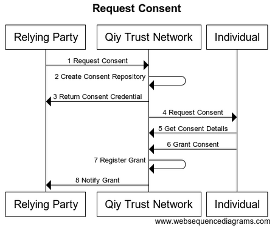

# UC05 Request Consent

# Abstract

This document describes how a [Relying Party](../Definitions.md#relying-party) can acquire [Consent](../Definitions.md#consent) to use [Personal Data](../Definitions.md#personal-data) of an [Individual](../Definitions.md#individual) for a [Service](../Definitions.md#service) it provides.

# Contents


1. [Primary Actors](#primary-actors)
1. [Preconditions](#preconditions)
1. [Basic Flow: Relying Party requests Consent](#basic-flow-relying-party-requests-consent)
	1. [The Relying Party sends a Consent Request to the Qiy Trust Network](#1-the-relying-party-sends-a-consent-request-to-the-qiy-trust-network)
	1. [The Qiy Trust Network creates a Consent Repository](#2-the-qiy-trust-network-creates-a-consent-repository)
	1. [The Qiy Trust Network returns the Consent Relying Party Credentials to the Relying Party](#3-the-qiy-trust-network-returns-the-consent-relying-party-credentials-to-the-relying-party)
	1. [The Qiy Trust Network sends a Consent Request Message to the Individual](#4-the-qiy-trust-network-sends-a-consent-request-message-to-the-individual)
	1. [The Individual gets the Consent details from the Qiy Trust Network](#5-the-individual-gets-the-consent-details-from-the-qiy-trust-network)
	1. [The Individual grants Consent](#6-the-individual-grants-consent)
	1. [The Qiy Trust Network registers the granting of the Consent in the Consent Repository](#7-the-qiy-trust-network-registers-the-granting-of-the-consent-in-the-consent-repository)
	1. [The Qiy Trust Network notifies the Relying Party that the Consent has been granted](#8-the-qiy-trust-network-notifies-the-relying-party-that-the-consent-has-been-granted)
1. [Postconditions](#postconditions)
1. [Diagram Source Code](#diagram-source-code)
	1. [Request Consent](#request-consent)

# Primary Actors

* [Individual](../Definitions.md#individual)
* [Relying Party](../Definitions.md#relying-party)
* [Qiy Trust Network](../Definitions.md#qiy-trust-network)

# Preconditions

1. The [Individual](../Definitions.md#individual) has a [Connection](../Definitions.md#connection) with the [Relying Party](../Definitions.md#relying-party) and knows its [Persistent Id](../Definitions.md#persistent-id). 
1. The [Relying Party](../Definitions.md#relying-party) has a [Connection](../Definitions.md#connection) with the [Individual](../Definitions.md#individual) and knows its [Persistent Id](../Definitions.md#persistent-id).
1. The [Relying Party](../Definitions.md#relying-party) knows the (local) [Identity](../Definitions.md#identity) of the [Individual](../Definitions.md#individual).
1. The [Relying Party](../Definitions.md#relying-party) has permission to provide the [Service](../Definitions.md#service) via Qiy.

# Basic Flow: Relying Party requests Consent

The [Relying Party](../Definitions.md#relying-party) requests an [Individual](../Definitions.md#individual) [Consent](../Definitions.md#consent) to use a specific set of [Personal Data](../Definitions.md#personal-data) for a [Service](../Definitions.md#service) it provides.



## 1. The Relying Party sends a Consent Request to the Qiy Trust Network

The [Relying Party](../Definitions.md#relying-party) sends a request for [Consent](../Definitions.md#consent) to the [Qiy Trust Network](../Definitions.md#qiy-trust-network) in the form of a [Qiy Node Message](../Definitions.md#qiy-node-message) which he sends to the [Individual](../Definitions.md#individual), specifying the [Service](../Definitions.md#service) and the [Personal Data](../Definitions.md#personal-data) of interest using the [Service Descriptor](../Definitions.md#service-descriptor).

## 2. The Qiy Trust Network creates a Consent Repository

The [Qiy Trust Network](../Definitions.md#qiy-trust-network) creates a [Consent Repository](../Definitions.md#consent-repository) and [Consent Credentials](../Definitions.md#consent-credential) for the [Relying Party](../Definitions.md#relying-party), the [Individual](../Definitions.md#individual) and a [Data Provider](../Definitions.md#data-provider).

## 3. The Qiy Trust Network returns the Consent Relying Party Credentials to the Relying Party

The [Qiy Trust Network](../Definitions.md#qiy-trust-network) returns the [Consent Relying Party Credentials](../Definitions.md#consent-relying-party-credential) to the [Relying Party](../Definitions.md#relying-party).

## 4. The Qiy Trust Network sends a Consent Request Message to the Individual

The [Qiy Trust Network](../Definitions.md#qiy-trust-network) forwards the [Consent Request Message](../Definitions.md#consent-request-message) with the [Consent Individual Credentials](../Definitions.md#consent-individual-credential) and a first [Consent Data Provider Credentials](../Definitions.md#consent-data-provider-credential) to the [Individual](../Definitions.md#individual).

## 5. The Individual gets the Consent details from the Qiy Trust Network

The [Individual](../Definitions.md#individual) uses the [Consent Individual Credentials](../Definitions.md#consent-individual-credential) in a [Consent Details Request](../Definitions.md#consent-details-request) to get the details of the requested Consent from the [Qiy Trust Network](../Definitions.md#qiy-trust-network).

## 6. The Individual grants Consent

The [Individual](../Definitions.md#individual) grants the requested [Consent](../Definitions.md#consent) which is communicated to the [Qiy Trust Network](../Definitions.md#qiy-trust-network) in a [Consent Granted Request](../Definitions.md#consent-granted-request). 

## 7. The Qiy Trust Network registers the granting of the Consent in the Consent Repository

The [Qiy Trust Network](../Definitions.md#qiy-trust-network) registers the granting of the [Consent](../Definitions.md#consent) in the [Consent Repository](../Definitions.md#consent-repository).

## 8. The Qiy Trust Network notifies the Relying Party that the Consent has been granted

The [Qiy Trust Network](../Definitions.md#qiy-trust-network) notifies the [Relying Party](../Definitions.md#relying-party) that the [Consent](../Definitions.md#consent) has been granted using a [Consent Granted Event](../Definitions.md#consent-granted-event).


# Postconditions

1. The [Relying Party](../Definitions.md#relying-party) has [Consent](../Definitions.md#consent) to use the requested [Personal Data](../Definitions.md#personal-data) of the [Individual](../Definitions.md#individual) for its [Service](../Definitions.md#service).


# Diagram Source Code

## Request Consent


```
title "Request Consent"

participant "Relying Party"     as RP
participant "Qiy Trust Network" as QTF
participant "Individual"        as User

RP   ->  QTF  : 1 Request Consent
QTF  ->  QTF  : 2 Create Consent Repository
QTF  ->  RP   : 3 Return Consent Credentials
QTF  ->  User : 4 Request Consent
User ->  QTF  : 5 Get Consent Details
User ->  QTF  : 6 Grant Consent
QTF  ->  QTF  : 7 Register Grant
QTF  ->  RP   : 8 Notify Grant
```

