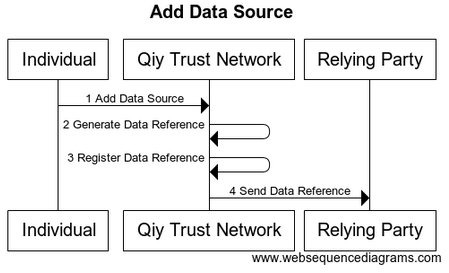
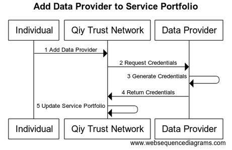

# UC06 Manage Personal Data

# Abstract

This document describes how [Individuals](../Definitions.md#individual) and [Data Providers](../Definitions.md#data-provider) manage [Personal Data](../Definitions.md#personal-data).

# Contents


1. [Primary Actors](#primary-actors)
1. [Preconditions](#preconditions)
1. [Basic Flow: Individual adds Data Source](#basic-flow-individual-adds-data-source)
	1. [The Individual requests the Qiy Trust Network to add a Data Source](#1-the-individual-requests-the-qiy-trust-network-to-add-a-data-source)
	1. [The Qiy Trust Network generates a Data Reference](#2-the-qiy-trust-network-generates-a-data-reference)
	1. [The Qiy Trust Network registers the Data Reference with the Consent](#3-the-qiy-trust-network-registers-the-data-reference-with-the-consent)
	1. [The Qiy Trust Network sends the Data Reference to the Relying Party](#4-the-qiy-trust-network-sends-the-data-reference-to-the-relying-party)
1. [Postconditions](#postconditions)
1. [Extensions](#extensions)
	1. [E1 Notify Consent](#e1-notify-consent)
	1. [E2 Propose Data Source](#e2-propose-data-source)
	1. [E3 Request Operation Specification](#e3-request-operation-specification)
	1. [E4 Add Data Provider to Service Portfolio](#e4-add-data-provider-to-service-portfolio)
		1. [Preconditions](#preconditions)
		1. [Flow](#flow)
			1. [The Individual requests the Qiy Trust Network to add a Data Provider to his Service Portfolio](#1-the-individual-requests-the-qiy-trust-network-to-add-a-data-provider-to-his-service-portfolio)
			1. [The Qiy Trust Network requests the Data Provider for Service Credentials](#2-the-qiy-trust-network-requests-the-data-provider-for-service-credentials)
			1. [The Data Provider generates the Service Credentials](#3-the-data-provider-generates-the-service-credentials)
			1. [The Data Provider returns the Service Credentials to the Qiy Trust Network](#4-the-data-provider-returns-the-service-credentials-to-the-qiy-trust-network)
			1. [The Qiy Trust Network updates the Service Portfolio](#5-the-qiy-trust-network-updates-the-service-portfolio)
		1. [Postconditions](#postconditions)
1. [Diagram Source Code](#diagram-source-code)
	1. [Add Data Source](#add-data-source)
	1. [Add Data Provider to Service Portfolio](#add-data-provider-to-service-portfolio)

# Primary Actors

* [Individual](../Definitions.md#individual)
* [Data Provider](../Definitions.md#data-provider)
* [Relying Party](../Definitions.md#relying-party)
* [Qiy Trust Network](../Definitions.md#qiy-trust-network)


# Preconditions

1. The [Data Provider](../Definitions.md#data-provider) is registered as such in the [Service Portfolio](../Qiy%20Node%20Protocol.md#service-portfolio) of the [Individual](../Definitions.md#individual).
1. The [Individual](../Definitions.md#individual) has unused [Consent Data Provider Credentials](../Definitions.md#consent-data-provider-credential) of the [Consent](../Qiy%20Node%20Protocol.md#consent).
1. The [Data Provider](../Definitions.md#data-provider) can provide the consented [Personal Data](../Definitions.md#personal-data).

# Basic Flow: Individual adds Data Source

The [Individual](../Definitions.md#individual) adds a [Data Source](../Qiy%20Node%20Protocol.md#data-source) to a [Consent](../Qiy%20Node%20Protocol.md#consent).




## 1. The Individual requests the Qiy Trust Network to add a Data Source

The [Individual](../Definitions.md#individual) requests the [Qiy Trust Network](../Definitions.md#qiy-trust-network) to add a [Data Source](../Qiy%20Node%20Protocol.md#data-source) to a [Consent](../Qiy%20Node%20Protocol.md#consent) using a [Source Register Request](../Qiy%20Node%20Protocol.md#source-register-request).

## 2. The Qiy Trust Network generates a Data Reference

The [Qiy Trust Network](../Definitions.md#qiy-trust-network) generates a [Data Reference](../Qiy%20Node%20Protocol.md#data-reference).

## 3. The Qiy Trust Network registers the Data Reference with the Consent

The [Qiy Trust Network](../Definitions.md#qiy-trust-network) registers the [Data Reference](../Qiy%20Node%20Protocol.md#data-reference) with the [Consent](../Qiy%20Node%20Protocol.md#consent).

## 4. The Qiy Trust Network sends the Data Reference to the Relying Party

The [Qiy Trust Network](../Definitions.md#qiy-trust-network) sends the [Data Reference](../Qiy%20Node%20Protocol.md#data-reference) to the [Relying Party](../Definitions.md#relying-party) using an [Operation Reference Message](../Qiy%20Node%20Protocol.md#operation-reference-message).


# Postconditions

1. The [Data Provider](../Definitions.md#data-provider) is a data source for the [Personal Data](../Definitions.md#personal-data) related to the [Consent](../Qiy%20Node%20Protocol.md#consent).
2. The [Relying Party](../Definitions.md#relying-party) has a [Data Reference](../Qiy%20Node%20Protocol.md#data-reference) to acquire the [Personal Data](../Definitions.md#personal-data) from the [Data Provider](../Qiy%20Node%20Protocol.md#data-provider).


# Extensions

## E1 Notify Consent

The [Qiy Trust Network](../Definitions.md#qiy-trust-network) can notify the registration of a [Consent](../Qiy%20Node%20Protocol.md#consent) to an [Individual](../Definitions.md#individual) using a [Consent Notification Message](../Qiy%20Node%20Protocol.md#consent-notification-message).

## E2 Propose Data Source

The [Qiy Trust Network](../Definitions.md#qiy-trust-network) can propose [Data Sources](../Qiy%20Node%20Protocol.md#data-source) for a [Consent](../Qiy%20Node%20Protocol.md#consent) to an [Individual](../Definitions.md#individual) using a [Source Candidates Message](../Qiy%20Node%20Protocol.md#source-candidates-message).

## E3 Request Operation Specification

The [Qiy Trust Network](../Definitions.md#qiy-trust-network) can request for an [Operation Specification](../Qiy%20Node%20Protocol.md#operation-specification) of a [Data Source](../Qiy%20Node%20Protocol.md#data-source) using a [Operation Specification Request Message](../Qiy%20Node%20Protocol.md#operation-specification-request-message).

## E4 Add Data Provider to Service Portfolio

### Preconditions

1. The [Individual](../Definitions.md#individual) has a [Connection](../Qiy%20Node%20Protocol.md#connection) with the [Data Provider](../Definitions.md#data-provider) and knows its [Persistent Id](../Qiy%20Node%20Protocol.md#persistent-id). 
1. The [Data Provider](../Definitions.md#data-provider) has a [Connection](../Qiy%20Node%20Protocol.md#connection) with the [Individual](../Definitions.md#individual) and knows its [Persistent Id](../Qiy%20Node%20Protocol.md#persistent-id).
1. The [Data Provider](../Definitions.md#data-provider) knows the (local) [Identity](../Definitions.md#identity) of the [Individual](../Definitions.md#individual).
1. The [Data Provider](../Definitions.md#data-provider) has permission to provide the [Personal Data](../Qiy%20Node%20Protocol.md#personal-data) via Qiy.

### Flow



#### 1. The Individual requests the Qiy Trust Network to add a Data Provider to his Service Portfolio

The [Individual](../Definitions.md#individual) requests the [Qiy Trust Network](../Definitions.md#qiy-trust-network) to add a [Data Provider](../Definitions.md#data-provider) to his [Service Portfolio](../Qiy%20Node%20Protocol.md#service-portfolio) by sending the [Data Provider](../Definitions.md#data-provider) a [Portfolio Register Message](../Qiy%20Node%20Protocol.md#portfolio-register-message).

#### 2. The Qiy Trust Network requests the Data Provider for Service Credentials

The [Qiy Trust Network](../Definitions.md#qiy-trust-network) requests the [Data Provider](../Definitions.md#data-provider) for [Service Credentials](../Qiy%20Node%20Protocol.md#service-credential) that will allow the [Individual](../Definitions.md#individual) to use the [Service Endpoint](../Qiy%20Node%20Protocol.md#service-endpoint) of the [Data Provider](../Definitions.md#data-provider) using a [Service Credentials Request Message](../Qiy%20Node%20Protocol.md#service-credentials-request-message).

#### 3. The Data Provider generates the Service Credentials

The [Data Provider](../Definitions.md#data-provider) generates the [Service Credentials](../Qiy%20Node%20Protocol.md#service-credential).

#### 4. The Data Provider returns the Service Credentials to the Qiy Trust Network

The [Data Provider](../Definitions.md#data-provider) returns the [Service Credentials](../Qiy%20Node%20Protocol.md#service-credential) to the [Qiy Trust Network](../Definitions.md#qiy-trust-network) in a [Service Credentials Response Message](../Qiy%20Node%20Protocol.md#service-credentials-response-message).

#### 5. The Qiy Trust Network updates the Service Portfolio

The [Qiy Trust Network](../Definitions.md#qiy-trust-network) updates the [Service Portfolio](../Qiy%20Node%20Protocol.md#service-portfolio) by adding the [Data Provider](../Definitions.md#data-provider) and persisting the [Service Credentials](../Qiy%20Node%20Protocol.md#service-credential).


### Postconditions

1. The [Data Provider](../Definitions.md#data-provider) is registered as such in the [Service Portfolio](../Qiy%20Node%20Protocol.md#service-portfolio) of the [Individual](../Definitions.md#individual) with the [Service Credentials](../Qiy%20Node%20Protocol.md#service-credential) to access to the [Individuals](../Definitions.md#individual) [Personal Data](../Definitions.md#personal-data) it keeps.


# Diagram Source Code

## Add Data Source


```
title "Add Data Source"

participant "Individual"        as User
participant "Qiy Trust Network" as QTF
participant "Relying Party"     as RP

User ->  QTF  : 1 Add Data Source
QTF  ->  QTF  : 2 Generate Data Reference
QTF  ->  QTF  : 3 Register Data Reference
QTF  ->  RP   : 4 Send Data Reference
```

## Add Data Provider to Service Portfolio


```
title "Add Data Provider to Service Portfolio"

participant "Individual"        as User
participant "Qiy Trust Network" as QTF
participant "Data Provider"     as DP

User ->  QTF  : 1 Add Data Provider
QTF  ->  DP   : 2 Request Credentials
DP   ->  DP   : 3 Generate Credentials
DP   ->  QTF  : 4 Return Credentials
QTF  ->  QTF  : 5 Update Service Portfolio
```

