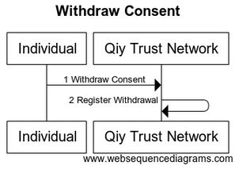

# UC07 Manage Consents

# Abstract

This document describes how an [Individual](../Definitions.md#individual) can manage his [Consents](../Qiy%20Node%20Protocol.md#consents).

# Contents


1. [Primary Actors](#primary-actors)
1. [Preconditions](#preconditions)
1. [Basic Flow: Individual withdraws Consent](#basic-flow-individual-withdraws-consent)
	1. [The Individual informs the withdrawal of a Consent to the Qiy Trust Network](#1-the-individual-informs-the-withdrawal-of-a-consent-to-the-qiy-trust-network)
	1. [The Qiy Trust Network registers the withdrawal of the Consent](#2-the-qiy-trust-network-registers-the-withdrawal-of-the-consent)
1. [Postconditions](#postconditions)
1. [Extensions](#extensions)
	1. [E1 Delete Consent](#e1-delete-consent)
	1. [E2 Get Consent Details](#e2-get-consent-details)
	1. [E3 List Consents](#e3-list-consents)
	1. [E4 Regrant Consent](#e4-regrant-consent)
1. [Diagram Source Code](#diagram-source-code)
	1. [Withdraw Consent](#withdraw-consent)

# Primary Actors

* [Individual](../Definitions.md#individual)
* [Qiy Trust Network](../Definitions.md#qiy-trust-network)

# Preconditions

1. The [Individual](../Definitions.md#individual) has a granted [Consent](../Qiy%20Node%20Protocol.md#consent).


# Basic Flow: Individual withdraws Consent



## 1. The Individual informs the withdrawal of a Consent to the Qiy Trust Network

The [Individual](../Definitions.md#individual) informs the withdrawal of a [Consent](../Qiy%20Node%20Protocol.md#consent) to the [Qiy Trust Network](../Definitions.md#qiy-trust-network) using a [Consent Withdrawn Request](../Qiy%20Node%20Protocol.md#consent-withdrawn-request).

## 2. The Qiy Trust Network registers the withdrawal of the Consent

The [Qiy Trust Network](../Definitions.md#qiy-trust-network) registers the withdrawal of the [Consent](../Qiy%20Node%20Protocol.md#consent) by updating the status of the [Consent](../Qiy%20Node%20Protocol.md#consent) in the [Consent Repository](../Qiy%20Node%20Protocol.md#consent-repository) and registering the change in the [Consent Audit Log](../Qiy%20Node%20Protocol.md#consent-audit-log).


# Postconditions

1. The status of the [Consent](../Qiy%20Node%20Protocol.md#consent) indicates that it has been withdrawn.
1. The change has been registered in the [Consent Audit Log](../Qiy%20Node%20Protocol.md#consent-audit-log).

# Extensions


## E1 Delete Consent

An [Individual](../Definitions.md#individual) can delete a [Consent](../Qiy%20Node%20Protocol.md#consent) using a [Consent Delete Request](../Qiy%20Node%20Protocol.md#consent-delete-request).


## E2 Get Consent Details

[Access Providers](../Definitions.md#access-provider), auditors, [Relying Parties](../Qiy%20Node%20Protocol.md#relying-parties), [Data Providers](#data-provider) and [Individuals](../Definitions.md#individual) can get details of a [Consent](../Qiy%20Node%20Protocol.md#consent) using a [Consent Details Request](../Qiy%20Node%20Protocol.md#consent-details-request).


## E3 List Consents

[Access Providers](../Definitions.md#access-provider), auditors, [Relying Parties](../Qiy%20Node%20Protocol.md#relying-parties), [Data Providers](#data-provider) and [Individuals](../Definitions.md#individual) can list their [Consents](../Qiy%20Node%20Protocol.md#consents) using a [Consents Request](../Qiy%20Node%20Protocol.md#consents-request).


## E4 Regrant Consent

An [Individual](../Definitions.md#individual) can regrant a [Consent](../Qiy%20Node%20Protocol.md#consent) using a [Consent Granted Request](../Qiy%20Node%20Protocol.md#consent-granted-request).


# Diagram Source Code

## Withdraw Consent


```
title "Withdraw Consent"

participant "Individual"        as User
participant "Qiy Trust Network" as QTF

User ->  QTF  : 1 Withdraw Consent
QTF  ->  QTF  : 2 Register Withdrawal
```


