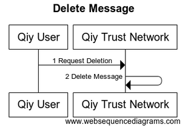

# UC08 Manage Messages

# Abstract

This document describes how a [Qiy User](../Definitions.md#qiy-user) can manage his [Qiy Node Messages](../Definitions.md#qiy-node-message).

# Contents


1. [Primary Actors](#primary-actors)
1. [Preconditions](#preconditions)
1. [Basic Flow: Delete Message](#basic-flow-delete-message)
	1. [The Qiy User requests the Qiy Trust Network to delete a Message](#1-the-qiy-user-requests-the-qiy-trust-network-to-delete-a-message)
	1. [The Qiy Trust Network deletes the Message](#2-the-qiy-trust-network-deletes-the-message)
1. [Postconditions](#postconditions)
1. [Extensions](#extensions)
	1. [E1 List Messages](#e1-list-messages)
	1. [E2 Get Message Details](#e2-get-message-details)
1. [Diagram Source Code](#diagram-source-code)
	1. [Delete Message](#delete-message)

# Primary Actors

* [Qiy User](../Definitions.md#qiy-user)
* [Qiy Trust Network](../Definitions.md#qiy-trust-network)

# Preconditions

1. The [Qiy User](../Definitions.md#qiy-user) has exchanged a [Qiy Node Message](../Definitions.md#qiy-node-message).


# Basic Flow: Delete Message




## 1. The Qiy User requests the Qiy Trust Network to delete a Message

The [Qiy User](../Definitions.md#qiy-user) requests the [Qiy Trust Network](../Definitions.md#qiy-trust-network) to delete a [Qiy Node Message](../Definitions.md#qiy-node-message) by using its [Message Uri] in a [Message Delete Request](../Definitions.md#message-delete-request).

## 2. The Qiy Trust Network deletes the Message

The [Qiy Trust Network](../Definitions.md#qiy-trust-network) deletes the [Qiy Node Message](../Definitions.md#qiy-node-message).


# Postconditions

1. The [Qiy Node Message](../Definitions.md#qiy-node-message) does not exist anymore.


# Extensions

## E1 List Messages

A [Qiy User](../Definitions.md#qiy-user) can list his [Qiy Node Messages](../Definitions.md#qiy-node-message) using a [Messages Request](../Definitions.md#messages-request).

## E2 Get Message Details

A [Qiy User](../Definitions.md#qiy-user) can get the details of a [Qiy Node Message](../Definitions.md#qiy-node-message) using a [Message Details Request](../Definitions.md#message-details-request).


# Diagram Source Code

## Delete Message


```
title "Delete Message"

participant "Qiy User"        as User
participant "Qiy Trust Network" as QTF

User ->  QTF  : 1 Request Deletion
QTF  ->  QTF  : 2 Delete Message
```


