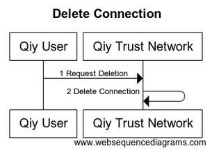

# UC09 Manage Connections

# Abstract

This document describes how a [Qiy User](../Definitions.md#qiy-user) can manage his [Connections](../Definitions.md#connection).

# Contents


1. [Primary Actors](#primary-actors)
1. [Preconditions](#preconditions)
1. [Basic Flow: Delete Connection](#basic-flow-delete-connection)
	1. [The Qiy User requests the Qiy Trust Network to delete a Connection](#1-the-qiy-user-requests-the-qiy-trust-network-to-delete-a-connection)
	1. [The Qiy Trust Network deletes the Connection](#2-the-qiy-trust-network-deletes-the-connection)
1. [Postconditions](#postconditions)
1. [Extensions](#extensions)
	1. [E1 List Connections](#e1-list-connections)
	1. [E2 Get Connection Details](#e2-get-connection-details)
1. [Diagram Source Code](#diagram-source-code)
	1. [Delete Connection](#delete-connection)

# Primary Actors

* [Qiy User](../Definitions.md#qiy-user)
* [Qiy Trust Network](../Definitions.md#qiy-trust-network)

# Preconditions

1. The [Qiy User](../Definitions.md#qiy-user) has a [Connection](../Definitions.md#connection).


# Basic Flow: Delete Connection




## 1. The Qiy User requests the Qiy Trust Network to delete a Connection

The [Qiy User](../Definitions.md#qiy-user) requests the [Qiy Trust Network](../Definitions.md#qiy-trust-network) to delete a [Connection](../Definitions.md#connection) using a [Connection Delete Request](../Definitions.md#connection-delete-request).

## 2. The Qiy Trust Network deletes the Connection

The [Qiy Trust Network](../Definitions.md#qiy-trust-network) deletes the [Connection](../Definitions.md#connection).


# Postconditions

1. The [Connection](../Definitions.md#connection) does not exist anymore.


# Extensions

## E1 List Connections

A [Qiy User](../Definitions.md#qiy-user) can list his [Connections](../Definitions.md#connection) using a [Connections Request](../Definitions.md#connections-request).

## E2 Get Connection Details

A [Qiy User](../Definitions.md#qiy-user) can get the details of a [Connection](../Definitions.md#connection) using a [Connection Details Request](../Definitions.md#connection-details-request).


# Diagram Source Code

## Delete Connection


```
title "Delete Connection"

participant "Qiy User"        as User
participant "Qiy Trust Network" as QTF

User ->  QTF  : 1 Request Deletion
QTF  ->  QTF  : 2 Delete Connection
```


