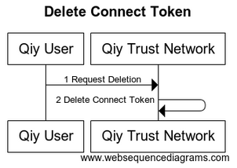

# UC10 Manage Connect Tokens

# Abstract

This document describes how a [Qiy User](../Definitions.md#qiy-user) can manage his [Connect Tokens](../Definitions.md#connect-token).

# Contents


1. [Primary Actors](#primary-actors)
1. [Preconditions](#preconditions)
1. [Basic Flow: Delete Connect Token](#basic-flow-delete-connect-token)
	1. [The Qiy User requests the Qiy Trust Network to delete a Connect Token](#1-the-qiy-user-requests-the-qiy-trust-network-to-delete-a-connect-token)
	1. [The Qiy Trust Network deletes the Connect Token](#2-the-qiy-trust-network-deletes-the-connect-token)
1. [Postconditions](#postconditions)
1. [Extensions](#extensions)
	1. [E1 List Connect Tokens](#e1-list-connect-tokens)
	1. [E2 Get Connect Token Details](#e2-get-connect-token-details)
	1. [E3 Update Connect Token](#e3-update-connect-token)
1. [Diagram Source Code](#diagram-source-code)
	1. [Delete Connect Token](#delete-connect-token)

# Primary Actors

* [Qiy User](../Definitions.md#qiy-user)
* [Qiy Trust Network](../Definitions.md#qiy-trust-network)


# Preconditions

1.  The [Qiy User](../Definitions.md#qiy-user) has a [Connect Token](../Definitions.md#connect-token).


# Basic Flow: Delete Connect Token




## 1. The Qiy User requests the Qiy Trust Network to delete a Connect Token

The [Qiy User](../Definitions.md#qiy-user) requests the [Qiy Trust Network](../Definitions.md#qiy-trust-network) to delete a [Connect Token](../Definitions.md#connect-token) using a [Connect Token Delete Request](../Definitions.md#connect-token-delete-request).

## 2. The Qiy Trust Network deletes the Connect Token

The [Qiy Trust Network](../Definitions.md#qiy-trust-network) deletes the [Connect Token](../Definitions.md#connect-token).


# Postconditions

1. The [Connect Token](../Definitions.md#connect-token) does not exist anymore.


# Extensions


## E1 List Connect Tokens

A [Qiy User](../Definitions.md#qiy-user) can list his [Connect Tokens](../Definitions.md#connect-token) using a [Connect Tokens Request](../Definitions.md#connect-tokens-request).


## E2 Get Connect Token Details

A [Qiy User](../Definitions.md#qiy-user) can get the details of a [Connect Token](../Definitions.md#connect-token) using a [Connect Token Details Request](../Definitions.md#connect-token-details-request).


## E3 Update Connect Token

A [Qiy User](../Definitions.md#qiy-user) can change [Attributes](../Definitions.md#attribute) of a [Connect Token](../Definitions.md#connect-token) using a [Connect Token Update Request](../Definitions.md#connect-token-update-request).


# Diagram Source Code

## Delete Connect Token


```
title "Delete Connect Token"

participant "Qiy User"        as User
participant "Qiy Trust Network" as QTF

User ->  QTF  : 1 Request Deletion
QTF  ->  QTF  : 2 Delete Connect Token
```

