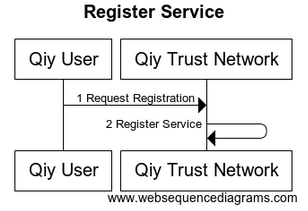
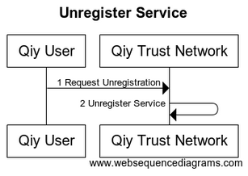

# UC11 Manage Service Catalogue


# Abstract

This document describes how [Service Providers](../Definitions.md#service-provider) and [Access Providers](../Definitions.md#access-provider) manage [Service Catalogues](../Definitions.md#service-catalogue).


# Contents


1. [Primary Actors](#primary-actors)
1. [Preconditions](#preconditions)
1. [Basic Flow: Service Provider registers a Service](#basic-flow-service-provider-registers-a-service)
1. [Postconditions](#postconditions)
1. [Extensions](#extensions)
	1. [E1. The Service Provider unregisters a Service](#e1-the-service-provider-unregisters-a-service)
1. [Diagram Source Code](#diagram-source-code)
	1. [Register Service](#register-service)
	1. [Unregister Service](#unregister-service)


# Primary Actors

* [Service Provider](../Definitions.md#service-provider)
* [Qiy Trust Network](../Definitions.md#qiy-trust-network)


# Preconditions

1. [Service Provider](../Definitions.md#service-provider) has access to the [Qiy Trust Network](../Definitions.md#qiy-trust-network).


# Basic Flow: Service Provider registers a Service

The [Service Provider](../Definitions.md#service-provider) can register a [Service](../Definitions.md#service) using a [Catalogue Service Register Request].




# Postconditions

1. The [Service](../Definitions.md#service) is included in the [Service Catalogue](../Definitions.md#service-catalogue) of the [Service Provider](../Definitions.md#service-provider).


# Extensions

## E1. The Service Provider unregisters a Service

The [Service Provider](../Definitions.md#service-provider) can uregister a [Service](../Definitions.md#service) using a [Catalogue Service Unregister Request].




# Diagram Source Code

## Register Service


```
title "Register Service"

participant "Qiy User"          as User
participant "Qiy Trust Network" as QTF

User ->  QTF  : 1 Request Registration
QTF  ->  QTF  : 2 Register Service
```

## Unregister Service


```
title "Unregister Service"

participant "Qiy User"          as User
participant "Qiy Trust Network" as QTF

User ->  QTF  : 1 Request Unregistration
QTF  ->  QTF  : 2 Unregister Service
```

