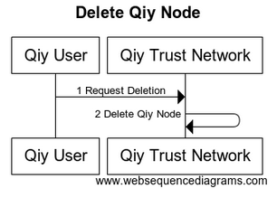

# UC12 Manage Access to Qiy Trust Network

# Abstract

This document describe how [Qiy Users](../Definitions.md#qiy-user) and [Access Providers](../Definitions.md#access-provider) manage the access to the [Qiy Trust Network](../Definitions.md#qiy-trust-network).

# Contents


1. [Primary Actors](#primary-actors)
1. [Preconditions](#preconditions)
1. [Basic Flow: Qiy User deletes Qiy Node](#basic-flow-qiy-user-deletes-qiy-node)
	1. [The Qiy User requests the Qiy Trust Network to delete a Qiy Node](#1-the-qiy-user-requests-the-qiy-trust-network-to-delete-a-qiy-node)
	1. [The Qiy Trust Network deletes the Qiy Node](#2-the-qiy-trust-network-deletes-the-qiy-node)
1. [Postconditions](#postconditions)
1. [Extensions](#extensions)
	1. [E1 Application Management](#e1-application-management)
	1. [E2 Qiy Node Management](#e2-qiy-node-management)
	1. [E3 Service Provider Management](#e3-service-provider-management)
1. [Diagram Source Code](#diagram-source-code)
	1. [Delete Qiy Node](#delete-qiy-node)

# Primary Actors

* [Qiy User](../Definitions.md#qiy-user)
* [Qiy Trust Network](../Definitions.md#qiy-trust-network)

# Preconditions

1. The [Qiy User](../Definitions.md#qiy-user) has access to the [Qiy Trust Network](../Definitions.md#qiy-trust-network) via one [Qiy Node](../Definitions.md#qiy-node).


# Basic Flow: Qiy User deletes Qiy Node



## 1. The Qiy User requests the Qiy Trust Network to delete a Qiy Node

The [Qiy User](../Definitions.md#qiy-user) requests the [Qiy Trust Network](../Definitions.md#qiy-trust-network) to delete a [Qiy Node](../Definitions.md#qiy-node) using a [Qiy Node Delete Request](../Definitions.md#qiy-node-delete-request).

## 2. The Qiy Trust Network deletes the Qiy Node

The [Qiy Trust Network](../Definitions.md#qiy-trust-network) deletes the [Qiy Node](../Definitions.md#qiy-node).


# Postconditions

1. The [Qiy User](../Definitions.md#qiy-user) does not have access to the [Qiy Trust Network](../Definitions.md#qiy-trust-network).


# Extensions

## E1 Application Management

tbd

## E2 Qiy Node Management

tbd

## E3 Service Provider Management

tbd


# Diagram Source Code

## Delete Qiy Node


```
title "Delete Qiy Node"

participant "Qiy User"          as User
participant "Qiy Trust Network" as QTF

User ->  QTF  : 1 Request Deletion
QTF  ->  QTF  : 2 Delete Qiy Node
```

